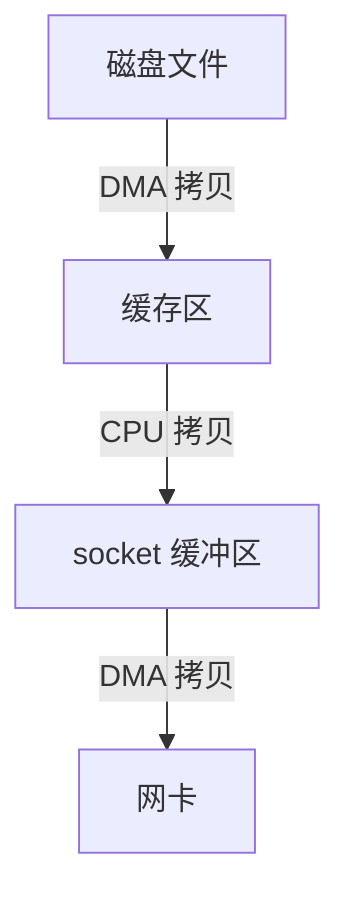

---
title: 【IO 02】IO效率优化
description: IO效率优化
date: 2025-04-02
slug: io_optimization
categories:
    - Make It Fast
    - 后端开发
tags:
    - IO
---


[前文]()提到影响IO效率的2个关键点

1. 多次上下文切换和数据拷贝
2. 等待时间


## 减少上下文切换和数据拷贝次数


### 零拷贝技术

零拷贝技术的核心目标是通过减少或消除用户空间与内核空间之间的数据复制次数，从而提升性能并降低资源消耗。

实现零拷贝技术的方式有很多。


#### 内存映射

> 我目前就使用过这个

原理如下图，将文件直接映射到进程的虚拟内存地址空间，用户程序通过操作内存指针访问文件数据，无需通过`read`/`write`系统调用复制数据


windows的api

```

```

linux的api

```c
// 直接通过addr指针访问文件数据
void *addr = mmap(file_fd, file_size, PROT_READ, MAP_SHARED);
```


基本流程：

```
void* addr = mmap(file, len);
write(fd, addr, len);
```





上下文切换次数：4次

- mmap的调用和返回
- write的调用和返回

数据拷贝次数：3次


**优势**：减少用户态与内核态之间的数据拷贝次数，适用于频繁访问文件的场景（如数据库、视频处理）


#### sendfile 系统调用

 **原理**：直接在内核空间完成文件数据到网络套接字的传输，绕过用户空间。
  • 传统流程：磁盘 → 内核缓冲区 → 用户缓冲区 → 内核缓冲区 → 网络。
  • sendfile流程：磁盘 → 内核缓冲区 → 网络（无需用户空间参与）。
• **适用场景**：文件传输（如Web服务器发送静态文件）。
• **代码示例**（Linux）：

```c
  sendfile(out_fd, in_fd, NULL, file_size);
```

---


| 技术      | 实现方式               | 适用场景                     | 引用来源 |
| --------- | ---------------------- | ---------------------------- | -------- |
| 内存映射  | 文件映射到虚拟内存     | 频繁文件读写（数据库、视频） |          |
| sendfile  | 内核直接传输文件到网络 | Web服务器文件传输            |          |
| splice    | 管道传输数据           | 文件/网络间高效复制          |          |
| 分散-聚集 | 单次操作多缓冲区       | 网络协议分片处理             |          |
| DMA       | 硬件直接访问内存       | 高速I/O设备数据传输          |          |


## 减少等待时间

感觉叫减少等待时间不是很准确，应该叫利用等待时间。我们怎么做到在数据未就绪的时候干其他事呢？通过采用高效的IO模型。

我们常见的IO模型有以下5种：


### 5种IO模型

#### 阻塞IO

一直等，直到数据就绪。
#### 非阻塞IO

非阻塞IO往往需要程序员循环的方式反复尝试读写文件描述符, 这个过程称为轮询. 这对CPU来说是较大的浪费, 一般只有特定场景下才使用.

不等，但会一直询问数据是否就绪，一旦就绪就处理。

#### 信号驱动IO

不等，数据就绪后，系统通过信号来通知进程处理。


#### IO多路转接 （多路复用）
IO多路转接: 虽然从流程图上看起来和阻塞IO类似. 实际上最核心在于IO多路转接能够同时等待多个文件描述符的就绪状态.


#### 异步IO
 由内核在数据拷贝完成时, 通知应用程序(而信号驱动是告诉应用程序何时可以开始拷贝数据).


总结：5种IO好比5种钓鱼方式

- 阻塞IO: 一直盯着鱼竿直到中鱼
- 非阻塞IO: 看会手机，看会鱼竿，发现中鱼，收杆
- 信号驱动IO:  一直看手机，直到鱼竿抖动，收杆
- 多路复用IO: 同时使用多个鱼竿，一直等，直到中鱼
- 异步IO: 让小弟去等鱼竿，自己干其他事，等中鱼了，让小弟打电话通知我

前4种都属于同步IO，

同步和异步关注的是消息通信机制.
- 所谓同步，就是在发出一个调用时，在没有得到结果之前，该调用就不返回. 但是一旦调用返回，就得到返回值了; 换句话说，就是由调用者主动等待这个调用的结果;
- 异步则是相反，调用在发出之后，这个调用就直接返回了，所以没有返回结果; 换句话说，当一个异步过程调用发出后，调用者不会立刻得到结果; 而是在调用发出后，被调用者通过状态、通知来通知调用者，或通过**回调函数**处理这个调用


现在回答：哪种IO模型最能充分利用等待时间？异步IO

|    模型     | 开发难度 | 性能 |    典型应用场景    |
| :---------: | :------: | :--: | :----------------: |
|   阻塞I/O   |   简单   |  低  |   低并发文件读写   |
|  非阻塞I/O  |   中等   |  中  |     传感器轮询     |
| 信号驱动I/O |   复杂   | 中高 |    UDP协议通信     |
| 多路复用I/O |   复杂   |  高  | Web服务器（Nginx） |
|   异步I/O   |   复杂   | 极高 |   分布式存储系统   |

**技术演进趋势**：现代高并发系统（如Kafka、Netty）普遍采用**多路复用+异步I/O组合模型**，在降低线程开销的同时实现高吞吐量

```
+-------------------+       +------------------+       +-------------------+
|  多路复用线程       |       |  异步I/O线程池     |       |  业务处理线程池    |
| (epoll_wait循环)  | ----> | (io_uring提交任务) | ----> | (处理HTTP请求等)   |
+-------------------+       +-------------------+       +-------------------+
       ↑                           ↑                           ↑
       监控事件就绪                 提交异步任务                 处理完成回调
```


### IO多路复用函数


#### epoll


