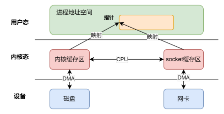
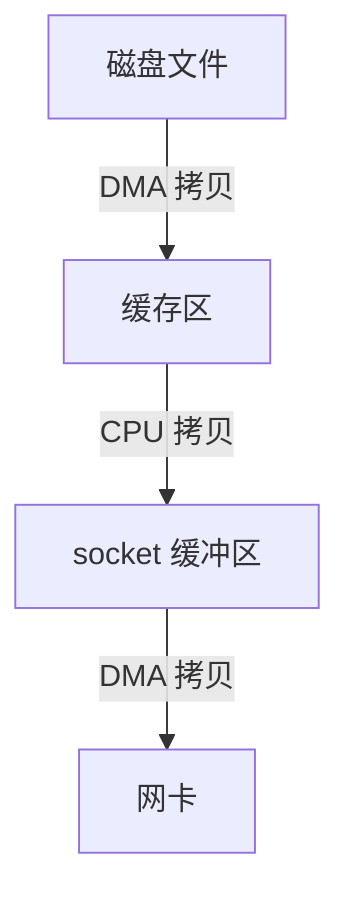

---
title: 【IO 02】IO效率优化
description: IO效率优化
date: 2025-04-02
slug: io_optimization
categories:
    - Make It Fast
    - 后端开发
tags:
    - IO
---


[前文]()提到影响IO效率的2个关键点

1. 多次上下文切换和数据拷贝
2. 等待时间


## 减少上下文切换和数据拷贝次数


### 零拷贝技术

零拷贝技术的核心目标是通过减少或消除用户空间与内核空间之间的数据复制次数，从而提升性能并降低资源消耗。

实现零拷贝技术的方式有很多。


#### 内存映射

> 我目前就使用过这个

原理如下图，将文件直接映射到进程的虚拟内存地址空间，用户程序通过操作内存指针访问文件数据，无需通过`read`/`write`系统调用复制数据



windows的api

```

```

linux的api

```c
// 直接通过addr指针访问文件数据
void *addr = mmap(file_fd, file_size, PROT_READ, MAP_SHARED);
```


基本流程：

```
void* addr = mmap(file, len);
write(fd, addr, len);
```





上下文切换次数：4次

- mmap的调用和返回
- write的调用和返回

数据拷贝次数：3次


**优势**：减少用户态与内核态之间的数据拷贝次数，适用于频繁访问文件的场景（如数据库、视频处理）


#### sendfile 系统调用

 **原理**：直接在内核空间完成文件数据到网络套接字的传输，绕过用户空间。
  • 传统流程：磁盘 → 内核缓冲区 → 用户缓冲区 → 内核缓冲区 → 网络。
  • sendfile流程：磁盘 → 内核缓冲区 → 网络（无需用户空间参与）。
• **适用场景**：文件传输（如Web服务器发送静态文件）。
• **代码示例**（Linux）：

```c
  sendfile(out_fd, in_fd, NULL, file_size);
```

---


#### splice 系统调用

• **原理**：通过管道（Pipe）在内核空间直接移动数据，支持任意文件描述符之间的零拷贝传输。
  • 例如：将文件数据直接传输到网卡，或两个文件之间高效复制。
• **特点**：无需数据实际拷贝，仅操作数据描述符的元数据。
• **示例**：

```c
  splice(in_fd, NULL, out_fd, NULL, file_size, SPLICE_F_MOVE);
```


#### 分散聚集（Scatter-Gather）I/O

• **原理**：允许单次系统调用操作多个非连续内存块，减少数据合并的拷贝次数。
• **分散读**：从文件读取数据到多个缓冲区。
• **聚集写**：将多个缓冲区的数据合并写入文件或网络。
• **应用**：网络协议栈中处理分片数据包（如HTTP分块传输）。


#### 直接内存访问（DMA）

• **原理**：硬件设备（如磁盘、网卡）直接与内存交互，绕过CPU参与数据搬运。
  • 传统方式：磁盘 → CPU → 内存。
  • DMA方式：磁盘 → 内存（由DMA控制器完成）。
• **优势**：释放CPU资源，提升吞吐量（尤其适用于高速网络和大文件传输）。


#### 其他技术

1. **Java NIO的transferTo()**  
   通过`FileChannel.transferTo()`直接将文件数据传输到网络通道，底层依赖操作系统的零拷贝机制（如sendfile）。
2. **RDMA（远程直接内存访问）**  
   在网络通信中，网卡直接读写远程内存，彻底绕过CPU和操作系统内核。

---

#### 总结对比

| 技术      | 实现方式               | 适用场景                     | 引用来源 |
| --------- | ---------------------- | ---------------------------- | -------- |
| 内存映射  | 文件映射到虚拟内存     | 频繁文件读写（数据库、视频） |          |
| sendfile  | 内核直接传输文件到网络 | Web服务器文件传输            |          |
| splice    | 管道传输数据           | 文件/网络间高效复制          |          |
| 分散-聚集 | 单次操作多缓冲区       | 网络协议分片处理             |          |
| DMA       | 硬件直接访问内存       | 高速I/O设备数据传输          |          |

