---
title: 【IO 02】IO效率优化
description: IO效率优化
date: 2025-04-02
slug: io_optimization
categories:
    - 后端开发
tags:
    - IO
---


[前文]()提到影响IO效率的2个关键点

1. 多次上下文切换和数据拷贝
2. 等待时间


## 减少上下文切换和数据拷贝次数


### 零拷贝技术

零拷贝技术的核心目标是通过减少或消除用户空间与内核空间之间的数据复制次数，从而提升性能并降低资源消耗。

实现零拷贝技术的方式有很多。


#### 内存映射

> 我目前就使用过这个

原理如下图，将文件直接映射到进程的虚拟内存地址空间，用户程序通过操作内存指针访问文件数据，无需通过`read`/`write`系统调用复制数据


windows的api

```

```

linux的api

```c
// 直接通过addr指针访问文件数据
void *addr = mmap(file_fd, file_size, PROT_READ, MAP_SHARED);
```


基本流程：

```
void* addr = mmap(file, len);
write(fd, addr, len);
```


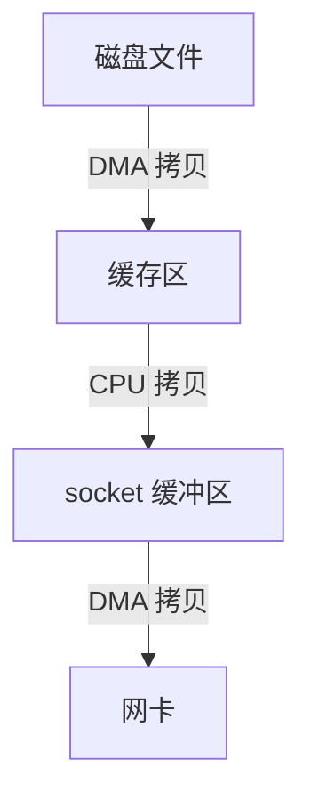


上下文切换次数：4次

- mmap的调用和返回
- write的调用和返回

数据拷贝次数：3次


**优势**：减少用户态与内核态之间的数据拷贝次数，适用于频繁访问文件的场景（如数据库、视频处理）


#### sendfile 系统调用

 **原理**：直接在内核空间完成文件数据到网络套接字的传输，绕过用户空间。
  • 传统流程：磁盘 → 内核缓冲区 → 用户缓冲区 → 内核缓冲区 → 网络。
  • sendfile流程：磁盘 → 内核缓冲区 → 网络（无需用户空间参与）。
• **适用场景**：文件传输（如Web服务器发送静态文件）。
• **代码示例**（Linux）：

```c
  sendfile(out_fd, in_fd, NULL, file_size);
```

---


| 技术      | 实现方式               | 适用场景                     | 引用来源 |
| --------- | ---------------------- | ---------------------------- | -------- |
| 内存映射  | 文件映射到虚拟内存     | 频繁文件读写（数据库、视频） |          |
| sendfile  | 内核直接传输文件到网络 | Web服务器文件传输            |          |
| splice    | 管道传输数据           | 文件/网络间高效复制          |          |
| 分散-聚集 | 单次操作多缓冲区       | 网络协议分片处理             |          |
| DMA       | 硬件直接访问内存       | 高速I/O设备数据传输          |          |


## 减少等待时间

感觉叫减少等待时间不是很准确，应该叫利用等待时间。我们怎么做到在数据未就绪的时候干其他事呢？通过采用高效的IO模型。

我们常见的IO模型有以下5种：


### 5种IO模型

#### 阻塞IO
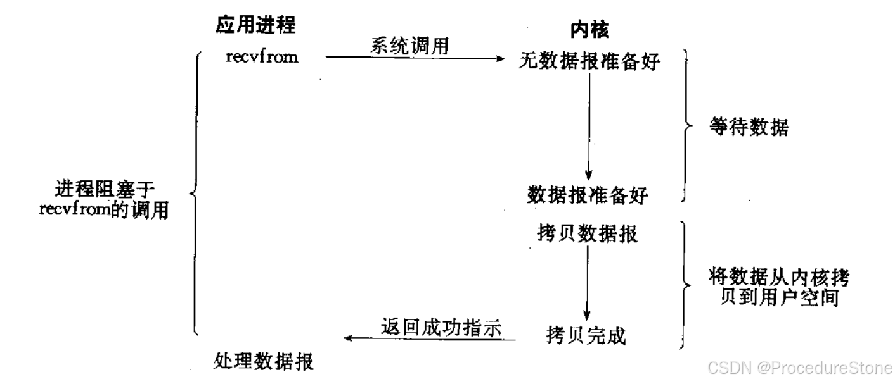
一直等，直到数据就绪。
#### 非阻塞IO

非阻塞IO往往需要程序员循环的方式反复尝试读写文件描述符, 这个过程称为轮询. 这对CPU来说是较大的浪费, 一般只有特定场景下才使用.
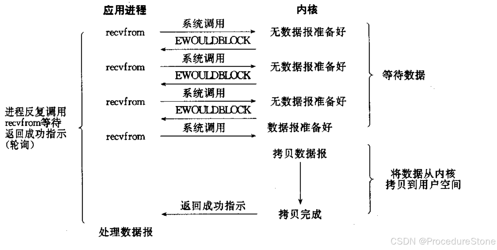
不等，但会一直询问数据是否就绪，一旦就绪就处理。

#### 信号驱动IO
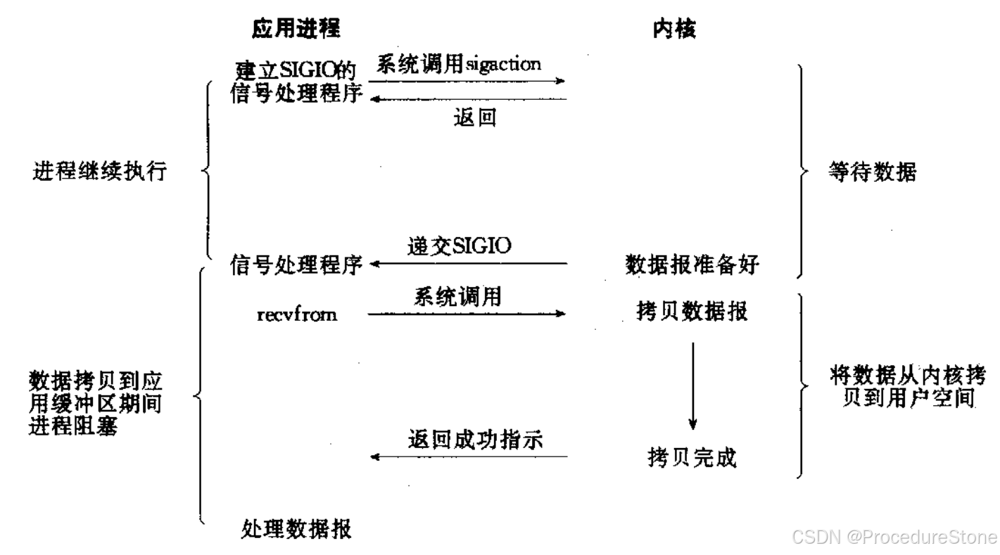
不等，数据就绪后，系统通过信号来通知进程处理。


#### IO多路转接 （多路复用）
IO多路转接: 虽然从流程图上看起来和阻塞IO类似. 实际上最核心在于IO多路转接能够同时等待多个文件描述符的就绪状态.
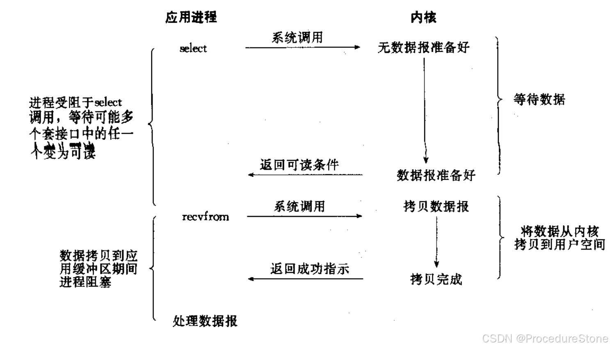

#### 异步IO
 由内核在数据拷贝完成时, 通知应用程序(而信号驱动是告诉应用程序何时可以开始拷贝数据).
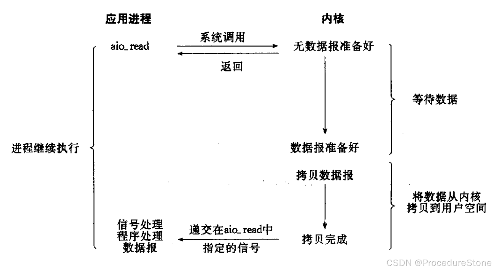

总结：5种IO好比5种钓鱼方式

- 阻塞IO: 一直盯着鱼竿直到中鱼
- 非阻塞IO: 看会手机，看会鱼竿，发现中鱼，收杆
- 信号驱动IO:  一直看手机，直到鱼竿抖动，收杆
- 多路复用IO: 同时使用多个鱼竿，一直等，直到中鱼
- 异步IO: 让小弟去等鱼竿，自己干其他事，等中鱼了，让小弟打电话通知我

前4种都属于同步IO，

同步和异步关注的是消息通信机制.
- 所谓同步，就是在发出一个调用时，在没有得到结果之前，该调用就不返回. 但是一旦调用返回，就得到返回值了; 换句话说，就是由调用者主动等待这个调用的结果;
- 异步则是相反，调用在发出之后，这个调用就直接返回了，所以没有返回结果; 换句话说，当一个异步过程调用发出后，调用者不会立刻得到结果; 而是在调用发出后，被调用者通过状态、通知来通知调用者，或通过**回调函数**处理这个调用


现在回答：哪种IO模型最能充分利用等待时间？异步IO

|    模型     | 开发难度 | 性能 |    典型应用场景    |
| :---------: | :------: | :--: | :----------------: |
|   阻塞I/O   |   简单   |  低  |   低并发文件读写   |
|  非阻塞I/O  |   中等   |  中  |     传感器轮询     |
| 信号驱动I/O |   复杂   | 中高 |    UDP协议通信     |
| 多路复用I/O |   复杂   |  高  | Web服务器（Nginx） |
|   异步I/O   |   复杂   | 极高 |   分布式存储系统   |

**技术演进趋势**：现代高并发系统（如Kafka、Netty）普遍采用**多路复用+异步I/O组合模型**，在降低线程开销的同时实现高吞吐量

```
+-------------------+       +------------------+       +-------------------+
|  多路复用线程       |       |  异步I/O线程池     |       |  业务处理线程池    |
| (epoll_wait循环)  | ----> | (io_uring提交任务) | ----> | (处理HTTP请求等)   |
+-------------------+       +-------------------+       +-------------------+
       ↑                           ↑                           ↑
       监控事件就绪                 提交异步任务                 处理完成回调
```


### IO多路复用详解

#### select
I/O多路转接之select
系统提供select函数来实现多路复用输入/输出模型.

- select系统调用是用来让我们的程序监视多个文件描述符的状态变化的;
- 程序会停在select这里等待，直到被监视的文件描述符有一个或多个发生了状态改变;

	

select接口介绍

```cpp
       #include <sys/select.h>

       int select(int nfds, fd_set *readfds, fd_set *writefds,
                  fd_set *exceptfds, struct timeval *timeout);
```

- **int nfds**
参数类型：**输入型参数**
说明：待检测的文件描述符中最大的文件描述符值加一


- **fd_set * readfds/writefds/exceptfds** 
参数类型：**输入输出型参数**
说明：fed_set是内核提供的一种数据类型，本质是位图.它的作用如下图：
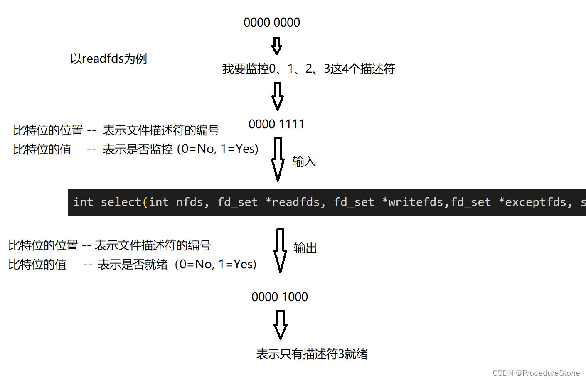
readfds -- 监控可读
writefds -- 监控可写
exceptfds - -监控错误


- **struct timeval * timeout** 
参数类型：**输入输出型参数**
说明：超时时间，如果为 NULL，则 select 函数会一直阻塞直到有事件发生；如果为非 NULL，则表示最长等待时间。
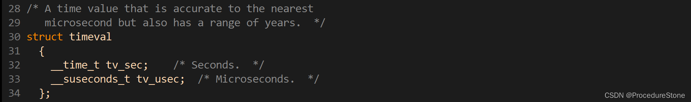
 struct timeval timeout = {1, 0}; 就表示最长等待时间为1秒
- 返回值
int n = select()
如果n > 0		表明有n个fd就绪
如果n == 0	表明超时
如果n < 0		表明出错

先介绍几个select的附属函数：select的参数fd_set是位图，如果让用户自己修改，不安全也不方便，与开发者也提供了几个专门修改fd_set的函数

```cpp
void FD_CLR(int fd, fd_set *set); -- 清空
int  FD_ISSET(int fd, fd_set *set); -- 是否已经设置
void FD_SET(int fd, fd_set *set); -- 设置
void FD_ZERO(fd_set *set); -- 清0
```
**select的例子**

这里不会对select的例子进行讲解，因此select太麻烦了。
 select需要一个辅助数组，这个数组是用来保存sockfd（包括listensockfd， 已经客户端连接的sockfd)。为什么？原因在于select的参数。
 第1个参数：nfds = maxfd+1，每次使用select时，都要遍历辅助数组来获得最大的fd，麻烦（当然你也可以设置成员来专门存储maxfd, 真正麻烦在后面）。
 第2，3、4个参数：由于它们在调用select前后，比特位的含义发生了变化。（前表示是否监控，后表示是否就绪）因此你每次在调用之前都要重新设置。但你怎么知道要保存哪些fd？因此需要一个辅助数组来记录fd。在调用select前，遍历辅助数据来设置fd_set。
 因此，select会出现很多遍历。代码如下：


```cpp
#pragma once

#include <iostream>
#include <sys/select.h>
#include <sys/time.h>
#include "Socket.hpp"

using namespace std;

static const uint16_t defaultport = 8888;
static const int fd_num_max = (sizeof(fd_set) * 8);
int defaultfd = -1;

class SelectServer
{
public:
    SelectServer(uint16_t port = defaultport) : _port(port)
    {
        for (int i = 0; i < fd_num_max; i++)
        {
            fd_array[i] = defaultfd;
            // std::cout << "fd_array[" << i << "]" << " : " << fd_array[i] << std::endl;
        }
    }
    bool Init()
    {
        _listensock.Socket();
        _listensock.Bind(_port);
        _listensock.Listen();

        return true;
    }
    void Accepter()
    {
        // 我们的连接事件就绪了
        std::string clientip;
        uint16_t clientport = 0;
        int sock = _listensock.Accept(&clientip, &clientport); // 会不会阻塞在这里？不会
        if (sock < 0) return;
        // sock -> fd_array[]
        int pos = 1;
        for (; pos < fd_num_max; pos++) // 第二个循环
        {
            if (fd_array[pos] != defaultfd)
                continue;
            else
                break;
        }
        if (pos == fd_num_max)
        {
            lg(Warning, "server is full, close %d now!", sock);
            close(sock);
        }
        else
        {
            fd_array[pos] = sock;
            PrintFd();
        }
    }
    void Recver(int fd, int pos)
    {
        // demo
        char buffer[1024];
        ssize_t n = read(fd, buffer, sizeof(buffer) - 1); // bug?
        if (n > 0)
        {
            buffer[n] = 0;
            cout << "get a messge: " << buffer << endl;
        }
        else if (n == 0)
        {
            lg(Info, "client quit, me too, close fd is : %d", fd);
            close(fd);
            fd_array[pos] = defaultfd; // 这里本质是从select中移除
        }
        else
        {
            lg(Warning, "recv error: fd is : %d", fd);
            close(fd);
            fd_array[pos] = defaultfd; // 这里本质是从select中移除
        }
    }
    void Dispatcher(fd_set &rfds)
    {
        for (int i = 0; i < fd_num_max; i++) // 这是第三个循环
        {
            int fd = fd_array[i];
            if (fd == defaultfd)
                continue;

            if (FD_ISSET(fd, &rfds))
            {
                if (fd == _listensock.Fd())
                {
                    Accepter(); // 连接管理器
                }
                else // non listenfd
                {
                    Recver(fd, i);
                }
            }
        }
    }
    void Start()
    {
        int listensock = _listensock.Fd();
        fd_array[0] = listensock;
        for (;;)
        {
            fd_set rfds;
            FD_ZERO(&rfds);

            int maxfd = fd_array[0];
            for (int i = 0; i < fd_num_max; i++) // 第一次循环
            {
                if (fd_array[i] == defaultfd)
                    continue;
                FD_SET(fd_array[i], &rfds);
                if (maxfd < fd_array[i])
                {
                    maxfd = fd_array[i];
                }
            }
            int n = select(maxfd + 1, &rfds, nullptr, nullptr,nullptr);
            switch (n)
            {
            case 0:
                cout << "time out, timeout: " << timeout.tv_sec << "." << timeout.tv_usec << endl;
                break;
            case -1:
                cerr << "select error" << endl;
                break;
            default:
                cout << "get a new link!!!!!" << endl;
                Dispatcher(rfds); 
                break;
            }
        }
    }
    void PrintFd()
    {
        cout << "online fd list: ";
        for (int i = 0; i < fd_num_max; i++)
        {
            if (fd_array[i] == defaultfd)
                continue;
            cout << fd_array[i] << " ";
        }
        cout << endl;
    }
    ~SelectServer()
    {
        _listensock.Close();
    }

private:
    Sock _listensock;
    uint16_t _port;
    int fd_array[fd_num_max];   // 数组, 用户维护的！
    // int wfd_array[fd_num_max];
};
```


总结一下：select实现多路复用的方式是，将已连接的Socket都放到一个文件描述符集合，然后调用select函数将文件描述符集合拷贝到内核里，让内核来检查是否有网络事件产生（通过遍历的方式）当检查到有事件产生后，将此Socket标记为可读或可写，接着再把整个文件描述符集合拷贝回用户态里，然后用户态再通过遍历的方法找到可读或可写的Socket，然后再对其处理。

**select的缺点**

- 固定的文件描述符集合大小：select 使用 fd_set 数据结构来管理文件描述符集合，其大小由宏 FD_SETSIZE 决定，通常默认为 1024。这意味着 select 一次最多只能处理 1024 个文件描述符，这在某些需要处理大量并发连接的场景下可能会成为限制。
- 复杂的代码逻辑：由于 select 的参数有很多输入输出型参数。**这导致每次使用都要遍历辅助数组来重新设置。**（这个辅助数组是常数大小，因此算法优化遍历，效率不会改变多少）因此使用 select 编写的代码可能会比较麻烦、复杂，容易出错，并且难以维护和理解。


- 不支持高级别的事件通知：select 仅支持基本的事件通知，如可读、可写、异常等。在某些高级别的应用场景中，可能需要更多的事件类型和更细粒度的事件控制，而 select 无法满足这些需求。
#### poll
poll是对select的优化，它解决了select的一些缺点。
哪些**缺点**？
1. 固定的文件描述符集合大小
2. 不支持高级别的事件通知

**poll的接口介绍**

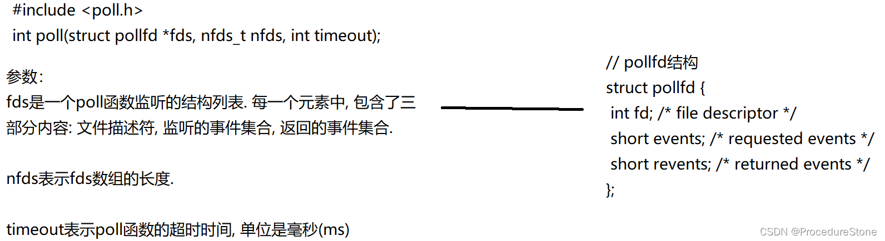
events和revents的取值：
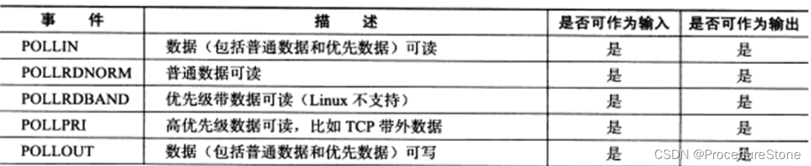
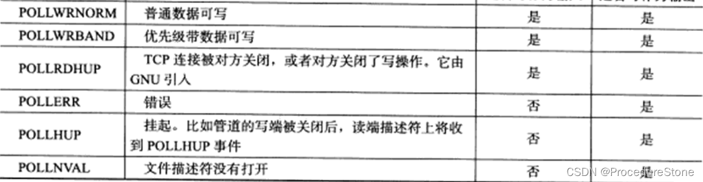

**poll的优点**

- 不同与select使用三个位图来表示三个 fdset的方式，poll使用一个pollfd的指针实现.pollfd结构包含了要监视的event和发生的event，不再使用select“参数-值”传递的方式. 接口使用比select更方便.
- poll并没有最大数量限制 (但是数量过大后性能也是会下降).

**poll的缺点**

poll中监听的文件描述符数目增多时，和select函数一样，poll返回后，需要轮询pollfd来获取就绪的描述符.每次调用poll都需要把大量的pollfd结构从用户态拷贝到内核中.同时连接的大量客户端在一时刻可能只有很少的处于就绪状态, 因此随着监视的描述符数量的增长, 其效率也会线性下降。


#### epoll

按照man手册的说法: 是为处理大批量句柄而作了改进的poll. 但其实epoll已经可以说是一个新东西了。
它是在2.5.44内核中被引进的(epoll(4) is a new API introduced in Linux kernel 2.5.44) 
Linux2.6下性能最好的多路它几乎具备了之前所说的一切优点，被公认为性能最好的多路IO转接方案。

**epoll的接口**

epoll有3个系统调用接口：

```cpp
int epoll_create(int size);
int epoll_ctl(int epfd, int op, int fd, struct epoll_event *event);
int epoll_wait(int epfd, struct epoll_event * events, int maxevents, int timeout);
```


下面我们来看看epoll的具体流程：
网卡接收数据，触发硬件中断，OS调用epoll的回调函数，执行以下4步

1. 根据网卡驱动信息，获取就绪的fd
2. 将数据交付给TCP的接收缓冲区
3. 以就绪的fd作为红黑树节点的key值，提取对应红黑树节点（内部包含events信息）
4. 依据提取的信息创建就绪节点，连接到就绪队列中

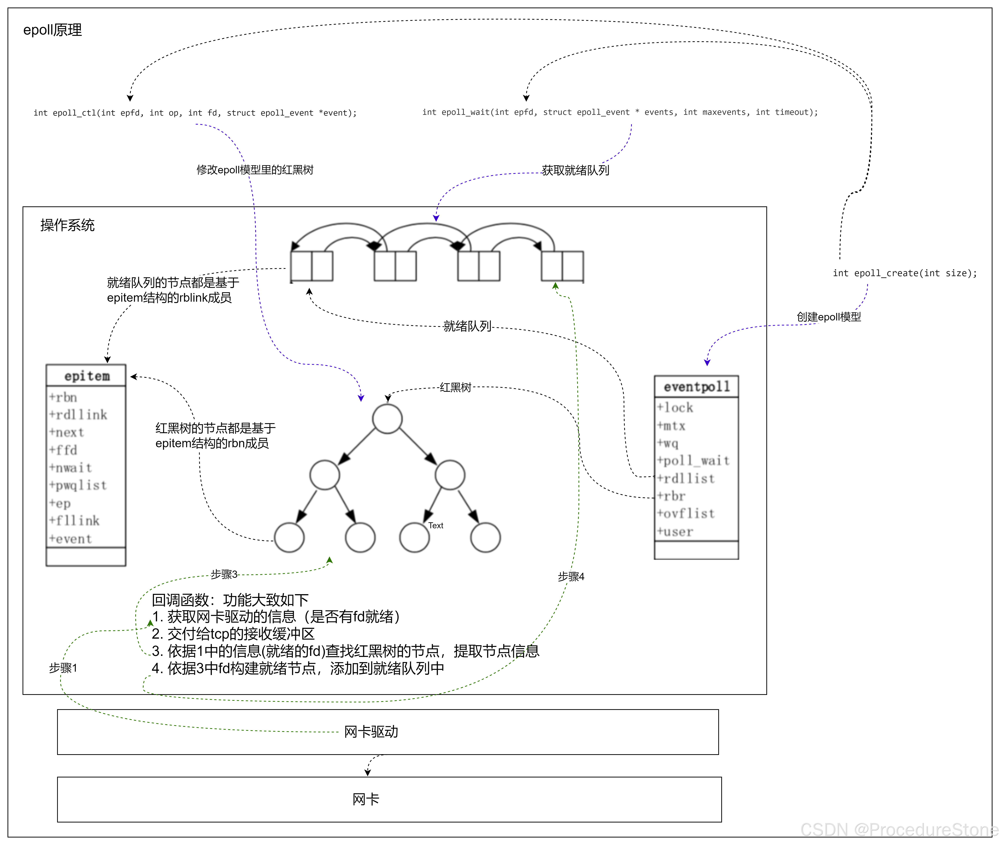


