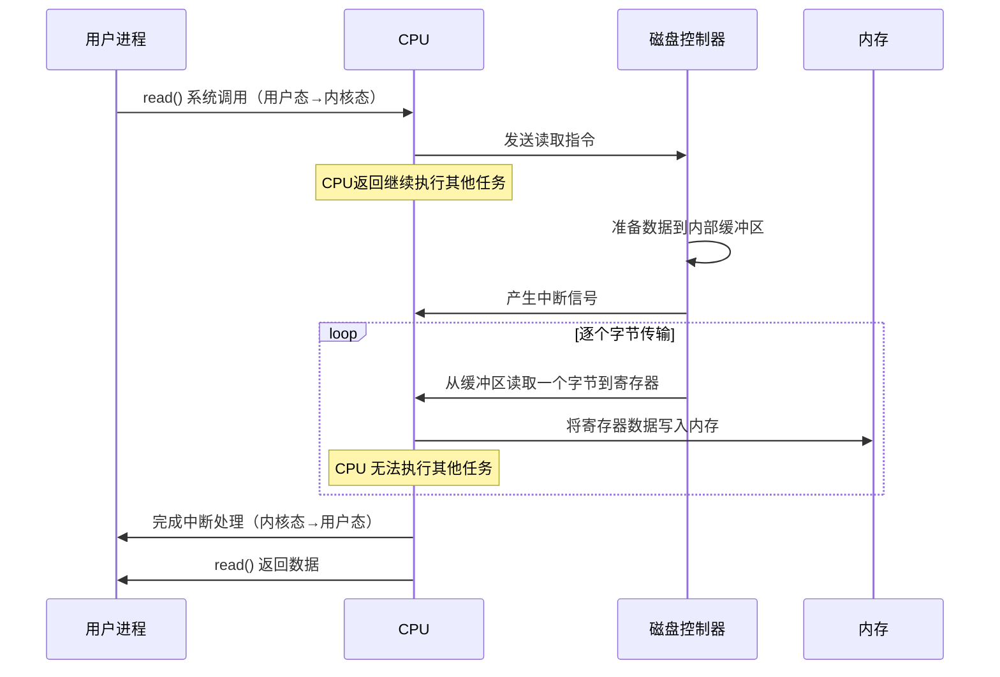
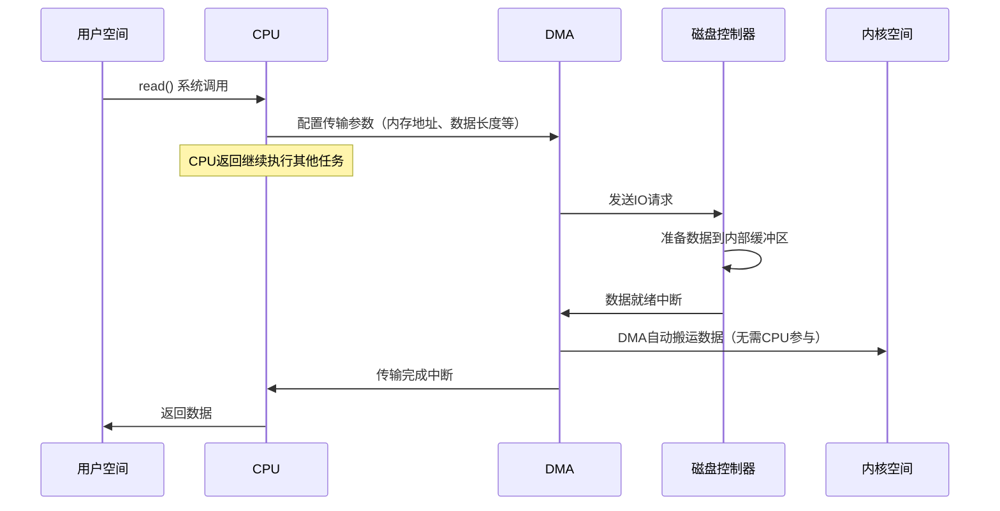
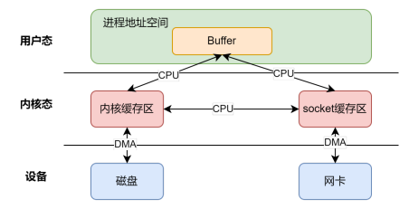

---
title: 【IO 01】IO过程分析
description: IO过程分析
date: 2025-04-02
slug: io_process_analysis
categories:
    - 后端开发
tags:
    - IO
---

## io过程的演进

### PIO模式

编程式IO（Process IO)：数据需通过 CPU 寄存器中转，**完全占用 CPU**（早期设备的实现方式）

- CPU发出对应的指令给磁盘控制器，然后返回；
- 磁盘控制器收到指令后，于是就开始准备数据，会把数据放入到磁盘控制器的内部缓冲区中，然后产生一个中断;
- CPU收到中断信号后，停下手头的工作，接着把磁盘控制器的缓冲区的数据一次一个字节地读进自己的寄存器，然后再把寄存器里的数据写入到内存。在数据传输的期间CPU是无法执行其他任务的。

### DMA模式

直接内存访问（Direct Memory Access）技术：DMA将数据从磁盘控制器缓冲区搬运到内存，**不需要 CPU 逐字节参与**（现代通用方案）

- 用户进程调用read方法，向操作系统发出I/O请求，请求读取数据到自己的内存缓冲区中，进程进入阻塞状态;
- 操作系统收到请求后，进一步将I/O请求发送DMA，然后让CPU执行其他任务；
- DMA进一步将I/O请求发送给磁盘；
- 磁盘收到DMA的I/O请求，把数据从磁盘读取到磁盘控制器的缓冲区中，当磁盘控制器的缓冲区被读满后，向DMA发起中断信号，告知自己缓冲区已满；
- DMA收到磁盘的信号，将磁盘控制器缓冲区中的数据拷贝到内核缓冲区中，此时不占用CPU，CPU可以执行其他任务；
- 当DMA读取了足够多的数据，就会发送中断信号给CPU;
- CPU收到DMA的信号，知道数据已经准备好，于是将数据从内核拷贝到用户空间，系统调用返回；

>早期DMA只存在在主板上，如今由于I/O 设备越来越多，数据传输的需求也不尽相同，所以每个I/O设
>备里面都有自己的DMA控制器。

## 传统IO的效率分析

IO可以划分为2个过程：等待数据就绪+数据拷贝

我们先说传统IO的数据拷贝

### 多次切换和拷贝

对于一次read + write，总共发生**4次用户态和内核态的上下文切换**和**4次数据拷贝**

上下文切换

- read的调用和返回：2次
- write的调用和返回：2次

数据拷贝

- 外存（如磁盘、网卡）到内核空间，内核空间再到用户空间：2次
- 用户空间到内核空间，内核空间到外存：2次

上下文切换到成本并不小，一次切换需要耗时几十纳秒到几微秒，虽然时间看上去很短，但是在高并发的场景下，这类时间容易被累积和放大，从而影响系统的性能，数据拷贝同理。

### 等待数据就绪

对于本地，多数情况下数据都是就绪的，但到了网络，情况就不同了，等待时间往往大于数据拷贝时间。在传统IO中，往往是阻塞式等待，导致用户进程浪费了很多时间。

## 如何提高IO效率

2个维度：

1. 减少等待时间（即在等待时间内做其他事）
2. 减少上下文切换和数据拷贝的次数

---

## 关于内核缓存区

前文一直提到一个叫名词：内核缓存区，内核缓存区是什么？内核缓冲区实际上是**磁盘高速缓存（PageCache）**。

它采用**局部型原理**来提高速度，举例：用户需要读取磁盘某部分0-50字节的内容，PageCache会**预读**0-100字节的内容。

多数情况下，PageCache能提高速率，但如果文件很大，PageCache的作用就体现不了，原因有2：

- PageCache 本身容量较小，读取大文件时，导致PageCache长时间被大文件占据，其他**热点**小文件可能就无法充分使用到 PageCache，于是磁盘读写的性能就会下降了
- PageCache 中的大文件数据，不但没有享受到缓存带来的好处，还耗费 DMA 多拷贝到 PageCache一次；

那如何解决大文件的读取呢？

综上，我们留下了3个问题：

1. 如何减少等待时间（即在等待时间内做其他事）
2. 如何减少上下文切换和数据拷贝的次数

3. 如何高效读取大文件
