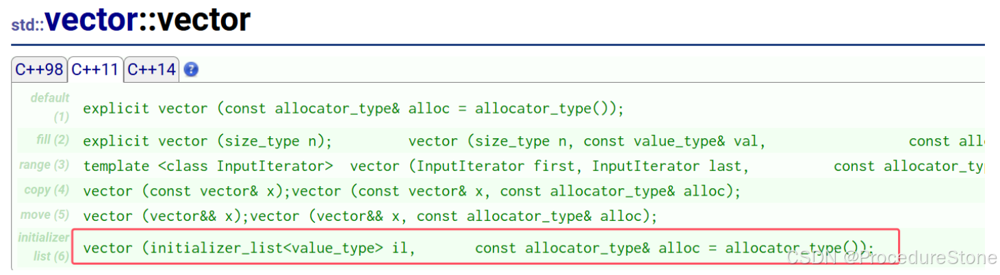
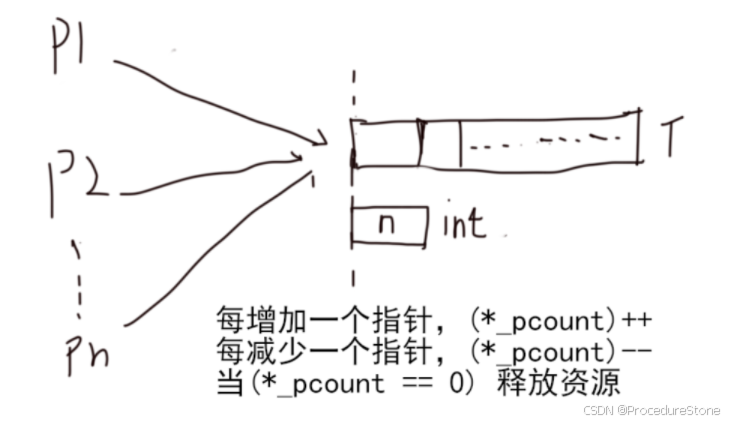
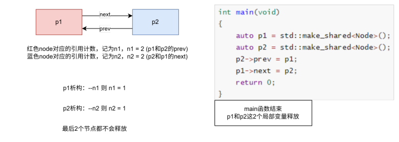
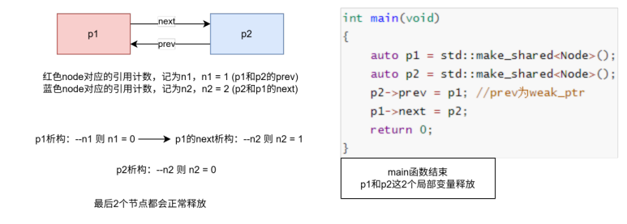
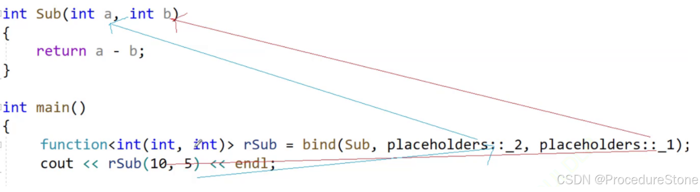

## C++11简介

在2003年C++标准委员会曾经提交了一份技术勘误表(简称TC1)，使得C++03这个名字已经取代了C++98称为C++11之前的最新C++标准名称。不过由于C++03(TC1)主要是对C++98标准中的漏洞进行修复，语言的核心部分则没有改动，因此人们习惯性的把两个标准合并称为C++98/03标准。从C++0x到C++11，C++标准10年磨一剑，第二个真正意义上的标准珊珊来迟。相比于C++98/03，C++11则带来了数量可观的变化，其中包含了约140个新特性，以及对C++03标准中约600个缺陷的修正，这使得C++11更像是从C++98/03中孕育出的一种新语言。相比较而言C++11能更好地用于系统开发和库开发、语法更加泛华和简单化、更加稳定和安全，不仅功能更强大，而且能提升程序员的开发效率，公司实际项目开发中也用得比较多，所以我们要作为一个重点去学习。C++11增加的语法特性非常篇幅非常多，这里挑重点介绍。


面试常问：你了解c++11的新特性吗？说一下你的看法

回答思路：

1. 首先说一下有哪些新特性
2. 然后再问面试官需要详细说说哪些特性


## 统一的初始化列表
### {}初始化
在C++98中，标准允许使用花括号{}对数组或者结构体元素进行统一的列表初始值设定。比如

```cpp
struct Point
{
    int _x;
    int _y;
};
int main()
{
    int array1[] = {1, 2, 3, 4, 5};
    int array2[5] = {0};
    Point p = {1, 2};
    return 0;
}
```

C++11扩大了用大括号括起的列表(初始化列表)的使用范围，使其可用于所有的内置类型和用户自定义的类型，**使用初始化列表时，可添加等号(=)，也可不添加**。、

```cpp
class Date
{
public:
    Date(int year, int month, int day)
        : _year(year), _month(month), _day(day)
    {
        cout << "Date(int year, int month, int day)" << endl;
    }

private:
    int _year;
    int _month;
    int _day;
} 
struct Point
{
    int _x;
    int _y;
};
int main()
{
    int x1 = 1;
    int x2{2};
    int array1[]{1, 2, 3, 4, 5};
    int array2[5]{0};
    Point p{1, 2};
    // C++11中列表初始化也可以适用于new表达式中
    int *pa = new int[4]{0};
    
    Date d1(2022, 1, 1);
    // C++11支持的列表初始化，这里会调用构造函数初始化
    Date d2{2022, 1, 2};
    Date d3 = {2022, 1, 3};
    return 0;
}
```


记录一个事例：

```cpp
class Test
{
public:
    Test(int* p) {}
};
int main()
{
    int* start = new int();
    *start = 1;
    Test(start); //我想创建一个匿名对象, 但是编译器认为这可能是一个函数声明
    Test t(start);//true
    Test{ start };//true
}
```

### std::initializer_list

std::initializer_list 是 C++11 中的一个特性，它允许你使用花括号 {} 中的值列表来初始化容器或数组。通常用于初始化标准库容器，比如 std::list、std::vector、std::set、std::map 以及数组， 也可以用于包含容器成员的自定义类。
当使用花括号初始化语法时，编译器会生成一个 `std::initializer_list` 对象。这个对象内部实际上包含两个指针：一个指向数组（或类似数组的结构）的开始位置，另一个指向结束位置（即下一个元素的起始位置，但不包括该位置）。




```cpp
int main()
{
 	vector<int> v = { 1,2,3,4 };
 	list<int> lt = { 1,2 };
 	// 这里{"sort", "排序"}会先初始化构造一个pair对象
 	map<string, string> dict = { {"sort", "排序"}, {"insert", "插入"} };
	// 使用大括号对容器赋值
	v = {10, 20, 30};
 	return 0;
}
```


## C++11关键字

### auto

在C++98中auto是一个存储类型的说明符，表明变量是局部自动存储类型，但是局部域中定义局部的变量默认就是自动存储类型，所以auto就没什么价值了。C++11中废奔auto原来的用法，将其用于实现自动类型腿断。这样要求必须进行显示初始化，让编译器将定义对象的类型设置为初始化值的类型。

```cpp
auto n = 10; //auto 为int
auto f  = 12.8; //auto 为double
auto p = &n;	//auto 为int*
```

auto的特殊情况：

1.  auto 不能在函数的参数中使用。
2.  作用于类的成员变量,auto 不能作用于类的非静态成员变量。
3.  auto 关键字不能定义数组
4.  auto不能用于模板

5.  `vector<bool>`

```cpp
int main() {
    std::vector<bool> vec{0,1,1,1,0};
    bool var = vec[3];
    auto var2 = vec[3];
    return 0;
}
```

`std::vector<bool>` 的特殊性

- **位压缩**：`std::vector<bool>` 是一个特例，它使用位（bit）而不是字节（byte）来存储布尔值。这是为了节省内存，但它也意味着对 `std::vector<bool>` 的访问与常规向量有所不同。
- **代理对象**：访问 `std::vector<bool>` 中的元素（例如 `vec[3]`）返回一个临时的代理对象，而不是普通的 `bool` 值。这是一个特殊的代理类型，用于提供对底层位的访问。它实际上并不是 `bool` 的引用。


### decltype

decltype 是 C++11 新增的一个关键字，它和 auto 的功能一样，都用来在编译时期进行自动类型推导。它是declare type的缩写，主要功能用来声明类型auto并不适合于所有自动推导的类型，并且auto的使用必须要初始化变量。而特殊的情况可能无法满足。declart type就可以解决这个问题。它可以在编译的时候推导出一个表达式

```cpp
int val = 10;
//auto根据val的类型类推导，必须初始化
auto varName = val;
---------------------------------------------
//decltype是根据exp表达式推导，可以不用初始化
decltype(exp) varname;
int a = 0;
decltype(a) b = 1;         //b被推导成int 
decltype(10.8) x = 5.5;    //x被推导成double
decltype(x + 100) y;      //b被推导成double


使用场景：模板泛型编程
//auto + decltype结合实现返回值类型后置
template<typename T1, typename T2>
auto add(const T1& t1, const T2& t2) -> decltype(t1 + t2)
{
    return t1 + t2;
}
template <typename T1, typename T2>
auto mul(const T1& t1, const T2& t2) -> decltype(t1* t2)
{
    return t1 * t2;
}

int main()
{
    auto a = 3;
    auto b = 4.0;
    auto c = 3.14;

    auto d = mul(add(a, b), d);
    cout << d << endl;  // 21.98

}
```


### using

在老版的C++中using用于声明域名空间。在C++11中C++赋予了using更多新的功能，让C++变得更加灵活。

C++中提供了using也有了重新定义类型别名的方式。

```cpp
C++98:
typedef  旧的类型名 新的类型;
//使用例子：
typedef  unsigned int uint_t;
typedef  int (*funp)(int ,int);

C++11
using 新的类型 = 旧的类型
//例子:
using  uint_t = int;
using funp = int (*)(int,int);
```

优点：

- using可以给**模板类**重定义，但是typedef无法使用此功能。
- using更清晰


### nullptr

nullptr是为了替换NULL而发明出来的。nullptr的类型为std::nullptr_t,而NULL的类型为int，可以防止一些类型转化导致的问题。如下：

```cpp
#include <iostream>

using namespace std;

void funTest(char* p)
{
    cout << "void fun(char *p)" << endl;
}

void funTest(int p)
{
    cout << "void fun(int p)" << endl;
}

int main()
{
                   
    funTest(NULL); 
    funTest(nullptr);
    funTest(200);
    return 0;
}

结果：
void fun(int p)
void fun(char *p)
void fun(int p)
```


```cpp
//NULL底层实现
#ifndef NULL
    #ifdef __cplusplus
        #define NULL 0
    #else
        #define NULL ((void *)0)
    #endif
#endif

//模拟nullptr底层实现（非官方)
const /*常量*/
class nullptr_t
{
public:
    template<class T>
    operator T*() const  /*向任意类的非成员指针转换*/
    {
        return 0;
    }

    template<class C,class T>
    operator T C::*() const  /*向任意类型的成员指针转换*/
    {
        return 0;
    }
private:
    void operator&() const /*不可取地址*/
    {
    }
}nullptr = {};
```

### default

用于生产默认的成员函数

```cpp
class A
{
public:
	A() = default;
	A& operator=(const A&) = default;
};
```

### delete	

禁止生成默认的成员函数

```
class A
{
public:
	A(const A&) = delete; //禁止生成拷贝构造
};
```


### orride

c++11新增：用于明确指示派生类中的成员函数是对基类中的虚函数的重写。若没有对虚函数重写，会提示错误。一般子类写了override，就不用加virtual了。

```cpp
class A
{
public:
	virtual void test() {};
};
class B:pulic A
{
public:
	void test() orride {}; //如果没实现，就报错
};
```


### final

c++11新增：用于标记虚函数，表示该函数不能在派生类中再次被重写。

```cpp
class A
{
public:
	virtual void test() final{};
};
class B:pulic A
{
public:
	virtual void test() {}; //如果实现，就报错
};
```


### explicit

c++11新增，禁止隐式类型转换

```cpp
比如智能指针不允许将原始指针赋值给 std::shared_ptr
    shared_ptr<int> p(new int);
	shared_ptr<int> p = new int; //false
原因是shared_ptr构造函数使用了explicit.对于 std::shared_ptr 来说，如果其构造函数不带 explicit，那么像 std::shared_ptr<int> mp = new int; 这样的赋值就会被允许，编译器会尝试隐式将 int* 类型转换为 std::shared_ptr<int>。
```


### constexpr (重要)

`constexpr` 是 C++11 引入的关键字，用于指定表达式在**编译时**求值。它允许在编译期对常量表达式进行计算，从而提高程序效率，并增加编译时类型检查的可能性。

```cpp
constexpr int Square(int x) {
    return x * x;
}

int main() {
    constexpr int result = Square(10);  // 编译期计算
    int y = 5;
    int runtimeResult = Square(y);      // 运行期计算
    
    constexpr int z = 5;
    constexpr int runtimeResult = Square(z);   // 编译期计算   
}

```

`Square(10)` 被编译期求值，而 `Square(y)` 则在运行时求值，因为 `y` 是运行时变量。


## 右值引用 *

左值和右值：**左值可以出现赋值符号的左边，右值不能出现在赋值符号左边**

```cpp
// 以下几个都是左值
int* p = new int(0);
int b = 1;
const int c = 2;
// 以下几个都是常见的右值
纯右值：非引用返回的临时变量、运算表达式产生的临时变量、原始字面量和 lambda 表达式等
将亡值：与右值引用相关的表达式，比如，T&& 类型函数的返回值、 std::move 的返回值等。
10;
x + y;
fmin(x, y);
```

 C++98/03 标准中就有引用，使用 "&" 表示。但此种引用方式有一个缺陷，即正常情况下只能操作 C++ 中的左值，无法对右值添加引用。虽然 C++98/03 标准不支持为右值建立非常量左值引用，但允许使用常量左值引用操作右值。也就是说，常量左值引用既可以操作左值，也可以操作右值.

```cpp
int a = 3;
int& b = a; //true;
int& c = 10;//false
const int& d = 10; //true
```

左指引用的缺陷：当函数返回对象是一个局部变量，出了函数作用域就不存在了，就不能使用左值引用返回，只能传值返回，而传值返回**至少**存在1次拷贝构造。

为此，C++11 标准新引入了另一种引用方式，称为右值引用，用 "&&" 表示。

**左值引用总结**：

1. 左值引用只能引用左值，不能引用右值。

2. 但是const左值引用既可引用左值，也可引用右值

```cpp
int main()
{
    // 左值引用只能引用左值，不能引用右值。
    int a = 10;
    int& ra1 = a;   // ra为a的别名
    //int& ra2 = 10;   // 编译失败，因为10是右值
    // const左值引用既可引用左值，也可引用右值。
    const int& ra3 = 10;
    const int& ra4 = a;
    return 0;
}
```

**右值引用总结：**

1. 右值引用只能右值，不能引用左值。

2. 但是右值引用可以move以后的左值。

```cpp
int main()
{
 	// 右值引用只能右值，不能引用左值。
 	int&& r1 = 10;
 
 	// error C2440: “初始化”: 无法从“int”转换为“int &&”
 	// message : 无法将左值绑定到右值引用
 	int a = 10;
 	int&& r2 = a; //error
    
 	// 右值引用可以引用move以后的左值
  	int&& r3 = std::move(a);
 	return 0;
}
```


### 完美转发

**完美转发**（Perfect Forwarding）是 C++11 引入的一种机制，它允许函数在调用其他函数时，能够**完美保留**传入参数的类型和值类别（左值或右值），并将其准确地传递给下一个函数。

为什么要有完美转发？根本原因在于**右值引用指向右值，但本身是左值**，也就是说`T&& t`中，t指向右值，但t本身是左值。所以，如果不采用发转，不管传进来的是右值，经过右值引用也会变成左值，从而去调用左值函

```cpp
void print(T&& t)
{
	t指向右值，但是t本身是左值
}
```
**std::forward** 完美转发在传参的过程中保留对象原生类型属性

```cpp
void Fun(int &x){ cout << "左值引用" << endl; }
void Fun(const int &x){ cout << "const 左值引用" << endl; }
void Fun(int &&x){ cout << "右值引用" << endl; }
void Fun(const int &&x){ cout << "const 右值引用" << endl; }
// std::forward<T>(t)在传参的过程中保持了t的原生类型属性。
template<typename T>
void PerfectForward(T&& t)
{
 	Fun(std::forward<T>(t));
}
int main()
{
 	PerfectForward(10);           // 右值
 	int a;
 	PerfectForward(a);            // 左值
 	PerfectForward(std::move(a)); // 右值
 	const int b = 8;
 	PerfectForward(b);      	  // const 左值
 	PerfectForward(std::move(b)); // const 右值
 	return 0;
 }
```


实际中使用场景

```cpp
//...
void pushFront(T&& t)
{
	insert(0, std::forward<T>(t));
}

void insert(size_t pos, T&& t)
{
	/....
}
```


### 万能引用（引用折叠）

**万能引用**（Universal References）是在 C++11 中引入的一个重要概念。万能引用是通过使用模板类型推导和右值引用的结合来实现的，主要用于实现完美转发（Perfect Forwarding）

```cpp
#include <iostream>
#include <utility>

template <typename T>
void Process(T&& arg) { // arg 是一个万能引用
    // 完美转发，调用一个其他的函数
    // std::forward 将 arg 转发为其原始值类别（左值或右值）
    std::cout << arg << std::endl;
}

int main() {
    int x = 10;
    Process(x);           // 传递左值， T&&会发生引用折叠，折叠为T&
    Process(20);          // 传递右值
    return 0;
}

template <typename T>
T&& ReturnValue(T&& value) {
    return std::forward<T>(value); // 完美转发，返回右值引用或左值引用
}
只有参数是万能引用，上面的返回值只能视作右值
```

## 可变模板参数

C++11的新特性可变参数模板能够让您创建可以接受可变参数的函数模板和类模板，相比C++98/03，类模版和函数模版中只能含固定数量的模版参数，可变模版参数无疑是一个巨大的改进。然而由于可变模版参数比较抽象，使用起来需要一定的技巧.

形式：`template<class ...Args>`

```cpp
// Args是一个模板参数包，args是一个函数形参参数包
// 声明一个参数包Args...args，这个参数包中可以包含0到任意个模板参数。
template <class ...Args>
void ShowList(Args... args)
{}
```

上面的参数args前面有省略号，所以它就是一个可变模版参数，我们把带省略号的参数称为“参数包”，它里面包含了0到N(N>=0)个模版参数。我们无法直接获取参数包args中的每个参数的，只能通过展开参数包的方式来获取参数包中的每个参数，这是使用可变模版参数的一个主要特点，也是最大的难点，即如何展开可变模版参数。由于语法不支持使用args[]这样方式获取可变参数，所以我们的用一些奇招来--获取参数包的值。

```cpp
方式1：递归
// 递归终止函数
template <class T>
void ShowList(const T &t)
{
    cout << t << endl;
}
// 展开函数
template <class T, class... Args>
void ShowList(T value, Args... args)
{
    cout << value << " ";
    ShowList(args...);
}
int main()
{
    ShowList(1);
    ShowList(1, 'A');
    ShowList(1, 'A', std::string("sort"));
    return 0;
}
方式2：逗号表达式展开参数包
template <class T>
void PrintArg(T t)
{
    cout << t << " ";
}
// 展开函数
template <class... Args>
void ShowList(Args... args)
{
    int arr[] = {(PrintArg(args), 0)...};
    cout << endl;
}
int main()
{
    ShowList(1);
    ShowList(1, 'A');
    ShowList(1, 'A', std::string("sort"));
    return 0;
}
```

使用：

```cpp
class A
{
private:
	int a, b, c;
public:
	A(int e1 = 0, int e2 = 0, int e3 = 0) : a(e1), b(e2), c(e3) {}
	void print() { cout << a << b << c << endl; }
};

template<class ...Args>
A* Create(Args... args)
{
	A* ret = new A(args...);//一次性使用参数包的所有参数
	return ret;
}
int main(void)
{
	A* p1 = Create(1);
	A* p2 = Create(1, 2, 3);
	A* p3 = Create(1, 2, 3);
	p1->print();
	p2->print();
	return 0;
}
```

注：STL容器中的empalce相关接口使用了 可变模板 + 万能引用

```cpp
template <class... Args>
void emplace_back (Args&&... args);
```
emplace_back是直接构造了，push_back 是先构造，再移动构造

## 智能指针 *

智能指针是基于RAII机制的类模板，利用对象生命周期来控制程序资源。

> RAII是Resource Acquisition Is Initialization（wiki上面翻译成 “资源获取就是初始化”）的简称，是C++语言的一种管理资源、避免泄漏的惯用法。利用的就是C++构造的对象最终会被销毁的原则。**RAII的做法是使用一个对象，在其构造时获取对应的资源，在对象生命期内控制对资源的访问，使之始终保持有效，最后在对象析构的时候，释放构造时获取的资源。**


2个问题：为什么？怎么实现？

**为什么要保障资源自动释放**？

1. 防止开发者忘记delete，造成内存泄漏
2. 抛异常，导致跳过delete 语句

```cpp
int* p = new int;
throw ...
delete p;
```

**如何保障资源正常释放**？

在智能指针的析构函数内，执行指针指向对象的析构函数。


智能指针一共有4种，其中auto_ptr已经弃用。不同类型的智能指针的使用场景，实现机制不同。对于使用者，首先要记住的就是它们的使用场景。

### auto_ptr

C++98: 资源转移

C++11之前：资源管理权限的转移----对资源释放的权限

C++11：弃用


它的解决方式是管理权转移，`p2 = p1`会将p1的管理权转移给p2, 而后p1悬空。如果p1是将亡值，这没什么问题，但p1不一定是将亡值，可能是左值，不能随便的转移资源。因此建议什么情况都不要使用auto_ptr

auto_ptr`在C++11中被标记为`deprecated`（弃用），并建议开发者迁移至`std::unique_ptr


### unique_ptr

c++11：**unique_ptr代表的是专属所有权，即由unique_ptr管理的内存，只能被一个对象持有。**

因此：unique_ptr不支持拷贝和赋值，只支持移动(std::move)


**使用场景**：

大多数场景下用到的应该都是unique_ptr

- 忘记delete
- 抛异常，导致跳过delete 语句

这2点也是智能指针最基本的功能


**性能**：

因为C++的zero cost abstraction的特点，unique_ptr在默认情况下和裸指针的大小是一样的。所以**内存上没有任何的额外消耗，性能是最优的。**


**模拟实现:简易版**

```cpp
template<typename T>
class UniquePtr {
public:
    // 默认构造函数
    UniquePtr(T* ptr = nullptr) : m_ptr(ptr) {}

    // 移动构造函数
    UniquePtr(UniquePtr&& other) noexcept : m_ptr(other.m_ptr) {
        other.m_ptr = nullptr; // 转移所有权，置空其他指针
    }

    // 移动赋值运算符
    UniquePtr& operator=(UniquePtr&& other) noexcept {
        if (this != &other) {
            delete m_ptr;          // 释放当前持有的指针
            m_ptr = other.m_ptr;   // 转移所有权
            other.m_ptr = nullptr;  // 置空其他指针
        }
        return *this;
    }

    // 禁止拷贝构造和拷贝赋值
    UniquePtr(const UniquePtr&) = delete;
    UniquePtr& operator=(const UniquePtr&) = delete;

    // 析构函数
    ~UniquePtr() {
        delete m_ptr; // 释放管理的对象
    }

    // 解引用操作符
    T& operator*() const {
        return *m_ptr;
    }

    // 指针操作符
    T* operator->() const {
        return m_ptr;
    }

    // 获取原始指针
    T* get() const {
        return m_ptr;
    }

    // 释放管理的指针
    void reset(T* ptr = nullptr) {
        delete m_ptr; // 释放旧指针
        m_ptr = ptr;  // 更新为新指针
    }

    // 释放并返回原始指针
    T* release() {
        T* temp = m_ptr;
        m_ptr = nullptr; // 置空管理指针
        return temp;     // 返回原始指针
    }

private:
    T* m_ptr; // 管理的指针
};
```

 `std::unique_ptr`，它专门为管理动态数组提供了支持。你可以直接使用 `std::unique_ptr` 的数组形式，它会在超出作用域时自动调用 `delete[]`：而shared_ptr直到c++17才支持动态数组

```cpp
std::unique_ptr<int[]> ptr(new int[5]);
```


### shared_ptr

c++11新增：**shared_ptr代表的是共享所有权，即多个shared_ptr可以共享同一块内存。**

**使用场景**：

1. **shared_ptr通常使用在共享权不明的场景。有可能多个对象同时管理同一个内存时。最经典场景就是：多线程下的跨线程的对象**
2. 对象的延迟销毁。当一个对象的析构非常耗时，甚至影响到了关键线程的速度。可以将对象转移到另外一个线程中释放，从而解放关键线程。
3. 延迟对象的生命周期。


**原理**：

shared_ptr内部是利用引用计数来实现内存的自动管理，每当复制一个shared_ptr，引用计数会+1。当一个shared_ptr离开作用域时，引用计数会-1。当引用计数为0的时候，则delete内存。




**性能**：

1. **内存占用高**：shared_ptr的内存占用是裸指针的两倍。因为除了要管理一个裸指针外，还要维护一个引用计数。 因此相比于unique_ptr, shared_ptr的内存占用更高
2. **原子操作性能低**：考虑到线程安全问题，引用计数的增减必须是原子操作。而原子操作一般情况下都比非原子操作慢。


我们在使用中，可以通过移动来优化：如果一个shared_ptr需要将所有权共享给另外一个新的shared_ptr，而我们确定在之后的代码中都不再使用这个shared_ptr。 对于此种场景，我们尽量使用std::move，将shared_ptr转移给新的对象。因为移动不用增加引用计数，因此性能比复制更好。


**使用**：


| shared_ptr支持的操作   | 描述                                                         |
| ---------------------- | ------------------------------------------------------------ |
| `shared_ptr<T>  p`     | 空共享指针，可以指向T类型对象                                |
| `*p`                   | 获得p所指向的对象                                            |
| `void reset`           | 释放任何可能存在的被管理对象的所有权。调用的共享指针被设置为空 |
| `void reset(T *ptr)`   | 释放当前被管理的对象的所有权。获取由ptr指向的对象的所有权。  |
| `T *get()`             | 返回指向被管理对象的裸指针，如果没有被管理的对象，则返回空指针。 |
| `make_shared<T>(args)` | 返回一个shared_ptr,此shared_ptr指向一个动态分配的类型为T的对象，用args初始化此对象。 |
| `p.use_cout()`         | 返回与p共享对象的智能指针数量                                |

使用注意事项：

```cpp
注意1：不要使用原始指针初始化多个shared_ptr
{
	A* p = new A;
	shared_ptr<A> sp1(p);
	shared_ptr<A> sp2(p);
}
当出了这个作用域后，报错，double free, 多次释放
因为这段代码相当于是 sp1和sp2分别管理不同的引用计数器，即都是1，当出了作用域后，sp1析构会释放一次，sp2析构也会释放一次
正确写法：
{
	A* p = new A;
	shared_ptr<A> sp1(p);
	shared_ptr<A> sp2(sp1);
}

注意2：不要用栈中的指针构造 shared_ptr
std::shared_ptr<A> func() 
{
    A a(10);
    std::shared_ptr<A> sharedPtr(&a);
    return sharedPtr; // 错误：返回栈上对象的 shared_ptr
}

int main() 
{
    std::shared_ptr<A> ptr = func();
}

注意3：shared_ptr的参数默认是不支持数组类型
std::shared_ptr<int> ptr(new int[5]);  // 错误
std::shared_ptr<int[]> sp1(new int[10]()); // 错误，c++17前不能传递数组类型作为shared_ptr的模板参数
因为 std::shared_ptr 默认使用 delete 来释放内存，而不是 delete[]。

解决方式：添加自定义删除器
std::shared_ptr<int> ptr(new int[5], [](int* p) { delete[] p; });
std::shared_ptr<int> sp3(new int[10](), std::default_delete<int[]>());

```


**模拟实现：**

```cpp
#pragma once
#include <mutex>
template<typename T>
class MySharedPtr
{
public:
    MySharedPtr(T* ptr = nullptr);
    MySharedPtr(const MySharedPtr<T>& other);
    MySharedPtr<T>& operator=(const MySharedPtr<T>& other);
    ~MySharedPtr();

    T& operator*();
    T* operator->();
    int useCount();
    T* get();

    void realse();
    void addCount();
    void subCount();
private:
    T* m_ptr;
    int* m_pcount;
    std::mutex* m_pmutex;
};

template<typename T>
MySharedPtr<T>::MySharedPtr(T* ptr)
    :m_ptr(ptr)
    , m_pcount(new int(1))
    , m_pmutex(new std::mutex)
{}
template<typename T>
MySharedPtr<T>::MySharedPtr(const MySharedPtr<T>& other)
    : m_ptr(other.m_ptr)
    , m_pcount(other.m_pcount)
    , m_pmutex(other.m_pmutex)
{
    addCount();
}
template<typename T>
MySharedPtr<T>& MySharedPtr<T>::operator=(const MySharedPtr<T>& other)
{
    if (this != &other)
    {
        realse();
        m_ptr = other.m_ptr;
        m_pcount = other.m_pcount;
        m_pmutex = other.m_pmutex;
        addCount();
    }
    return *this;
}
template<typename T>
MySharedPtr<T>::~MySharedPtr()
{
    realse();
}
template<typename T>
T& MySharedPtr<T>::operator*()
{
    return *(m_ptr);
}
template<typename T>
T* MySharedPtr<T>::operator->()
{
    return m_ptr;
}
template<typename T>
int MySharedPtr<T>::useCount()
{
    return *(m_pcount);
}
template<typename T>
T* MySharedPtr<T>::get()
{
    return m_ptr;
}

template<typename T>
void MySharedPtr<T>::realse()
{
    bool flag = false;
    m_pmutex->lock();
    if (--(*m_pcount) == 0 && m_ptr)
    {
        delete m_ptr;
        delete m_pcount;
        flag = true;
    }
    m_pmutex->unlock();
    if (flag) delete m_pmutex;
}
template<typename T>
void MySharedPtr<T>::addCount()
{
    m_pmutex->lock();
    ++(*m_pcount);
    m_pmutex->unlock();
}
template<typename T>
void MySharedPtr<T>::subCount()
{
    m_pmutex->lock();
    --(*m_pcount);
    m_pmutex->unlock();
}
```


循环引用问题：

```cpp
class A
{
public:
    A() { cout << "A()" << endl; }
    ~A() { cout << "~A()" << endl; }
};

struct Node
{
public:
    A val;
    shared_ptr<Node> prev = nullptr;
    shared_ptr<Node> next = nullptr;
};

int main(void) 
{
    auto p1 = std::make_shared<Node>();
    auto p2 = std::make_shared<Node>();
    p2->prev = p1;
    p1->next = p2;
    return 0;
}
```



程序执行结果：

```
A()
A()
```


### weak_ptr

c++11新增：**weak_ptr代表的是无所有权，不能单独管理对象。配合shared_ptr解决循环引用问题**


weak_ptr 的构造和析构不会引起引用计数的增加或减少。

| weak_ptr支持的操作                       | 描述                                                         |
| ---------------------------------------- | ------------------------------------------------------------ |
| `bool expired() const`                   | 空共判断weak_ptr保存的队行是否已经销毁，销毁了返回true，否则返回false。 |
| `shared_ptr<element_type> lock() const;` | 生命周期未结束，返回一个share_ptr指针，指向同样的对象，否则，返回一个为nullptr的share_ptr.引用计数 + 1 |
| `long use_count()`                       | 返回所有与weak_ptr指向同一对象的shared_ptr的数量。           |


我们用weak_ptr来修改之前的循环引用代码

```cpp
class A
{
public:
    A() { cout << "A()" << endl; }
    ~A() { cout << "~A()" << endl; }
};

struct Node
{
public:
    A val;
    weak_ptr<Node> prev = nullptr; //修改prev和next其中一个为weak_ptr
    shared_ptr<Node> next = nullptr;
};

int main(void) 
{
    auto p1 = std::make_shared<Node>();
    auto p2 = std::make_shared<Node>();
    p2->prev = p1; //prev为weak_ptr
    p1->next = p2;
    return 0;
}
```




## lambda
lambda可以看作函数对象（仿函数），编译器会根据lambda表达式自动生成一个函数对象，它有以下优点：

-  声明式的编程风格：就地匿名定义目标函数或函数对象，不需要额外写一个命名函数或函数对象。
- 简洁：避免了代码膨胀和功能分散，让开发更加高效。
- 在需要的时间和地点实现功能闭包，使程序更加灵活。

形式：`[capture-list] (parameters) mutable -> return-type { statement }`

1. `[capture-list] `: 捕捉列表，该列表总是出现在lambda函数的开始位置，编译器根据[]来判断接下来的代码是否为lambda函数，捕捉列表能够捕捉上下文中的变量供lambda函数使用
2. `(parameters)`：参数列表。与普通函数的参数列表一致，如果不需要参数传递，则可以连同()一起省略
3. `mutable`：可变的，**默认情况下，lambda函数总是一个const函数**，mutable可以取消其常量性。使用该修饰符时，参数列表不可省略(即使参数为空)
4. `return-type`: 返回值类型，可以不写，编译器会自动推导
5. `{statement}` ： 函数体,短小

举例：`auto add = [](int x, int y)->int {return x + y; };`

捕捉列表：
捕捉列表描述了上下文中那些数据可以被lambda使用，以及使用的方式传值还是传引用。

- [var]：表示值传递方式捕捉变量var
- [=]：表示值传递方式捕获所有父作用域中的变量(包括this)
- [&var]：表示引用传递捕捉变量var
- [&]：表示引用传递捕捉所有父作用域中的变量(包括this)
- [this]：表示值传递方式捕捉当前的this指针

注意点：默认情况下，lambda函数总是一个const函数

```cpp
错误代码：
int a = 0, b = 3;
auto swap1 = [a,b]() {
std::swap(a, b); //报错
};
swap1();
cout << a << ' ' << b;
//值捕获的列表的a，b相当于 const int a， const int b：
//要想改变，如下：
auto swap1 = [a,b]() mutable {
std::swap(a, b);
};
但是它改变的是 int a, int b,无法影响外部的a,b。
```
测试：

```cpp
int main()
{
    int a = 10,b = 20;
    //提问下列代码哪些是正确，哪些是错误的
    auto funFirst = []{return a;};					//error
    auto funSecond = [&]{return a++;}; 				//true
    auto funThird = [=]{return a;};   				//true
    auto funFourth = [=]{return a++;};  			//false
    auto funFifth = [a]{return a + (b++);}; 		//error
    auto funSixth = [a,&b]{return a + (b++);};  	//true;
    auto funSeventh = [=,&b]{return a + (b++);};  	//true
}
```


## 包装器

### function

```cpp
std::function在头文件<functional>

// 类模板原型如下

template <class T> function;     // undefined

template <class Ret, class... Args>

class function<Ret(Args...)>;
```

使用场景及作用：
函数指针，反函数，lambda表达式，即使他们的功能一样，但将它们作为参数传给模板时，会被识别为三种类型，实例化为三份，这导致使用效率降低，而包装器则可以说是将它们进行了一层封装。


```cpp
template<class F, class T>
T useF(F f, T x)
{
	static int count = 0;
	cout << "count:" << ++count << endl;
	cout << "count:" << &count << endl;
	return f(x);
}
double f(double i)
{
	return i / 2;
}
struct Functor
{
	double operator()(double d)
	{
		return d / 3;
	}
};
#include <functional>
int main(void)
{
	std::function<double(double)> func1 = f;
	cout << useF(func1, 11.11) << endl;
	// 函数对象
	std::function<double(double)> func2 = Functor();
	cout << useF(func2, 11.11) << endl;
	// lamber表达式
	std::function<double(double)> func3 = [](double d)->double { return d / 4; };
	cout << useF(func3, 11.11) << endl;
	return 0;
}
```

### bind

bind是一个函数模板，它就像一个函数包装器(适配器)，接受一个可调用对象（callable object），生成一个新的可调用对象来“适应”原对象的参数列表。一般而言，我们用它可以把一个原本接收N个参数的函数fn，通过绑定一些参数，返回一个接收M个（M可以大于N，但这么做没什么意义）参数的新函数。同时，使用std::bind函数还可以实现参数顺序调整等操作。

使用如下：

```cpp
#include <iostream>
#include <functional>

void PrintSum(int x, int y) {
    std::cout << x + y << std::endl;
}

int main() {
    auto boundFunc = std::bind(PrintSum, 10, std::placeholders::_1); // 绑定第一个参数为10
    boundFunc(20); // 只需传入第二个参数
    return 0;
}
```
理解


它的使用场景是什么？
我个人仅在编写服务器项目时，使用bind包装**回调函数**。


## 其他

### std::tuple

c++11新增，用于将多个值打包成一个单一的对象。它可以存储不同类型的值，并且可以通过索引或类型来访问这些值。

```cpp
 std::tuple<int, std::string, double> t(42, "Hello", 3.14159);
```

### std::quoted

c++11新增，给字符串加双引号

```cpp
int main() {
    std::string str = "hello world";
    std::cout << str<< std::endl; //====> hello world

    std::cout <<"\"" +str + "\""<<std::endl;
    std::cout << std::quoted(str) << std::endl; //===> "hello world"
    return 0;
}
```