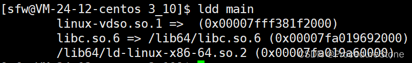

## 什么是编译链接？

编译则是将编译型语言（如c/c++）翻译为计算机可以识别的二进制文件，即目标文件。

链接则是一个打包的过程，将所有的目标文件以及系统组件组合成一个可执行文件。


c/c++编译链接过程如下：


## 编译

编译过程分为3部分：预处理（预编译），编译，汇编，整个编译过程由编译器负责。


### 预处理


#### 头文件的展开


#### #define定义的宏替换


#### 删除注释


### 编译


### 汇编


## 链接

C/C++的链接方式主要分为 **静态链接** 和 **动态链接**

### 静态链接

在编译时将库代码（`.a`/`.lib`）完全嵌入到可执行文件中


特点：

- 文件体积大，相同库代码在不同程序中重复存在

- 更新需重新编译整个程序
- 独立性强


### 动态链接

运行时加载共享库（`.so`/`.dll`），代码在内存中共享

特点：

- 节省磁盘和内存空间，多个程序共用同一库
- 支持热更新，库更新后无需重新编译程序
- 依赖环境配置，需确保运行时库路径正确


如何理解？


疑问：

假设动态库里有一个函数 Print(), 在生成动态库的过程中，Print函数的虚拟地址是被硬编码到动态库里。

这导致了一个问题，当进程使用Print(), 动态库首先被加载到物理内存里然后通过页表与虚拟地址相映射。但是由于Print函数的虚拟地址被硬编码到动态库，因此通过页表映射的Print函数虚拟地址是**固定的**。

那问题来了，这个虚拟地址已经被占了呢？那就出问题了。为了解决这个问题，动态库内的函数不在使用**绝对地址**，而是**相对地址**，即偏移量。

此时dy.so通过页表映射的虚拟地址不固定，之后要想找到Print函数，只需用动态库的起始地址 + Print函数的偏移量。


---

下面看看具体的操作系统下c++的编译和链接


## linux


### gcc/g++

GCC（GNU Compiler Collection）是Linux下C/C++开发的核心工具链，


### linux下制作动静态库

linux的静态库为.a文件，动态库为.so文件

- 静态库：通过`ar -rc`打包目标文件生成`.a`

- 动态库：使用`gcc -shared -fPIC`编译生成位置无关代码（PIC）的`.so`


#### linux静态库

现在有两个文件：test.h, test.c，如下。

```cpp
root@iZbp1inz4ol3gjahpjal9qZ:~/study# cat test.h
#include <stdio.h>
void Print();

root@iZbp1inz4ol3gjahpjal9qZ:~/study# cat test.c
#include "test.h"
void Print()
{
    printf("66666666\n");
}
```


执行上述命令后，结果如下：lib目录里存储制作的静态库。

```bash
root@iZbp1inz4ol3gjahpjal9qZ:~/study# make
gcc -o test.o -c test.c 
ar -rc libtest.a test.o
root@iZbp1inz4ol3gjahpjal9qZ:~/study# make put
mkdir -p lib/include
mkdir -p lib/mylib
cp *.h lib/include
cp *.a lib/mylib
root@iZbp1inz4ol3gjahpjal9qZ:~/study# make clean
rm -f *.o *.a
root@iZbp1inz4ol3gjahpjal9qZ:~/study# ls
lib  Makefile  test.c  test.h
root@iZbp1inz4ol3gjahpjal9qZ:~/study# tree lib
lib
├── include
│   └── test.h
└── mylib
    └── libtest.a

2 directories, 2 files
```


**使用静态库**

现在我们创建main.c来测试我们的静态库。如下：

```bash
root@iZbp1inz4ol3gjahpjal9qZ:~/study# cat main.c
#include "test.h"
int main()
{
    Print();
    return 0;
}root@iZbp1inz4ol3gjahpjal9qZ:~/study# gcc -o main main.c
main.c:1:10: fatal error: test.h: No such file or directory
    1 | #include "test.h"
      |          ^~~~~~~~
compilation terminated.
```

这里出现了一个报错，找不到头文件。原因很简单，test.h与main.c不在同一级目录下，此时我们有3种做法：
1. 告诉编译器，除了在当前目录下、系统目录下找，如果找不到，就去指定目录下找。参数`-I [路径】`
`gcc main.c -o main -I ./lib/include`
2. include头文件时，带相对路径或绝对路径
`include "lib/include/test.h"`
3. 安装到系统里，即将头文件和库移到`/usr/inlcude 和/usr/lib64`, 如果不想移，也可以建立软链接，再将软链接放到`/usr/inlcude 和/usr/lib64`

这里采用第一种，结果如下

```bash
root@iZbp1inz4ol3gjahpjal9qZ:~/study# gcc -o main main.c -I lib/include
/usr/bin/ld: /tmp/ccGShNRL.o: in function `main':
main.c:(.text+0xe): undefined reference to `Print'
collect2: error: ld returned 1 exit status
```

报错显示找不到Print函数，属于链接报错。原因是你只告诉了.h的路径，并没有告诉.a文件的路径.
因此完整的命令如下

```bash
gcc main.c -o main -I ./lib/include/ -L ./lib/mylib -ltest
```

其中`-L  [库的路径]-l[库名]`

**注意库名要掐头去尾且最好与-l连在一起**

```bash
root@iZbp1inz4ol3gjahpjal9qZ:~/study# tree lib
lib
├── include
│   └── test.h
└── mylib
    └── libtest.a

2 directories, 2 files
root@iZbp1inz4ol3gjahpjal9qZ:~/study# gcc -o main main.c -I lib/include -L lib/mylib -ltest
root@iZbp1inz4ol3gjahpjal9qZ:~/study# 
```


#### linux动态库

linux下有个命令可以看到程序动态链接了哪些库 --- ldd
以上文的main程序为例




现在有2个文件：dytest.h dytest.c

```bash
[sfw@VM-24-12-centos 3_10]$ cat dytest.c
#include "dytest.h"
void Print()
{
	printf("dytest链接正常\n");
}

[sfw@VM-24-12-centos 3_10]$ cat dytest.h
#pragma once
#include <stdio.h>
void Print();
```


执行上述命令后便会生成lib目录，libtest.so便是我们制作的动态库


创建main.c进行测试


同样和静态库一样：`gcc main.c -o main -I ./lib/include/ -L ./lib/mylib/ -ltest`
最后便会出现下面的错误

此时我们用ldd命令来查看，会看到not found,找不到库，可我们明明已经告诉编译器库在哪里，为什么还是找不到？原因是我们告诉了编译器，但现在已经是可执行程序，需要通过**加载器**来进行链接，但我们并没有告诉加载器，库在哪里。

解决这个问题的方法很多，这里介绍3种：
1. 安装到系统里，即`/usr/lib64`
2. 添加路径到环境变量`LD_LTBRAY_PATH`
`export LD_LIBRARY_PATH=$LD_LIBRARY_PATH:/home/sfw/study/3_10/lib/mylib`
**地址写到库所在目录就可以了，因为库的名字早就写在可执行程序中**
但是这种方法，在重启时，环境变量更新，便会失效。除非，你写到系统配置文件里。
3. 在`/etc/ld.so.conf.d`里面建立动态库路径，然后ldconfig
>/etc/ld.so.conf.d 目录是 Linux 下的动态链接器配置目录。在这个目录下，可以放置一系列以 .conf 结尾的文件，这些文件包含了动态链接器的库文件搜索路径配置。每个文件通常包含一组路径，告诉动态链接器在运行时去哪里搜索共享库文件。
>操作如下：(下面操作需要root权限）
>


## windows


### MSVC

windows下的c/c++工具链是 MSVC，MSVC包括以下几个工具

- cl.exe：一个控制 Microsoft C++ (MSVC) C 和 C++ 编译器和链接器的工具

- link.exe：链接器
- 其他（debugger……）


> 误解：cl.exe 这里的cl是编译器compiler和链接器linker的两个单词首字母的缩写，是不是表示cl.exe即是编译器又是链接器？
>
> 不是，根据官方文档：**除非使用 /c 选项，否则 CL 会在编译后自动调用链接器link.exe**。cl.exe本身只是编译器。


### windows SDK


### windows制作动静态库

