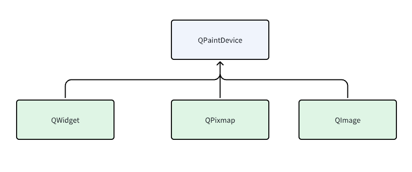
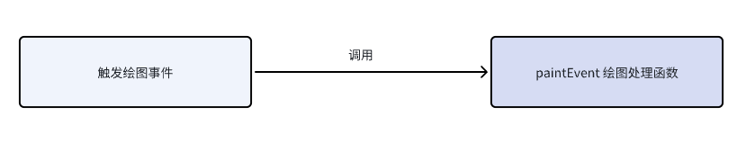
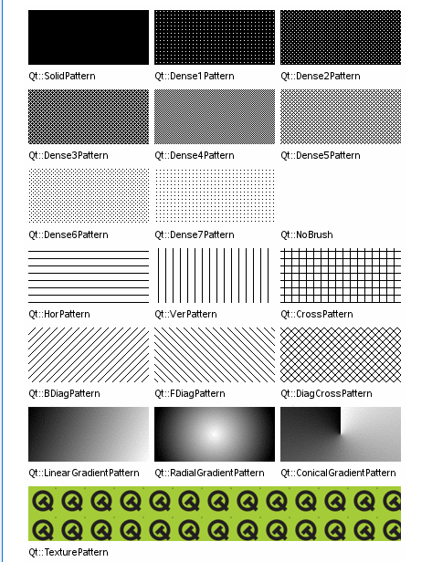
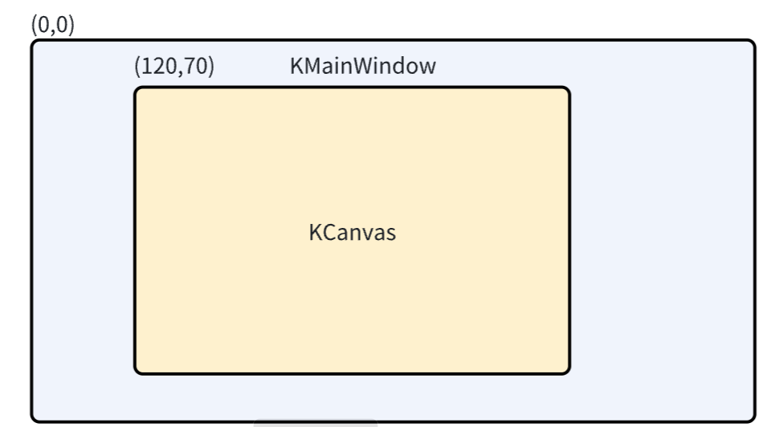
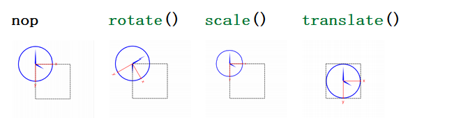

## Qt 绘图框架

QPainter 与 QPaintDevice 和 QPaintEngine类一起构成了 Qt绘画系统的基础.

- QPainter 是用于执行绘图操作的类。
- QPaintDevice 表示可以使用QPainter绘制的设备。Qt中绘图设备的基类，它是一个抽象类，用于描述可以绘制的设备,QPainter 在 绘图设备中绘制中,常用的绘图设备 QWidget、QPixmap  、QImage
- QPaintEngine提供了 Painter 用于在不同类型的设备上绘图的界面。**对程序员不不透明**，提供了不同类型设备的接口,由 QPaintDevice 和 QPainter 与其进行交互

如果 Painter处于活动状态，device()返回 Painter在其上绘画的绘制设备，paintEngine ()返回 Painter 当前正在操作的绘制引擎。有关更多信息，请参阅绘制系统。


### QPaintDevice 

QWidget 、QImage 、QPixmap 等等绘图场景都是从 QPainterDevice 继承而来的。

```cpp
class Q_WIDGETS_EXPORT QWidget : public QObject, public QPaintDevice
{}
class Q_GUI_EXPORT QImage : public QPaintDevice
{}
class Q_GUI_EXPORT QPixmap : public QPaintDevice
{}
```



### QPainter

QPainter 是用于执行绘图操作的类，需要配合辅助类来使用，常见的有以下三种

| QPen   | 描述画笔，用户画线 |
| ------ | ------------------ |
| QBrush | 描述画刷，用于填充 |
| QColor | 描述颜色           |


### Qt绘图事件




绘图事件处理触发时机

- 在窗口部件第一次显示时，系统会自动产生一个绘图事件(QPaintEvent),从而强制绘制这个窗口部件
- 当重新调整窗口部件的大小时，系统也会产生一个绘制事件
- 调用 update( 或者repaint()) 函数

```
void QWidget::update()
void QWidget::repaint()
```

update和repaint的区别：

- update是一个异步函数,它会将绘图事件添加到事件队列中,当事件循环回到主线程时，会调用组件的 paintEvent() 函数进行实际的重绘工作
- 是一个同步函数，会立即触发组件的重绘操作,不会等待事件循环


## Qt绘图实战


### QPen

| 线型风格(Qt::PenStyle)     |  |
| -------------------------- | ------------------------------------------------------------ |
| 端点风格( Qt::PenCapStyle) |  |
| 连接风格(Qt::PenJoinStyle) |  |

使用案例

```cpp
  QPainter painter(this);
  QPen pen;
  pen.setStyle(Qt::DashDotLine);   //设置线性风格
  pen.setWidth(3);               
  pen.setBrush(Qt::green);         //设置刷子
  pen.setCapStyle(Qt::RoundCap);  //设置端点风格
  pen.setJoinStyle(Qt::RoundJoin); //设置连接风格

  painter.setPen(pen);
```


### QBrush

QBrush用于描述画刷，Qt中用于描述绘图区域填充样式的类。它可以用于指定绘图区域的背景色、渐变色、纹理、图片等




### QColor

QColor 是Qt中用于表示颜色的类。它可以用于描述RGB颜色、RGBA颜色、HSL颜色、HSV颜色以及16进制颜色等。

```cpp
QColor color(Qt::red); // 使用预定义颜色  
QColor color(255, 0, 0); // 使用RGB值  
QColor color("#FF0000"); // 使用16进制值  
color.setRgb(255, 0, 0); // 设置RGB颜色值  
color.setHsl(0, 255, 127); // 设置HSL颜色值  
```


### Qt坐标

QPainter 使用的坐标系是组件自身坐标系，如果通过 geometry() 函数与 pos() 函数获取的坐标是基于父组件的坐标系

相对于父组件的坐标可以通过 mapFromParent 函数进行转换，得到想的自己的坐标系



```cpp
//获得相对父控件的坐标
QPoint centerPointFromParent = this->geometry().center();
//获得相对自身的坐标
QPoint centerPoint = mapFromParent(centerPointFromParent);
```


### Qt图形变换

在图形变换操作时,是对坐标系进行变换

```cpp
void QPainter::scale(qreal sx, qreal sy) 		// 缩放
void QPainter::rotate(qreal angle) 				// 旋转
void QPainter::shear(qreal sh, qreal sv) 		// 扭曲
void QPainter::translate(qreal dx, qreal dy) 	// 平移
```




