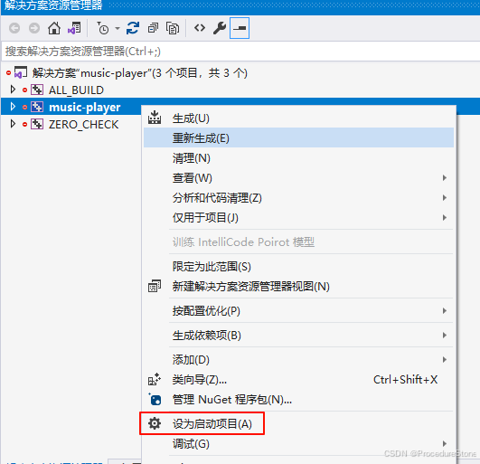
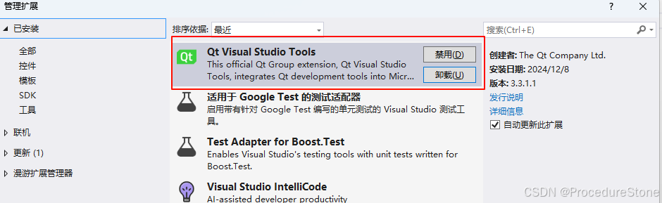
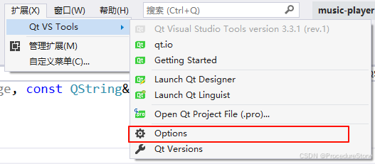
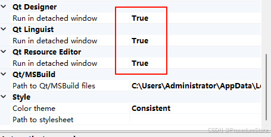
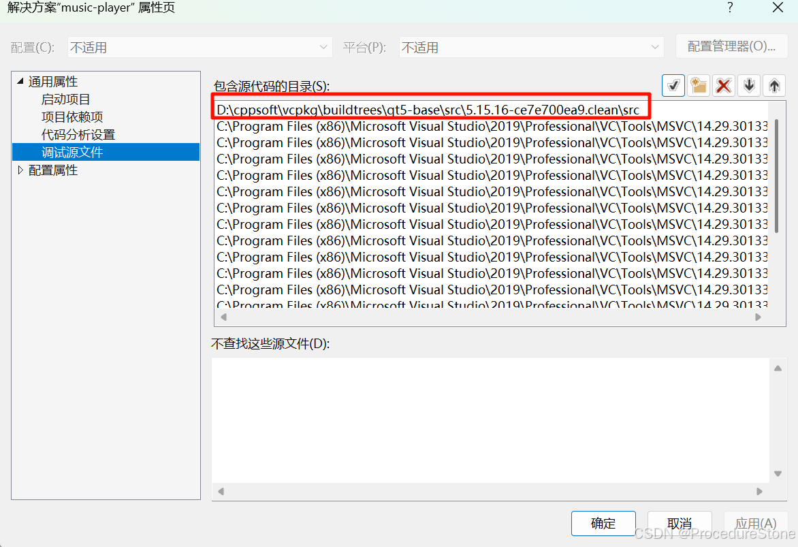
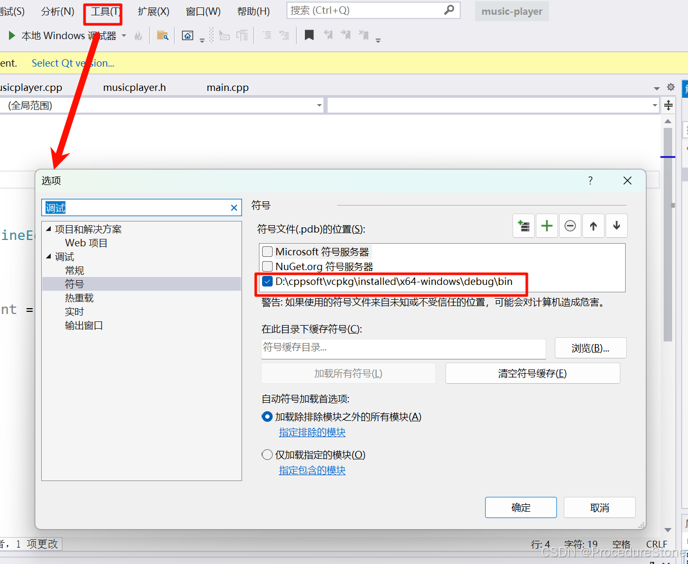

---
title: 【Qt 环境搭建 01】cmake搭建Qt VS2019开发环境
description: cmake搭建Qt VS2019开发环境
date: 2025-04-02
slug: qt-env-setup-01
categories:
    - Qt
---


## 准备

编码：vscode
debug: vs2019 + Qt vs Tools 插件
c++包管理工具：vcpkg
项目构建：cmake

安装好上述工具后。

### 第一步：安装Qt5 库

使用vcpkg

```bash
PS D:\cppsoft\vcpkg> .\vcpkg.exe install qt5
```


### 第二步：编写CMakeLists.txt

项目结构：

```
PS D:\MyProject\qt-code\Qt5Demo> tree /F
卷 系统文件 的文件夹 PATH 列表
卷序列号为 67C3-157C
D:.
│  CMakeLists.txt
│  main.cpp
│  mainwindow.cpp
│  mainwindow.h
│  mainwindow.ui
│  resource.qrc
│
└─resource
    └─image
```

参考下面的案例

```c
cmake_minimum_required(VERSION 3.10)  #cmake版本最低3.10

# 设置CMAKE工具链
set(CMAKE_TOOLCHAIN_FILE "D:/cppsoft/vcpkg/scripts/buildsystems/vcpkg.cmake")

# 获取当前子CMake文件所在目录的完整路径 
get_filename_component(CURRENT_DIR_PATH "${CMAKE_CURRENT_LIST_DIR}" ABSOLUTE) 
# 从完整路径中提取目录名称 
get_filename_component(CURRENT_DIR_NAME "${CURRENT_DIR_PATH}" NAME)

# 设置项目名称
project(${CURRENT_DIR_NAME})

set(CMAKE_CXX_STANDARD 11) 

if(MSVC)
	add_compile_options(/Zc:__cplusplus)
endif()

# 自动包含当前目录
SET(CMAKE_INCLUDE_CURRENT_DIR ON)

# 自动生成moc文件
SET(CMAKE_AUTOMOC ON)
# 自动生成rcc文件
SET(CMAKE_AUTORCC ON)
# 自动生成uic文件
SET(CMAKE_AUTOUIC ON)

# 查找Qt5库
find_package(Qt5 COMPONENTS Core Widgets Gui REQUIRED)

file(GLOB UI_FILES "${CMAKE_CURRENT_SOURCE_DIR}/*.ui")
file(GLOB RCC_FILES "${CMAKE_CURRENT_SOURCE_DIR}/*qrc")
file(GLOB HEADER_FILES "${CMAKE_CURRENT_SOURCE_DIR}/*.h" "${CMAKE_CURRENT_BINARY_DIR}/*.h")
file(GLOB CPP_FILES "${CMAKE_CURRENT_SOURCE_DIR}/*.cpp")

qt5_wrap_ui(UI_HEADERS ${UI_FILES})

source_group("Form Files" FILES ${UI_FILES})
source_group("Resource Files" FILES ${RCC_FILES})


# win32表示关闭控制台窗口
add_executable(${PROJECT_NAME} WIN32 ${HEADER_FILES} ${CPP_FILES} ${UI_FILES} ${RCC_FILES})

# 链接库
target_link_libraries(${PROJECT_NAME} 
	Qt5::Widgets
	Qt5::Core
	Qt5::Gui
)
```

### 第三步：编写批处理文件
编写好CMakeLists.txt后可以使用cmake构建，但为了更方便控制，我们可以再编写一个批处理文件来运行cmake命令
案例：这里call后需要改为你的vs2019的vcvarsamd64_x86.bat路径

```c
mkdir build
cd build
call "C:\Program Files (x86)\Microsoft Visual Studio\2019\Professional\VC\Auxiliary\Build\vcvarsamd64_x86.bat"
cmake  -G "Visual Studio 16 2019"  -A x64 -DCMAKE_BUILD_TYPE=Debug  ..
cd ../
pause
```


运行批处理文件后，便可以再build目录下找到 .sln （vs工程）
这里打开后可能还需要将项目设置为启动项。

到这里一个Qt 工程就创建好了。


## 其他

### 配置Qt VS Tools

再vs2019扩展商店里搜索Qt，下载下面这个插件（如果没有魔法，连不上扩展商店，找其他方式下载）

点击Qt VS Tools的options

将这些选项设为true（如果你之后不想使用Qt Designer也可以不使用）


此时便可以使用Qt Designer打开 .ui 文件
（如果打开失败，原因估计是找不到Qt Desinger，右键 --> 打开方式，自己配置一个Qt Desinger，这里是Qt Desinger需要自己去官网或其他地方下载）


### qt 源码调试配置
在开发过程中，如果想通过断点进入到 qt 源码中，我们可以配置pdb文件。
>PDB文件（Program Database File）是Microsoft Visual Studio编译生成的调试信息文件，主要用于存储程序的符号信息（如函数名、变量名、行号等），使调试器能将机器代码与源代码对应，从而辅助开发人员定位问题。

右键点击vs 2019 解决方案 进入属性中,添加相应的源码路径



然后设置pdb文件，pdb文件需要使用Debug编译生成。由于我们使用vcpkg安装了qt5，它已经生成了pdb文件

路径：D:\cppsoft\vcpkg\installed\x64-windows\debug\bin
点击工具 --> 选项 --> 调试 ---> 符号



到这里就可以通过断点进入源码。


## 疑问


### 初始的.ui, .qrc文件如何生成？

Qt Creator 左上角新建 .ui文件，qrc同理使用 Qt Resource Editor

当然可以自己手动编写ui文件