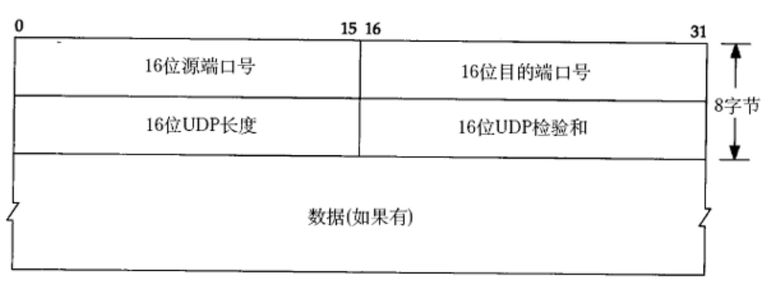
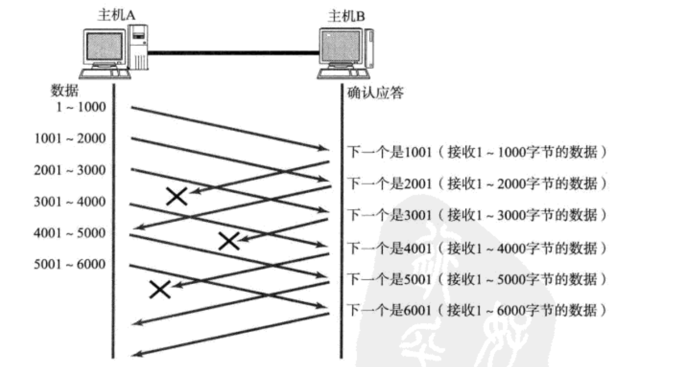
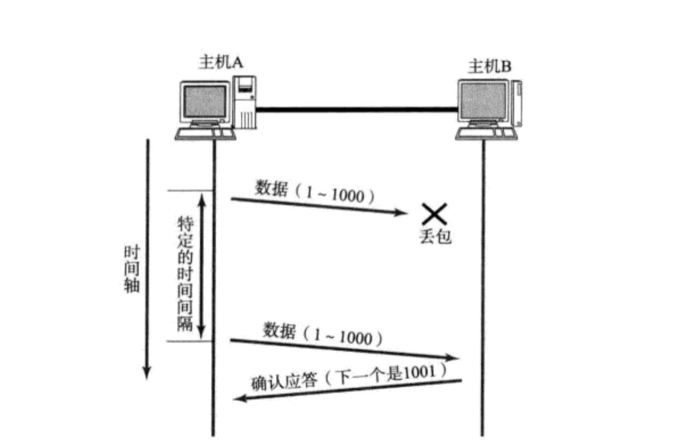

---
title: "传输层"
description: "传输层"
date: 2025-04-02
slug: "transport-layer"
categories:
    - Net
---


## 运输层 -- 传输层


## 端口号

端口的由来：

在操作系统中，不同的进程是通过进程标识符(pid)进行区分。不同的操作系统使用的pid的格式不尽相同，但在网络里我们需要采用统一的格式进行区分。因此端口号诞生了。它采用统一的格式来标识进程。

端口号的格式：TCP/IP： 16bit位的正整数

c++：`uint16_t`

在TCP/IP协议中, 用 "源IP", "源端口号", "目的IP", "目的端口号", "协议号" 这样一个五元组来标识一个通信。


### 端口的分类

服务端使用的端口号

- 熟知端口号: 里面一些端口固定绑定某些应用程序：1-1023

  | 应用程序 | HTTP | SSH  | FTP  |      |
  | :------: | :--: | :--: | :--: | ---- |
  |  端口号  |  80  |  22  |  21  |      |

- 登记端口号：

- 客户端端口号：49152-65535，客户端运行时，操作系统动态绑定，通信时自动绑定，通信结束自动回收


## UDP(user datagram protocol)

用户数据报协议

### UDP特点：

- 无连接
- 不可靠，尽最大努力交付，因此数据可能丢失、乱序
- 面向**数据报**，每次读取都是完整的报文，且发多少个数据报，就要收到多少个数据报
- **UDP没有拥塞控制**，因此网络拥塞不会降低发送速率
- UDP支持一对一，一对多，多对一和多对多通信
- UDP首部开销小：8字节
- UDP是**全双工**

### UDP缓存区

- UDP没有真正意义上的 **发送缓冲区**. 调用sendto会直接交给内核, 由内核将数据传给网络层协议进行后

续的传输动作;

- UDP具有接收缓冲区. 但是这个接收缓冲区不能保证收到的UDP报的顺序和发送UDP报的顺序一致; 如果

缓冲区满了, 再到达的UDP数据就会被丢弃，而且也不会通知你。

### UDP格式

- 源端口号（选用）：在需要对方回信时选用，不需要则全0
- 目的端口号：终点交付报文时必用
- 长度：整个报文长度(大小), 最小为8字节
- 校验：检查报文传输中是否损坏



如果我们需要传输的数据超过64K, 2^16bit, 则需要手动拆解数据。

### UDP的应用场景

- NFS: 网络文件系统

- TFTP: 简单文件传输协议

- DHCP: 动态主机配置协议

- BOOTP: 启动协议(用于无盘设备启动)

- DNS: 域名解析协议
- 直播，视频


### UDP的使用

在Linux系统中，对UDP头部的定义

```c
struct udphdr {
    __be16  source;      /* 源端口 */
    __be16  dest;        /* 目标端口 */
    __be16  len;         /* UDP数据包长度 */
    __sum16 check;       /* 校验和 */
};
```

对UDP的缓存区的定义

```c
struct sk_buff {
    struct sk_buff         *next;       /* 下一个缓冲区 */
    struct sk_buff         *prev;       /* 上一个缓冲区 */
    struct sk_buff_head    *list;       /* 缓冲区链表 */
    struct sock            *sk;         /* 相关的套接字 */
    unsigned char          *data;       /* 数据指针 */
    unsigned int           len;         /* 数据长度 */
    unsigned int           data_len;    /* 数据部分长度 */
    unsigned int           truesize;    /* 真实大小 */
    struct udphdr          *udp;        /* UDP头指针 */
    /* 其他成员 */
};
```


## TCP(Transmission Control Protocol)

传输控制协议


### TCP的特点

- 基于连接
- 可靠交付（无差错，不丢失，不重复）
- 面向字节流
- 全双工
- 一对一通信

### TCP的格式

TCP的数据我们称为数据段（报文段）

注：同一份数据，在传输层称为数据段，网络层称为数据包，数据链路层称为数据帧


- 源/目的端口号: 表示数据是从哪个进程来, 到哪个进程去;

- 32位序号/32位确认号: 保障有序性

- 4位TCP报头长度: 表示该TCP头部有多少个32位bit(有多少个4字节); 所以TCP头部最大长度是15 * 4 = 60

- 6位标志位:TCP报文是有类型的，比如一个TCP报文可能是通信报文，也可以是建立连接的报文，也可以是关闭连接的报文，因此需要用标志来区分。

​		URG: 紧急指针是否有效

​		ACK: 确认号是否有效，当该报文是应答类型的报文，该标志置1

​		PSH: 提示接收端应用程序立刻从TCP缓冲区把数据读走

​		RST: 对方要求重新建立连接; 我们把携带RST标识的称为**复位报文段**

​		SYN: 请求建立连接; 我们把携带SYN标识的称为**同步报文段**

​		FIN: 通知对方, 本端要关闭了 , 我们称携带FIN标识的为**结束报文段**

- 16位窗口大小: 16位窗口大小最大为2^16-1 = 65532 字节
- 16位校验和: 发送端填充, CRC校验. 接收端校验不通过, 则认为数据有问题. 此处的检验和不光包含TCP首部, 也包含TCP数据部分.
- 16位紧急指针: 标识哪部分数据是紧急数据。只有当URG标志为1，才有效。紧急指针的本质是紧急数据在TCP报文里的偏移量。
- 40字节头部选项: 暂时忽略;


### 与TCP相关的协议

#### ARQ

ARQ（Automatic Repeat Quest，自动重传请求）和TCP（Transmission Control Protocol，传输控制协议）在计算机网络中具有密切的关系。ARQ是一种可靠的数据传输机制，而TCP则是实现这种可靠性的一种具体协议。

常见的ARQ有三种：

1. **停止等待（Stop-and-Wait ARQ）**：发送方发送一个数据包后，停止发送新的数据包，等待接收方的确认（ACK）。如果接收到ACK，则发送下一个数据包；如果在超时时间内没有收到ACK，则重传当前数据包。

   体现在TCP中：序列号和确认号，超时重传机制

2. **回退N（Go-Back-N ARQ）**：发送方可以连续发送多个数据包（最多N个），但如果遇到一个数据包出错或丢失，从这个出错的包开始，所有后续的数据包都要重传。

3. **选择性重传（Selective Repeat ARQ）**：发送方可以连续发送多个数据包，接收方对每个正确接收的数据包发送ACK，发送方只重传那些没有收到ACK的数据包。

   体现在TCP中：快重传

#### 滑动窗口协议


### TCP机制

可靠性原理: 

- 校验和

- 序列号(按序到达)

- 确认应答

- 超时重发

- 连接管理

- 流量控制

- 拥塞控制

提高性能机制: 

- 滑动窗口

- 快速重传

- 延迟应答

- 捎带应答


#### 确认应答(ACK)机制

要想确定一个报文是否有效，需要对方做出应答。但应答的有效性无法验证（验证应答的有效性会陷入循环），因此我们规定**不用对 应答 做出 应答。对方发出应答就默认我收到了应答。**


**捎带应答**：多数情况下，单纯发出应答效率不高，而且根据规定，对方发出应答就默认我收到了应答。因此为了提高效率，对方发出的报文 = 应答 + 数据。


#### 序列号

TCP通信时，并不是发一个，应答一个。这样效率低下。而是一次发多个数据，发送多个数据存在乱序问题，而**乱序**是不可靠的一种。

TCP保证有序是通过序列号来实现（TCP报文里的32位序号）。每个报文都带有序号，对方收到多个报文，会根据序号进行排序。如何理解这个序号？

- TCP是面向字节流的，因此我们可以抽象的认为TCP的缓存区是一个 **char类型的数组**，数组的元素天然带有一个编号（数组下标）

- TCP 报文头中的 32 位序号字段用于标识 TCP 连接中每个数据包的顺序。**这个序号表示了数据包中的第一个字节在整个数据流中的位置。**序号的增长是根据发送的数据量而定的，每发送一个字节，序号就增加一个。这样，接收端就可以根据序号来确定接收到的数据包的顺序，并进行重组。

1. 如果发送方发送了第一个TCP段，包含100字节数据，且这个TCP段的序列号为1000。
2. 接下来发送第二个TCP段时，它的序列号将是1100（1000 + 100），因为第一个段包含了100个字节。


#### 确认号

接受方收到一个序列号为**N**报文后，需要应答。该应答需要告诉对方，自己接受到了序号为**N**，因此要返回一个序号为**M**确认序号，**规定：确认序号 = 最后一个已成功接收的数据字节的序列号 + 1， 即 M = N+1 **。通知发送方可以从M处开始发数据了。

当发送方收到序号为**M**的应答后，**规定：发送方可以认为小于序号M的所有报文，接受方全部收到**。这样，我们可以允许少量应答丢失。


那为什么一个报文同时带有确认号和序列号？确认号 -- 应答， 序列号 -- 数据，由于存在**捎带应答**的情况，一个报文即是应答又是数据，因此需要同时带上确认号和序列号。


#### 连接管理机制

TCP建立连接，需要进行3次握手和4次挥手


问题：三次握手的目的是什么？

答：**确认双方的通信能力和可达性**，**同步双方的序列号**

​		第一次：客户端发送报文给服务器，服务器接受到报文：服务器知道客户端**发送**能力正常

​		第二次：服务器做出应答，客户端接受到报文：客户端知道服务器的**接受**和**发送**能力正常

​		第三次：客户端做出应答，服务器接受到报文：服务器知道客户端的**接受**能力正常


问题：为什么是三次？两次或一次不行吗？

答：先说一次，如果一次握手可以，那表示一个客户端发送一个SYN报文就可以建立，这就导致服务器很容易受到SYN洪水的攻击（即客户端发送多个SYN报文）。

再说两次，两次握手的问题和一次握手的问题类似，在两次握手情况下，服务器在做出应答后，就要开始建立连接（变为establish状态），但客户端不一定收到应答，即服务器先进入estabushed，这就存在服务器空挂连接的问题，也就是说**先让服务器做出资源让步**。而服务器是1对多，如果失败的情况都让服务器端着，一但服务器撑不住了，那影响的是多个客户端。

而三次握手，客户端先于服务器进入estabushed状态，如果最后一个应答丢失，也就影响一个客户端。

因此我们可以得出验证全双工的最少次数为3次。


问题：为什么要4次挥手，第二次挥手和第三次挥手为什么不能采用捎带应答的方式合成一次？

答：

1. **独立的状态管理**：
   - TCP设计允许每一方独立地关闭自己的数据发送端。发送FIN表示发送方没有更多的数据要发送，但接收方可能仍然有数据要发送。
   - 第二次挥手（ACK）确认接收到对方的FIN，标志着接收方知道对方已经不再发送数据，但接收方的发送操作可能仍未完成。
2. **半关闭连接的支持**：
   - TCP支持连接的半关闭状态，即一端关闭发送而保持接收。这种状态下，一端可以停止发送数据（发送FIN），而另一端仍然可以继续发送数据直到其发送完成。
   - 如果第二次挥手和第三次挥手合并，便不能支持这种半关闭的状态，限制了TCP连接的灵活性。
3. **时间等待机制（TIME_WAIT）**：
   - 当主动关闭的一方发送ACK后，会进入TIME_WAIT状态。这一状态确保网络中的所有报文都已经消失，以防对方未收到ACK时重传FIN，导致连接不正常关闭。
   - TIME_WAIT的存在是为了保证连接的完全关闭和资源的安全释放。如果合并ACK和FIN，时间等待机制将变得复杂，甚至无法保证数据的完整性和确认的可靠性。


#### 流量控制

接收端处理数据的速度是有限的. 如果发送端发的太快, 导致接收端的缓冲区被打满, 这个时候如果发送端继续发送,就会造成丢包, 继而引起丢包重传等等一系列连锁反应. 因此TCP支持根据接收端的处理能力, 来决定发送端的发送速度. 这个机制就叫做**流量控制**(Flow Control);

流量控制是通过接收端抑制发送端发送数据的速率，以使接收端来得及接收。是点对点通信量的控制，是个端到端的问题。

流量控制的手段：滑动窗口


- 接收端将自己可以接收的缓冲区大小放入 TCP 首部中的 "窗口大小" 字段, 通过ACK端通知发送端;

- 窗口大小字段越大, 说明网络的吞吐量越高;

- 接收端一旦发现自己的缓冲区快满了, 就会将窗口大小设置成一个更小的值通知给发送端;

- 发送端接受到这个窗口之后, 就会减慢自己的发送速度;

- 如果接收端缓冲区满了, 就会将窗口置为0; 这时发送方不再发送数据, 但是需要定期发送一个窗口探测数据段, 使接收端把窗口大小告诉发送端.


**滑动窗口**

刚才我们讨论了确认应答策略, 对每一个发送的数据段, 都要给一个ACK确认应答. 收到ACK后再发送下一个数据段.

这样做有一个比较大的缺点, 就是性能较差. 尤其是数据往返的时间较长的时候。因此为了提高效率，我们需要一次发送多段报文，而TCP使用**滑动窗口**来管理多段数据的发送。


 **窗口越大, 网络吞吐量就越大, 传输效率就越高.** 


问题：滑动窗口在哪里？发送缓存区的一部分

滑动窗口将发送缓存区分为了3部分：


具体如下：


滑动窗口如何解决丢包问题？

1. ACK丢了



根据确认序号的定义：该序号之前的数据已经全部接受。

因此少量的丢包不会影响。

2. 数据包丢了

   

现在：发送方：1000 2000 3000 4000 其中2000丢了 接受方没有接受到2000，但接受到了3000 4000，但根据确认序列号的定义，接受方只能发送ACK = 1001


#### **拥塞控制**

虽然TCP有了滑动窗口这个大杀器, 能够高效可靠的发送大量的数据. 但是如果在刚开始阶段就发送大量的数据, 仍然可能引发问题. 因为网络上有很多的计算机, 可能当前的网络状态就已经比较拥堵. 在不清楚当前网络状态下, 贸然发送大量的数据,是很有可能引起雪上加霜的. 因此TCP引入了**拥塞控制**。

拥塞控制的目的是防止过多的数据注入到网络中，避免网络中的路由器或链路过载。是一个全局性的过程，涉及到所有的主机、路由器，以及与降低网络传输性能有关的所有因素。


TCP 进行拥塞控制的算法有四种

- 慢开始（slow-start)
- 拥塞避免(congestion avoidance) 
- 快重传(fast retransmit)
- 快恢复(fast recovery)

此外引入2个概念：**拥塞窗口**(`cwnd：congestion window`)和**慢开始门限** (`ssthresh`)

拥塞窗口：初始为1，根据拥塞控制算法进行修改，它的作用：16位窗口大小 = min(cwnd, rwnd)

慢开始门限：为了防止拥塞窗口 cwnd 增长过大引起网络拥塞，还需要设置一个慢开始门限。具体来说，它用来控制什么情况下执行哪一种拥塞控制算法。

算法思想如下：cwnd 初始置1

1. 刚开始执行**慢开始算法**，cwnd成指数增长

2. 当cwnd > ssthresh，执行**拥塞避免算法**（特殊情况：cwnd == ssthresh，执行慢开始、拥塞避免都可以），开始进行线性增长

3. 当出现下面2种情况：

   - 情况1：**超时**，发送方长时间未收到接受方的ACK，判定为**网络拥塞**。则cwnd置1，ssthresh变为超时时的cwnd的一半。进入慢开始阶段

     

   - 情况2：**快重传**，发送方收到接受方3个相同的ACK。则cwnd == ssthresh == 快重传时cwnd的一半，**进入快恢复阶段**

     

理解：为什么分2种情况？

答：有时，个别报文段会在网络中意外丢失，但实际上网络并未发生拥塞。如果发送方迟迟收不到确认，就会产生超时，并误认为网络发生了拥塞。这就导致发送方错误地启动慢开始，把拥塞窗口 cwnd 又设置为 1，因而不必要地降低了传输效率。因而引入快重传算法

#### 快重传机制

快重传算法规定，发送力只要一连收到3个重复确认，就可知道现在并未出现网络拥塞，而只是接收方少收到一个报文段 M3 ，因而立即进行重传M3 (即“快重传”)。使用快重传可以使整个网络的吞吐坟提高约 20%.


#### 超时重传机制

主机A发送给主机B的数据可能因为网络问题而丢失，或者主机B由于某些原因，收到了报文，但没有应答。

如果主机A在一定时间内没有收到主机B的应答，则会重发。

问题：

1. 主机B可能收到多个相同的报文，如何去重？ **根据序列号**

2. “超时时间”是如何规定的？当网络良好时，超时时间太长，会导致效率低下，同理当网络不好时，超时时间太小，也会导致效率低下。

   Linux中(BSD Unix和Windows也是如此), 超时以500ms为一个单位进行控制, 每次判定超时重发的超时

   时间都是500ms的整数倍.

   如果重发一次之后, 仍然得不到应答, 等待 2*500ms 后再进行重传.

   如果仍然得不到应答, 等待 4*500ms 进行重传. 依次类推, 以**指数形式**递增.

   累计到一定的重传次数, TCP认为网络或者对端主机出现异常, 强制关闭连接.




### 粘包问题

首先要明确,粘包问题中的"包”，是指的应用层的数据包.
在TCP的协议头中,没有如同UDP一样的“报文长度”这样的字段,但是有一个序号这样的字段。
站在传输层的角度,TCP是一个一个报文过来的.按照序号排好序放在缓冲区中.
站在应用层的角度,看到的只是一串连续的字节数据.
那么应用程序看到了这么一连串的字节数据,就不知道从哪个部分开始到哪个部分,是一个完整的应用层数据包？

那么如何避免粘包问题呢? 归根结底就是一句话,**明确两个包之间的边界**

- 定长报文：对于定长的包,保证每次都按固定大小读取即可; 例如上面的Request结构,是固定大小的,那么就从缓冲区从头开始按sizeof(Request)依次读取即可;

- 特殊字符分割:对于变长的包,还可以在包和包之间使用明确的分隔符(应用层协议,是程序猿自己来定的,只要保证分隔
  符不和正文冲突即可);

- 自描述字段：带上报文属性，如http的状态行和请求头

  


思考: 对于UDP协议来说，是否也存在“粘包问题”呢?
答：对于UDP 如果还没有上层交付数据,UDP的报文长度仍然在.同时,UDP是一个一个把数据交付给应用层.就有很明确的数据边界站在应用层的站在应用层的角度,使用UDP的时候,要么收到完整的UDP报文,要么不收.不会出现"半个"的情况.


### TCP异常情况分析

1. 进程终止：文件的生命周期随进程，当进制终止时，os会自动进行4次挥手
2. 机器重启：同上，关机时，os会先终止所有进程
3. 网线断了、断电: TCP选项里有**保活定时器**，如果客户端长时间不发消息，服务器会自动释放连接


#### 一次TCP连接

1. 三次握手建立连接：客户端发送SYN，服务器接受到SYN报文，则会发送一个捎带应答：SYN+ACK, 客户端收到应答后，发送ACK应答。
2. 双方传输数据，并沟通双方的窗口大小：初始窗口大小有OS决定，然后双方通过协商来确定窗口大小。具体的窗口大小除了受到双方的缓冲区的影响，还受到TCP的拥塞窗口的影响。拥塞窗口是TCP拥塞控制的手段，再通信初期，发送方无法确定网络拥塞情况，因此先发少量的数据, 探探路, 摸清当前的网络拥堵状态, 再决定按照多大的速度传输数据。具体的拥塞窗口增长：先指数增长，达到慢启动阈值，再线性增长，如果网络拥塞，则慢启动阈值减少为发送网络拥塞时拥塞窗口的一半，同时拥塞窗口置1，进行快速恢复阶段。实际上，16位窗口大小 = min(拥塞窗口，主机反馈的窗口大小)


 
