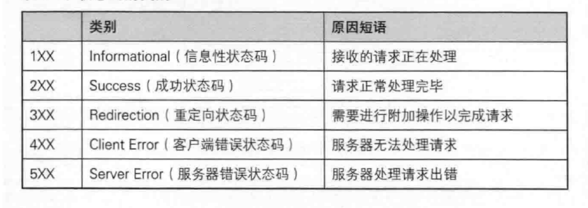

## 应用层


## DNS


### DNS的由来

TCP/IP中使用IP地址和端口号来确定网络上的一台主机的一个程序. 但是IP地址不方便记忆. 

于是人们发明了一种叫主机名的东西, 是一个字符串, 并且使用hosts文件来描述主机名和IP地址的关系. 。


最初, 通过互连网信息中心(SRI-NIC)来管理这个hosts文件的.

- 如果一个新计算机要接入网络, 或者某个计算机IP变更, 都需要到信息中心申请变更hosts文件.
- 其他计算机也需要定期下载更新新版本的hosts文件才能正确上网

这样就太麻烦了, 于是产生了DNS系统.

- 一个组织的系统管理机构, 维护系统内的每个主机的IP和主机名的对应关系. 如果新计算机接入网络, 将这个信息注册到数据库中;

- 用户输入域名的时候, 会自动查询DNS服务器, 由DNS服务器检索数据库, 得到对应的IP地址.


### 域名的组成

通常我们称形如"www.sina.com.cn"是一个域名，但从严格意义上讲，"sina.com.cn"才被称为域名(全球唯一)，而"www"是主机名。"主机名.域名"称为完全限定域名(FQDN)。一个域名下可以有多个主机，域名全球唯一，那么"主机名.域名"肯定也是全球唯一的。

1. 顶级域名（TLD）

这是域名的最高级部分，位于最右边。顶级域名有几种类型：

- **通用顶级域名（gTLD）**：如`.com`、`.org`、`.net`、`.info`、`.biz`等。
- **国家和地区顶级域名（ccTLD）**：如`.cn`（中国）、`.us`（美国）、`.uk`（英国）等。
- **行业和专业领域的（gTLD）**：如`.edu`（教育机构）、`.gov`（政府机构）、`.mil`（军事机构）、`.int`（国际组织）。
- **新通用顶级域名（new gTLD）**：如`.app`、`.tech`、`.xyz`、`.shop`等。

2. 二级域名（SLD）

位于顶级域名的左边，是域名的一部分，通常代表组织或公司的名称。例如，在`example.com`中，`example`是二级域名。

3. 子域名

这是在二级域名的左边，可以有多个层级，用于更具体的组织和管理。例如，在`blog.example.com`中，`blog`是子域名。子域名可以进一步分层，如`support.blog.example.com`。

4. 主机名

主机名指向特定的设备或服务器，通常是子域名中的最左边部分。例如，在`mail.example.com`中，`mail`是主机名，指向邮件服务器。


### DNS查询

DNS服务器采用分层的结构，整体看上去像一颗**树**。为什么采用分层的结构？在启用域名功能之前，单凭主机名还无法完全管理IP地址，因为在不同的组织机构中不允许有同名的主机。然而，当出现了带有层次结构的域名之后，每一个组织机构就可以自由地为主机命名了。

当在浏览器输入一个域名，查询顺序如下：

**（1）查看浏览器缓存**

当用户通过浏览器访问某域名时，本地DNS解析器首先会在浏览器的缓存中查找是否有该域名对应的 IP 地址（若曾经访问过该域名且没有清空缓存便存在）。

**（2）查看hosts文件**

由于`hosts` 文件是一个静态配置文件，系统会首先查找这个文件中的条目。任何匹配的域名都会直接使用`hosts` 文件中的IP地址，而不会进行后续查询。

windows: `C:\Windows\System32\drivers\etc\hosts`


**（3）查看系统DNS缓存**

如果hosts文件里没有，检测系统DNS缓存。windows主机查询DNS缓存的命令：`ipconfig /displaydns` , `ipconfig /flushdns`命令用于清除系统的DNS缓存


**（4）查看路由器缓存**

路由器通常配置为DNS中继器，转发DNS查询请求，某些路由器可能有DNS缓存功能，如果有，则会检测路由器缓存

**（5）查看ISP DNS 缓存**

当在用户客服端查找不到域名对应 IP 地址，则将进入 ISP DNS 缓存中进行查询。比如你用的是电信的网络，则会进入电信的 DNS 缓存服务器中进行查找。

**（6）递归\迭代查询**

1. 询问根域名服务器

当以上均未完成，则进入根服务器进行查询。全球仅有 13 台根域名服务器，1 个主根域名服务器，其余 12 为辅根域名服务器。根域名收到请求后会查看区域文件记录，若无则将其管辖范围内顶级域名（如.com、.cn等）服务器 IP 告诉本地 DNS 服务器。

2. 询问顶级域名服务器

顶级域名服务器收到请求后查看区域文件记录，若无记录则将其管辖范围内权威域名服务器的 IP 地址告诉本地 DNS 服务器。

3. 询问权威域名（主域名）服务器

权威域名服务器接收到请求后查询自己的缓存，如果没有则进入下一级域名服务器进行查找，并重复该步骤直至找到正确记录。


递归查询一般不常用，而是将递归和迭代相结合的形式：


实验：修改hosts文件，修改www.baidu.com 对应的ip，导致浏览器无法访问百度

以谷歌浏览器为例：

1. 首先清除谷歌的DNS缓存

谷歌浏览器输入：chrome://net-internals/#sockets 在出现的页面中分别点击

- 「DNS」->「Clear host cache」
- 「Socket」->「Flush socket pools」


2. 以管理员身份运行记事本，修改hosts, windows系统下hosts文件路径 `C:\Windows\System32\drivers\etc\hosts`

添加：

```
192.0.2.1   baidu.com
192.0.2.1   www.baidu.com
#为注释
```

3. 刷新本地缓存：`ipconfig /flushdns`

此时在谷歌浏览器输入www.baidu.com则进不去。


## URL

URL: （Uniform Resource Locator，统一资源定位符）是互联网上用于指定资源位置的标准格式。


- **协议**
- **登录信息**：现在一般很少见到，多数的登录信息会通过登录界面来解决。
- **服务器地址**：可以直接使用IP地址，也可以使用域名。一般情况我们看到的是域名。
- **端口号**：一般情况下我们看不到。多数协议是有固定的端口号的。比如：http -- 80端口， ftp -- 21。因此浏览器会自动**根据协议确定端口号**。当然也可以手动添加。
- **文件路径**：指定了资源在服务器上的位置。路径由斜杠（/）分隔成多个部分，每个部分表示资源在服务器文件系统中的一个目录或文件。这个路径可以是**绝对路径**，也可以是**相对路径**。具体的实现方式在后文讲解。
- **查询字符串**：可选的部分，用于向服务器传递参数。查询字符串以问号（?）开头，参数的形式为key=value，即形式为参数=参数值，不同参数之间用和号（&）连接。
- **片段标识符**：可选的部分，指定了资源中的特定片段或位置。片段标识符以井号（#）开头。

一个典型的URL如下：
`https://www.example.com/path/to/resource?param1=value1&param2=value2#section1
`

特殊字符：在标准的URL是有一些特殊字符的，如`: . / ? #`等。
这些字符是有特殊含义的，如果用户输入的信息也包含特殊字符呢？

`https://www.baidu.com/s?ie=utf-8&f=8&rsv_bp=1&tn=44004473_8_oem_dg&wd=%2F%2F%2F%2F%3F%3F%3F%3F&oq=%25E5%25BE%25AE%25E4%25BF%25A1&rsv_pq=9096029e0051298e&rsv_t=9c9fTtRQZn57sCTrXfNf5Nd12s3mvBMGfVc9IDGDaHxz%2FHsJqX5ofYHt5v9i5psyTgxUV%2BXp6wU&rqlang=cn&rsv_enter=1&rsv_dl=tb&rsv_sug3=16&rsv_sug1=6&rsv_sug7=100&bs=%E5%BE%AE%E4%BF%A1`

显然不能直接将带有**特殊字符的内容**传参到URL里面，因此要进行编码（encode）。

- urlencode：编码
- urldecode：解码

浏览器会将用户的搜索信息进行编码，发给服务器，服务器再进行解码。

转义的规则如下: 
将需要转码的字符转为16进制，然后从右到左，取4位(不足4位直接处理)，每2位做一位，前面加上%，编码成%XY

如：

```
+     %2B
/      %2F
?     %3F
%    %25
#     %23
&    %26
```

---

## HTTP协议

Web的应用层协议是超文本传输协议（HyperText TransferProtocol，HTTP），它是Web的核心，在[RFC1945］和[RFC2616］中进行了定义。HTTP由两个程序实现：一个客户程序和一个服务器程序。客户程序和服务器程序运行在不同的端系统中，通过交换HTTP报文进行会话。HTTP定义了这些报文的结构以及客户和服务器进行报文交换的方式。

### HTTP请求 request


#### Method


GET和POST是安全和幂等的吗？

先说明下安全和幂等的概念：

- 在HTTP 协议里，所谓的「安全」是指请求方法不会「破坏」服务器上的资源。
- 所谓的「幂等」，意思是多次执行相同的操作，结果都是「相同」的。

如果从 RFC 规范定义的语义来看:

- GET方法就是安全且幂等的，因为它是「只读」操作，无论操作多少次，服务器上的数据都是安全的，
  且每次的结果都是相同的。所以，可以对GET请求的数据做缓存，这个缓存可以做到浏览器本身上
  （彻底避免浏览器发请求），也可以做到代理上（如nginx），而且在浏览器中GET请求可以保存为书
  签。
- POST因为是「新增或提交数据」的操作，会修改服务器上的资源，所以是不安全的，且多次提交数据就会创建多个资源，所以不是幂等的。所以，浏览器一般不会缓存POST请求，也不能把POST请求保存为书签。

做个简要的小结。
GET的语义是请求获取指定的资源。GET方法是安全、幂等、可被缓存的。
POST的语义是根据请求负荷（报文主体）对指定的资源做出处理，具体的处理方式视资源类型而不同。
POST不安全，不幂等，（大部分实现）不可缓存。
注意，上面是从 RFC 规范定义的语义来分析的。
但是实际过程中，开发者不一定会按照 RFC 规范定义的语义来实现 GET 和 POST方法。比如：
·可以用GET方法实现新增或删除数据的请求，这样实现的GET方法自然就不是安全和幂等。
·可以用POST方法实现查询数据的请求，这样实现的POST方法自然就是安全和幂等。


GET请求主要用于从服务器获取实体资源，资源可被缓存，可以记录历史记录

POST请求主要用于向服务器提交表单数据，因此POST请求不会被缓存，POST请求不会保留在浏览器历史记录当中，POST请求不能被保存为书签，POST请求对数据长度没有要求


PUT方法请求服务器去把请求里的实体存储在请求URI（Request-URI）标识下。

- 如果请求URI（Request-URI）指定的的资源已经在源服务器上存在，那么此请求里的实体应该被当作是源服务器关于此URI所指定资源实体的最新修改版本。
- 如果请求URI（Request-URI）指定的资源不存在，并且此URI被用户代理定义为一个新资源，那么源服务器就应该根据请求里的实体创建一个此URI所标识下的资源。如果一个新的资源被创建了，源服务器必须能向用户代理（user agent） 发送201（已创建）响应。如果已存在的资源被改变了，那么源服务器应该发送200（Ok）或者204（无内容）响应


#### 请求头选项

格式：`key: value`


 **Connection**：指明长短连接

- close 表示短连接
- keep-alive表示长连接


**Content-Type**：用于告诉客户实际返回的内容的内容类型或者说编码类型

比如 Content-Type: text/html; charset=utf-8 用于表示正文是 text/html文档类型，字符集为utf-8


**Content-Language**：用于表示用户希望采用的语言或语言组合

比如 Content-Language: de-DE 表示该文件为说德语的人提供，但是要注意者不代表文件内容就是德语的。


这里理解 Content-Type 和 Content-Language 区别： Content-Language更多表示上层语言的表示， 而Content-Type用于底层数据编码的表示。因此在响应报文头部设置字符编码是在Content-Type中设置charset属性，大小写不敏感


**cookie**：cookie的中文翻译是曲奇，小甜饼的意思。cookie其实就是一些数据信息，类型为“**小型文本文件**”，存储于电脑上的文本文件中。


为什么有cookie?

HTTP里的Cookie是一种用于在客户端（如浏览器）和服务器之间存储和交换信息的小数据片段。Cookie的主要作用是保持状态信息，因为HTTP协议本身是无状态的，其无状态性主要体现在每个请求都是独立的，服务器不会自动保存任何关于客户端的上下文信息。这种设计简化了协议，但也带来了一些挑战，需要其他机制来管理会话和状态。Cookie可以用于各种用途，如用户身份验证、会话管理、用户偏好保存等。

下面为cookie用作会话管理的示意图：

cookie不能直接存放用户的邮箱和密码，这会有安全问题，因此会用sessionID来替代用户的邮箱和密码。

sessionID通常实验token，一串字符串。


### HTTP响应 response


#### 状态码



##### **1xx-接受的请求正在处理**


##### **2xx - 请求正常处理完毕**

200: ok


##### **3xx - 需要进行附加操作以完成请求**

301：

- 301 状态码表明目标资源被永久的移动到了一个新的 URI，任何未来对这个资源的引用都应该使用新的 URI。

302：

- 302 状态码表示目标资源临时移动到了另一个 URI 上。由于重定向是临时发生的，所以客户端在之后的请求中还应该使用原本的 URI。
- 由于历史原因，用户代理可能会在重定向后的请求中把 POST 方法改为 GET方法。如果不想这样，应该使用 307（Temporary Redirect） 状态码

303：

- 303 状态码表示服务器要将浏览器重定向到另一个资源。从语义上讲，重定向到的资源并不是你所请求的资源，而是对你所请求资源的一些描述。
- 比如303 常用于将 POST 请求重定向到 GET 请求，比如你上传了一份个人信息，服务器发回一个 303 响应，将你导向一个“上传成功”页面。

307：

- 307 的定义实际上和 302 是一致的，唯一的区别在于，307 状态码不允许浏览器将原本为 POST 的请求重定向到 GET 请求上。

308：

- 308 的定义实际上和 301 是一致的，唯一的区别在于，308 状态码不允许浏览器将原本为 POST 的请求重定向到 GET 请求上。

##### **4xx-服务器无法处理请求-客户端的问题**

403：

 禁止访问，服务器理解请求客户端的请求，但是拒绝执行此请求（比如权限不足，ip被拉黑。。。等一系列原因）


404：NOT FOUND

表示客户端请求的资源不存在


##### **5xx-服务器处理出错-服务器的问题**

503 由于临时的服务器维护或者过载，服务器当前无法处理请求。. 这个状况是临时的，并且将在一段时间以后恢复。


### HTTP Header

http的请求报头和响应报头的内容是一些key:value的参数。
常见有以下几个：

- Content-Type: 数据类型(text/html等)
- Content-Length: Body的长度
- Host: 客户端告知服务器, 所请求的资源是在哪个主机的哪个端口上;
- User-Agent: 声明用户的操作系统和浏览器版本信息;
- referer: 当前页面是从哪个页面跳转过来的;
- location: 搭配3xx状态码使用, 告诉客户端接下来要去哪里访问;
- Cookie: 用于在客户端存储少量信息. 通常用于实现会话(session)的功能;

下面介绍一下cookie:
我们平时访问某些网站，会观察到以下现象：第一次访问，它会要求你进行登录，但在之后的几天内进行访问，它会自动登录，又过了几天后，它又会要求你重新输入账号密码进行登录。
这是为什么呢？
首先我要明确一个概念：http协议默认是无状态的。它并不会关心你以前访问哪些资源，比如我们刷新一次网页，浏览器便会再次提交http请求。（当然，现在的浏览器可能会进行在本地缓存，但对http协议本身来说，是需要再次提交请求）
这就导致当我们登录网站后，刷新一下页面或者访问网站的资源，又会要求我们输入账号和密码，这显然对用户很不友好。而cookie便可以解决这个问题。


第一次登录后，网站会响应一个Set Cookie给浏览器，浏览器会将Set Cookie的信息保存到一个文件里，这个文件我们叫作Cookie文件。之后再次进行访问时，浏览器会自动将Cookie文件的信息发给网站，自动完成登录。
如何验证？以edge浏览器为例。


Location：重定向

目的资源改变了路径，但是保持原链接依然可用，或者用于将客户端资源请求导向新的URL，通过3xx状态码表示重定向，通过头部字段中设定新的请求URL

- 301：表示永久重定向
- 302：表示临时重定向


## HTTPS

HTTPS 也是⼀个应⽤层协议. 是在 HTTP 协议的基础上引⼊了⼀个加密层


### 对称加密和非对称加密

**对称加密**其实就是通过同一个"密钥”，把明文加密成密文，并且也能把密文解密成明文.
一个简单的对称加密，按位异或
假设明文a=1234，密钥key=8888
则加密a^key得到的密文b为9834.
然后针对密文9834再次进行运算b^key，得到的就是原来的明文1234.
（对于字符串的对称加密也是同理，每一个字符都可以表示成一个数字)
当然，按位异或只是最简单的对称加密.HTTPS中并不是使用按位异或.


但事情没这么简单.服务器同一时刻其实是给很多客户端提供服务的.这么多客户端，每个人用的秘钥都必须是不同的（如果是相同那密钥就太容易扩散了，黑客就也能拿到了）.因此服务器就需要维护每个客户端和每个密钥之间的关联关系，这也是个很麻烦的事情～


比较理想的做法，就是能在客户端和服务器建立连接的时候，双方协商确定这次的密钥是啥～

但是如果直接把密钥明文传输，那么黑客也就能获得密钥了~～此时后续的加密操作就形同虚设了，
**因此密钥的传输也必须加密传输！**
但是要想对密钥进行对称加密，就仍然需要先协商确定一个“密钥的密钥"这就成了"先有鸡还是先有
蛋”的问题了.此时密钥的传输再用对称加密就行不通了，


再引入非对称密钥

**非对称加密**要用到两个密钥，一个叫做“公钥"，一个叫做"私钥"
公钥和私钥是配对的.最大的缺点就是运算速度非常慢，比对称加密要慢很多，

- 通过公钥对明文加密，变成密文
- 通过私钥对密文解密，变成明文

也可以反着用

- 通过私钥对明文加密，变成密文
- 通过公钥对密文解密，变成明文


客户端在本地生成对称密钥，通过公钥加密，发送给服务器，
由于中间的网络设备没有私钥，即使截获了数据，也无法还原出内部的原文，也就无法获取到对称密钥
服务器通过私钥解密，还原出客户端发送的对称密钥.并且使用这个对称密钥加密给客户端返回的响应数据.
后续客户端和服务器的通信都只用对称加密即可.由于该密钥只有客户端和服务器两个主机知道，其他主机/设备不知道密钥即使截获数据也没有意义，

由于对称加密的效率比非对称加密高很多，因此只是在开始阶段协商密钥的时候使用非对称加密，后续的传输仍然使用对称加密，

但问题来了：服务器生成公钥和私钥

- 客户端如何获取到公钥？
- 客户端如何确定这个公钥不是黑客伪造的？

正是存在这个问题，可以使用中间人攻击。

### 中间人攻击

1. 服务器具有非对称加密算法的公钥S，私钥S'
2. 中间人具有非对称加密算法的公钥M，私钥M'
3. 客户端向服务器发起请求，服务器明文传送公钥S给客户端
4. **中间人劫持数据报文，提取公钥S并保存好，然后将被劫持报文中的公钥S替换成为自己的公钥M，并将伪造报文发给客户端**
5. 客户端收到报文，提取公钥M(自己当然不知道公钥被更换过了)，自己形成对称秘钥X，用公钥M加密X，形成报文发送给服务器
6. **中间人劫持后，直接用自己的私钥M'进行解密，得到通信秘钥X，再用曾经保存的服务端公钥S加密后，将报文推送给服务器**
7. 服务器拿到报文，用自己的私钥S'解密，得到通信秘钥X
8. 双方开始采用X进行对称加密，进行通信。但是一切都在中间人的掌握中，劫持数据，进行窃听甚
   至修改，都是可以的


这个问题的关键在于：**客户端无法分辨服务器发送公钥是否被调包**。

因此可以引入一个第三方结构，通过第三方结构来作证**客户端收到的公钥**是正确的。


### 引入证书

服务端在使用HTTPS前，需要向CA机构申领一份数字证书，数字证书里含有证书申请者信息、公钥信息等。服务器把证书传输给浏览器，浏览器从证书里获取公钥就行了，证书就如身份证，证明服务端公钥的权威性


这个证书可以理解成是一个结构化的字符串，里面包含了以下信息：

- 证书发布机构
- 证书有效期
- 公钥
- 证书所有者
- 签名

需要注意的是：申请证书的时候，需要在特定平台生成查，会同时生成一对儿密钥对儿，即公钥和私钥。这对密钥对儿就是用来在网络通信中进行明文加密以及数字签名的。


### 数字签名


### 解决中间人攻击

- 在客户端和服务器刚一建立连接的时候，服务器给客户端返回一个响应（包含证书、服务器信息）.
- 这个证书包含了刚才的公钥，也包含了网站的身份信息
- 当客户端获取到这个证书之后，会对证书进行校验(防止证书是伪造的).
  - 判定证书的有效期是否过期
  - 判定证书的发布机构是否受信任(**操作系统中已内置的受信任的证书发布机构**).
  - 验证证书是否被篡改：从操作系统中拿到该证书发布机构的公钥，对签名解密，得到一个hash值（称为数据摘要)，设为hash1.然后计算整个证书的hash值，设为hash2.对比hash1和hash2是否相等.如果相等，则说明证书是没有被篡改过的，

由此可以判断证书没有被更改，没有被更改，可以保证收到的是服务器发送的消息，从中获取公钥。


问题：中间人不能伪造证书吗？

中间人有没有可能篡改该证书？

- 中间人篡改了证书的明文
- 由于他没有CA机构的私钥，所以无法hash之后用私钥加密形成签名，那么也就没法办法对篡改后
  的证书形成匹配的签名
- 如果强行篡改，客户端收到该证书后会发现明文和签名解密后的值不一致，则说明证书已被篡改，
  证书不可信，从而终止向服务器传输信息，防止信息泄露给中间人

中间人整个掉包证书？

- 因为中间人没有CA私钥，所以无法制作假的证书(为什么？）
- 所以中间人只能向CA申请真证书，然后用自己申请的证书进行掉包
- 这个确实能做到证书的整体掉包，但是别忘记，证书明文中包含了域名等服务端认证信息，如果整
  体掉包，客户端依旧能够识别出来。
- 永远记住：中间人没有CA私钥，所以对任何证书都无法进行合法修改，包括自己的


但还是有漏洞，**受信任的证书发布机构**是内置在操作系统中，如果黑客伪装为一个证书发布机构，将自己的证书公钥下载到客户端的操作系统中，还是会出问题。


## FTP协议和TFTP

基于TCP的FTP和基于UDP的TFTP,它们都是文件共享协议的一大类，即复制整个文件。

> 特点：**若要存取一个文件，就必须先获得一个本地的文件副本。如果要修改文件，只能对文件的副本进行修改，然后再将修改后的文件副本传回到原节点。**


FTP 使用客户-服务器方式。 

FTP的服务器进程由2大部分组成： 

- 1个主进程，负责接受新的请求
- n个从属进程，负责处理单个请求

工作流程：client向server发起建立连接的请求，通过FTP熟知的端口号21，找到server进程，同时告诉server自己的IP:PORT. 服务器用FTP进行数据传输的端口号20与client告知的IP:PORT找到client，建立数据传送连接。

总结：

- FTP会建立2个TCP连接：控制连接 + 数据传送连接
- 控制连接在整个会话期间保持打开，数据传送连接在传送完毕后关闭


TFTP 的主要优点有两个。第一， TFTP 可用于 UDP 环境。例如，当需要将程序或文件同

时向许多机器下载时就往往衙要使用 TFTP 。第二， TFTP 代码所占的内存较小。这对较小的

计算机或某些特殊用途的设备是很重要的

 TFTP 的工作很像停止等待协议。发送完一个文件块后就等待对方

的确认，确认时应指明所确认的块编号。发完数据后在规定时间内收不到确认就要重发数据

PDU 。发送确认 PDU 的一方若在规定时间内收不到下一个文件块，也要重发确认 PDU 。这

样就可保证文件的传送不致因某一个数据报的丢失而告失败。


## 电子邮件格式


## 电子邮件相关协议


### SMTP -- 发送邮件


### POP3/IMAP -- 接受邮件


### MIME -- 扩充邮件内容

前面所述的电子邮件协议 SMTP 有以下缺点：

1. SMTP 不能传送可执行文件或其他的二进制对象。人们曾试图将二进制文件转换为SMTP 使用的 ASCII 文本，例如流行的 UNIX UUencode/UUdecode 方案，但这些均未形成正式标准或事实上的标准。
2. SMTP 限于传送 位的 ASCII 码。许多其他非英语国家的文字（如中文、俄文，甚至带呕音符号的法文或德文）就无法传送。即使在 SMTP 网关将 EBCDIC 码（即扩充的二／十进制交换码）转换为 ASCII 码，也会遇到一些麻烦.
3. SMTP 服务器会拒绝超过一定长度的邮件。
4. 某些 SMTP 的实现并没有完全按照 SMTP 的互联网标准。常见的问题如下：

- 回车、换行的删除和增加；

- 超过 76 个字符时的处理；截断或自动换行；
- 后面多余空格的删除；
- 将制表符tab 转换为若干个空格。


MIME（多用途互联网邮件扩展）


TCP/IP 体系的电子邮件系统规定电子


#### 基于万维网的电子邮件

基于万维网的电子邮件系统是指通过网页浏览器来访问和管理电子邮件的系统。邮件传输：SMTP协议，用户访问邮件服务器：HTTP协议


