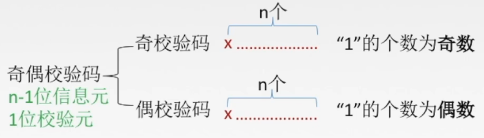

了解完网络层，我们知道了数据报是如何跨网络进行传输的，数据报通过一次又一次的”跳“，最后到达目的主机。但具体的一次”跳”是怎么完成的呢？由数据链路层完成，下面介绍数据链路层。

# 数据链路层

**数据链路层负责通过一条链路从一个结点向另一个物理链路直接相连的相邻结点传送数据报。**

- 链路：网络中两个结点之间的物理通道，链路的传输介质主要有双绞线、光纤和微波。分为有线链路、无线链路。
- 数据链路：网络中两个结点之间的逻辑通道，把实现控制数据传输协议的硬件和软件加到链路上就构成数据链路。

数据链路层在物理层提供服务的基础上向网络层提供服务。

- 对上：将源自网络层来的数据**可靠**地传输到相邻节点的目标机网络层。
- 对下：加强物理层传输原始比特流的功能，将物理层提供的**可能出错的物理连接**改造成为**逻辑上无差错的数据链路**，使之对网络层表现为一条**无差错**的链路。

数据链路层负责两个设备(同一种数据链路节点)之间进行传递。通常情况下，同一数据链接即二者处于同一局域网内，因此首先要了解局域网内是如何通信的。

注：局域网和数据链路的关系

虽然在许多情况下，处于同一数据链路的设备确实位于同一个局域网内，但有些网络拓扑和配置可能导致例外情况：

- **虚拟局域网（VLAN）**：VLAN允许在同一个物理网络基础设施上创建多个逻辑隔离的网络。不同VLAN的设备尽管连接到同一个交换机，但处于不同的逻辑数据链路和广播域中。
- **网桥和交换机**：现代交换机能够隔离冲突域，但不隔离广播域。因此，连接到同一交换机不同端口的设备可以认为在同一数据链路上，但仍处于同一局域网中。
- **子网划分和路由**：在一些复杂网络中，可能会通过子网划分和路由策略，使得不同子网的设备在逻辑上看似处于不同数据链路，但实际上共享同一个物理介质。

# 局域网通信

局域网通信的技术：以太网，令牌环网, 无线LAN等

下面主要介绍以太网。

## 以太网

以太网（Ethernet）是一种广泛使用的局域网（LAN）技术，用于在局域网内设备之间进行数据通信。它定义了数据帧的格式、传输协议、物理连接标准和介质访问控制方法。以太网因其高效性、可靠性和易于实现而成为最常用的有线网络技术。

"以太网" 不是一种具体的网络, 而是一种技术标准; 既包含了数据链路层的内容, 也包含了一些物理层的内容. 例如: 规定了网络拓扑结构, 访问控制方式, 传输速率等;例如以太网中的网线必须使用双绞线; 传输速率有10M, 100M, 1000M等;

以太网是当前应用最广泛的局域网技术; 和以太网并列的还有令牌环网, 无线LAN等;

以太网会将网络层的IP数据报封装为以太网帧，然后进行通信。那以太网帧的格式是什么呢？

# 数据帧

## 封装成帧

封装成帧就是在一段数据的前后部分添加首部和尾部，这样就构成了一个帧。接收端在收到物理层上交的比特流后，就能根据首部和尾部的标记，从收到的比特流中识别帧的开始和结束。

首部和尾部包含许多的控制信息，他们的一个重要作用:**定界(确定帧的界限)。**

**帧同步**:接收方应当能从接收到的二进制比特流中区分出帧的起始和终止。

**组帧**的四种方法:

1. 字符计数法，
2. 字符(节)填充法
3. 零比特填充法
4. 违规编码法。

## 透明传输

## 差错检验

**差错的来源**：

全局性 1.由于线路本身电气特性所产生的随机噪声(热噪声)，是信道固有的，随机存在的。
解决办法:提高信噪比来减少或避免干扰。(对传感器下手)
局部性 2.外界特定的短暂原因所造成的冲击噪声，是产生差错的主要原因。
解决办法:通常利用编码技术来解决。

**差错体现的方面**：

**差错的检测和解决**

**奇偶检验码**：

局限：奇效验码只能检测奇数个1的错误，50%

**循环冗余检验** CRC (Cyclic Redundancy Check) 

举例:

**总结：**

在数据链路层仅仅使用循环冗余检验CRC差错检测技术，只能做到对的无差错接收，即“凡是接收端数据链路层接受的帧，我们都能以非常接近于1的概率认为这些帧在传输过程中没有产生差错”。接收端丢弃的帧虽然曾收到了，但是最终还是因为有差错被丢弃。“凡是接收端数据链路层接收的帧均无差错”

注意：**无差错  < 可靠传输（无差错，不丢失，不重复）**

# 数据链路层的流量控制

它和TCP的流量控制的区别：

> 传输层的流量控制是 **端到端**
>
> 数据链路层的流量控制是 **点到点**

**都是通过滑动窗口来控制，但是数据链路层的滑动窗口的大小是固定的，而传输层不是固定的。**

问题：由来传输层的流量控制，为什么还需要数据链路层的流量控制？

答：早期网络并不完善，让数据链路层进行流量控制，但现在随着技术发展，现代网络中的流量控制和错误恢复功能主要由传输层（如 TCP）来处理，而数据链路层更多地专注于差错检测和基本的帧传输。但在一些特定的网络场景中，数据链路层仍然会实现一些流量控制机制，例如：以太网流量控制，无线局域网。

# 以太网帧（MAC帧）

# MAC地址

MAC地址用来识别数据链路层中相连的节点;

长度为48位, 及6个字节. 一般用16进制数字加上冒号的形式来表示(例如: 08:00:27:03:fb:19)

在网卡出厂时就确定了, 不能修改. mac地址通常是唯一的(虚拟机中的mac地址不是真实的mac地址, 可能会冲突; 也有些网卡支持用户配置mac地址). 

它和IP地址有什么关系？

### IP地址和MAC地址

IP地址

- 描述路途总体的 起点 和 终点;
- 它是逻辑层面的地址

MAC地址

- 描述的是路途上的每一个区间的起点和终点;
- 它是物理层的地址

问题：为什么要分别用IP地址和MAC地址来作为逻辑层面和物理层面的地址，不能用MAC地址作为统一的地址吗？

答：

1. **基于分层设计和职责分离的原则**：计算机网络协议栈采用分层设计，每层具有不同的功能。MAC地址用于数据链路层，负责在同一局域网内传输数据包；IP地址用于网络层，负责跨网络的路由和传输。分层设计使得每层可以独立发展和优化，增强了整个网络系统的灵活性和可扩展性。
2. **兼容性**：不同的网络技术（如以太网、Wi-Fi、光纤、卫星等）都有自己独特的物理层和数据链路层协议。通过在网络层使用统一的IP地址，可以在各种不同底层技术上实现互操作性和兼容性，促进不同网络之间的无缝通信。

---

我们在IP报文如果太大需要分片，这里的“大”是相对数据链路层而言，具体来说是相对于MTU

# MTU

网络链路上的最大传输单元（MTU，Maximum Transmission Unit）：**不同的网络类型有不同的MTU**，最常用的以太网就规定其 MTU 值是 **1500 字节**。如果一个数据包从以太网路由到拨号链路上,数据包长度大于拨号链路的MTU了,则需要对数据包进行分片(fragmentation。

**以太网帧中的数据长度规定最小46字节,最大1500字节**

注：ARP数据包的长度不够46字节,要在后面补填充位;

### MTU对IP层的影响

由于数据链路层MTU的限制, 对于较大的IP数据包要进行分包.

将较大的IP包分成多个小包, 并给每个小包打上标签;

每个小包IP协议头的 16位标识(id) 都是相同的;

每个小包的IP协议头的3位标志字段中, 第2位置为0, 表示允许分片, 第3位来表示结束标记(当前是否是最

后一个小包, 是的话置为1, 否则置为0);

到达对端时再将这些小包, 会按顺序重组, 拼装到一起返回给传输层;

一旦这些小包中任意一个小包丢失, 接收端的重组就会失败. 但是IP层不会负责重新传输数据;

### MTU对UDP和TCP的影响

让我们回顾一下UDP协议:

一旦UDP携带的数据超过1472(1500 - 20(IP首部) - 8(UDP首部)), 那么就会在网络层分成多个IP数据报.

这多个IP数据报有任意一个丢失, 都会引起接收端网络层重组失败. 那么这就意味着, 如果UDP数据报在

网络层被分片, 整个数据被丢失的概率就大大增加了.

让我们再回顾一下TCP协议:

TCP的一个数据报也不能无限大, 还是受制于MTU. TCP的单个数据报的最大消息长度, 称为MSS(Max Segment Size);

TCP在建立连接的过程中, 通信双方会进行MSS协商.

最理想的情况下, MSS的值正好是在IP不会被分片处理的最大长度(这个长度仍然是受制于数据链路层的MTU), 双方在发送SYN的时候会在TCP头部写入自己能支持的MSS值.然后双方得知对方的MSS值之后, 选择较小的作为最终MSS.

MSS的值就是在TCP首部的40字节变长选项中(kind=2);

如果MTU = 1500, 则max有效载荷 = 1500-20((P)) - 20(TCP) = 1460

- 源地址和目的地址是指网卡的硬件地址(也叫MAC地址), 长度是48位,是在网卡出厂时固化的;
- 帧协议类型字段有三种值,分别对应IP、ARP、RARP;
- 数据 = **网络层的数据报**
- 帧末尾是CRC校验码

---

介绍完MAC帧，下面具体看看MAC帧是如何进行局网络通信的。

## MAC帧在局域网通信

场景：主机A想发送消息给主机D

过程：

1. 主机A封装好MAC帧，在目的地址填入主机D的MAC地址
2. 主机A将消息发送到**广播信道**（共享信道）里，于是所有主机都会收到消息
3. 然后主机会在数据链路层会检测MAC帧里的**目的地址**，如果不符合则直接丢弃，符合则向上层传递。

#### 碰撞冲突

局域网通信，一台发送的消息，其他主机都会收到。如果多台主机同时发送消息，那么消息就会产生冲突。这就是**碰撞冲突**。

为了减少碰撞的发生，局域网通常会采用一些措施，如使用碰撞避免算法，交换机。

碰撞避免算法是从软件层面上

交换机则是从硬件层面上：

在数据链路层，主要采用2种信道：**广播信道**和**点对点信道**

(l) 点对点信道。这种信道使用一对一的点对点通信方式。

(2) 广播信道。这种信道使用一对多的广播通信方式，因此过程比较复杂。广播信道上连接的主机很多，因此必须使用专用的共享信道协议来协调这些主机的数据发送。

广播信道存在碰撞冲突问题。

交换机(switch)：支持点对点和广播

#### 局域网瘫痪（小知识）

一台主机不断发送垃圾消息到局域网内。

前文我们了解，具体某一跳在局域网是如何进行的，下面我们从局域网道广域网来整体看待这个过程。

# 从局域网到广域网

## MAC帧在广域网通信

在网络传输的过程，MAC帧不断解包、丢弃、封包，这样每一跳就和前文描述的一样。

但现在有个问题：前文提到的局域网通信地址都是MAC地址，但实际我们在通信过程使用的是IP地址，如何理解二者在数据传输过程的关系？

## ARP协议

虽然我们在这里介绍ARP协议, 但是需要强调, ARP不是一个单纯的数据链路层的协议, 而是一个介于数据链路层和网络层之间的协议;

### ARP协议的作用

**ARP协议建立了主机 IP地址 和 MAC地址 的映射关系.**

在网络通讯时,源主机的应用程序知道目的主机的IP地址和端口号,却不知道目的主机的硬件地址;数据包首先是被网卡接收到再去处理上层协议的,如果接收到的数据包的硬件地址与本机不符,则直接丢弃;因此在通讯前必须获得目的主机的硬件地址; 

源主机发出ARP请求,询问“IP地址是192.168.0.1的主机的硬件地址是多少”, 并将这个请求广播到本地网段(以太网帧首部的硬件地址填FF:FF:FF:FF:FF:FF表示广播);

主机1的ARP缓存表中不存在主机2的MAC地址，所以主机1会发送ARP Request来获取目的MAC地址。
•ARP Request报文封装在以太帧里。帧头中的源MAC地址为发送端主机1的MAC地址。此时，由于主机1不知道主机2的MAC地址，所以目的MAC地址为广播地址FF-FF-FF-FF-FF-FF。
•ARP Request报文中包含发送端MAC地址、发送端IP地址、目的端MAC地址（未知）、目的端IP地址（已知），其中目的端MAC地址的值为0。ARP Request报文会在整个网络上传播，该网络中所有主机包括网关都会接收到此ARP Request报文。并对报文进行泛洪操作。

总结：以太帧帧头中目的地址为FF-FF-FF-FF-FF-FF（广播地址）则所有端口都会接受此报文。
      以太帧里封装着的ARP Request报文中目的地址为00-00-00-00-00-00 那么网络中的所有主机和网关接收到这帧数据，都会检查它的目的端IP地址字段与自身的IP地址是否匹配。如果匹配，该主机会将ARP请求报文中的发送端MAC地址和发送端IP地址信息记录到自己的ARP缓存表中，然后通过ARP Reply报文进行响应。如果不匹配，主机将不会响应此报文。

每台主机都维护一个ARP缓存表,可以用arp -a命令查看。缓存表中的表项有过期时间(一般为20分钟),如果20分钟内没有再次使用某个表项,则该表项失效,下次还要发ARP请求来获得目的主机的硬件地址

### ARP数据报格式

- 注意到源MAC地址、目的MAC地址在以太网首部和ARP请求中各出现一次,对于链路层为以太网的情况是多余的,但如果链路层是其它类型的网络则有可能是必要的。

- 硬件类型指链路层网络类型,1为以太网;

- 协议类型指要转换的地址类型,0x0800为IP地址;

- 硬件地址长度对于以太网地址为6字节;

- 协议地址长度对于和IP地址为4字节;

- op字段为1表示ARP请求,op字段为2表示ARP应答。

ARP请求过程：

1. 主机A向信道内发送APR请求，其余主机都会收到
2. 非目的主机，如主机c：收到ARP请求后，进行有效载荷的分离。1. 检查**以太网目的地址**，为全F，表明是广播地址，因此需要进行处理。2. 查看帧类型，为1，传到ARP层。3. 查看op字段，为1，表示为ARP请求。 4. 查看目的IP地址，为ipB, 与主机C的ipC不同, 因此丢弃
3. 目的主机，如主机B：经过2的流程后，主机B需要做出ARP应答，填充格式如图。

ARP应答过程：

1. 非目的主机收到ARP应答后，在数据链路层比对目的MAC地址时，就会丢弃。
2. 目的主机收到ARP应答后，会生成一组 IP:MAC 的映射关系

### ARP协议相关的周边问题

- ARP缓存为什么要有时间限制？ip:mac的映射关系可能会更改，

- 多次ARP请求以最新一次为准
- ARP欺骗：ARP欺骗（ARP Spoofing），也称为ARP中毒（ARP Poisoning），是一种网络攻击技术，通过发送伪造的ARP（地址解析协议）消息，使目标设备更新其ARP缓存中的IP地址与MAC地址的对应关系，从而将流量误导到攻击者的设备上。这种攻击可以导致多种安全问题，如数据窃取、中间人攻击（Man-in-the-Middle Attack）、网络瘫痪等。

