## 网络层（网际层）

作用：负责跨网络传输，并在传输过程中选择最合适的路径。

设计方案：**网络层要设计得尽量简单，向其上层只提供简单灵活的无连接的、尽最大努力交付的数据报服务**

网络层最重要的任务是**路由选择和分组转发**

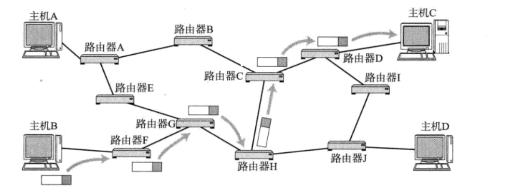

要想将数据送到网络世界的某一台主机，首先必须要用一个**唯一的标识符**来标识主机。网络层给出的解决方式是用**IP地址**来区别主机。

## IP地址

IP地址的设计可分为两个主要版本：IPv4和IPv6。

### IPv4

#### 格式

- IPv4地址是32位的二进制数，通常表示为四个十进制数，即点分十进制，每个数取值范围为0到255，用点号分隔（例如：192.168.0.1）。

问题1：为什么设计成这样？

以一个生活中例子来讲解：有个计院的学生，他的学号为0101，现在他捡到了一个校园卡，校园卡上标注的学号为0202。他想将校园卡交给失主，该怎么做？

1. 学校人那么多，不可能自己慢慢找，于是他将校园卡交给了计院的学生会
2. 计院的学生会首先查看学号的前2位：02，而计院学生的学号开头统一为01，因此不可能为计院的学生。于是计院学生会在学校学生会群里询问。
3. 经院学生会发现，02与经院学号开头匹配，表明该校园卡属于经院的学生。于是拿走了校园卡
4. 然后经院学生会根据学号的后两位：02，找到了失主。

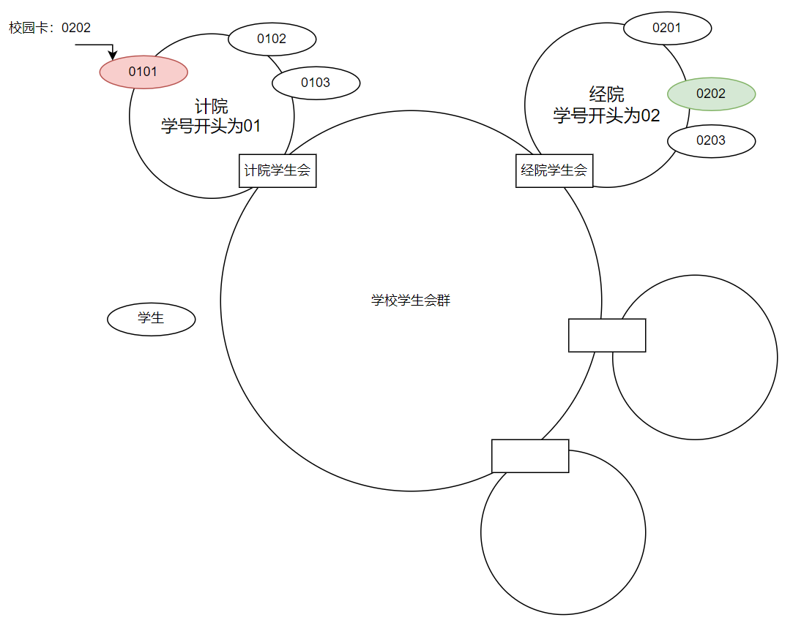

网络查找主机的方式，类似于上面找失主的例子，只是网络的层次更多。

IP地址相当于学号，众所周知，学号是被划分的，即前n位代表学院，后m位代表该学院的某个学生，IP地址有划分吗? 有！

#### IPv4地址的划分

##### 分类划分法

IP地址分为两个部分, 网络号和主机号

网络号: 保证相互连接的两个网段具有不同的标识;

主机号: 用于标识网络和网络中的具体设备，同一网段内, 主机之间具有相同的网络号, 但是必须有不同的主机号;

不同的子网其实就是把网络号相同的主机放到一起.如果在子网中新增一台主机, 则这台主机的网络号和这个子网的网络号一致, 但是主机号必须不能和子网中的其他主机重复.

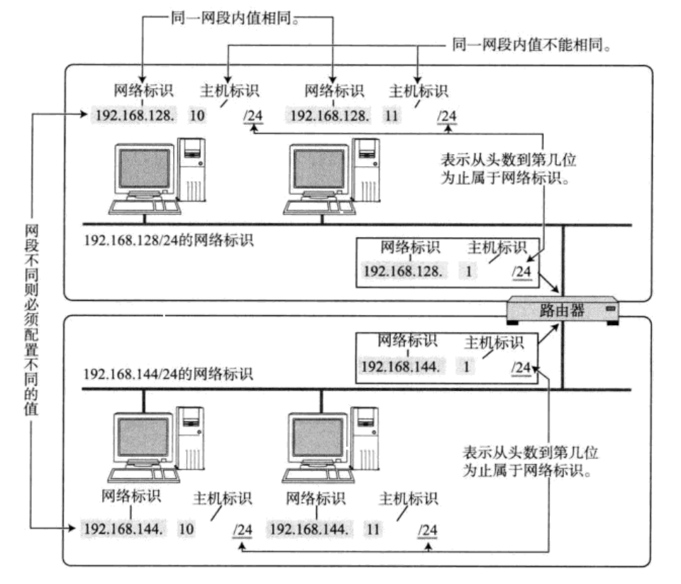

初始设计中，地址被分为A、B、C、D和E类，以不同的方式划分网络和主机部分：

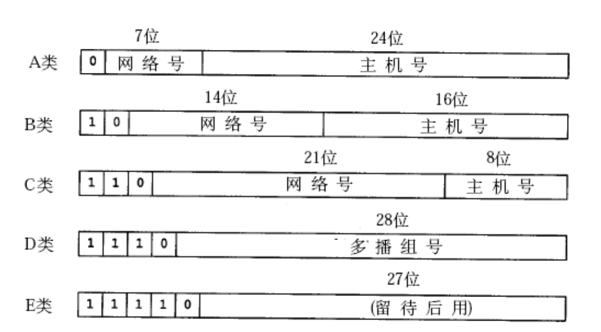

这种划分称为**分类划分法**。

---

随着Internet的飞速发展,这种划分方案的局限性很快显现出来,大多数组织都申请B类网络地址, 导致B类地址很快就分配完了, 而A类却浪费了大量地址;例如, 申请了一个B类地址, 理论上一个子网内能允许6万5千多个主机. A类地址的子网内的主机数更多. 然而实际网络架设中, 不会存在一个子网内有这么多的情况. **因此大量的IP地址都被浪费掉了**

针对这种情况提出了新的划分方案, 称为**CIDR(Classless Interdomain Routing):无分类域间路由选择**

---

##### 无分类域间路由选择-CIDR

- 引入一个额外的子网掩码(subnet mask)来区分网络号和主机号;

- 子网掩码也是一个32位的正整数. 通常用一串 "0" 来结尾;

- 将IP地址和子网掩码进行 "**按位与**" 操作, 得到的结果就是网络号;

- 网络号和主机号的划分与这个IP地址是A类、B类还是C类无关;

此时IP地址 = {<网络前缀>，<主机号>}

**子网掩码(地址掩码)**：分类的IP地址划分的主要问题就是网络号和主机号的比例只有3类：7:24, 14:16, 21:8，我们想要的根据实际情况，动态更改网络号和主机号的比例。子网掩码可以解决这个问题。

那如何求子网掩码呢？

1. 定长子网掩码

2. 不定长子网掩码

CIDR在一定程度上缓解了IP地址不够用的问题(提高了利用率, 减少了浪费, 但是IP地址的绝对上限并没有增加), 仍然

不是很够用. 这时候有三种方式来解决:

- 动态分配IP地址: 只给接入网络的设备分配IP地址. 因此同一个MAC地址的设备, 每次接入互联网中, 得到的IP地址不一定是相同的;

- NAT技术

- IPv6: IPv6并不是IPv4的简单升级版. 这是互不相干的两个协议, 彼此并不兼容; IPv6用16字节128位来表示一个IP地址; 但是目前IPv6还没有普及;

#### 特殊的IP地址

### NAT技术

#### 公网IP和私网IP

如果一个组织内部组建局域网,IP地址只用于局域网内的通信,而不直接连到Internet上,理论上 使用任意的IP地址都可以,但是RFC 1918规定了用于组建局域网的私有IP地址

- 10.*,前8位是网络号,共16,777,216个地址

- 172.16.* 到 172.31.*,前12位是网络号,共1,048,576个地址

- 192.168.*,前16位是网络号,共65,536个地址 

包含在这个范围中的, 都成为私有IP, 其余的则称为全局IP(或公网IP);

问题1:为什么要分公网和私网？公网IP和私网IP是如何工作的？

主要是因为IPv4地址不够，因此我们需要复用一些IP地址，一台主机的IP地址不是唯一的吗？怎么还能复用。

工作原理如下：

一台主机的IP的地址是在联网时由路由器进行分配，为私有IP地址，在不同的局域网内，私有IP地址可能相同。主机发送请求到路由器，如果主机访问的IP不属于该路由器的局域网内，则路由器会更改数据报里的源IP地址，**更改为路由器的WAN口IP**，向上一级转发。也就是说，数据报在传输过程，**源IP地址一直在变化**。这样我们只需要给部分路由器赋予唯一的公网IP，而这些路由器下的子网使用私网IP进行管理。

这种技术就是**NAT技术**（网络地址转换）：私网IP地址通常在内部网络中使用，并通过网络地址转换（NAT）设备（如路由器）将私网IP映射到一个或多个公网IP地址。NAT允许多个设备共享一个公网IP地址访问互联网，有效地减少了对公网IP地址的需求。

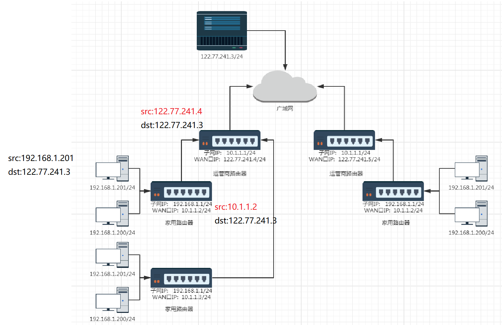

- 一个路由器可以配置两个IP地址, 一个是WAN口IP, 一个是LAN口IP(子网IP).

- 路由器LAN口连接的主机, 都从属于当前这个路由器的子网中. 

- 不同的路由器, 子网IP其实都是一样的(通常都是192.168.1.1). 子网内的主机IP地址不能重复. 但是子网之间的IP地址就可以重复了. 

- 每一个家用路由器, 其实又作为运营商路由器的子网中的一个节点. 这样的运营商路由器可能会有很多级, 

- 最外层的运营商路由器, WAN口IP就是一个公网IP了.

- 子网内的主机需要和外网进行通信时, 路由器将IP首部中的IP地址进行替换(替换成WAN口IP), 这样逐级替换, 最终数据包中的IP地址成为一个公网IP. 这种技术称为NAT(Network Address Translation，网络地址转换).

- 如果希望我们自己实现的服务器程序, 能够在公网上被访问到, 就需要把程序部署在一台具有外网IP的服务器上. 这样的服务器可以在阿里云/腾讯云上进行购买.

那现在有个问题：主机通过私有IP访问互联网时，路由器会不断更改源IP地址，那么目的主机，也就是服务器，服务器的响应该怎么返回呢？

答：当设备在私有网络中访问互联网时，路由器使用NAT将设备的私有IP地址替换为路由器的公网IP地址，**并记录这个映射关系。**这样当服务器返回的响应到路由器后，会根据映射关系跳到下一级路由器，最后到主机。

---

了解完IP地址，那有个问题：谁给主机设置IP地址？

### IP地址的分配

#### 静态配置

人手动配置

#### 动态配置 - DHCP（应用层协议）

动态主机配置协议DHCP是**应用层**协议，使用客户/服务器方式，客户端和服务端通过广播方式进行交互，基于UDP。
DHCP提供即插即用联网的机制，主机可以从服务器动态获取IP地址、子网掩码、默认网关、DNS服务器名称与IP地址,
允许地址重用，支持移动用户加入网络，支持在用地址续租。

1.主机广播DHCP发现报文
2.DHCP服务器广播DHCP提供报文
3.主机广播DHCP请求报文
4.DHCP服务器广播DHCP确认报文

---

那IP地址与数据是如何包装的？

## 网际协议IP

### IP报文格式

- 4位版本号(version):指定IP协议的版本,对于IPv4来说,就是4.
- 4位头部长度(header length): IP头部的长度是多少个32bit,也就是 length * 4 的字节数4bit表示最大的数字是15,因此IP头部最大长度是60字节.
- 8位服务类型(Type of Service): 3位优先权字段(已经弃用),4位TOS字段 和1位保留字段(必须置为0).4位TOS分别表示: **最小延时,最大吞吐量,最高可靠性,最小成本,**这四者相互冲突,只能选择一个，需要根据不同的情况选择不同的对于ssh/telnet这样的应用程序,最小延时比较重要; 对于ftp这样的程序,最大吞吐量比较重要.
- 16位总长度(totallength): IP数据报整体占多少个字节.
- 16位标识(id): 唯一的标识主机发送的报文.如果IP报文在数据链路层被分片了,那么每一个片里面的这个id都是相同的.
- 3位标志字段: 第一位保留(保留的意思是现在不用,但是还没想好说不定以后要用到)第二位置为1表示禁止分片,这时候如果报文长度超过MTU,IP模块就会丢弃报文,第三位表示"更多分片”,如果分片了的话最后一个分片置为1，其他是0.类似于一个结束标记.
- 13位分片偏移(framegament offset): 是分片相对于原始IP报文开始处的偏移.其实就是在表示当前分片在原报文中处在哪个位置实际偏移的字节数是这个值*8 得到的.因此，除了最后一个报文之外,其他报文的长度必须是8的整数倍(否则报文就不连续了).
- 8位生存时间(Time To Live, TTL): 数据报到达目的地的最大报文跳数,一般是64.每次经过一个路由,TTL-= 1，一直减到0还没到达,那么就丢弃了.这个字段主要是用来防止出现路由循环
- 8位协议: 表示上层协议的类型
- 16位头部校验和: 使用CRC进行校验,来鉴别头部是否损坏.
- 32位源地址和32位目标地址: 表示发送端和接收端
- 选项字段(不定长,最多40字节): 略

### IP层的分组转发

IP（Internet Protocol）报文有时会由于其大小超过了数据链路层的最大传输单元（MTU，Maximum Transmission Unit）而需要进行分片（fragmentation）。

控制分片的字段是IP报头里的3位标志和13位片偏移。

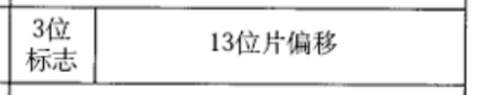

3位标志

1. **第0位（保留位，Reserved Bit，RB）**：
   - 始终为0，保留为将来使用。
   - 在处理IP报文时，应忽略这个位的值。
2. **第1位（不分片位，Don't Fragment，DF）**：
   - 如果设置为1，则表示不允许对该IP报文进行分片。如果报文大小超过MTU，则报文将被丢弃并返回ICMP错误消息。
   - 如果设置为0，则表示允许对该IP报文进行分片。
3. **第2位（更多分片位，More Fragments，MF）**：
   - 如果设置为1，则表示后面还有更多的分片。
   - 如果设置为0，则表示这是最后一个分片或者报文没有被分片。

13位片偏移：片偏移指出：较长的分组在分片后，某片在原分组中的相对付置，也就是说，相对于用户数据字段的起点，该片从何处开始。片偏移以8个字节为偏移单位。这就是说，除最后一个数据报片外，**其他每个分片的长度一定是8字节 (64 位）的整数倍。**

分片过程：

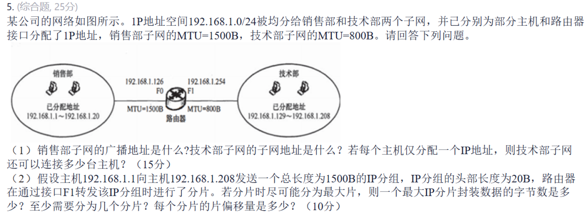

（1）广播地址是网络地址中主机号全l的地址（主机号全0的地址代表网络本身）。销售部和技术部均分配了192.168.1.0/24的IP地址空间，IP地址的前24位为子网的网络号。于是在后8位中划分部门的子网，选择前1位作为部门子网的网络号。令销售部子网的网络号为0，技术部子网的网络号为1，则技术部子网的完整地址为192.168.1.128；令销售部子网的主机号全1，可以得到该部门的广播地址为192.168.1.127。每个主机仅分配一个IP地址，计算目前还可以分配的主机数，用技术部可以分配的主机数减去已分配的主机数，技术部总共可以分配给计算机的主机数为27-2=126(减去全0和全l的主机号）。已经分配了208-129+1=80个，此外还有1个IP地址分配给了路由器的端口(192.168.1.254)，因此还可以分配126-80-1=45台。

（2）判断分片的大小，需要考虑各个网段的MTU，而且注意分片的数据长度必须是8B的整数倍。由题可知，在技术部子网内，MTU=800B，IP分组头部长20B，最大1P分片封装数据的字节数为L[(800-20)/8]*8=776。至少需要的分片数[(1500-20)/776=2。第1个分片的偏移量为0；第2个分片的偏移量为776/8=97。

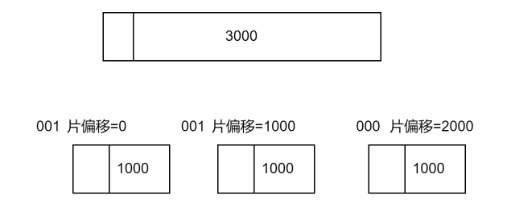

丢片问题：

1. 第一个丢了：找不到片偏移=0 ==> 第一个丢了
2. 中间丢了：根据片偏移和报文大小进行计算，可以得出。比如上面收到1和3，但3片偏移=2000，而1只有1000字节，因此少了1000字节 ==> 2丢了
3. 最后一个丢了：找不到MF=0的报文 ==> 最后一个丢了

推荐分片吗？ **不推荐**。增加了丢包概率，少一个分片都要重发。

## ICMP协议

为了更有效地转发 IP 数据报和提高交付成功的机会，在网际层使用了网际控制报文协ICMP (Internet Control Message Protocol) 。

ICMP协议是一个 **网络层协议**，它的位置在IP协议上方，简单来说，ICMP的数据是包装在IP报文里。

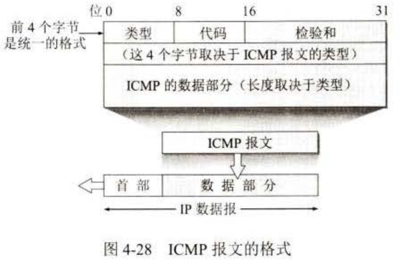

”为了更有效地转发 IP 数据报和提高交付成功的机会“， 那ICMP如何提高效率？

首先，在发送数据之前，先探探路。

因此ICMP报文分为了2种：**ICMP 差错报告报文和 ICMP 询间报文。**

### ICMP报文的种类

#### 差错报文的种类

(I) 终点不可达 

当路由器或主机不能交付数据报时就向源点发送终点不可达报文。

 (2) 时间超过 

当路由器收到生存时间为零的数据报时，除丢弃该数据报外，还要向

源点发送时间超过报文。当终点在预先规定的时间内不能收到一个数据报的全部数据报片时，

就把已收到的数据报片都丢弃，并向源点发送时间超过报文。

(3) 参数问题 

当路由器或目的主机收到的数据报的首部中有的字段的伯不正确时，

就丢弃该数据报，并向源点发送参数问题报文。

(4) 改变路由（重定向） 

路由器把改变路由报文发送给主机，让主机知道下次应将

数据报发送给另外的路由器（也就是说，找到了更好的路由）。

#### 询问报文的种类

在应用层有个工具：Ping，它是之间跨过

### ICMP的应用

#### PING

---

前文描述了一个数据报通过NAT技术不断转发的过程，那么具体的某一次转发过程是什么样子的呢？

路由的过程, 就是这样一跳一跳(Hop by Hop) "问路" 的过程. 

所谓 "一跳" 就是数据链路层中的一个区间. 具体在以太网中指从源MAC地址到目的MAC地址之间的帧传输区间. 

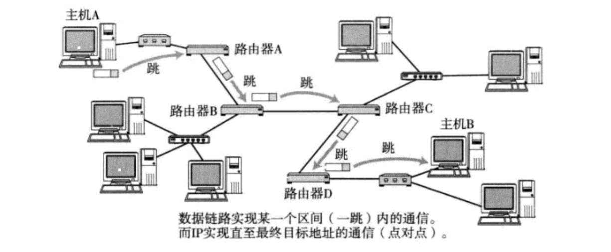

IP数据包的传输过程也和问路一样.

- 当IP数据包, 到达路由器时, 路由器会先查看目的IP;

- 路由器决定这个数据包是能直接发送给目标主机, 还是需要发送给下一个路由器;

- 依次反复, 一直到达目标IP地址;

那么如何判定当前这个数据包该发送到哪里呢? 

不同网络中的两个主机之间的通信，要经过若干个路由器转发分组来完成，分组查找路由器中的转发表，从指明的按口转发到下个路由器。但转发表是怎样得出的呢？是从路由表导出的。而路山表又是由互联网中许多的路由器，按照共同选定的路由选择协议，通过许多次的相互交换路由信息而产生的。

## 路由

因此路由器传输的信息可以分为两类：

1. 数据			
2. 路由信息   

在计算机网络种，将2这抽象为数据平面和控制平面。

数据--数据平面 --根据转发表进行转发，时间短，直接用硬件解决

路由信息--控制平面 --根据路由算法得出，时间长，用软件解决

控制平面有2种方式：

1. 传统方法：每个路由器都有控制平面和数据平面，路由器自己计算路由选择算法。

2. SDN（software-Defined Networking) 方法：控制平面在远程控制器，然后远程控制器分发给各路由器。

### 路由算法

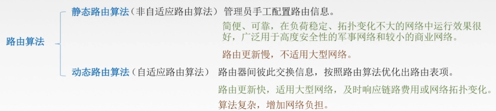

### 路由选择协议 -- 动态路由

路由选择分层:

- 互联网太大：如果让所们的路由器知道所付的网络应怎样到达，则这种路由器将非常大，处理起来也太花时间
- 许多单位也不愿意暴露自己单位网络的细节给外界。

为此，可以把整个互联网划分为许多较小的**自治系统**(autonomous system), 一般都记为**AS** 。

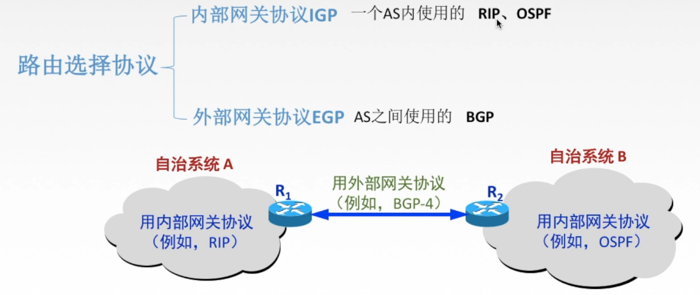

### RIP协议

> **RIP(Routing Information Protocol)** 是一种分布式的基于**距离向量**的路由选择协议，是因特网的协议标准，**最大优点是简单。**
> RIP协议要求网络中每一个路由器都**维护**从它自己到其他每一个目的网络的唯一最佳距离记录(即一组距离)。
>
> **距离:通常为“跳数”，即从源端口到目的端口所经过的路由器个数，经过一个路由器跳数+1。**
>
> 特别的，从一路由器到直接连接的网络距离为1。
>
> RIP允许一条路由最多只能包含15个路由器，因此距离为16表示网络不可达。这就表明RIP协议只适用于小互联网。

路由器如何维护这个最佳距离？路由器刚开始就知道这个最佳距离吗？不知道，它需要去“询问”，准确来说“交换”，与其他路由器交换各自的路由信息。

问题：和谁交换？何时交换？如何根据交换的路由信息更新自己的路由信息？

- 和谁交换信息：仅和相邻路由器交换信息
- 交换什么信息：自己的路由表
- 何时交换信息：**周期性交换**(例如每30秒)

路由器刚开始工作时，只知道自己到直连网络的距离为1，经过若干次交换和更新后，每个路由器都知道到达本AS内各网络的最短距离和下一跳地址，这一过程称为**收敛**。

具体的更新方式：

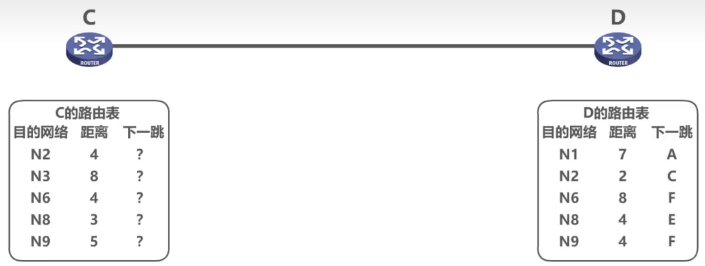

#### RIP协议的格式

现在较新的 RIP 版本是 1998 11 月公布的 RlP2 [RFC 2453, STD57], 新版本协议本身并无多大变化，但性能上有些改进。 RIP2 可以支持九分类域间路由选择 CIDR 。此外，RIP2 还提供简单的鉴别过程支持多插。

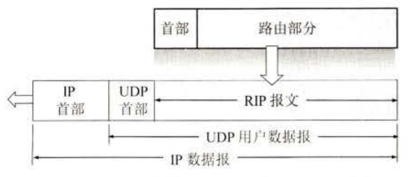

RIP 报义由首部和路由部分组成。在路由部分要填入自治系统号 ASN (Autonomous System Number)，这是考虑使 RIP 有可能收到本自治系统以外的路由选择信息。还要指出目的网络地址（包括网络的子网掩码）、下一跳路由器地址以及到此网络的距离。一个 RIP报文最多可包括 25 个路由。如超过，必须再用一个 RIP报文来传送。

#### RIP的缺点

RTP 存在的一个问题是当网络出现故障时，要经过比较长的时间才能将此信息传送到所有的路由器。我们可以用图 4-41 的简单例子来说明。设三个网络通过两个路由器互连起来，并且都已建寸了各自的路由表。图中路由器交换的信息只给出了我们感兴趣的一行内容。路

路由器 R, 中的 “Net 1,1, 直接”表示”到网 Net1的距离是 I, 直接交付

路由器 R2 中的"Net 1,2, R1" 表示”到网 Net1的距离是 2, 下一跳经过 R1

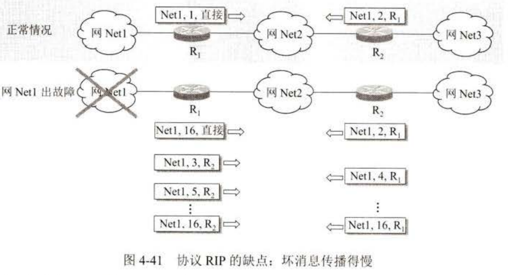

现在假定路由器R1到Net1的线路出问题了，因R1更新自己的路由信息并发送：Net1的距离改为 16, 表示不可达。因而传输的路由表中的相应项目变为 “Net1, 16, 直接“ 。但是，很可能要经过 30 秒钟后才把更新信息发送给 R2 。然而 R2 可能已经先把自己的路由表发送给了 R1，其中有 “Net1, 2, R1" 这一项。

R1收到 R2 的更新报文后，便将“Net1, 2, R1" --> “Net1, 3, R2”，误认为可以通过R2到达Net1，于是又更新自己的路由表。

而此时，R2收到了R1不可达Net1的信息,更新了自己路由表。但是R1却认为R2可达Net1。之后二者便互相交换信息，都以为对方可以到达Net1, 由于每次交换都会使路由表中的Net1的距离增加。这样的更新一直继续下去，直到 R1 R2 到Net1 的距离都增大到 16 时，R1和R2才知道原来网 Ne 是不可达的。

协议 RIP 的这一特点叫作：**好消息传播得快，而坏消息传播得慢**。网络出故障的传播时间往往较长（例如数分钟）。这是 RIP 的一个主要缺点。

但如果一个路由器发现了更短的路由，那么这种更新信息就传播得很快。

### 路由表

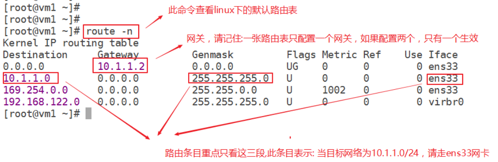

#### 路由表的转发

路由器转发分组的算法:
1.提取目的IP地址
2.是否直接交付
3.特定主机路由
4.检测路由表中有无路径
5.默认路由 0.0.0.0
6.丢弃，报告转发分组出错

## 网络层设备

#### 路由器

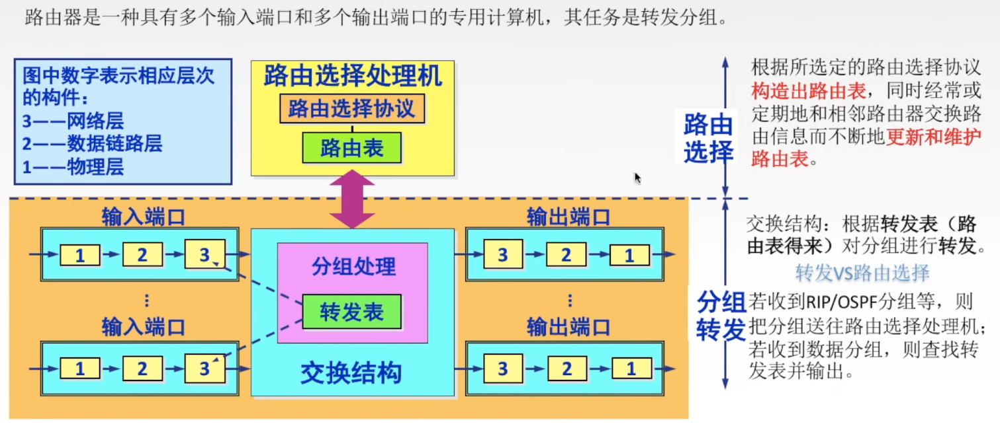

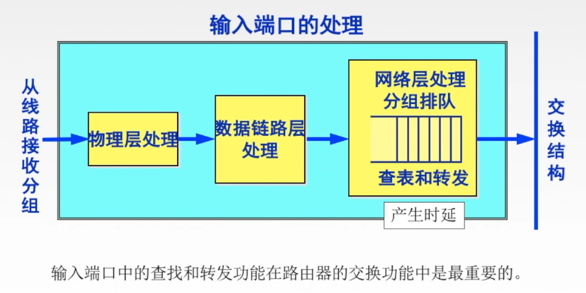

