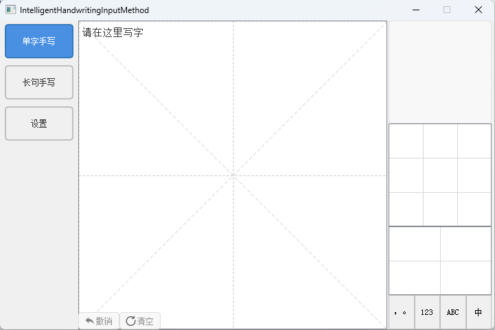
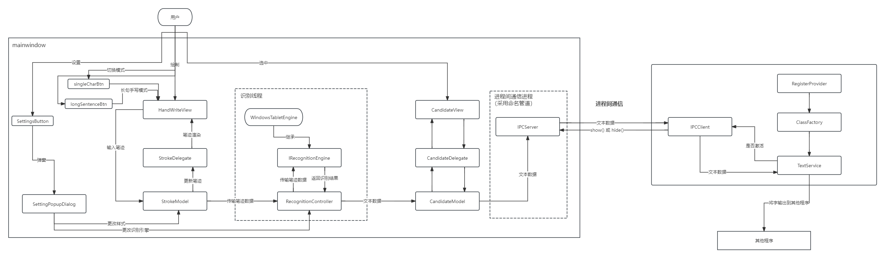
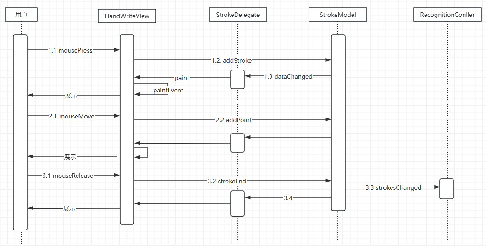
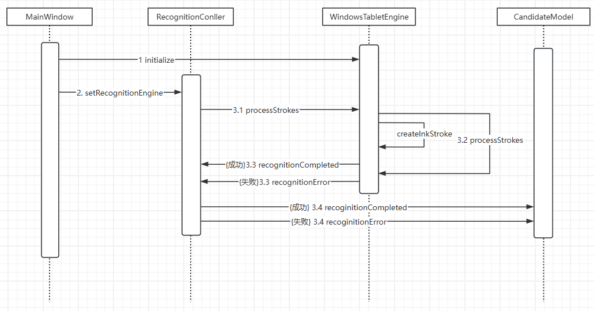
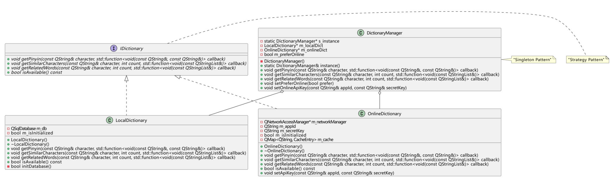
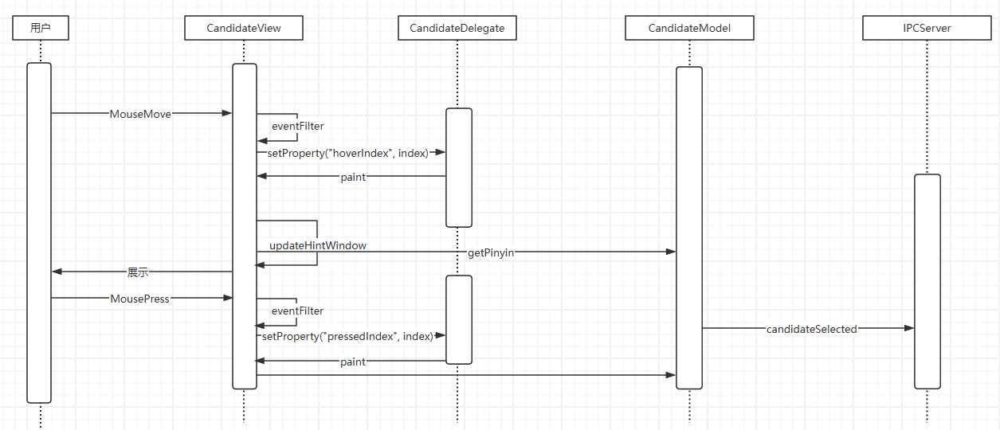
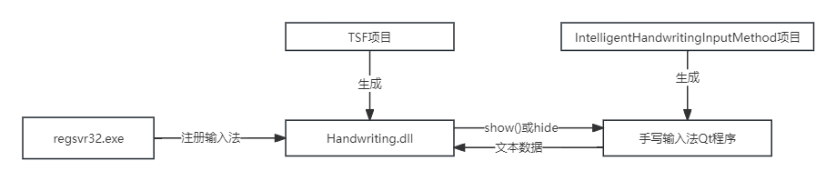
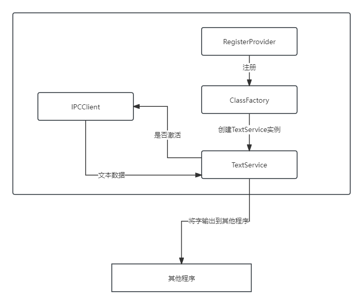

# 智能手写输入法



# 设计思路


## 模块划分

【金山文档 | WPS云文档】 手写输入法模块划分
https://kdocs.cn/l/cbaoXUi8YmWw



models

- **StrokeModel**: 管理笔画数据，提供数据的增删改查功能。
- **CandidateModel**: 管理候选词数据，提供候选词的选择和更新功能。
- **ConfigModel**: 管理配置数据，如用户设置、手写识别参数等。

delegates

- **StrokeDelegate**: 负责笔画的渲染。
- **CandidateDelegate**: 负责候选词的渲染。

views

- **HandWriteView**: 手写板视图，处理用户输入和笔画显示。
- **CandidateView**: 候选词视图，显示识别结果的候选词。
- **SettingsPopupDialog**: 设置弹窗，提供用户配置界面。
- **ToolPopupDialog**：手动选择标点、数字、字母、语言弹窗

controllers

- **RecognitionController**: 负责与识别引擎的交互，处理识别结果。
- **TSFController**: 负责与文本服务框架（TSF）的交互，管理输入法状态。

core

- Recognition：提供识别服务
  - **RecognitionModel**: 识别服务，提供手写识别的核心算法。
- IPC: 用于和TSF服务通信
  -  **IPCServer**: 使用命名管道进行双向通信
- Common: 公共组件，提供通用的工具类和数据结构。
  - **data.h**：核心数据结构。

dictionary

- **dictionary.db**: Sqlite数据库，里面存储汉字-拼音表，汉字-常见词组表
- **DictionaryManager**：词典管理类
- **LocalDictionary**：本地词典（使用dictionary.db）
- **OnlineDictionary**：在线词典（使用第三方平台词典）


## 手写区域

笔迹数据存储

```cpp
struct StrokeStyle // 笔迹样式
{
    QColor color{Qt::black};	// 笔迹颜色（默认颜色: 黑）
    int width{2};				// 笔迹大小（默认大小: 2px）

    bool operator==(const StrokeStyle &other) const
    {
        return color == other.color && width == other.width;
    }
};

struct StrokeData // 笔迹数据
{
    QVector<QPoint> points; // 笔迹点集
    StrokeStyle style;      // 笔迹样式
    qint64 timestamp;       // 时间戳（目前未用到）

    StrokeData() = default;
    StrokeData(const StrokeStyle &s) : style(s) {}
};
```

手写区域采用 Qt 的 Model-View 架构。

view：通过继承 `QAbstractItemView` 实现自定义视图控件。设计了基类 `HandWriteView` 及其两个子类 `SingleHandWriting`（单字手写）和 `LongSentenceHandWriting`（长句手写），实现了不同模式下的手写功能。

delegate: 通过继承`QStyledItemDelegate` 实现自定义代理。设计了类`StrokeDelegate`，实现`paint`函数，进行局部重绘，减少整个手写试图的重绘次数。

model: 因为笔迹用通过继承`QAbstractListModel` 实现自定义模型，数据采用`QVector<StrokeDate>`存储。

### 时序图



基本流程：

1. 用户用鼠标在HandWriteView上绘制，先后触发 mousePressEvent, mouseMoveEvent, mouseReleaseEvent，采集笔迹给StrokeModel
2. 每次笔迹(点)更新，通知StrokeDelegate进行笔迹渲染，展示给用户
3. 当一次完整笔迹采集后，发送信号StrokeDateChange给RecognitionContoller调用识别引擎进行识别

通过单字手写按钮、长句手写按钮可以将进行不同手写模式的切换

 

### 详细设计

手写输入法有2种模式：单字手写和长句手写

- 在单字手写模式下，手写区域为正方形，米字格
- 在长句手写模式下，手写区域为矩形，网格。

二者的区别在于paintEvent绘制背景。 因此我设计了一个基类HandWriteView，2个子类SingleHandWriting和LongSentenceHandWriting

基类 HandWriteView

- **UI 组件管理**
  - 撤销按钮：支持笔画回退
  - 清空按钮：清除所有笔画
  - 提示文本：显示当前状态信息

- **笔迹处理**
  - 笔画捕获：处理鼠标事件实现笔迹采集
  - 笔迹渲染：实时绘制用户输入的笔画
  - 状态管理：跟踪书写状态，控制按钮启用/禁用

- **事件处理**
  - mousePressEvent：开始笔画
  - mouseMoveEvent：继续笔画
  - mouseReleaseEvent：结束笔画
  - paintEvent：渲染视图
  - resizeEvent：处理尺寸变化

子类特化

- **SingleHandWriting**

  - 实现米字格背景

- **LongSentenceHandWriting**

  - 实现网格背景

    


## 笔迹识别

 我希望我的笔迹识别能够支持多种识别引擎。因此采用策略模式设置了一个抽象类IRecognitionEngine

```cpp
class IRecognitionEngine : public QObject
{
    Q_OBJECT
public:
    explicit IRecognitionEngine(QObject* parent = nullptr) : QObject(parent) {}
    virtual ~IRecognitionEngine() = default;

    // 初始化引擎
    virtual bool initialize() = 0;
    // 处理笔画数据
    virtual void processStrokes(const QVector<StrokeData>& strokes) = 0;
    // 清理资源
    virtual void cleanup() = 0;

signals:
    void recognitionCompleted(const QStringList& candidates);	// 笔迹识别完成信号
    void recognitionError(const QString& error);				// 笔迹识别错误信号
};
```

目前我只设置了一种识别引擎：windows的墨迹识别 window LNK

```cpp
class WindowsTabletEngine : public IRecognitionEngine
{
    Q_OBJECT
public:
    explicit WindowsTabletEngine(QObject* parent = nullptr);
    ~WindowsTabletEngine();

    bool initialize() override;
    void processStrokes(const QVector<StrokeData>& strokes) override;
    void cleanup() override;
    void setRecognitionMode(RecognitionMode mode) override;
private:
    // 辅助方法
    winrt::Windows::UI::Input::Inking::InkStroke createInkStroke(const StrokeData& strokeData);
    // 处理坐标转换
    winrt::Windows::UI::Input::Inking::InkStrokeContainer handleCoordinateConversion(const QVector<StrokeData>& strokes);
    // 处理错误
    void handleRecognitionError(const QString& message);
    // 数据补充
    void dataSupplement(RecognitionResult& result, RecognitionMode mode);
private:
    // 识别器容器
    winrt::Windows::UI::Input::Inking::InkRecognizerContainer m_recognizerContainer;
    // 识别目标
    RecognitionMode m_recognitionTarget;
};
```


### 时序图




### 详细设计


笔迹识别函数processStrokes包括3部分：

- qt笔迹 --> windows LNK（handleCoordinateConversion）
- 异步识别
- 结果补充(如果候选词<9则补充，同时加入拼音和4个词组)（dataSupplement）

```cpp
InkStrokeContainer WindowsTabletEngine::handleCoordinateConversion(const QVector<StrokeData> &strokes)
{
    InkStrokeContainer strokeContainer;
    InkStrokeBuilder builder;
    // qt坐标转换为winrt坐标
    if(m_recognitionTarget == RecognitionMode::SingleChar)
    {
        // 单字模式：将所有笔画的点合并成一个笔画
        IVector<Windows::Foundation::Point> allpoints = single_threaded_vector<Windows::Foundation::Point>();
        for (const auto& stroke : strokes) {
            for (const QPoint& point : stroke.points) {
                float scaledX = point.x();
                float scaledY = point.y();
                allpoints.Append(Windows::Foundation::Point(scaledX, scaledY));
            }
        }
        auto inkStroke = builder.CreateStroke(allpoints);
        strokeContainer.AddStroke(inkStroke);
    } 
    else if(m_recognitionTarget == RecognitionMode::MultiChar)
    {
        for (const auto &stroke : strokes)
        {
            // 自由书写模式：保持原有的多笔画结构
            IVector<Windows::Foundation::Point> points = single_threaded_vector<Windows::Foundation::Point>();
            for (const QPoint &point : stroke.points)
            {
                float scaledX = point.x();
                float scaledY = point.y();
                points.Append(Windows::Foundation::Point(scaledX, scaledY));
            }

            auto inkStroke = builder.CreateStroke(points);
            strokeContainer.AddStroke(inkStroke);
        }
    }
    return strokeContainer;
}
```


结果补充

```cpp
void WindowsTabletEngine::dataSupplement(RecognitionResult& result, RecognitionMode mode)
{
    if(mode == RecognitionMode::SingleChar)
    {
#ifdef USE_LIBRARY
         // 1. 如果候选字少于9个，补充相似字
        if (result.candidates.size() < 9) {
            QString firstChar = result.candidates.first();
            DictionaryManager::instance().getSimilarCharacters(firstChar, 9 - result.candidates.size(),
                [&result](const QStringList& similar) {
                    // 添加相似字到候选列表
                    result.candidates.append(similar);
                    // 确保不超过9个
                    while (result.candidates.size() > 9) {
                    result.candidates.removeLast();
                }
                });
        }
        // 2. 为所有候选字获取拼音
        result.pinyins.clear();  // 确保拼音列表为空
        int pendingPinyinRequests = result.candidates.size();
    
        for (const QString& character : result.candidates) {
            DictionaryManager::instance().getPinyin(character,
                [&result, character, &pendingPinyinRequests, this](const QString& char_, const QString& pinyin) {
                    result.pinyins[character] = pinyin;
                    --pendingPinyinRequests;

                    // 当所有拼音都获取完毕后，获取相关词组
                    if (pendingPinyinRequests == 0) {
                        // 3. 获取相关词组
                        DictionaryManager::instance().getRelatedWords(result.candidates.first(), 4,
                        [this, &result](const QStringList& words) {
                            result.relatedWords = words;
                            // 这里可以发送完成信号（上述步骤都是异步获取，当获取完成后，发送信号通知）
                            emit recognitionCompleted(result);
                        });
                    }
                });
        }
#endif
    }
    else if(mode == RecognitionMode::MultiChar)
    {
        while(result.candidates.size() < 9)
        {
            result.candidates.append(QString::fromLocal8Bit(" "));
        }
        emit recognitionCompleted(result);
    }
}
```


## 词典

词典用来补充数据，为识别出的字提供拼音、词组服务。词典分为在线词典和本地词典，对于这种双模式词典设计，我使用策略、单例、工厂模式的组合。

策略模式：采用在线词典和本地词典双重实现

工厂模式：使用词典管理器统一管理不同词典实现

单例模式：词典管理器采用单例设计，确保全局唯一访问点




### 详细设计

词典接口（IDictionary）

- 定义统一的词典操作接口

- 包含拼音查询、相似字查询、相关词组查询等基本功能

- 提供可用性检查机制

```cpp
class IDictionary {
public:
    virtual ~IDictionary() = default;

    // 核心接口
    virtual void getPinyin(const QString& character, 
                          std::function<void(const QString&, const QString&)> callback) = 0;
    virtual void getSimilarCharacters(const QString& character, int count,
                                    std::function<void(const QStringList&)> callback) = 0;
    virtual void getRelatedWords(const QString& character, int count,
                               std::function<void(const QStringList&)> callback) = 0;

    // 状态检查
    virtual bool isAvailable() const = 0;
};

```

本地词典（LocalDictionary）

- 基于 SQLite 数据库实现

- 包含字符表和词组表两个基本表结构

- 提供快速的本地查询能力

```cpp
class LocalDictionary : public IDictionary {
public:
    LocalDictionary();
    ~LocalDictionary();

    void getPinyin(const QString& character, 
                   std::function<void(const QString&, const QString&)> callback) override;
    void getSimilarCharacters(const QString& character, int count,
                             std::function<void(const QStringList&)> callback) override;
    void getRelatedWords(const QString& character, int count,
                        std::function<void(const QStringList&)> callback) override;
    
    bool isAvailable() const override;

private:
    bool initDatabase();

    QSqlDatabase m_db;
    bool m_isInitialized;
};
```

在线词典（OnlineDictionary）（未测试）

- 通过网络 API 实现（采用百度只能云）

- 提供更丰富的词典数据

- 支持数据的实时更新

- 包含请求缓存机制，优化性能

```
class OnlineDictionary : public QObject, public IDictionary {
    Q_OBJECT
public:
    explicit OnlineDictionary(QObject* parent = nullptr);
    ~OnlineDictionary();

    // IDictionary 接口实现
    void getPinyin(const QString& character, 
                   std::function<void(const QString&, const QString&)> callback) override;
    void getSimilarCharacters(const QString& character, int count,
                             std::function<void(const QStringList&)> callback) override;
    void getRelatedWords(const QString& character, int count,
                        std::function<void(const QStringList&)> callback) override;
    bool isAvailable() const override;

    // API配置
    void setApiKey(const QString& appId, const QString& secretKey);
    void setTimeout(int milliseconds);

signals:
    void error(const QString& errorMessage);

private slots:
    void handleNetworkReply(QNetworkReply* reply);
    void handleTimeout();

private:
    // API请求相关
    QString generateSignature(const QUrlQuery& query) const;
    QNetworkReply* sendRequest(const QString& endpoint, QUrlQuery& query);
    
    // 缓存相关
    struct CacheEntry {
        QVariant data;
        qint64 timestamp;
    };
    QVariant getCachedData(const QString& key) const;
    void cacheData(const QString& key, const QVariant& data);
    void cleanCache();

private:
    // 网络相关
    QNetworkAccessManager* m_networkManager;
    std::map<QNetworkReply*, std::function<void(const QJsonDocument&)>> m_pendingReplies;
    QTimer* m_timeoutTimer;
    int m_timeout;

    // API配置
    QString m_appId;
    QString m_secretKey;
    QString m_baseUrl;
    bool m_isInitialized;

    // 缓存
    QMap<QString, CacheEntry> m_cache;
    static const int CACHE_DURATION = 3600;    // 缓存时间（秒）
    static const int CACHE_MAX_SIZE = 1000;    // 最大缓存条目数
};
```

词典管理器（DictionaryManager）

- 统一管理在线和本地词典

- 提供智能切换机制

- 处理词典查询的优先级策略

```cpp
class DictionaryManager {
public:
    static DictionaryManager& instance();
    // 获取拼音
    void getPinyin(const QString& character, 
                   std::function<void(const QString&, const QString&)> callback);
    // 获取相似字
    void getSimilarCharacters(const QString& character, int count,
                             std::function<void(const QStringList&)> callback);
    // 获取相关词
    void getRelatedWords(const QString& character, int count,
                        std::function<void(const QStringList&)> callback);

    // 配置方法
    void setOnlineApiKey(const QString& appId, const QString& secretKey);
    // 设置是否优先使用在线词典
    void setPreferOnline(bool prefer);

private:
    DictionaryManager();
    DictionaryManager(const DictionaryManager&) = delete;
    DictionaryManager& operator=(const DictionaryManager&) = delete;

    IDictionary* getPreferredDictionary();

    OnlineDictionary* m_onlineDictionary;
    LocalDictionary* m_localDictionary;
    bool m_preferOnline;
};
```


## 候选词区域

候选词区域负责展示和管理用户可选择的候选字词。采用 Qt 的 Model-View 架构。

view：系统提供两种候选词视图模式:单字模式(SingleCharCandidateView)，长句模式(LongSentenceCandidateView),里面设置成员`QTableView`

delegate: 通过继承`QStyledItemDelegate`实现自定义代理。对TableItem设置的**动态属性**进行样式绘制。

model：通过继承`QAbstractTableModel`实现自定义模型。存储候选词数据，接受笔迹识别控制器传输的候选词数据。


### 时序图




### 详细设计

候选词区域有2种模式：单字手写和长句手写

- 在单字手写模式下，候选词区域(SingleCharCandidateView)由4部分组成，从上到下
  - 提示窗口（QWidget* m_hintWidget）：显示鼠标hover的候选词，如果是汉字，添加拼音
  - 单字候选词（QTableView* m_mainCandidateView）：3x3表格，显示单字
  - 词组候选词（QTableView* m_phraseCandidateView）：2x2表，显示词组
  - 4个工具按钮：标点、数字、字母、语言

```cpp
class SingleCharCandidateView : public CandidateView
{
    Q_OBJECT
public:
	// ...
protected:
	// ...
    // 事件过滤器(过滤鼠标事件，未TableItem添加动态属性)
    bool eventFilter(QObject* watched, QEvent* event) override;

private:
    QWidget* m_hintWidget{nullptr};                    // 提示窗口
    QLabel* m_hintLabel{nullptr}; // 提示文本
    QLabel* m_pinyinLabel{nullptr};// 提示拼音

    QTableView* m_mainCandidateView{nullptr};        // 3x3候选词表格
    QTableView* m_phraseCandidateView{nullptr};      // 2x2词组表格
};
```


- 在长句手写模式下，候选词区域(LongSentenceCandidateView)由2部分，从上到下
  - 候选词（QTableView* m_candidateView）：1x9的表格，显示识别的长句
  - 4个工具按钮：标点、数字、字母、语言

```
class LongSentenceCandidateView : public CandidateView
{
    Q_OBJECT
public:
	// ...
protected:
    // 事件过滤器(过滤鼠标事件，未TableItem添加动态属性)
    bool eventFilter(QObject* watched, QEvent* event) override;
private:
    // ...
private:
    QTableView* m_candidateView{nullptr};            // 1x9候选词表格
};
```


## 手写上屏



- 采用分离式设计：Qt程序负责手写识别，TSF模块负责文本服务

- 使用命名管道（IPC）实现两个模块间的通信

- TSF模块以COM组件形式实现，注册为系统输入法


基本流程：手写输入 -> Qt识别 -> IPC传输 -> TSF接收 -> 创建EditSession -> 插入文本

**该功能我没有测试通过，我成功了注册了输入法，实现了qt程序和tsf模块的通信，但是在创建编辑会话这一步，我无法将文本插入进去**


具体的模块划分



核心组件：

TextService类：实现TSF核心接口

- ITfTextInputProcessor：输入法处理器接口

- ITfThreadMgrEventSink：线程管理事件接口

- ITfTextEditSink：文本编辑事件接口
- EditSession类：实现文本编辑会话负责实际的文本插入操作管理文本选区和光标位置


