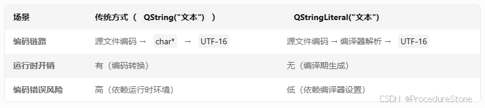
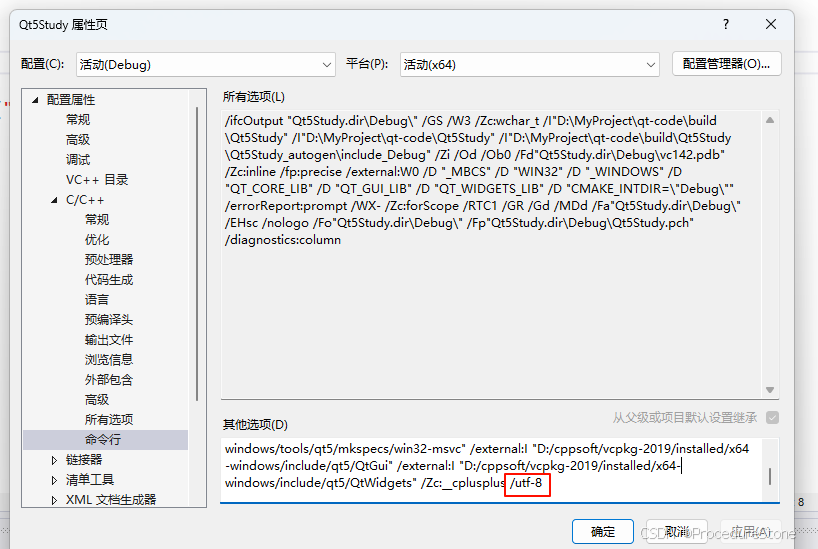

---
title: 【Qt Core 02】容器类和算法
description: 容器类和算法
date: 2025-04-02
slug: qt-core_02_container_and_algorithm
categories:
    - Qt
tags:
    - Qt Core
---

> 以下内容基于Qt 5.15 LTS 官方文档整理


Qt Core 提供多种容器类，满足不同的数据存储和操作需求。


## 字符串

Qt中与字符的核心类

- QChar：存放文本数据
- QByteArray：这个用来存放原始数据（图片、文件的二进制）
- QString：

QString存储一串16 位QChar，其中每个QChar对应一个**UTF-16** 代码单元。（代码值大于65535的Unicode字符使用代理项对存储，即两个连续的QChar。

Unicode是一种国际标准，支持当今使用的大多数书写系统。它是US-ASCIl（ANSIX3.4-1986）和Latin-1（IS08859-1）的超集，所有US-
ASCll/Latin-1字符都可以在相同的代码位置使用。

在幕后，QString 使用隐式共享（写时复制）来减少内存使用并避免不必要的数据复制。这也有助于减少存储16 位字符而不是8 位字符的固有开销。

除了QString之外，Qt还提供了QByteArray类来存储原始字节和传统的8位以\0'结尾的字符串。在大多数情况下，QString 是您要使用的类。它在整个QtAPI 中使用，如果您想在某个时候扩大应用程序的市场，Unicode支持可确保您的应用程序易于翻译。QByteArray适用的两种突出情况是需要存储原始二进制数据时，以及内存节省至关重要时（如在嵌入式系统中），


### 初始化
初始化QString的一种方法是将const char *传递给其构造函数。例如，以下代码创建了一个包含数据 “Hello”、大小为 5 的QString：
```cpp
QString str = "Hello";
```

QString会使用`fromUtf8()`函数将const char * 数据转换为 Unicode。
在所有接受const char * 参数的QString函数中，const char * 被解释为经典的 C 风格以'\0'结尾的字符串。除非函数名明确表明采用其他编码，否则这类const char *参数都假定为 UTF-8 编码。
你也可以将字符串数据作为QChar数组提供：


可以将字符串数据作为QChar数组提供：

```cpp
static const QChar data[4] = { 0x0055, 0x006e, 0x10e3, 0x03a3 };
QString str(data, 4);
```

QString会对QChar数据进行深拷贝，所以你之后修改原数据不会产生副作用。如果不想对字符数据进行深拷贝，可以使用QStringView或QString::fromRawData()。

此时会采用原始数据，如果你仍然修改了数据，它在修改时自动创建副本（深拷贝）
```cpp
QRegularExpression pattern("\u00A4");
static const QChar unicode[] = {
        0x005A, 0x007F, 0x00A4, 0x0060,
        0x1009, 0x0020, 0x0020};
qsizetype size = sizeof(unicode) / sizeof(QChar);

QString str = QString::fromRawData(unicode, size);
if (str.contains(pattern) {
    // ...
}
```

其他访问QString的数据，可以使用 operator[]()和at()，这和c++的string使用方式一样。


QString可以嵌入'\0'字符（QChar::Null）。size()函数始终返回整个字符串的大小，包括嵌入的'\0'字符。调用resize()函数后，新分配的字符具有未定义的值。要将字符串中的所有字符设置为特定值，可以使用fill()函数。

你也可以将字符串字面量传递给接受QString作为参数的函数，这会调用QString(const char * )构造函数。类似地，你可以使用`qPrintable()`宏将QString传递给接受const char * 参数的函数，该宏会将给定的QString作为const char *返回，这等效于调用`<QString>.toLocal8Bit().constData()`。


### 操作字符串数据
QString 提供了以下用于修改字符数据的基本函数：append()（追加）、prepend()（前置添加）、insert()（插入）、replace()（替换）和remove()（删除）等等
如果你逐步构建一个 QString，并且事先大致知道该 QString 会包含多少字符，可以调用reserve()函数，让 QString 预先分配一定量的内存。你还可以调用capacity()函数来查看 QString 实际分配了多少内存。
replace()和remove()函数的前两个参数分别是开始删除的位置和应删除的字符数。如果你想将某个子字符串的所有出现都替换为另一个子字符串，可以使用带有两个参数的replace()重载函数。

一个常见的需求是从字符串中删除空白字符（如'\n'、'\t'、' '等）。如果你想删除 QString 两端的空白字符，可以使用trimmed()函数。如果你想删除两端的空白字符，并且将字符串中多个连续的空白字符替换为单个空格字符，可以使用`simplified()`函数。

如果你想在 QString 中查找某个特定字符或子字符串的所有出现位置，可以使用indexOf()或lastIndexOf()函数。前者从给定的索引位置开始向前搜索，后者向后搜索。如果找到字符或子字符串，这两个函数都会返回其索引位置；否则，返回 -1。例如，下面是一个典型的循环，用于查找某个特定子字符串的所有出现位置：

```cpp
QString str = "We must be <b>bold</b>, very <b>bold</b>";
int j = 0;
while ((j = str.indexOf("<b>", j)) != -1) {
    qDebug() << "Found <b> tag at index position" << j;
    ++j;
}
```

QString 提供了许多用于将数字转换为字符串以及将字符串转换为数字的函数。例如arg()函数、setNum()函数、number()静态函数，以及toInt()、toDouble()等类似函数。
要获取字符串的大写或小写版本，可以使用toUpper()或toLower()函数。
字符串列表由QStringList类处理。你可以使用split()函数将一个字符串拆分为字符串列表，并使用QStringList::join()函数通过一个可选的分隔符将字符串列表合并为一个字符串。你还可以使用QStringList::filter()函数从字符串列表中获取包含特定子字符串或匹配特定QRegExp（正则表达式）的字符串列表。


### 查询字符串数据
如果你想查看一个QString是否以某个特定子字符串开头或结尾，可以使用`startsWith()`或`endsWith()`函数。如果你只是想检查一个QString是否包含某个特定字符或子字符串，可以使用`contains()`函数。如果你想知道某个特定字符或子字符串在字符串中出现的次数，可以使用`count()`函数。

要获取指向实际字符数据的指针，可以调用`data()`或`constData()`函数。这些函数返回一个指向QChar数据开头的指针。在对QString调用非const函数之前，该指针保证有效。
### 比较字符串
QStrings可以使用诸如`operator<()`、`operator<=()`、`operator==()`、`operator>=()`等重载运算符进行比较。请注意，这种比较完全基于字符的数字Unicode值。它速度非常快，但不符合人类的预期；在可用的情况下，`QString::localeAwareCompare()`函数通常是对用户界面字符串进行排序的更好选择。

在类Unix平台（包括Linux、macOS和iOS）上，当Qt与ICU库链接时（通常是这样），会使用其区域设置感知排序。否则，在macOS和iOS上，`localeAwareCompare()`会根据“国际”偏好面板中的“排序列表顺序”设置进行比较。在没有ICU的其他类Unix系统上，比较会回退到系统库的`strcoll()`函数，当`strcoll()`认为字符串相等时，再回退到QString的（不区分区域设置的）比较，如上文所述。

### 在8位字符串和Unicode字符串之间转换
QString提供了以下三个函数，用于将字符串以QByteArray的形式返回为`const char *`版本：`toUtf8()`、`toLatin1()`和`toLocal8Bit()`。
- `toLatin1()`返回一个Latin - 1（ISO 8859 - 1）编码的8位字符串。
- `toUtf8()`返回一个UTF - 8编码的8位字符串。UTF - 8是US - ASCII（ANSI X3.4 - 1986）的超集，通过多字节序列支持整个Unicode字符集。
- `toLocal8Bit()`返回一个使用系统本地编码的8位字符串。

为了从这些编码之一进行转换，QString提供了`fromLatin1()`、`fromUtf8()`和`fromLocal8Bit()`函数。其他编码可通过`QTextCodec`类支持。

如上文所述，QString提供了许多函数和运算符，使其与`const char *`字符串的互操作变得容易。但这种功能是一把双刃剑：如果所有字符串都是US - ASCII或Latin - 1，它会使QString使用起来更方便，但始终存在从`const char *`进行隐式转换或转换为`const char *`时使用错误的8位编码的风险。为了最小化这些风险，你可以通过定义以下一些预处理器符号来关闭这些隐式转换：
- `QT_NO_CAST_FROM_ASCII`禁用从C字符串字面量和指针到Unicode的自动转换。
- `QT_RESTRICTED_CAST_FROM_ASCII`允许从C字符和字符数组进行自动转换，但禁用从字符指针到Unicode的自动转换。
- `QT_NO_CAST_TO_ASCII`禁用从QString到C字符串的自动转换。

然后，你需要显式调用`fromUtf8()`、`fromLatin1()`或`fromLocal8Bit()`从8位字符串构造QString，或者使用轻量级的`QLatin1String`类，例如：
```cpp
QString url = QLatin1String("http://www.unicode.org/");
```
同样，你必须显式调用`toLatin1()`、`toUtf8()`或`toLocal8Bit()`将QString转换为8位字符串。（其他编码可通过`QTextCodec`类支持。）


### 给C程序员的注意事项
由于C++的类型系统以及QString是隐式共享的这一事实，QStrings可能会被当作`int`或其他基本类型来对待。例如：
```cpp
QString Widget::boolToString(bool b)
{
    QString result;
    if (b)
        result = "True";
    else
        result = "False";
    return result;
}
```
`result`变量是一个在栈上分配的普通变量。当调用`return`时，由于我们是按值返回，复制构造函数会被调用并返回字符串的一个副本。由于隐式共享，实际上并不会发生复制。

### 空字符串和NULL字符串的区别
由于历史原因，QString区分空字符串和NULL字符串。NULL字符串是使用QString的默认构造函数或通过将`(const char *)0`传递给构造函数初始化的字符串。空字符串是任何长度为0的字符串。NULL字符串总是空的，但空字符串不一定是NULL：
```cpp
QString().isNull();               // 返回true
QString().isEmpty();              // 返回true
QString("").isNull();             // 返回false
QString("").isEmpty();            // 返回true
QString("abc").isNull();          // 返回false
QString("abc").isEmpty();         // 返回false
```
除了`isNull()`函数外，所有函数都将NULL字符串与空字符串同等对待。例如，`toUtf8().constData()`会为NULL字符串返回一个指向`'\0'`字符的有效指针（不是`nullptr` ）。我们建议始终使用`isEmpty()`函数并避免使用`isNull()`。
### 参数格式
在可以指定参数格式的成员函数（例如`arg()`、`number()` ）中，参数格式可以是以下之一：
| 格式 | 含义                             |
| ---- | -------------------------------- |
| `e`  | 格式化为`[-]9.9e[+|-]999`        |
| `E`  | 格式化为`[-]9.9E[+|-]999`        |
| `f`  | 格式化为`[-]9.9`                 |
| `g`  | 使用`e`或`f`格式，以更简洁者为准 |
| `G`  | 使用`E`或`f`格式，以更简洁者为准 |

参数格式中还会指定精度。对于`'e'`、`'E'`和`'f'`格式，精度表示小数点后的位数。对于`'g'`和`'G'`格式，精度表示最大有效位数（省略尾随零）。


### 更高效的字符串构建
许多字符串在编译时就已知。但是，简单的构造函数`QString("Hello")`会将字符串内容视为Latin - 1并进行复制。为避免这种情况，可以使用`QStringLiteral`宏在编译时直接创建所需的数据。这样，从字面量构造QString在运行时不会产生任何开销。

一种效率稍低的方法是使用`QLatin1String`。这个类包装一个C字符串字面量，在编译时预先计算其长度，因此与普通C字符串字面量相比，它可以更快地与QStrings进行比较并转换为QStrings。

使用QString的`+`运算符，可以轻松地从多个子字符串构造一个复杂的字符串。你可能经常编写这样的代码：
```cpp
QString foo;
QString type = "long";
foo->setText(QLatin1String("vector<") + type + QLatin1String(">::iterator"));
if (foo.startsWith("(" + type + ") 0x"))
    // ...
```
这些字符串构造方式本身没有问题，但存在一些隐藏的低效之处。从Qt 4.6开始，可以消除这些问题。

首先，多次使用`+`运算符通常意味着多次内存分配。当连接n个子字符串（n > 2）时，可能会调用多达n - 1次内存分配器。

在Qt 4.6中，添加了一个内部模板类`QStringBuilder`以及一些辅助函数。这个类被标记为内部类，不会出现在文档中，因为不应该在代码中实例化它。它的使用是自动的，如下所述。如果你想查看它，可以在`src/corelib/tools/qstringbuilder.cpp`中找到这个类。

`QStringBuilder`使用表达式模板并重新实现了`%`运算符，因此当使用`%`而不是`+`进行字符串连接时，多个子字符串的连接将被推迟，直到最终结果即将分配给QString。此时，已知最终结果所需的内存量。然后调用一次内存分配器来获取所需的空间，并将子字符串逐个复制到其中。

通过内联和减少引用计数（从`QStringBuilder`创建的QString通常引用计数为1，而`QString::append()`需要额外的测试），可以进一步提高效率。

有两种方法可以使用这种改进的字符串构建方法。一种直接的方法是在需要使用的地方包含`QStringBuilder`，并在连接字符串时使用`%`运算符而不是`+`运算符：
```cpp
#include <QStringBuilder>

    QString hello("hello");
    QStringRef el(&hello, 2, 3);
    QLatin1String world("world");
    QString message =  hello % el % world % QChar('!');

```

QStringBuilder类则通过表达式模板和重新实现%操作符来解决这一问题。它推迟子字符串的拼接，直到确定最终结果所需内存量后，再一次性分配内存并完成拼接，同时通过内联和减少引用计数进一步提升效率。

另一种更全局的方法，也是最方便但并非完全源兼容的方法，是在.pro文件中进行如下定义：

```
DEFINES *= QT_USE_QSTRINGBUILDER
```
这样，+操作符在任何地方都会自动像QStringBuilder的%操作符一样工作。

如果采用cmake来管理的话则添加

```
启用 QStringBuilder 优化
target_compile_definitions(my_app PRIVATE QT_USE_QSTRINGBUILDER)
```

### 字符串编码问题
在使用vs运行qt程序遇到这样的问题

```cpp
// vs2019 界面显示为乱码
// vs2022 直接在编译时报错：常量中有换行符
ui->label->setText("森林是否是发顺丰砍伐");
```

问题的根源：**纯文本文件却不会记录自己采用的编码**
比如我采用UTF8编码保存文件，用某软件打开时，并不知道该用什么编码方式去打开，只能靠猜。
以 GBK 编码文件在不同软件中的表现为例：
- Linux 下的 gedit：
默认仅支持 UTF-8，打开 GBK 文件会显示乱码。需通过修改 gedit 配置，将 GBK 添加到自动检测列表。

- Windows 记事本：
会优先尝试 UTF-8，失败后回退到本地编码（GBK），但此行为不稳定，可能误判为其他编码（如 ISO-8859-1）


疑问：那如果我采用 UTF8 with BOM 呢？
BOM文件确实会通过文件头 EF BB BF 隐式声明编码，但此方式不被所有系统兼容。
VS编译器可以识别BOM文件，但是即使知道文件的编码方式，依然有问题。

```
// 文件编码：UTF-8 with BOM
const char* str = "我是汉字"; 
// 实际链路：
// 1. 编译器按 UTF-8 解析源码 → "我是汉字" 的 UTF-8 字节为 [0xE6...]
// 2. 编译器将字符串隐式转码为本地编码（GBK）→ 字节变为 [0xCE, 0xD2...]
// 结果：str 的内容是 GBK 编码，而非 UTF-8
```
字符串常量会经过2次解析，原因在于 cl.exe 的 /execution-charset 默认值为本地代码页（如 GBK），导致 char* 字符串最终被转码为 GBK。

GBK编码下的 const char * str = "我是汉字"
等价于
const char * str = "\xce\xd2\xca\xc7\xba\xba\xd7\xd6";

 前文提到，QString 默认选择Latin-1，\xce\xd2\xca\xc7\xba\xba\xd7\xd6则会被当作Latin-1编码，再转为unicode，所以最后显示为乱码。


**解决方式**：核心是要告诉 QString 你的str是何种编码

场景：UTF-8 with BOM文件，之前出错的原因是因为字符串常量会经过2次解析，我们可以使用QStringLiteral 跳过第2次解析。（这个适合静态字符串，即已经确定字符串的内容）


> 如果文件为UTF-8编码，没有BOM，上面操作则会出问题，因为没有bom，编译器不知道文件的编码方式，只能采用默认的。因此为了统一，可以开启vs编译器的 /utf8选项，此时编译器会默认采用utf-8来解码。
> 

如果需要动态转换，参考**在8位字符串和Unicode字符串之间转换**章节


## 其他

QList， QVector， QMap等等，这些去看一下成员函数，就知道如何使用了。


### QVariant
Qt 的容器类，我个人认为最重点的就是QString和QVariant。

QVariant类类似于C++的联合（union）数据类型，它不仅能够保存很多Qt类型的值，包括QColor、QBrush、QFont、QPen、QRect、QString和QSize等，也能够存放Qt的容器类型的值。Qt的很多功能都是建立在QVariant基础上的，如Qt的对象属性及数据库功能等。


之后再写
