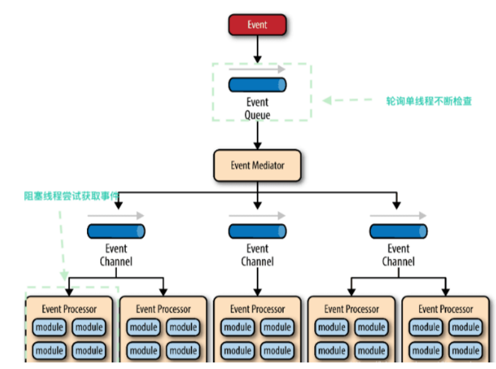
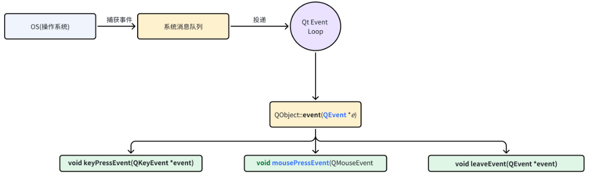
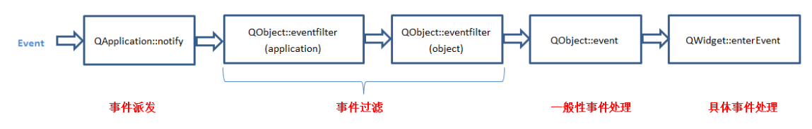
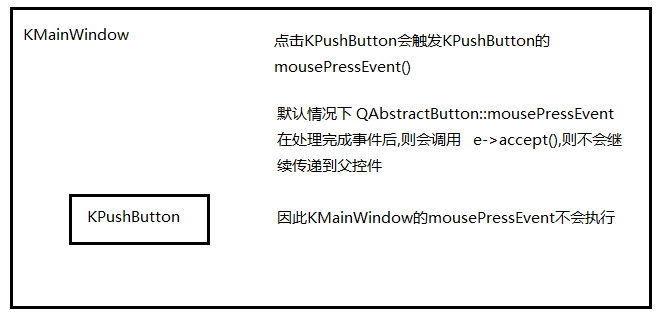
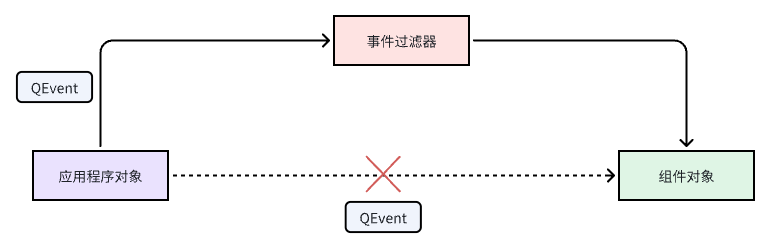

---
title: 【Qt Core 03】事件机制
description: 事件机制
date: 2025-04-02
slug: qt-core_03_event_mechanism
categories:
    - Qt
tags:
    - Qt Core
---


> 以下内容基于Qt 5.15 LTS 官方文档整理


## 事件驱动

- **事件**：事件是用户和应用软件间产生的一个交互操作，由用户操作产生或者系统内部产生，通过事件循环对事件进行处理，事件也可以用来在对象间进行信息交互。
- **事件驱动架构**(Event-Driven Architecture)是一种用于设计应用的软件架构和模型，程序的执行流由外部事件来决定
  - **事件队列**(event queue)：接收事件的入口，存储待处理事件
  - **分发器**(event mediator)：将不同的事件分发到不同的业务逻辑单元
  - **事件通道**(event channel)：分发器与处理器之间的联系渠道
  - **事件处理器**(event processor)：实现业务逻辑，处理完成后会发出事件，触发下一步操作


事件驱动模型的特点:

- 可维护性高：事件驱动模型使得应用程序的代码结构更加清晰，并且易于维护和调试。每个事件都有相应的处理函数，使得代码更加模块化
- 可扩展性强：采用事件驱动模型可以方便地添加新的事件处理函数，并且可以轻松地扩展应用程序的功能。
- 并发性好：事件驱动模型可以方便管理多个事件，并且可以在处理事件时执行异步操作,使得应用程序具有更好的并发性
- 可移植性好：采用事件驱动模型可以使应用程序更容易地在不同的操作系统和平台上移植，从而提高了应用程序的可移植性。


## Qt事件框架



- 用户操作与 GUI 应用程序交互之后,系统内核获取用户动作，产生 OS 消息
- 系统内核会将 OS 消息传递给 Qt 事件处理框架,会转换 事件对象 QEvent,并讲转换后的事件发送给QObject。
- QObject 调用 QObject::event 函数来接收事件，并分发，默认是在当前调用该事件的组件对象接收，若是该组件对象不做任何操作，则可以转给它的父对象来接收。最后会按照事件类型来调用不同的事件处理函数
- 调用 事件处理函数,在事件处理函数中可进行信号的发送
- 调用 槽函数(信号需要与槽函数进行关联)


## 自定义事件处理
Qt 用户自定义处理事件方式

 按照 Qt 事件处理流程,用户自定义处理事件方式如下:
  - 重写特定事件函数mousePressEvent()，keyPressEvent()，paintEvent()
  - 重写实现 Q0bject::event0
  - 安装事件过滤器
  - 在 QApplication 上安装事件过滤器
  - 重新实现 QApplication 的 notify()方法

 在实际应用的过程中,采用 重写特定事件函数 和 安装事件过滤器 的方式居多

其实还有一种方式：自定义事件（继承 QEvent 并发送）
原理：应用程序可通过QCoreApplication::sendEvent()和QCoreApplication::postEvent()发送自定义事件。sendEvent()会立即处理事件，返回时事件已被处理；postEvent()将事件放入队列，在 Qt 主事件循环下次运行时进行调度，且会对一些事件（如多个resize事件、paint事件）进行优化。在对象初始化期间常使用postEvent()，因为对象初始化完成后事件通常会很快被调度。创建自定义事件时，需定义大于QEvent::User的事件编号，可能还需子类化QEvent来传递特定信息。


### 重写特定事件函数
重写特定事件函数是最常用的自定义事件处理方式，下面是案例

```cpp
void CustomButton::mousePressEvent(QMouseEvent* e)
{
	// 自定义处理
	if (event->button() == Qt::LeftButton) {
        // handle left mouse button here
    }
    return QPushButton::mousePressEvent(e);// 调用父类的 mousePressEvent 函数
}
```
这里有1点注意：**在结束时需要调用父类的事件处理函数，如果是故意不写，也应该加上注释**

如果不加，会导致事件传播链中断：
Qt 的事件处理机制中，若子类重写事件函数后未调用父类实现，相当于隐式调用了 event->accept()，事件将停止传播。这可能导致父组件或上层逻辑无法响应事件。
示例：若按钮被放置在父窗口的特定区域，父窗口可能依赖于事件传播实现拖拽等功能，但事件被截断后这些功能将失效。


**qt的事件忽略**

```cpp
void QEvent::ignore() // 表示当前对象忽略事件，该事件会继续传递给父对象
void QEvent::accept() // 表示事件在当前对象中已经处理，不会继续传递到父对象
```



### Qt的事件过滤器
- Qt事件过滤器是一种机制，用于在Qt应用程序中拦截、处理和转发事件。
- 事件过滤器的作用是在 目标对象接收事件之前，对事件进行拦截和处理。
- 通过安装事件过滤器，可以对目标对象的事件进行修改、过滤、转发或者记录，这样可以很方便地实现一些自定义的功能。
- 事件过滤器的优点是可以在不修改目标对象的代码的情况下，对其进行功能扩充




事件过滤器的使用

1. 给目标对象安装过滤器,这里调用 installEventFilter 函数

```cpp
ui->textEdit->installEventFilter(this);  // 在父窗口中监控textEdit的事件[1](@ref)
```

3. 在事件过滤器对象中实现事件过滤器逻辑，这里需要重写  eventFilter 函数

```cpp
bool Widget::eventFilter(QObject *obj, QEvent *event) {
    if (obj == ui->textEdit) {
        if (event->type() == QEvent::Wheel) {
            // 拦截滚轮事件，阻止传递
            return true;
        }
    }
    // 其他事件交给默认处理
    return QWidget::eventFilter(obj, event);
}
//return true：事件被拦截，不再传递给目标对象。
//return false：事件继续传递至目标对象或其父类
```


```cpp
// 自定义过滤器类
class KeyMouseFilter : public QObject {
protected:
    bool eventFilter(QObject *obj, QEvent *event) override {
        if (event->type() == QEvent::KeyPress) {
            QKeyEvent *keyEvent = static_cast<QKeyEvent*>(event);
            qDebug() << "Key pressed:" << keyEvent->key();
            return true;  // 拦截按键
        }
        else if (event->type() == QEvent::MouseButtonPress) {
            qDebug() << "Mouse clicked on" << obj->objectName();
        }
        return false;
    }
};

// 安装到控件
KeyMouseFilter *filter = new KeyMouseFilter;
ui->lineEdit->installEventFilter(filter);
```