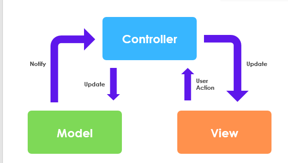
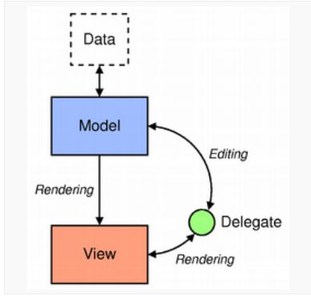
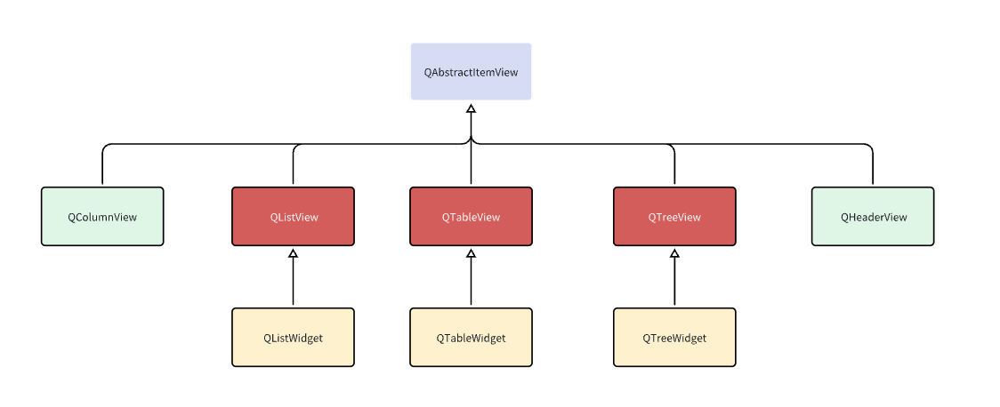
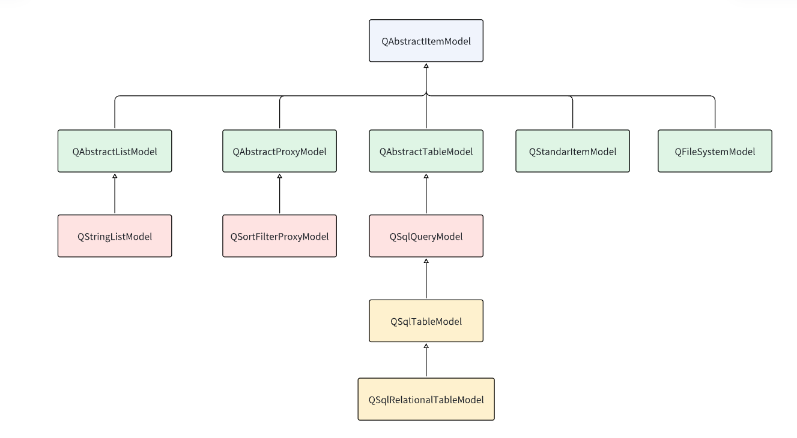
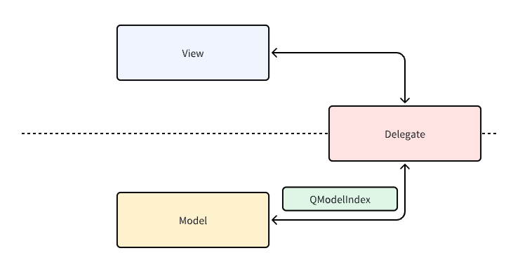
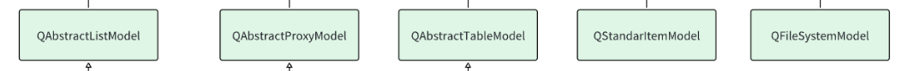
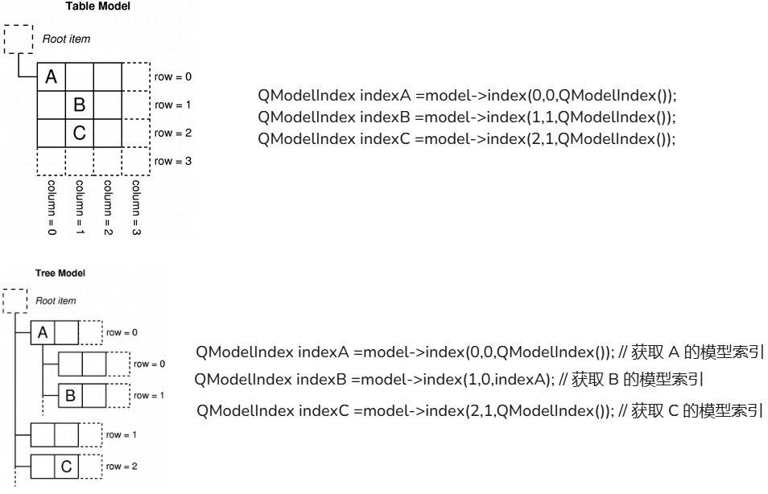
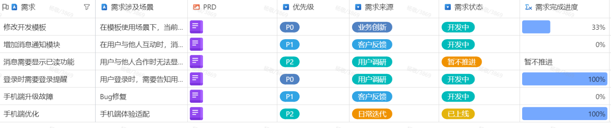
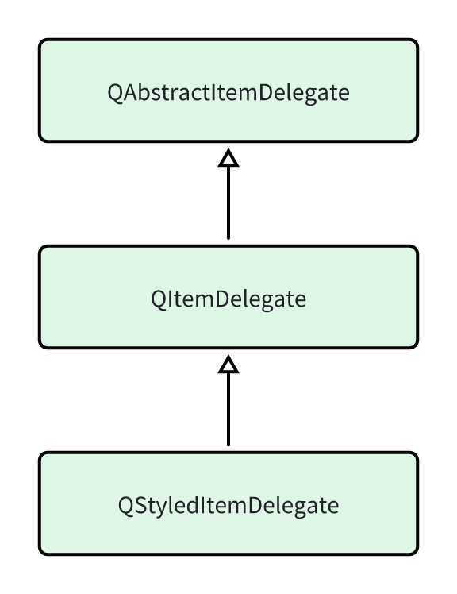

## MVC

模型-视图-控制(MVC) 是源自 Smalltalk 的一种设计模式,在构建用户界面时经常使用。用于将应用程序的数据、逻辑和界面分离，以提高代码可读性、可维护性和可扩展性

- MVC  框架由三个对象组成:

- - Model (模型) :  负责存储和处理数据，通常与数据库进行交互。模型表示应用程序的核心逻辑,例如数据结构、数据处理和存储等
  - View (视图) ：负责显示数据，将模型中的数据可视化。视图是用户与系统交互的接口,通常包括图形用户界面 GUI 或者网页
  - Controller (控制器 ） : 负责接收用户输入，处理用户请求，并更新模型和视图




## QT Model-View

在Qt中，Model-View是一种设计模式，用于将数据（Model）与其可视化表示（View）分离，使得程序更加模块化、可扩展和易于维护。

- Model/View 框架主要包括以下三个组件

- - Model：模型是数据的抽象表示，它负责存储和管理数据。

  - - 模型通常从底层数据源（如数据库、文件或数据结构）获取数据，并将其呈现给视图。


- - View : 视图是数据的可视化表示，它负责呈现模型中的数据。

  - - 视图可以有多种形式，如表格、列表、树状结构等


- -  Delegate :  委托负责处理数据的显示和编辑。委托可以自定义单元格的渲染方式，以及将用户输入的数据写回模型

  -  - 如果用户没有设置委托，则使用默认委托




### View

在  Qt 内部实现了多个可以支持 Model/View 的视图,具体如下: 

| 视图名称    | 描述                                                         | 示例                           |
| ----------- | ------------------------------------------------------------ | ------------------------------ |
| QListView   | 用于显示单列的列表数据，适用于一维数据的操作                 |  |
| QTreeView   | 用于显示树状结构数据，适用于树状结构数据的操作               |  |
| QTableView  | 用于显示表格状数据，适用于二维表格型数据的操作               |  |
| QColumnView | 用于多个QListView显示树状层次结构，树状结构的一层用一个QListView显示。 |  |

它们的继承关系如下图。



### 自定义View


### Model


| 模型                     | 描述                                                         |
| ------------------------ | ------------------------------------------------------------ |
| QStandardItemModel       | 1.通用的数据模型类，可以存储各种类型的数据（如列表、树形结构、表格等）2.是  QAbstractItemModel 的子类，提供了一组用于管理数据项（如添加、删除、修改等）的便捷方法 |
| QStringListModel         | 1.用于存储字符串列表的数据模型类，2.是 QAbstractListModel 的子类，可以方便地管理字符串列表（如添加、删除、修改等3.适用于需要展示和操作字符串列表的场景，如列表框、下拉框 |
| QFileSystemModel         | 用于访问文件系统的数据模型类是 QAbstractItemModel 的子类,可以表示文件系统的目录结构和文件信息适用于需要浏览和操作文件系统的场景，如文件选择器、文件管理器等 |
| QSqlTableModel           | 一个用于访问 SQL 数据库的数据模型类是 QAbstractTableModel 的子类,可以表示 SQL 数据库中的表格数据QSqlTableModel 提供了一组用于查询、插入、更新和删除数据库记录的方法。它适用于需要与 SQL 数据库交互的场景。 |
| QSqlRelationalTableModel | 用于访问带有关系的 SQL 数据库的数据模型类是 QSqlTableModel 的子类，可以表示 SQL 数据库中的关系表格数据QSqlRelationalTableModel 提供了一组用于处理关系字段（如外键）的方法。适用于需要表示和操作关系数据库的场景。 |
| QSortFilterProxyModel    | 代理模型类，用于对其他模型数据进行排序和过滤是 QAbstractProxyModel 的子类,可以作为其他模型（如上述内置模型）的代理，对数据进行排序和过滤QSortFilterProxyModel 适用于需要对数据进行排序和过滤的场景，如表格视图、树形视图等 |




#### Model索引

所有的模型都是统一通过模型索引来访问数据，它用于表示数据模型中特定数据项的位置
模型索引由**QModellndex**类来表示，包含了一个数据项的行、列和父索引信息
关于QModellndex类一些主要特性如下：

- 行和列：QModellndex包含一个数据项在模型中的行和列信息
- 父索引：QModellndex还包含一个父索引l，表示数据项的父项，对于树形结构的模型（如QStandardltemModel或QFileSystemModel特别有用
- 有效性：QModellndex可以是有效或无效的。有效索引表示模型中实际存在的数据项，而无效索引表示一个空或未定义的位置
- 数据访问：通过模型索引，可以访问和操作模型中的数据
- 模型指针：QModellndex包含一个指向其所属模型的指针



获取索引的函数是index，它在这一层定义




```
QAbstracTableMode:
QModelIndex	index(int row, int column, const QModelIndex &parent = QModelIndex()) const override
```




#### 自定义Model

系统的标准模型(QStandardltemModel）主要支持字符串与图标(Qlcon)，对于其他类型支持能力较弱
如果需要显示自定义数据结构，则更好的方式是采用自定义模型，同时对于大量数据的处理，自定义数据模型可以实现数据的按需加载、缓存等策略，以提高视图的性能。

自定义模型基本实现思路：

- 明确自定义模型需要处理的数据结构和特点，如树形结构，列表或者表格
- 根据数据结构的特点，选择合适的基类，下面列举了相应的数据类型对应的比较合适的基类

| 数据结构类型 | 自定义模型基类      |
| ------------ | ------------------- |
| 表格         | QAbstractTableModel |
| 列表         | QAbstractListModel  |
| 通用         | QAbstractItemModel  |


继承这些模型后，需要实现以下函数（不同的模型实现的函数不同）

| 方法原型                                                     | 方法描述                         |
| ------------------------------------------------------------ | -------------------------------- |
| **int rowCount(const QModelIndex& parent) const**            | 返回数据模型的行数               |
| **int columnCount(const QModelIndex& parent = QModelIndex())** | 返回数据模型的列数               |
| **QVariant data(const QModelIndex& index, int role = Qt::DisplayRole) const ;** | 返回指定数据模型中指定单元格数据 |
| QVariant headerData(int section, Qt::Orientation orientation, int role = Qt::DisplayRole | 返回表头数据                     |
| bool setData(const QModelIndex &index, const QVariant &value, int role = Qt::EditRole); | 设置指定索引的项的数据           |
| QModelIndex index(int row, int column, const QModelIndex &parent = QModelIndex()) const; | 返回给定行和列的项的索引         |
| QModelIndex parent(const QModelIndex &child) const;          | 返回给定子项的父项的索引         |
| Qt::ItemFlags flags(const QModelIndex &index) const;         | 返回给定索引的项的标志           |
| bool insertRows(int row, int count, const QModelIndex &parent = QModelIndex()); | 在给定位置插入指定数量的行       |
| bool removeRows(int row, int count, const QModelIndex &parent = QModelIndex()); | 从给定位置移除指定数量的行       |
| bool insertColumns(int column, int count, const QModelIndex &parent = QModelIndex()); | 在给定位置插入指定数量的列       |
| bool removeColumns(int column, int count, const QModelIndex &parent = QModelIndex()); | 从给定位置移除指定数量的列       |


其中最重要的是

 `QVariant data(const QModelIndex& index, int role = Qt::DisplayRole) const ; `

- index 是索引
- role则是角色说明，Qt里有自带的角色说明
  - DisplayRole (0)，这是最基本的角色，通常用来显示文本内容
  - DecorationRole (1)，通常用来显示图标或图片


如果是自定义Model, 最好使用自定义.


数据的更改和增加，可以使用bool insertColumns(int column, int count, const QModelIndex &parent = QModelIndex());  。。。

简易使用自定义函数

```cpp
// 添加一个新的笔画
void StrokeModel::addStroke(const StrokeData& stroke) {
    
    // 通知视图即将插入新行
    beginInsertRows(QModelIndex(), m_strokes.size(), m_strokes.size());
    // 创建新的笔画数据，使用当前样式和时间戳
    StrokeData newStroke = stroke;
    newStroke.style = m_currentStyle;
    newStroke.timestamp = QDateTime::currentMSecsSinceEpoch();
    m_strokes.append(newStroke);  // 添加到笔画列表中
    // 通知视图插入完成
    endInsertRows();
    
    emit strokeAdded(m_strokes.size() - 1);  // 发射笔画添加信号，处理handwriteview的按钮更新
}
```

使用自定义函数就需要关注：**通知**


beginRemoveRows 和 endRemoveRows 主要用于通知视图模型的结构变化（即行的添加或删除）

这对函数主要影响视图的行管理，比如：

- 更新视图的行数

- 更新行的索引

- 更新视图的滚动范围等


dataChanged 信号用于通知视图数据内容的变化

这个信号会触发视图的重绘操作

它告诉视图："这些数据已经改变，你需要重新绘制它们


### Delegate

Qt Delegate 负责数据的编辑和渲染。当用户需要编辑数据时，Delegate负责提供编辑器，同时负责将编辑后的数据写回Model

Qt 内置支持 MVD 模式的组件都是支持 QTableView,QTreeView 都支持默认委托,用于基本数据类型的渲染,包括文本、数字和图像，还有默认编辑组件 QLineEdit

默认委托是由 QStyledItemDelegate 类来进行过描述,继承于QAbstractItemDelegate

当遇到单元格的内容非文本，数字和图像等基本数据类型，则应该考虑自定义 Delegate,如下面应用场景



| 委托类名称          | 描述                                           | 父类                  |
| ------------------- | ---------------------------------------------- | --------------------- |
| QItemDelegate       | 基本的委托类，提供默认的渲染和编辑功能         | QAbstractItemDelegate |
| QStyledItemDelegate | 继承自 QItemDelegate，提供更好的样式支持和性能 | QItemDelegate         |



#### 自定义Delegate

在实现自定义 Delegate 主要方式就是选择合适的 Delegate  基类，并重写实现相应的方法,这里一般选择 QStyledItemDelegate作为基类

| virtual QWidget *createEditor(QWidget *parent, const QStyleOptionViewItem &option, const QModelIndex &index) const | 自定义单元格编辑器组件   |
| ------------------------------------------------------------ | ------------------------ |
| **virtual void paint(QPainter *painter, const QStyleOptionViewItem &option, const QModelIndex &index) const = 0** | 自定义组件绘制           |
| virtual void setEditorData(QWidget *editor, const QModelIndex &index) const | 将模型数据设置到编辑器   |
| virtual void setModelData(QWidget *editor, QAbstractItemModel *model, const QModelIndex &index) const | 将编辑后的数据设置到模型 |
| virtual void updateEditorGeometry(QWidget *editor, const QStyleOptionViewItem &option, const QModelIndex &index) const | 自定义编辑器的几何位置   |

