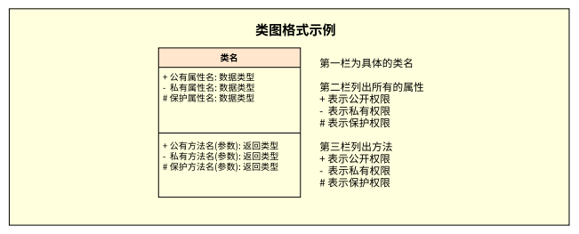
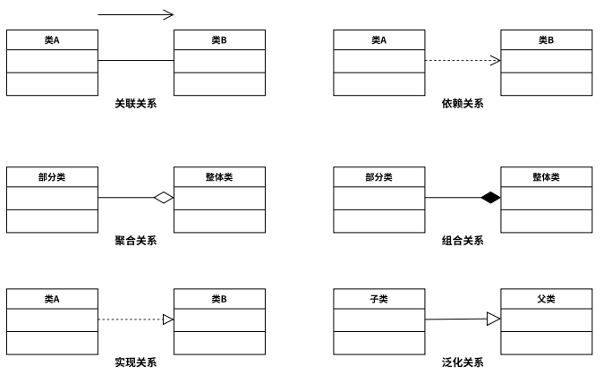

## 需求

### 业务需求

**定义**：反映企业或客户对系统的高层次目标，通常由项目发起人定义

### 用户需求

用户需求：描述的是用户的具体目标，或用户要求系统必须能完成的任务。

### 系统需求

系统需求：从系统角度来说明软件的需求，包括功能需求(系统必须实现的功能)、非功能需求(比如软件的质量，可维护性，效率等等)和设计约束(交付时的一些限制条件，比如必须采用国有自主知识产权的数据库，必须运行在某个操作系统下)等等。

## 需求分析

1. 绘制系统上下文范围关系图：用于定义系统与系统外部实体间界限和接口的简单模型，为需求确定范围；
2. 创建用户界面原型：可以通过快速开发工具开发一个原型或者通过幻灯片、Flash等演示工具制作一个演示原型，甚至可以通过纸笔画出一些关键的界面接口示意图，从而帮助用户更好的理解要解决的问题，理解系统；
3. 分析需求的可行性：对获取到的需求进行成本、性能和技术实现方面的可行性研究，以及是否与其他的需求存在冲突，是否有对外部的依赖等；
4. 确定需求的优先级：是制订选代计划的一个重要的依据，可以使用满意和不满意指标进行说明。满意度表示当需求被实现时用户的满意程度，不满意度表示当需求未被实现时用户的不满意程度；
5. 为需求建立模型：表现形式主要是图表加上少量的文字描述，图形化的描述使需求更加清晰、易懂。需求分析模型主要描述系统的数据、功能、用户界面和运行的外部行为，并不会涉及软件的具体实现细节，同时，为后续的软件设计提供了系统的表示视图；
6. 创建数据字典：对系统用到的所有数据项和结构进行定义，以确保开发人员使用统一的数据定
   义。

## 用例模型分析

### 用例图

你展示的就是一个详细的用例描述（Use Case Description）示例。这是用例文档的标准格式之一，用于详细描述每个用例的具体信息。让我解释一下用例描述的各个组成部分：

### 用例描述

1. **用例名称**：用例的唯一标识符和名称
   - 例：发布帖子

2. **简要说明**：对用例功能的简短描述
   - 例：用户发布新帖子，同时增加对应版块帖子数量

3. **事件流（基本流程）**：描述用例的主要步骤
   - 用户的操作步骤
   - 系统的响应步骤
   - 按照时间顺序排列

4. **备选事件流（替代流程）**：描述可能的异常情况和处理方式
   - 例：如果标题为空，系统提示错误

5. **非功能需求**：与该用例相关的性能、安全等要求

6. **前置条件**：执行用例前必须满足的条件
   - 例：用户必须登录系统

7. **后置条件**：用例执行完成后的系统状态
   - 例：更新帖子数量统计

8. **扩展点**：用例可能的扩展或变化点

9. **优先级**：用例的重要程度
   - 可以用数字或描述表示

模版：

| 用例名称   | 发布帖子                                                     |
| ---------- | ------------------------------------------------------------ |
| 简要说明   | 用户发布新帖，同时增加对应版块帖子数量                       |
| 事件流     | 1. 用户向系统发出发布新贴请求 2. 系统展示编辑新帖界面 3. 用户选择对应的版块类别，写入帖子标题与正文，并提交 4. 系统检查版块类别、标题、正文是否有效 5. 系统将所输入的信息存储建档，帖子发布成功 |
| 备选事件流 |                                                              |
| 非功能需求 | 无                                                           |
| 前置条件   | 用户必须登录系统进行权限校验                                 |
| 后置条件   | 修改对应版块下帖子的数量，修改用户发帖数                     |
| 扩展点     | 无                                                           |
| 优先级     | 最高(满意度5，不满意度5)                                     |

## 数据模型分析

### E-R图

### 类图

**1. 发现概念类**

概念类：模型中可以代表事物与概念的对象。
OOA的主要任务就是找到系统中的对象和类，这些类将反映到OOD中的软件类和OOP中具体的实
现类。
发现类的方式有很多种，其中应用最广泛的是名词短语法，具体步骤如下：

- 阅读和理解需求文档或用例描述
- 筛选出名词或名词短语，建立初始类清单(候选类)

- 将候选类分为三类：分别是显而易见的类，明显无意义的类和不确定类别的类

- 舍弃明显无意义类别的类
- 小组讨论不确定类别的类，直到把他们合并或调整到其他两个类别。

**2. 确定类和类的关系**

当完成了类的寻找工作之后，就是理清这些类之间的关系，类之间的关系有：关联、依赖、泛化、聚合、组合和实现。

**3. 画图**

