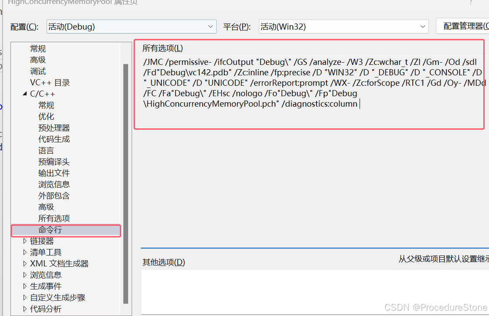

## 单例模式
单例模式是指在内存只会创建且仅创建一次对象的设计模式，确保在程序运行期间只有唯一的实例。


## 使用场景
**当对象需要被共享的时候又或者某类需要频繁实例化.**


- 设备管理器，系统中可能有多个设备，但是只有一个设备管理器，用于管理设备驱动;
- 数据池，用来缓存数据的数据结构，需要在一处写，多处读取或者多处写，多处读取;
- 回收站,在整个系统运行过程中，回收站一直维护着仅有的一个实例;
- 应用程序的日志应用，一般都何用单例模式实现，这一般是由于共享的日志文件一直处于打开状态，因为只能有一个实例去操作，否则内容不好追加;
- 网站的计数器，一般也是采用单例模式实现，否则难以同步。


**实际开发中，如果不是完美符合使用场景，不推荐使用。**
如果实际开发经验不够，很容易看什么都是单例。

## c++实现
单例模式的关键点：创建且仅创建一次对象
2个关键点：
1. 如何只创建一次？
2. 如何禁止拷贝和赋值？（保证只有一个）

### 静态局部变量
对于1：这很容易想到**静态局部变量**
当一个函数中定义一个局部静态变量，那么这个局部静态变量只会初始化一次，就是在这个函数第一次调用的时候，以后无论调用几次这个函数，函数内的局部静态变量都不再初始化。

对于2：可以将拷贝构造和赋值重载设置位私有成员。

综上，我们可以得到第一个版本
```cpp
class Singleton1 
{
public:
    static Singleton1& getInstance()
    {
        static Singleton1 s_single;
        return s_single;
    }
private:
    Singleton1() = default;
    Singleton1(const Singleton1&) = delete;
    Singleton1& operator=(const Singleton1&) = delete;
};
```
上述版本的单例模式在C++11 以前存在多线程不安全的情况，多个线程同时执行这段代码，**编译器可能会初始化多个静态变量**。

magic static, 它是C++11标准中提供的新特性
- 如果在初始化变量时控制同时进入声明，则并发执行应等待初始化完成。
- 如果当变量在初始化的时候，并发同时进入声明语句，并发线程将会阻塞等待初始化结束。

即c++规定各厂商优化编译器，能保证线程安全。所以为了保证运行安全请确保使用C++11以上的标准。


`/Zc:threadSafeInit` 是 Microsoft Visual Studio 编译器中的一个编译选项，作用是启用线程安全的静态局部变量初始化。这个选项对于 C++11 引入的“magic statics”（线程安全的静态局部变量）机制尤为重要。
当启用 `/Zc:threadSafeInit`（默认在 C++11 及更高标准中启用）时，编译器会确保静态局部变量的初始化是线程安全的。这意味着如果多个线程首次访问同一个静态局部变量，编译器会保证该变量只被初始化一次，并确保其他线程可以看到初始化后的正确值。
VS2015+：默认启用线程安全初始化（等效于主动设置 /Zc:threadSafeInit）。
VS2013 及之前：不启用线程安全初始化，需手动加锁或升级编译器

在项目- 属性 - C/C++ -命令行里可以查看。如果想禁用，输入`/Zc:threadSafeInit-`


实际开发中一定要注意是否遵循规定。
如果遵循，推荐使用静态局部变量的方式，又简单又安全。


### 饿汉式（线程安全）
>饿汉式：程序启动即初始化

在C++11 推出以前，局部静态变量的方式实现单例存在线程安全问题，所以部分人提出了一种方案，就是在主线程启动后，其他线程没有启动前，由主线程先初始化单例资源，这样其他线程获取的资源就不涉及重复初始化的情况了。

```cpp
//饿汉式初始化
class Singleton2
{
public:
    static Singleton2* getInstance()
    {
        if (s_single == nullptr)
        {
            s_single = new Singleton2();
        }
        return s_single;
    }
private:
    Singleton2() = default;
    Singleton2(const Singleton2&) = delete;
    Singleton2& operator=(const Singleton2&) = delete;

    static Singleton2* s_single;
};
Singleton2* Singleton2::s_single = Singleton2::getInstance();
```
虽然从使用的角度规避多线程的安全问题，但是又引出了很多问题，如1. 启动即初始化，可能导致程序启动时间延长。2. 从规则上束缚了开发者

### 懒汉式（线程安全）
>懒汉式：需要时即初始化

事例何时初始化应该由开发者决定。因此我们使用懒汉式初始化。但懒汉式初始化存在线程安全问题，即资源的重复初始化，因此，我们需要加锁。

```cpp
#include <mutex>
class Singleton3
{
public:
    static Singleton3* getInstance()
    {
        //这里不加锁判断，提高性能
        if (s_single != nullptr)
        {
            return s_single;
        }
        s_mutex.lock();//1处
        if (s_single != nullptr) //2处
        {
            s_mutex.unlock();
            return s_single;
        }
        s_single = new Singleton3();//3处
        s_mutex.unlock();
        return s_single;
    }
private:
    Singleton3() = default;
    Singleton3(const Singleton3&) = delete;
    Singleton3& operator=(const Singleton3&) = delete;

    static Singleton3* s_single;
    static std::mutex s_mutex;
};
Singleton3* Singleton3::s_single = nullptr;
std::mutex Singleton3::s_mutex;
```
为什么2处要加一个判断呢？
假如现在有线程A, B同时调用getInstance()
1. 此时s_single == nullptr， A和B同时进入1处，假设A加上锁，B等待
2. A执行完3处的命令后，通过s_mutex.unlock()解锁，此时B加上锁。
3. 如果没有2处，B会再执行一遍3处，这会导致内存泄漏，而加上2处后，B会判断s_single != nullptr, 解锁返回

###  懒汉式（线程安全）+ 智能指针
但这还没完，懒汉式相比饿汉式有一个最大的不同：不确定是哪个线程初始化的。那之后由谁析构呢？
其实不必操心，我们可以利用c++的RAIII，使用智能指针。

```cpp
#include <mutex>
class Singleton3
{
public:
    static std::shared_ptr<Singleton3> getInstance()
    {
        if (s_single != nullptr)
        {
            return s_single;
        }
        s_mutex.lock();
        if (s_single != nullptr)
        {
            s_mutex.unlock();
            return s_single;
        }
        s_single = std::shared_ptr<Singleton3>(new Singleton3);
        s_mutex.unlock();
        return s_single;
    }
private:
    Singleton3() = default;
    Singleton3(const Singleton3&) = delete;
    Singleton3& operator=(const Singleton3&) = delete;

    static std::shared_ptr<Singleton3> s_single;
    static std::mutex s_mutex;
};
std::shared_ptr<Singleton3> Singleton3::s_single = nullptr;
std::mutex Singleton3::s_mutex;
```

有些人认为虽然智能指针能自动回收内存，如果有开发人员手动delete指针怎么办？将析构函数设为私有，为智能指针添加**删除器**。

```cpp
#include <mutex>
class Singleton3
{
public:
    static std::shared_ptr<Singleton3> getInstance()
    {
        if (s_single != nullptr)
        {
            return s_single;
        }
        s_mutex.lock();
        if (s_single != nullptr)
        {
            s_mutex.unlock();
            return s_single;
        }
        s_single = std::shared_ptr<Singleton3>(new Singleton3, [](Singleton3* single) {
            delete single;
            });
        s_mutex.unlock();
        return s_single;
    }
private:
    Singleton3() = default;
    ~Singleton3() = default; //析构私有
    Singleton3(const Singleton3&) = delete;
    Singleton3& operator=(const Singleton3&) = delete;

    static std::shared_ptr<Singleton3> s_single;
    static std::mutex s_mutex;
};
std::shared_ptr<Singleton3> Singleton3::s_single = nullptr;
std::mutex Singleton3::s_mutex;
```

---


上面的代码仍然存在危险，主要原因在于new操作是由三部分组成的
1. 分配内存
在第一个阶段，new 操作会调用内存分配函数（默认是 operator new），在堆上为新对象分配足够的空间。如果内存分配失败，通常会抛出 std::bad_alloc 异常。

2. 调用构造函数
分配到内存后，new 操作会在刚刚分配的内存上调用对象的构造函数，初始化该对象的各个成员。构造函数的参数可以在 new 语句中直接传递。

3. 返回指针
构造函数执行完毕后，new 操作会返回一个指向新创建对象的指针。如果是 new[] 操作符（即分配数组），则返回指向数组起始元素的指针

这里的问题就再2和3的顺序上，有些编译器会优化，将2和3的顺序颠倒。

```cpp
    static Singleton3* getInstance()
    {
        if (s_single != nullptr) //1处
        {
            return s_single;
        }
        s_mutex.lock();
        if (s_single != nullptr) 
        {
            s_mutex.unlock();
            return s_single;
        }
        s_single = new Singleton3();//2处
        s_mutex.unlock();
        return s_single;
    }
```
如果2和3的顺序颠倒，那么顺序变为
1.分配内存
3.返回指针
2.调用构造
可能出现下面的情况：
线程A执行到2处的new的第3步，此时s_single已经不为空，但是指向的对象还未调用构造。
线程B刚好执行1处，此时s_single != nullptr, 直接返回s_single。**外部将接受到一个还没来的及调用构造函数的对象的指针。**


为解决这个问题，C++11 推出了std::call_once函数保证多个线程只执行一次
### 懒汉式(线程安全)+智能指针+call_once
`std::call_once `是 C++11 引入的一个函数，用于保证某段代码在多线程环境中只被执行一次。这对单例模式、懒加载或只需执行一次的初始化操作非常有用。
`std::call_once` 与一个` std::once_flag` 对象配合使用。`std::once_flag` 是一个标志，确保 `std::call_once` 所调用的函数只会执行一次，不论有多少个线程试图同时调用它。
```cpp
#include <mutex>
class Singleton
{
public:
    static std::shared_ptr<Singleton> getInstance()
    {
        static std::once_flag s_flag;
        std::call_once(s_flag, [&]() {
            s_single = std::shared_ptr<Singleton>(new Singleton, [](Singleton* single) {
                delete single;
                });
            });
        return s_single;
    }
private:
    Singleton() = default;
    ~Singleton() = default; //析构私有
    Singleton(const Singleton&) = delete;
    Singleton& operator=(const Singleton&) = delete;

    static std::shared_ptr<Singleton> s_single;
};
std::shared_ptr<Singleton> Singleton::s_single = nullptr;
```


###  懒汉式(线程安全)+智能指针+call_once+CRTP
为了让单例类更通用，可以通过继承实现多个单例类。
注：这里需要使用c++的CRTP（奇异递归模板模式），不知道是什么，自己查一下。


```cpp
#include <mutex>
template<typename T>
class Singleton
{
public:
    static std::shared_ptr<T> getInstance()
    {
        static std::once_flag s_flag;
        std::call_once(s_flag, [&]() {
            s_instance = std::shared_ptr<T>(new T);
            });
        return s_instance;
    }
protected: 
    Singleton() = default;
    Singleton(const Singleton<T>&) = delete;
    Singleton& operator=(const Singleton<T>&) = delete;

    static std::shared_ptr<T> s_instance;
};
template<typename T>
std::shared_ptr<T> Singleton<T>::s_instance = nullptr;


class A :public Singleton<A> //CRTP
{
    friend class Singleton<A>;
public:
    //...

};
```

`friend class Singleton<A>;`的目的是允许 `Singleton<A>` 类访问 A 的受保护构造函数。没有这个 friend 声明，`Singleton<A> `将无法调用 A 的构造函数，从而无法在 `getInstance` 方法中正确地创建 A 的实例。

