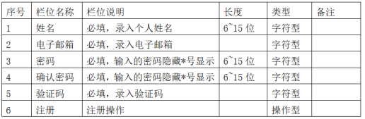
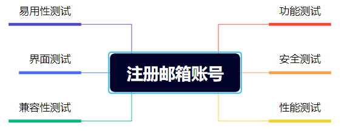
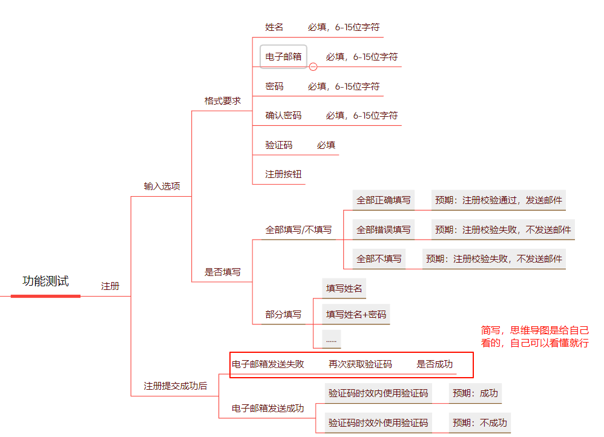
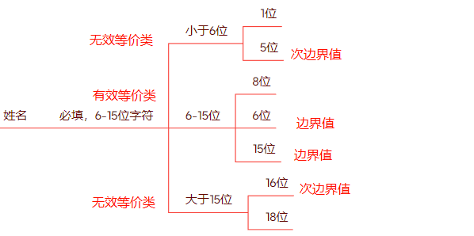

## 测试用例

测试用例（TestCase）是为了实施测试而向被测试的系统提供的一组集合，这组集合包含：测试环境、操作步骤、测试数据、预期结果等要素。

## 设计思想

**工具选择：**

- 过去的方式：Excel

- 现在的方式：思维导图

**设计思想：**

正确设计测试用例的思想：**常规思维+逆向思维+发散性思维**
设计测试用例的原则二：

1. 测试用例的编写不仅应当根据有效和预料到的输入情况，而且也应该根据无效和未预料到的输入情况。
2. 检查程序是否“未做其应该做的”仅是成功的一半，测试的另一半是检查程序是否“做了其不应该做的”。(是上一条原则的必然结果)
3. 计划测试工作时不应默许假定不会发现错误。

## 设计方法

设计测试用例的万能公式：**功能测试+界面测试+性能测试+兼容性测试+易用性测试+安全测试**

**特殊测试：弱网测试，安装和卸载测试**

### 基于需求的设计方法

基于需求的设计方法也是总的设计测试用例的方法，在工作中，我们需要参考需求文档/产品规格说明书来设计测试用例。
测试人员接到需求之后，要对需求进行分析和验证，从合理的需求中进一步分析细化需求，从细化的需求中找出测试点，根据这些测试点再去设计测试用例。
以该注册邮箱账号需求为例，我们来设计测试用例。

需求如下：

根据万能公式，我们可以设计出基本的轮廓

以功能测试为例：

> 上面的内容不包含具体的测试用例

### 具体用例的设计方法

#### 等价类和边界值法

上面的格式要求：6-15位字符，我们如何测试呢？分别测试6,7,8……15位吗。如果是6-1500位字符呢？显然穷举很麻烦， 我们采用方法是等价类。

依据需求将输入（特殊情况下会考虑输出）划分为若干个等价类，从等价类中选出一个测试用例，如果这个测试用例测试通过，则认为所代表的等价类测试通过，这样就可以用较少的测试用例达到尽量多的功能覆盖，解决了不能穷举测试的问题。

**等价类**分类：

- 有效等价类：对于程序的规格说明书是合理的、有意义的输入数据构成的集合，利用有效等价类验证程序是否实现了规格说明中所规定的功能和性能
- 无效等价类：根据需求说明书，不满足需求的集合。

6-15位则可以划为 

- 有效等价类：[6, 15]
- 无效等价类：[0, 6)  (15 正无穷)

但这还是几个区间，如何设计具体的值？**边界值法**

边界值分析法就是对输入或输出的边界值进行测试的一种黑盒测试方法。通常边界值分析法是作为对等价类划分法的补充，这种情况下，其测试用例来自等价类的边界。

边界值包含: **边界值、次边界值**

[6, 15]

- 边界值为 6， 15
- 次边界值为5，16

#### 正交法

location / {
    #将该路径替换为您的网站根目录。
    root   /root/workspace/myblog-source/public/;
    #添加默认首页信息
    index  index.html index.htm;
}

root /root/workspace/myblog-source/public; 

server {

  listen 80;           # 监听HTTP默认端口

  server_name _;         # 使用IP访问时保留_，若绑定域名则替换为域名

  root /root/workspace/myblog-source/public;   # 替换为Hugo生成的public目录绝对路径

  index index.html index.htm;   # 指定默认索引文件

  

  location / {

​    try_files $uri $uri/ =404; # 尝试匹配文件或目录，否则返回404

  }

}  
