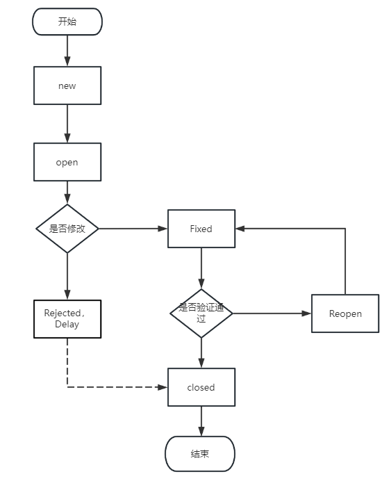

## Bug

定义：一个计算机bug指在计算机程序中存在的一个错误(error)、缺陷(flaw)、疏忽(mistake)或者故障（fault)，这些bug使程序无法正确的运行。Bug产生于程序的源代码或者程序设计阶段的疏忽或者错误。

### Bug的描述

描述bug的基本要素：问题出现的版本、问题出现的环境、问题出现的步骤、预期结果、实际结果、解决方案（可以不提）

案例：

**问题出现的版本**：谷歌浏览器版本123.0.6312.123（正式版本）(64位)
**问题出现的环境**：Windows家庭版
**问题出现的步骤**：
1、打开谷歌浏览器，输入网址https://www.101eduyun.com/
2、等待首页页面渲染完成
**预期结果**：二维码与登陆模块不会出现遮挡，二维码可以正常扫描
**实际结果**：二维码被登陆模块遮挡，二维码扫描失败

### Bug的级别

bug级别⼀般分为：崩溃、严重、⼀般、次要。具体参考公司的Bug文档

### Bug的流程

