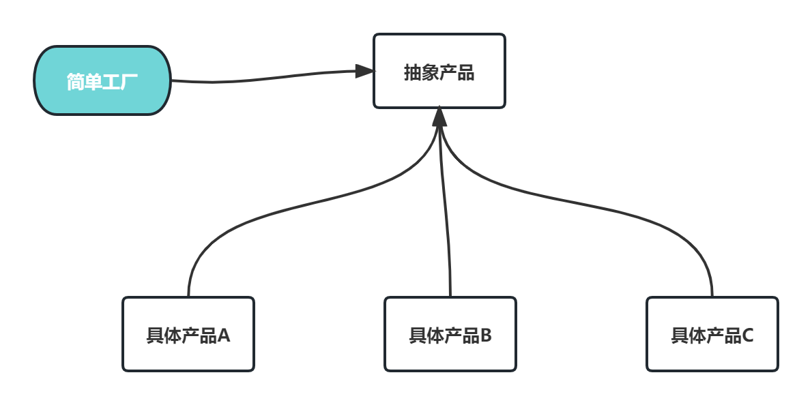
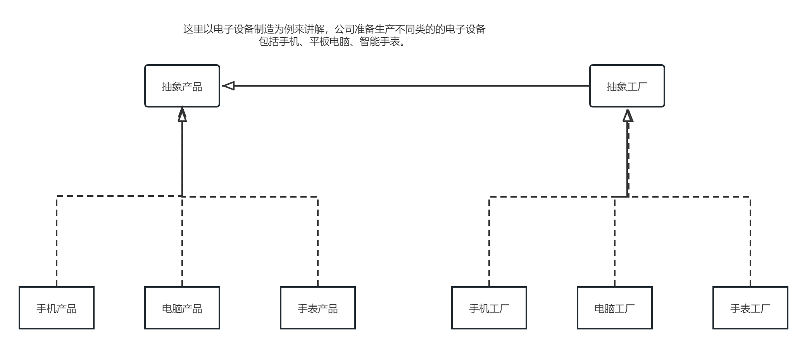
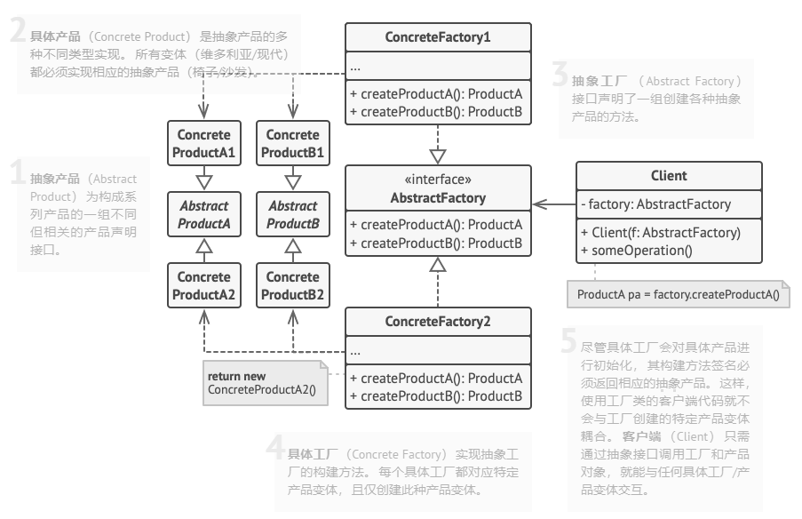
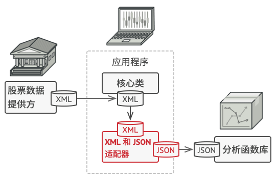

编写软件过程中，程序员面临着来自耦合性，内聚性以及可维护性，可扩展性，重用性，灵活性等多方面的挑战，设计模式是为了让程序(软件)，具有更好特性。

- 代码复用性(即:相同功能的代码，不用多次编写)

- 可读性(即:编程规范性，便于其他程序员的阅读和理解)

- 可扩展性(即:当需要增加新的功能时，非常的方便，称为可维护)4)可靠性(即:当我们增加新的功能后，对原来的功能没有影响)5)使程序呈现高内聚，低耦合的特性


# 七大原则

1. 开闭原则
2. 依赖倒转(倒置)原则
3. 单一职责原则
4. 接口隔离原则
5. 里氏替换原则
6. 迪米特法则
7. 合成复用原则


## 开闭原则 *

Open-Closed Principle, OCP 

- **对扩展开放，对更改关闭。**


## 单一职责原则 *

Simple Responsibility Pinciple，SRP

- 不要存在多余一个导致类变更的原因。一个类应该应该只负责一项职责。

- 每个应该实现单一职责，否则就应该把类拆分，便于后期的维护


## 依赖倒转(倒置)原则

Dependence Inversion Principle,DIP

- 高层模块(稳定)不应该依赖于底层模块(变化),二者都应该依赖于抽象(稳定)

- 抽象(稳定)不应该依赖于实现细节(变化),实现细节应该依赖于抽象(稳定).


**数据库操作**

假设你有一个高层模块（比如用户管理模块），它需要访问数据库执行增、删、改、查操作。如果在不遵守依赖倒转原则的情况下，用户管理模块直接依赖于具体的数据库实现（例如 MySQL 操作），那么这个模块就与数据库紧密耦合，不利于扩展和测试。

**应用DIP：**

- **高层模块**：用户管理模块定义一个接口 `IDatabase`，负责所有与数据库相关的操作。
- **低层模块**：具体的数据库实现类（如 `MySQLDatabase` 或 `PostgreSQLDatabase`）实现 `IDatabase` 接口。


**支付接口集成**

假设你的系统支持多种支付方式（如支付宝、微信支付、银行卡支付等），如果每次增加一种支付方式都需要修改支付处理的高层逻辑，就会导致代码的耦合度增加，违反了单一职责和开闭原则。

**应用DIP：**

- **高层模块**：支付处理模块定义一个 `IPaymentProcessor` 接口。
- **低层模块**：每种支付方式都实现 `IPaymentProcessor` 接口。


## 里氏替换原则

Liskov Substitution Principle,LSP

- 通俗的来讲就是子类可以扩展父类的功能，但不能改变父类原有的功能。【尽量不用重写父类的方法】


动物类和鸟类

假设有一个 `Animal` 类，它有一个 `move` 方法，表示动物的移动方式。`Bird` 类继承自 `Animal` 类，并且需要实现 `move` 方法来表示鸟类的飞行。这里的问题是，如果我们在 `Bird` 类中强行调用 `move` 方法来表示飞行，就可能出现不符合预期的行为，尤其是当 `Bird` 类具有一些不适用于其他动物的行为时。

如果我们使用 LSP 来设计这个问题，应该将 `move` 方法根据动物的类型进行抽象，避免让所有的动物都遵循同样的 `move` 行为。我们可以将动物分为两类，`Flyable` 和 `Swimmable`，分别定义 `fly` 和 `swim` 方法。

```
class Animal {
public:
    virtual void sound() = 0; // 动物发出声音
};

class Flyable {
public:
    virtual void fly() = 0; // 可以飞的动物
};

class Swimmable {
public:
    virtual void swim() = 0; // 可以游泳的动物
};
```


## 接口隔离原则

Interface Segregation Principle,ISP

- 使用多个专门的接口，而不使用单一的总接口，不应该强迫客户程序依赖它们不用的方法

- 接口尽量细化，同时接口中的方法尽量少并且完备

（注：这里和"单一职责"是有区别的,单一职责强调类的职责单一，站在业务逻辑的角度，这里强调的是接口，要求接口的方法尽可能的少而完备）

符合我们常说的**高内聚低耦合**的设计思想，从而使得类具有很好的可读性、可扩展性和可维护性


## 迪米特法则

迪米特原则（Law of Demeter LoD）是指一个对象应该对其他对象保持最少的了解，又叫**最少知道原则**（Least Knowledge Principle,LKP），尽量降低类与类之间的耦合。迪米特原则主要强调只和朋友交流，不和陌生人说话。出现在成员变量、方法的输入、输出参数中的类都可以称之为成员朋友类，而出现在方法体内部的类不属于朋友类。


## 合成复用原则

合成复用原则的主要观点是，应该优先考虑使用组合，即将现有的类对象作为新类的成员变量，而不是继承已有的类

**但是组合是否优于继承完全取决实际情况。**


# 设计模式


## 单例模式 *

单例模式确保其一个类只有一个实例，而且自行实例化并向整个系统提供单个对象的模式。单例模式只应在有真正的“单一实例”的需求时才可使用。


单例模式很常用，但也特别容易用错。一定要明确 单一实例的应用场景


## 工厂模式 *

工厂模式将目的创建对象的具体过程屏蔽隔离起来，从而达到更高的灵活性，工厂模式可以分为三类：

-  简单工厂模式(Simple Factory)
- 工厂方法模式(Factory Method)
- 抽象工厂模式(Abstract Factory)


一般用一下简单工厂就可以了


**简单工厂**

简单工厂模式就是一个工厂类根据传入的参数决定创建出哪一类产品类的实例，被创建的实例具有共同的父类或接口。



举例：聊天消息


**工厂方法**

工厂方法模式：它也被叫做工厂模式。工厂父类负责定义创建产品对象的公共接口，而工厂子类则负责生成具体的产品对象，这样做的目的是将产品类的实例化操作延迟到工厂子类中完成，即通过工厂子类来确定究竟应该实例化哪一个具体产品类。

工厂方法相对于简单工厂来说，就是把单一的工厂类，分成了多个具体的小厂，并抽象出一个工厂接口，这个接口只负责创建的方法，具体创建的过程由小工厂完成。




**抽象工厂**

抽象工厂模式是工厂方法的仅一步深化，在这个模式中的工厂类不单单可以创建一个对象，而是可以创建一组对象。这是和工厂方法最大的不同点。

(这个模式最不好理解，而且在实际应用中局限性也蛮大的，因为这个模式并不符合开闭原则。实际开发还需要做好权衡。)




## 建造者模式

建造者模式（Builder Pattern）是一种创建型设计模式，它允许使用多个简单的对象一步步构建成一个复杂的对象。建造者模式使得对象的创建过程独立于对象的组成部分以及如何组合它们。

**建造者模式的常见场景**：

- 当一个对象的构建过程中有多个步骤，且这些步骤的顺序、类型可能不同。
- 对象的构建过程独立于其组成部分的实现和顺序。


总结：分段初始化


## 适配器模式

其实就和转接口一样



## 策略模式 *

策略模式的作用就是把具体的算法实现从业务逻辑中剥离出来，成为一些列独立算法，使得它们可以相互转换。

- 当你有多个算法可以完成某项任务，而且这些算法的使用在不同的情况下是可替换的。

- 你希望避免使用多个条件语句（`if` 或 `switch`）来选择某个算法或行为


支付方式选择

假设你正在开发一个在线支付系统，用户可以选择不同的支付方式（如信用卡、支付宝、微信支付）。在这种情况下，使用策略模式可以帮助你避免在每个支付方式中编写大量的条件判断。

```cpp
#include <iostream>
#include <string>
#include <memory>

// 策略接口：支付方式
class PaymentStrategy {
public:
    virtual void pay(double amount) = 0;  // 每种支付方式的具体实现
    virtual ~PaymentStrategy() = default;
};

// 具体策略：信用卡支付
class CreditCardPayment : public PaymentStrategy {
public:
    void pay(double amount) override {
        std::cout << "Paying " << amount << " using Credit Card." << std::endl;
    }
};

// 具体策略：支付宝支付
class AlipayPayment : public PaymentStrategy {
public:
    void pay(double amount) override {
        std::cout << "Paying " << amount << " using Alipay." << std::endl;
    }
};

// 具体策略：微信支付
class WeChatPayment : public PaymentStrategy {
public:
    void pay(double amount) override {
        std::cout << "Paying " << amount << " using WeChat." << std::endl;
    }
};

// 上下文：订单类，负责选择支付方式
class Order {
public:
    // 可以动态改变支付策略
    void setPaymentStrategy(std::shared_ptr<PaymentStrategy> strategy) {
        paymentStrategy = strategy;
    }

    // 执行支付
    void processPayment(double amount) {
        paymentStrategy->pay(amount);
    }

private:
    std::shared_ptr<PaymentStrategy> paymentStrategy;
};

```


## 观察者模式 *

观察者模式（Observer Pattern）是一种行为型设计模式，它定义了一种一对多的依赖关系，允许多个观察者对象同时监听某一个主题对象的状态变化。当主题对象的状态发生变化时，所有依赖于它的观察者都会得到通知并自动更新。

- 当一个对象的状态变化需要同时影响到多个对象，并且这些对象之间存在松散耦合关系时。

- 事件驱动系统，或某个状态变化会引发其他对象的行为（例如GUI界面中的按钮点击、发布订阅系统等）。

**天气预报系统**

假设我们正在设计一个天气预报系统，其中有多个显示屏（例如当前天气显示、统计显示、热力图显示等），当天气状态变化时，所有显示屏都需要更新自己的信息。我们可以使用观察者模式来解决这个问题。

```cpp
#include <iostream>
#include <vector>
#include <string>

// 观察者接口
class Observer {
public:
    virtual void update(float temperature, float humidity, float pressure) = 0;
    virtual ~Observer() = default;
};

// 被观察者接口（主题接口）
class Subject {
public:
    virtual void registerObserver(Observer* observer) = 0;
    virtual void removeObserver(Observer* observer) = 0;
    virtual void notifyObservers() = 0;
    virtual ~Subject() = default;
};

// 具体主题类：天气数据
class WeatherData : public Subject {
public:
    void registerObserver(Observer* observer) override {
        observers.push_back(observer);
    }

    void removeObserver(Observer* observer) override {
        observers.erase(std::remove(observers.begin(), observers.end(), observer), observers.end());
    }

    void notifyObservers() override {
        for (Observer* observer : observers) {
            observer->update(temperature, humidity, pressure);
        }
    }

    // 设置天气数据，并通知观察者
    void setMeasurements(float temp, float hum, float pres) {
        temperature = temp;
        humidity = hum;
        pressure = pres;
        notifyObservers();
    }

private:
    std::vector<Observer*> observers;
    float temperature;
    float humidity;
    float pressure;
};

// 具体观察者类：当前天气显示
class CurrentConditionsDisplay : public Observer {
public:
    CurrentConditionsDisplay(Subject* weatherData) {
        this->weatherData = weatherData;
        weatherData->registerObserver(this);
    }

    void update(float temperature, float humidity, float pressure) override {
        this->temperature = temperature;
        this->humidity = humidity;
        display();
    }

    void display() {
        std::cout << "Current conditions: " << temperature << "°C and " << humidity << "% humidity\n";
    }

private:
    float temperature;
    float humidity;
    Subject* weatherData;
};

// 具体观察者类：统计天气显示
class StatisticsDisplay : public Observer {
public:
    StatisticsDisplay(Subject* weatherData) {
        this->weatherData = weatherData;
        weatherData->registerObserver(this);
    }

    void update(float temperature, float humidity, float pressure) override {
        this->temperature = temperature;
        this->humidity = humidity;
        display();
    }

    void display() {
        std::cout << "Statistics: " << temperature << "°C, " << humidity << "% humidity\n";
    }

private:
    float temperature;
    float humidity;
    Subject* weatherData;
};

// 客户端代码
int main() {
    // 创建一个天气数据对象
    WeatherData weatherData;

    // 创建观察者对象
    CurrentConditionsDisplay currentDisplay(&weatherData);
    StatisticsDisplay statisticsDisplay(&weatherData);

    // 模拟天气变化
    std::cout << "Setting new weather measurements...\n";
    weatherData.setMeasurements(30.4f, 65.0f, 1012.0f);
    std::cout << "\nSetting new weather measurements...\n";
    weatherData.setMeasurements(25.0f, 70.0f, 1010.0f);

    return 0;
}
```

