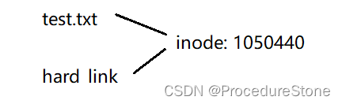

## 文件

在谈文件系统前，首先谈谈什么是文件？

### 文件结构体

文件 = 属性 + 内容
同进程PCB，linux也有管理文件属性的结构体

- **struct file**：描述文件的打开状态，每次打开文件都会创建一个 file 结构，主要记录与进程操作文件相关的信息（如文件指针位置、打开模式等）。
- **struct inode**：描述文件在磁盘或文件系统中的元数据，无论文件是否被打开，inode 都存在。

- **struct stat**：用于在**用户空间**访问文件的属性信息，系统调用通过从 inode 获取属性并填充到 struct stat 中

本文重点在前2个

### 文件的权限

文件权限
每个文件和目录在 Linux 中都有三类权限，分别是：

- 所有者（Owner）
- 所属组（Group）
- 其他用户（Others）

每类权限又分为三种操作权限：

- 读（r，read）：允许查看文件内容或列出目录内容。
- 写（w，write）：允许修改文件内容或在目录中创建、删除文件。
- 执行（x，execute）：允许执行文件（如果是可执行程序）或访问目录中的文件。

这些权限被表示为一个 9 位的二进制组合，如下：

`rwxrwxrwx`

- 前三个字符表示文件的所有者权限。
- 中间三个字符表示文件的所属组权限。
- 最后三个字符表示其他用户的权限。

有权限则对应的二进制位为1
例如，文件权限 755 表示：`rwxr-xr-x`

**文件掩码**（umask）用于决定在创建文件或目录时默认权限会被如何设置。它是一个权限的反向屏蔽值，掩码中的位会关闭（去除）文件或目录的默认权限。

- 对于文件，默认权限为 666（即只有读和写权限，没有执行权限）。
- 对于目录，默认权限为 777（即读、写、执行权限全部开放）。
  码会从这些默认权限中减去相应的权限。例如：

一个常见的掩码值为 022。这意味着从默认权限中去掉组和其他用户的写权限：

- 文件权限：666 - 022 = 644（所有者有读写权限，组和其他用户只有读权限）
- 目录权限：777 - 022 = 755（所有者有全部权限，组和其他用户有读和执行权限）

```cpp
查看当前掩码：
umask

临时设置 umask（只对当前会话有效）：
umask 002

永久更改 umask
将 umask 命令添加到你的 shell 启动文件中（例如 ~/.bashrc 或 ~/.profile）
```


### 文件的状态

文件有2种状态：打开和未打开
对于一个打开的文件，我们重点关注谁打开？谁进行维护？进程！因此要研究进程和文件的关系
对于一个未打开的文件，我们重点关注放在哪里？如何分门别类的放置好？因此我们需要研究linux的文件系统。


## 打开的文件

对于打开的文件，我们要研究进程和文件的关系。下面按照如下顺序来讲解：

1. 进程如何操作文件？研究linux下的文件系统调用 
2. 底层是如何将进程和打开的文件联系在一起？研究struct task_struct和struct file

### Linux下文件的系统调用

>linux系统提供的常见文件接口：
>**open**
>**write**
>**read**
>**close**

#### open && close

```cpp
       #include <sys/types.h>
       #include <sys/stat.h>
       #include <fcntl.h>

       int open(const char *pathname, int flags);
       int open(const char *pathname, int flags, mode_t mode);
       
       #include <unistd.h>

       int close(int fd);
参数介绍
	pathname -- 文件路径
	flags    --  文件打开方式
	mode     --  文件掩码
```

flags参数是标志位，告诉open函数是要以读还是以写的方式打开文件。传参内容如下：
O_WRONLY：以写的方式打开文件
O_RDONLY：以读的方式打开文件
O_RDWR：以读写的方式打开文件
O_CREAT：当文件不存在时，创建文件
O_APPEND：在文件末尾追加

>疑问：如何传递多个标志位？
>原理如下图，通过位图的方式,每个标志（如 O_RDWR、O_CREAT、O_TRUNC 等）都是一个特定的整数值，其中每个标志都使用一个或多个二进制位来表示。因为这些标志的二进制表示互不重叠（即它们的值在二进制上不冲突），可以通过按位或运算符（|）将它们组合在一起。
>如：`int fd = open("example.txt", O_RDWR | O_CREAT | O_TRUNC, S_IRUSR | S_IWUSR);`
>

mode参数： 新建文件的权限
使用: int fd = open("sfw.txt",  O_WRONLY|O_CREAT, 0666);
最后文件的权限是664，这是由于**权限掩码**的影响

返回值：**文件描述符**
后文会详细介绍，这里就简单认为是为open的文件分配一个id，将这个id作为read和write的参数可以对open的文件进行读写。


#### read && write

```cpp
 #include <unistd.h>
ssize_t read(int fd, void *buf, size_t count);
ssize_t write(int fd, const void *buf, size_t count);
```

使用：

```cpp
#include <unistd.h>
#include <sys/types.h>
#include <sys/stat.h>
#include <fcntl.h>
#include <string.h>

int main()
{
        int fd = open("log.txt", O_WRONLY | O_CREAT, 0666);
        char buf[] = "6666\n";
        write(fd, buf, strlen(buf));
        close(fd);
}

结果：
root@iZbp1inz4ol3gjahpjal9qZ:~/test# ls
log.txt  t1  t1.c
root@iZbp1inz4ol3gjahpjal9qZ:~/test# cat log.txt
6666
root@iZbp1inz4ol3gjahpjal9qZ:~/test# 
```


### 文件描述符fd和struct file

在Linux系统中用来描述一个打开的文件的结构体是struct file

```cpp
struct file {
    struct list_head   f_list;      // 文件对象的链表，用于内核维护打开文件的列表
    struct vfsmount    *f_path;     // 文件路径及挂载点信息
    struct dentry      *f_dentry;   // 文件的目录项
    const struct file_operations *f_op; // 文件操作函数指针
    atomic_long_t      f_count;     // 引用计数
    unsigned int       f_flags;     // 文件状态标志（读写、非阻塞等）
    loff_t             f_pos;       // 文件当前的读写位置（文件指针）
    void               *private_data; // 文件私有数据（特定文件系统或设备的私有数据）
    ...
};
```

进程打开文件的本质即是 task_struct和 file 建立联系。如何联系？如下图
task_struct 有一个成员 struct file_struct* files, 它指向结构体 struct files_struct。在struct files_struct 有个指针数组struct file* fd_array[]，该数组存储struct file* 指针。由次 task_struct 与 file 建立了联系。所谓的文件描述符就是struct file* fd_array[]数组的下标。

内核源代码

```cpp
struct files_struct {
        atomic_t count;
        spinlock_t file_lock;     /* Protects all the below members.  Nests inside tsk->alloc_lock */
        int max_fds;
        int max_fdset;
        int next_fd;
        struct file ** fd;      /* current fd array */
        fd_set *close_on_exec;
        fd_set *open_fds;
        fd_set close_on_exec_init;
        fd_set open_fds_init;
        struct file * fd_array[NR_OPEN_DEFAULT];
};
```

那现在打印文件描述符看看：

```cpp
#include <unistd.h>
#include <sys/types.h>
#include <sys/stat.h>
#include <fcntl.h>
#include <string.h>
#include <stdio.h>
int main()
{
        int fd1 = open("log.txt", O_WRONLY | O_CREAT, 0666);
        printf("fd1 = %d\n", fd1);
        int fd2 = open("log.txt", O_WRONLY | O_CREAT, 0666);
        printf("fd2 = %d\n", fd2);
        int fd3 = open("log.txt", O_WRONLY | O_CREAT, 0666);
        printf("fd3 = %d\n", fd3);
        close(fd1);
        close(fd2);
        close(fd3);
}
结果：
fd1 = 3
fd2 = 4
fd3 = 5
```

为什么是从3开始？

我们在学习C语言的文件操作时，应该会了解：C语言默认打开3个文件流：stdin, stdout, stderr
stdin -- 标准输入 -- 对应键盘
stdout -- 标准输出 -- 对应显示器
stderr -- 标准错误输出 -- 对应显示器
其他语言类似。

实际，这并不是语言的特性，而是操作系统的特性。**操作系统默认会打开3个文件描述符**
0 -- 标准输入 -- 对应键盘
1 -- 标准输出 -- 对应显示器
2 -- 标准错误输出 -- 对应显示器


验证：

```cpp
#include <unistd.h>
#include <sys/types.h>
#include <sys/stat.h>
#include <fcntl.h>
#include <string.h>
#include <stdio.h>
int main()
{
        char buf[] = "sfsfsf\n";
        write(1, buf, strlen(buf));
        write(2, buf, strlen(buf));
}
结果：
root@iZbp1inz4ol3gjahpjal9qZ:~/test# ./t1 
sfsfsf
sfsfsf
```

**文件描述符的分配规则：在files_struct数组当中，找到当前没有被使用的最小的一个下标，作为新的文件描述符。**
所以，除去系统默认打开文件，打开的文件的文件描述符默认从3开始。

小知识：

  1. 文件描述符1，2都指向显示器，那关闭1，2会受影响吗？不会，**类比智能指针shared_ptr的引用计数**
 2. 可以推测，不同语言的文件结构体或者文件类中，一定包含一个成员，文件描述符


### 重定向

```cpp
#include <stdio.h>
#include <sys/types.h>
#include <sys/stat.h>
#include <fcntl.h>
#include <stdlib.h>
int main()
{
    close(1);
    int fd = open("myfile", O_WRONLY|O_CREAT, 00644);
    printf("fd: %d\n", fd);
    fflush(stdout);
    close(fd);
    return 0;
}
```

此时，我们发现，本来应该输出到显示器上的内容，输出到了文件 myfile 当中，其中，fd＝1。这种现象叫做输出重定向。原理如下。


#### 重定向方法 

| **重定向符号** | **说明**                                   | **示例**                     |
| -------------- | ------------------------------------------ | ---------------------------- |
| `<`            | 将文件内容作为命令的标准输入               | `command < input_file`       |
| `>`            | 将命令的标准输出重定向到文件（覆盖原文件） | `command > output_file`      |
| `>>`           | 将命令的标准输出追加到文件末尾             | `command >> output_file`     |
| `2>`           | 将命令的标准错误输出重定向到文件           | `command 2> error_file`      |
| `2>>`          | 将标准错误追加到文件末尾                   | `command 2>> error_file`     |
| `&>`           | 将标准输出和标准错误同时重定向到文件       | `command &> output_file`     |
| `&>>`          | 将标准输出和标准错误追加重定向到文件末尾   | `command &>> output_file`    |
| `2>&1`         | 将标准错误重定向到标准输出                 | `command > output_file 2>&1` |
| `| tee`        | 将标准输出显示在终端并写入文件             | `command | tee output_file`  |


```cpp
root@iZbp1inz4ol3gjahpjal9qZ:~/study# ls
myfile  t1.c
root@iZbp1inz4ol3gjahpjal9qZ:~/study# echo "5555" > myfile  将打印到显示器的信息重定向到myfile
root@iZbp1inz4ol3gjahpjal9qZ:~/study# cat myfile
5555
root@iZbp1inz4ol3gjahpjal9qZ:~/study# echo "6666" > myfile  重定向会清空文件原有的内容
root@iZbp1inz4ol3gjahpjal9qZ:~/study# cat myfile
6666
root@iZbp1inz4ol3gjahpjal9qZ:~/study# echo "7777" >> myfile 追加重定向不会清空原有内容
root@iZbp1inz4ol3gjahpjal9qZ:~/study# cat myfile
6666
7777
```

这些操作本质都是通过系统调用dup来实现的

```cpp
NAME
       dup, dup2, dup3 - duplicate a file descriptor

SYNOPSIS
       #include <unistd.h>

       int dup(int oldfd);
       int dup2(int oldfd, int newfd);

       #define _GNU_SOURCE             /* See feature_test_macros(7) */
       #include <fcntl.h>              /* Obtain O_* constant definitions */
       #include <unistd.h>

       int dup3(int oldfd, int newfd, int flags);
```

dup系统调用接口中，最常用的是dup2。
注意它的含义：让newfd对应文件替换为oldfd指向的文件。
简单理解：**最后oldfd和newfd都指向oldfd对应的文件**

```cpp
#include <stdio.h>
#include <unistd.h>
#include <fcntl.h>
int main() {
    int fd = open("./log", O_CREAT | O_RDWR);
    if (fd < 0) {
        perror("open");
        return 1;
    }
    close(1);
    dup2(fd, 1);
    char buf[1024] = {0};
    ssize_t read_size = read(0, buf, sizeof(buf) - 1);
    if (read_size < 0) {
        perror("read");
        return 1;
    }
    printf("%s", buf);
    fflush(stdout);
    return 0;
}
```


### 用户缓冲区

看下面一段代码

```cpp
#include <sys/types.h>
#include <unistd.h>
#include <stdio.h>
#include <string.h>
int main()
{
    const char *msg0="hello printf\n";
    const char *msg1="hello fwrite\n";
    const char *msg2="hello write\n";
    printf("%s", msg0);
    fwrite(msg1, strlen(msg0), 1, stdout);
    write(1, msg2, strlen(msg2));
    fork();
    return 0;
}
```

结果：

```cpp
root@iZbp1inz4ol3gjahpjal9qZ:~/study# ./t1
hello printf
hello fwrite
hello write
root@iZbp1inz4ol3gjahpjal9qZ:~/study# ./t1 > myfile
root@iZbp1inz4ol3gjahpjal9qZ:~/study# cat myfile
hello write
hello printf
hello fwrite
hello printf
hello fwrite
```

为什么打印屏幕上和重定向到文件的结果不一样？

我们发现 printf 和 fwrite （库函数）都输出了2次，而 write 只输出了一次（系统调用）。为什么呢？肯定和
fork有关！**一般C库函数写入文件时是全缓冲的，而写入显示器是行缓冲**。printf fwrite 库函数会自带缓冲区，当发生重定向到普通文件时，数据的缓冲方式由行缓冲变成了全缓冲。
而我们放在缓冲区中的数据，就不会被立即刷新，当进程退出之后，会统一刷新，写入文件当中。
但是fork的时候，父子数据会发生写时拷贝，所以当你父进程准备刷新的时候，子进程也就有了同样的
一份数据，随即产生两份数据。write 没有变化，说明没有所谓的缓冲区。


## 未打开的文件

### linux的文件系统

假设现在linux的文件系统要管理一个1000GB的磁盘。
它的第一步便是要对1000GB进行划分，因为太大了，这一过程便是**分区**。如何分？随便分。对于操作系统，定义一个结构体，里面定义start，end,便可以很容易的记录各个区的起始于结尾，因此分区对于操作系统来说非常简单。此时系统便将管理1000GB的任务 --> 管理200GB的任务。只要系统将200GB的空间管理好，后面的150GB，120GB同理即可。

200GB对于操作系统还是太大，于是系统可以继续分。直到最后分成一个基本块（block）。

Linux ext2文件系统，上图为磁盘文件系统图（内核内存映像肯定有所不同），磁盘是典型的块设备，硬盘分区被划分为一个个的block。一个block的大小是由格式化的时候确定的，并且不可以更改。例如mke2fs的-b选项可以设定block大小为1024、2048或4096字节。而上图中启动块（Boot Block)的大小是确定的，

- Block Group：ext2文件系统会根据分区的大小划分为数个Block Group。而每个Block Group都有着相
  同的结构组成。政府管理各区的例子
- Super Block：存放文件系统本身的结构信息。记录的信息主要有：bolck 和 inode的总量，未使用的block和inode的数量，一个block和inode的大小，最近一次挂载的时间，最近一次写入数据的时间，最近一次检验磁盘的时间等其他文件系统的相关信息。Super Block的信息被破坏，可以说整个文件系统结构就被破坏了
- Group Descriptor Table：块组描述符，描述块组属性信息。
- Block Bitmap：Block Bitmap中记录着Data Block中哪个数据块已经被占用，哪个数据块没有被占用
- inode Bitmap：每个bit表示一个inode是否空闲可用。
- inode Table：**存放struct inode，存储文件属性**。每个inode带有编号
- Data blocks：存放Data block，每一个Data block带有编号

介绍一下它们之间的关系：

当我们创建一个新文件时：

```cpp
[root@localhost linux]# touch abc
[root@localhost linux]# ls -i abc //-i 查看该文件的inode编号
263466 abc
```


---

疑问：

3种情况：

1. 新建一个文件，系统所做如上
2. 删除一个文件，系统只需要把 block bitmap和inode bitmap中对应位图置0
3. 查找和修改
   用户并不知道inode编号，只知道文件名，那系统如何通过文件名找到inode呢？
   目录也是一个文件，它存储的内容是文件名和inode的对应关系。
   那目录本身呢？谁存储目的的文件名和inode的对应关系？上一级目录。最后所有目录都会指向一个目录：根目录。因此查找一文件，对系统来说是从根目录递归向下查找。这是不是太慢了？当然，因此要不断访问磁盘。为此，Linux 系统会缓存多种数据以提高性能，包括文件系统的元数据、文件内容以及目录结构。当你访问文件时，系统会将这些数据存储在内存中，以便快速访问，减少磁盘读写操作。

---

### 软硬链接

 linux下通过`ln`命令可以为文件创建软硬链接

```bash
文件 test.txt
创建硬链接 ln 目标文件（不能是目录） 硬链接名
ln test.txt hard_link
创建软链接 ln -s 目标文件 软链接名
ln -s test.txt soft_link
```


问题1：软硬链接是干什么的？
答：**用于建立文件之间的联系**


问题2：软硬链接有什么区别？
**软链接是一个独立的文件，因为它有独立的inode,
硬链接不是一个独立的文件，因为它没有独立的inode.**

通过上面的例子可以看出：test.txt的inode(1050440)与hard_link的inode(1050440)相同，而我们知道，每个文件的inode是唯一的，因此可以推断hard_link不是一个独立的文件，反之，soft_link是一个独立的文件，因为它有独立的inode.

我们应该如何去理解软硬链接呢？

对于软链接：它完全等同于windows下创建软件的**快捷方式**。**它存储指向文件的存储路径（地址）**

对于硬链接：硬链接本质是**在特定的目录数据块中新增 文件名 和 指向文件的inode编号 的映射关系**，就像c++里的**引用**一样。

通过ls -l命令可以看到文件的硬链接数，如下图红框处。如果你了解**引用计数**的概念，这个理解起来就很轻松。

假如我们删去test.txt，与文件inode:105040的文件名减少一个，因此引用计数减1，由2变为1，因此下方hard_link前面的数字变为1。而soft_link存储的是test.txt的路径（地址），test.txt文件没了，显然soft_link就失效了，


问题3：软硬链接有哪些应用场景？
答：软链接就不用说了。硬链接的经典的应用场景便是**目录**。linux创建一个目录，你会发现它的引用计数是2，说明有一个硬链接指向它，那这个硬链接在哪里呢？

每个目录创建时，会自动创建两个隐藏文件`.`和`..`，它们都是硬链接。


问题4：为什么用户不能给目录设置硬链接？
循环引用问题：如果允许用户给目录创建硬链接，那么用户可以创建一个目录结构的循环，比如目录A指向目录B，目录B又指向目录A，最终导致无限循环。这种情况会破坏文件系统的层次结构，并使得一些文件系统操作（如遍历文件树）变得复杂和无法实现。
