---
title: "Linux 线程"
description: "Linux 线程"
date: 2025-04-03
slug: "linux-thread"
categories:
    - System
    - Linux
---


## 线程概念

>线程（Thread）是进程内的一个执行分支，线程的执行粒度，要比进程更细。

如何理解？
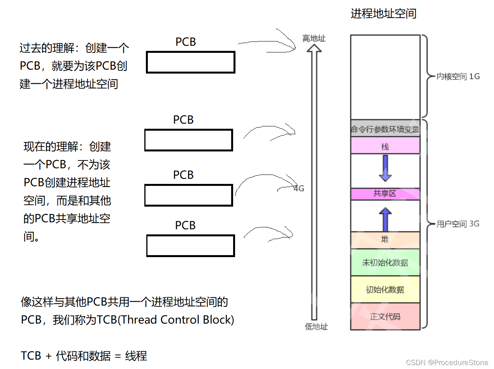
**不同的操作系统对线程的定义都是一样的，但对线程的实现方式不一定相同。
有些操作系统会为线程专门定义TCB，比如windows, 但linux并没有专为线程定义TCB，而是使用PCB来模拟TCB。就像上图画的一样。**

### Linux下的线程

前文我们提到linux使用PCB来模拟TCB，即用进程的结构体来模拟线程。因此，很多教材会说：**linux没有真正意义的线程**！
为什么linux使用PCB来模拟TCB？
设计一个PCB就已经很麻烦了，在加上一个TCB，会更加麻烦。linux的开发人员发现，线程和进程有很多相似的地方，因此，linux的开发人员选择使用PCB来模拟TCB，这样不仅减少了代码量，也减少了维护的成本。


对于线程，我们还要记住一些概念：

>**进程是资源分配的基本单位**
>**线程是操作系统调度的最小单位**
>**执行流是程序在运行时的执行路径或执行顺序。**
>对于CPU来说，没有线程，进程的概念，它只知道执行流。
>在Linux中：线程  <= 执行流 <= 进程

linux下的线程实际是对**轻量级进程**进行了封装。（封装在pthread库，后文会提到）

>linux的线程：**用户级线程**
>linux的轻量级进程: **内核级线程**
>二者的关系是**1:1**，一个轻量级进程封装为一个线程


>相关知识：线程比进程更轻量化，体现在两方面：
>
>1. 创建和释放更加轻量化
>2. **切换更加轻量化。** 在多线程环境中，线程之间的切换比进程之间的切换开销更小。这是因为线程共享了相同的地址空间，切换时无需切换**内存上下文**。

### 线程的优缺点

优点：

- 轻量级：相比于进程，线程的创建和切换开销更小，因为它们共享相同的地址空间。
- 资源共享：线程可以直接共享相同进程的内存空间和其他资源，定义一个全局变量，所有线程都能使用，这使得数据交换更为高效。
- 并发性：线程的并发性使得程序可以同时执行多个任务，从而提高了系统的效率和响应性。
- 协作性：线程之间可以方便地进行协作，共同完成某项任务，而无需额外的通信开销。
  多核利用：在多核系统中，线程可以被分配到不同的核心上并发执行，充分利用了硬件资源。

缺点：

- 健壮性降低：编写多线程需要更全面更深入的考虑，在一个多线程程序里，因时间分配上的细微偏差或者因共享了不该共享的变量而造成不良影响的可能性是很大的，换句话说线程之间是缺乏保护的
- 缺乏访问控制：进程是访问控制的基本粒度，在一个线程中调用某些OS函数会对整个进程造成影响。
- 编程难度提高：编写与调试一个多线程程序比单线程程序困难得多

## Linux下使用线程

前文提到linux没有真正意义的线程，因此linux没有线程的系统调用，但用户需要线程。因此linux在用户层定义了一个库：pthread（该库属于linux下的原生线程库）
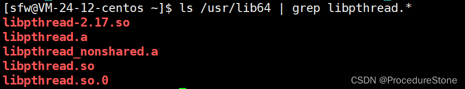
pthread库包含了线程相关的函数，以及线程的TCB。（注意这里的线程的TCB，后文会重点介绍）


### 线程接口

创建线程：
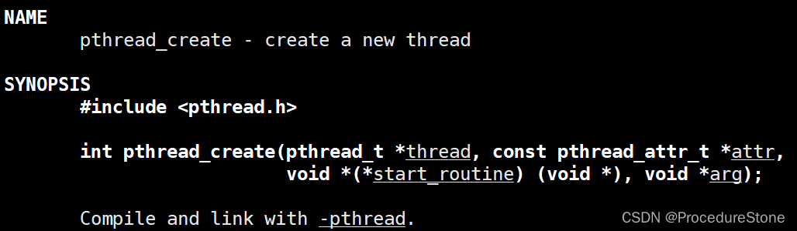
参数1：`pthread_t *thread`

```cpp
typedef unsigned long int pthread_t;
```

它是一个输出型参数，存储线程的tid（线程的标识符）

参数2：`const pthread_attr_t *attr`
用于设置新线程的属性。如果传入 NULL，则使用默认属性。

参数3：`void *(*start_routine)(void*)`
它是一个函数指针，指向的是一个返回值为void*，参数是void*的函数。这个函数将作为该线程的入口函数。相当于该线程的main函数。

参数4：`void*arg`
它将作为线程的入口函数的参数（参数3指向的函数的参数）。

返回值：0成功，失败返回错误码
用例：
main.cc

```cpp
#include <pthread.h>
#include <unistd.h>
#include <iostream>
using namespace std;
void *thread_routine(void* arg)
{
    int val = *((int*)arg);
    cout << "Thread function received argument: " << val << endl;
    while(true)
    {
        sleep(1);
    }
    return NULL;
}
int main()
{
    pthread_t tid;
    int val = 10;
    pthread_create(&tid, nullptr, thread_routine, (void*)&val);
    sleep(1);
    cout << "thread's tid is "  << tid << endl;
    while(true)
    {
        sleep(1);
    }
    return 0;
}
```

我们使用g++进行编译，你可能会发生如下错误：
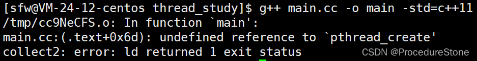
这是典型的链接错误，原因：pthread并不是c/c++库，如果要使用，你需要告诉g++编译器。（这一部分知识，属于linux下的动静态库的使用。）
[【linux】动静态库](https://blog.csdn.net/ProcedureStone/article/details/136601270)

正确的方法：
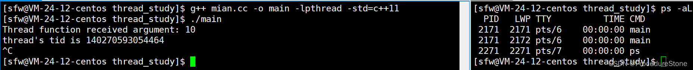

### Linux下查看线程

`ps -aL`
-a选项：显示所有用户的进程，而不仅仅是当前用户的进程。
-L选项：显示进程的线程信息

LWP，即Light Weight Process，轻量级进程，前文提到，linux只有轻量级进程的概念，这里轻量级进程即我们认为的线程。LWP下面的信息，即轻量级进程（线程）在linux内核的标识符。
注意：在linux内核里的标识符 != 线程的tid
上图左侧打印了线程的tid，`140270593054464`
这个数字怎么这么长？如果我们使用%p来打印：`0x7f8739de3700`
这个数字的十六进制刚好是一个64位机器的地址编号。要想知道为什么？后文的线程TCB会讲解。


---

线程等待：在进程中，有进程等待，即父进程要接收子进程的退出信息，同理，在线程中，主线程也可以通过线程等待，接受其他的线程的返回信息。

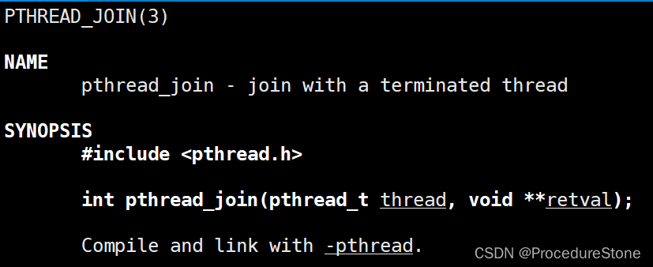
功能：等待线程结束
原型
int pthread_join(pthread_t thread, void **value_ptr);
参数
thread:线程ID
retval:它指向一个指针，后者指向线程的返回值,如果不关心，传NULL
返回值：成功返回0；失败返回错误码

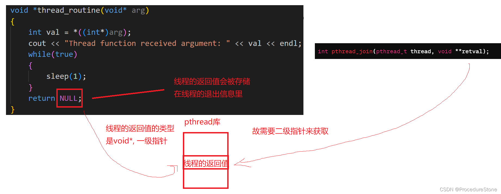
使用时：

```cpp
void *ret;
pthread_join(tid, &ret);
```

需要注意,return返回的指针所指向的内存单元必须是全局的或者是用malloc分配的,不能在线程函数的栈上分配,因为当其它线程得到这个返回指针时线程函数已经退出了。

---

如果不想等待线程，可以使用线程分离。
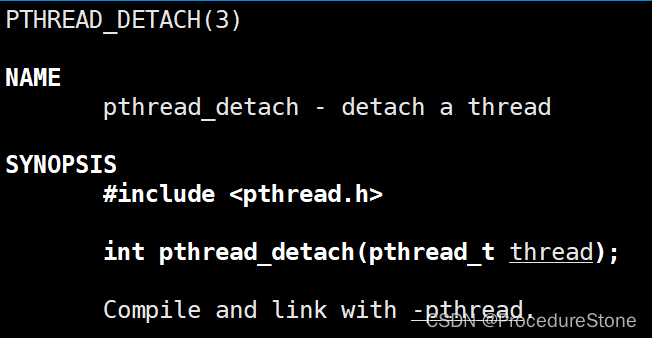

1. 线程分离后，主线程不会管分离的线程，分离的线程结束后自动销毁。
2. 如果线程分离后，依然使用pthread_join等待则会报错。
3. 线程分离可以是主线程进行分离，也可以是新线程自己调用函数分离。

---

除此之外：还有线程终止，线程取消……

pthread_exit函数
功能：线程终止
原型
void pthread_exit(void *value_ptr);
参数
value_ptr:value_ptr不要指向一个局部变量。
返回值：无返回值，跟进程一样，线程结束的时候无法返回到它的调用者（自身）

需要注意,pthread_exit或者return返回的指针所指向的内存单元必须是全局的或者是用malloc分配的,不能在线程函数的栈上分配,因为当其它线程得到这个返回指针时线程函数已经退出了。

pthread_cancel函数
功能：取消一个执行中的线程
原型
int pthread_cancel(pthread_t thread);
参数
thread:线程ID
返回值：成功返回0；失败返回错误码


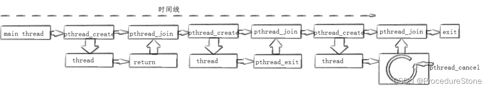


---

### 线程的TCB

linux没有真正意义的线程，自然在内核里没有所谓的TCB。linux下的TCB是在pthread库中维护。
当我们使用pthread_create创建一个线程时，pthread库中便会创建一个TCB,并进行维护。
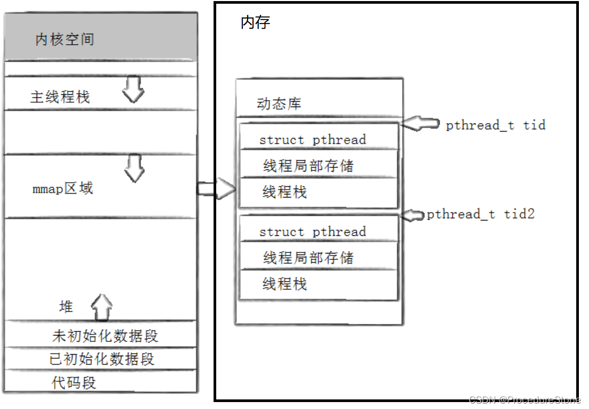
**而上面我们打印的tid，实际上是线程的TCB的起始地址。**

在TCB中，有2个属性不容易理解：线程栈和线程的局部存储

#### 线程栈。

每一个线程都有自己的调用链，注定了每个线程都要有调用链对应的栈帧结构，用来存储线程函数中的局部变量、函数参数以及函数调用的返回地址等信息。这一点类似进程的main函数的函数栈帧。这里的线程栈由pthread来维护，有了线程栈，才能在内核里创建执行流，有了新的执行流，才是一个真正的线程。

>小知识：为什么有了线程栈，内核才会创建执行流呢？内核明明没有线程的概念，又怎么会理解线程栈？
>答：linux下只有轻量级进程的概念，自然linux会提供轻量级进程的接口，pthread库正是对轻量级进程的接口进行了封装，才在用户层创建了线程的概念。
>linux下创建轻量级进程的系统接口是clone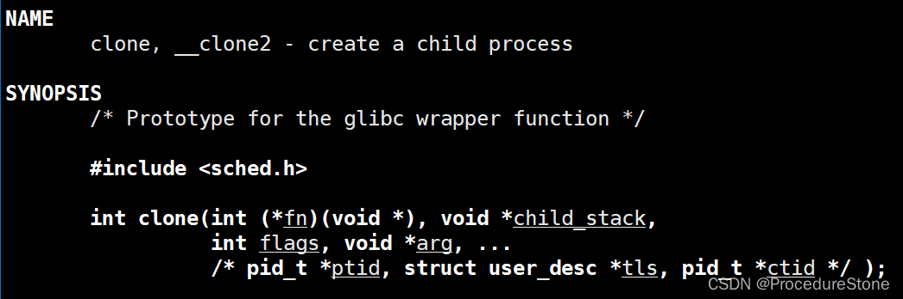
>注意看前两个参数，fn是入口函数，child_stack是轻量级进程栈。
>内核不认识线程栈，但它认识轻量级进程栈。而pthread_create的底层便是clone，这就是为什么内核能够给线程栈创建执行流。


如何验证？

```cpp
#include <pthread.h>
#include <unistd.h>
#include <iostream>
#include <vector>
using namespace std;
int g_val = 0;
void *thread_routine(void* arg)
{
    int* pi = (int*)arg;
    int i = *pi;
    int j = 0;
    while(j < 5)
    {
        cout << "thread-" << i << ", j=" << j << ", &j=" << &j << ", g_val=" << g_val << ", &g_val=" << &g_val << endl;
        sleep(2);
        j++, g_val++;
    }
    return NULL;
}
int main()
{
    int i = 0;
    std:;vector<pthread_t> tids;
    while(i < 4)
    {
        pthread_t tid;
        pthread_create(&tid, nullptr, thread_routine, (void*)&i);
        sleep(1);
        tids.push_back(tid);
        i++;
    }
    for(int j = 0; j < 4; j++)
    {
        pthread_join(tids[j], nullptr);
        sleep(1);
    }
    sleep(3);
    return 0;
}
```

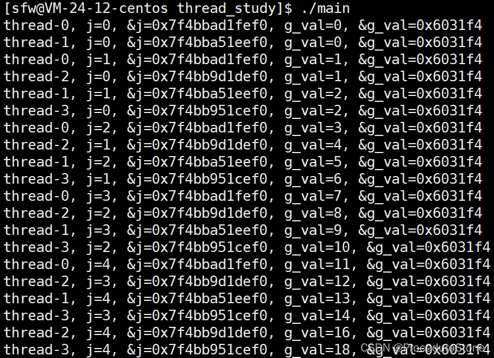


不同的线程，都执行的同一个函数thread_routine，但函数内部的临时变量j，不是共享的，如果是共享的，那么不同的线程的j的地址应该一样。但结果表明，j的地址都不同。这也表明线程有自己独立的栈结构。

对于全局变量g_val，不同线程是共享的。

#### 线程的局部存储

如果我想线程拥有私有的全局变量呢？这就要使用线程的局部存储。
`int g_val = 0  改为 __thread in g_val = 0`
此时不同的线程的变量g_val，都是不同的
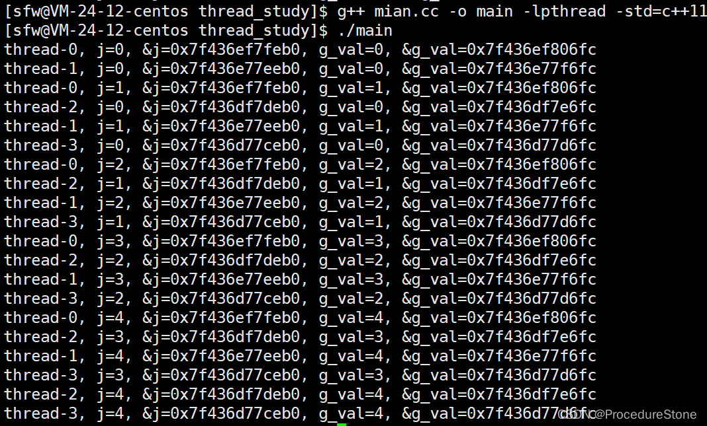
在变量前加上 `__thread`， 就可以将该变量改为局部存储。除了这个关键字之外，pthread库中也有一些函数可以实现局部存储。

__thread 是 GCC 中用于实现线程局部存储（Thread Local Storage，TLS）的关键字。它可以用来声明线程局部变量，这些变量对于每个线程是唯一的，不同线程之间的变量不会相互影响。**但是它只能声明内置类型，无法声明自定义类型。**
需要注意的是，__thread 关键字是 GCC 的扩展语法，虽然在大多数情况下可以正常工作，但并不是 C 标准的一部分，因此在一些不支持 GCC 扩展语法的编译器中可能无法使用。在 C11 标准中引入了 _Thread_local 关键字，用于实现线程局部存储，具有类似的功能，而且是标准化的语法。


---

## 线程互斥

### 互斥的相关概念

- 共享资源：多个线程之间可以**并发**访问的资源。
- 临界资源：多个线程**互斥**访问的共享资源。（共享资源 && 同一时间只能由一个线程访问）
- 临界区：每个线程内部，访问临界资源的代码，就叫做临界区
- 互斥：任何时刻，互斥保证有且只有一个执行流进入临界区，访问临界资源，通常对临界资源起保护作用
- 原子性：不会被任何调度机制打断的操作，该操作只有两态，要么完成，要么未完成

### 非互斥的问题

非互斥，就表示多个线程可以同时访问一个资源。这会带来什么问题呢？
下面是一个抢票的代码：4个线程同时访问全局变量tickets

```cpp
#include <pthread.h>
#include <unistd.h>
#include <iostream>
#include <vector>
using namespace std;

int tickets = 1000;

void *getTickets(void* arg)
{
    int* pi = (int*)arg;
    int i = *pi;
    while(1)
    {
    //票大于0才抢
        if(tickets > 0)
        {
            usleep(1000);
            printf("thread-%d, get a ticket: %d\n", i, tickets);
            tickets--;
        }
        else
        {
            break;
        }
    }
    return nullptr;
}
int main()
{
    int i = 0;
    std::vector<pthread_t> tids;
    while(i < 4)
    {
        pthread_t tid;
        pthread_create(&tid, nullptr, getTickets, (void*)&i);
        tids.push_back(tid);
        i++;
    }
    for(int j = 0; j < 4; j++)
    {
        pthread_join(tids[j], nullptr);
    }
    sleep(3);
    return 0;
}
```

结果：出现了负数
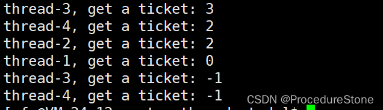
按照抢票的逻辑，票>0才抢，<=0就退出，怎么会出现负数呢？一张票应该属于一个线程，怎么出现了相同数字？问题就出在多线程并发访问。
像这类问题，归为**多线程并发访问造成的数据不一致问题**。

上面出现负数的原因：类似于下图
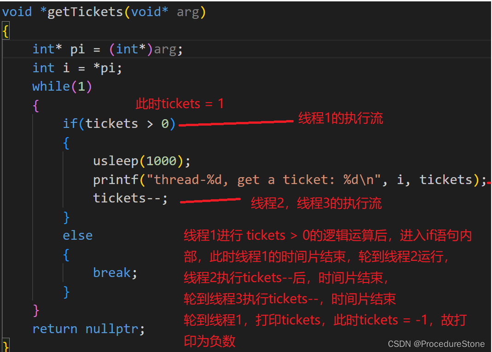
出现相同数字的原因：

那如何解决这种问题呢？通过**加锁**来解决。Linux上提供的这把锁叫**互斥量**。

### 互斥量（互斥锁）

互斥锁是如何实现线程互斥？

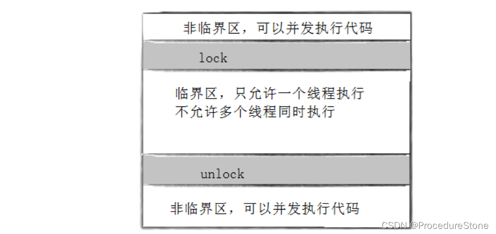
一个线程进入临界区之前，需要**申请锁**，只有拿了锁，才能执行临界区的代码。锁只有一把，故当一个线程拿了锁后，其他线程在申请锁时就会被阻塞，只有当持有锁的线程执行完临界区代码、进行**解锁**后，其他线程才可以申请锁。此时便实现了多个线程互斥的访问共享资源。

#### 互斥量的接口

>初始化互斥量
>初始化互斥量有两种方法：
>方法1，静态分配:
>`pthread_mutex_t mutex = PTHREAD_MUTEX_INITIALIZER`
>方法2，动态分配:
>`int pthread_mutex_init(pthread_mutex_t *restrict mutex, const pthread_mutexattr_t *restrict
>attr);`
>参数：
>mutex：要初始化的互斥量
>attr：NULL

>销毁互斥量
>销毁互斥量需要注意：使用 PTHREAD_ MUTEX_ INITIALIZER 初始化的互斥量不需要销毁
>不要销毁一个已经加锁的互斥量，已经销毁的互斥量，要确保后面不会有线程再尝试加锁
>int pthread_mutex_destroy(pthread_mutex_t *mutex)；

>互斥量加锁和解锁
>int pthread_mutex_lock(pthread_mutex_t *mutex);
>int pthread_mutex_unlock(pthread_mutex_t *mutex);
>返回值:成功返回0,失败返回错误号
>调用 pthread_ lock 时，可能会遇到以下情况:
>互斥量处于未锁状态，该函数会将互斥量锁定，同时返回成功
>发起函数调用时，其他线程已经锁定互斥量，或者存在其他线程同时申请互斥量，但没有竞争到互斥量，
>那么pthread_ lock调用会陷入阻塞(执行流被挂起)，等待互斥量解锁。


锁的接口都很简单，但使用时要注意很多细节。

#### 加锁的注意事项

- 加锁首先要**保证正确性**

以前文抢票的代码为例。我们定义一个静态锁。
`pthread_mutex_t mutex = PTHREAD_MUTEX_INITIALIZER;`

正确的加锁方式如下：

```cpp
#include <pthread.h>
#include <unistd.h>
#include <iostream>
#include <vector>
using namespace std;

pthread_mutex_t mutex = PTHREAD_MUTEX_INITIALIZER;

int tickets = 1000;

void *getTickets(void* arg)
{
    int* pi = (int*)arg;
    int i = *pi;
    while(1)
    {    
        pthread_mutex_lock(&mutex);
        if(tickets > 0)
        {
            usleep(1000);
            printf("thread-%d, get a ticket: %d\n", i, tickets);
            tickets--;
            pthread_mutex_unlock(&mutex);
        }
        else
        {
            pthread_mutex_unlock(&mutex);
            break;
        }  
    }
    return nullptr;
}
int main()
{
    int i = 0;
    std::vector<pthread_t> tids;
    while(i < 4)
    {
        pthread_t tid;
        pthread_create(&tid, nullptr, getTickets, (void*)&i);
        tids.push_back(tid);
        i++;
    }
    for(int j = 0; j < 4; j++)
    {
        pthread_join(tids[j], nullptr);
    }
    sleep(3);
    return 0;
}
```

错误的加锁方式：
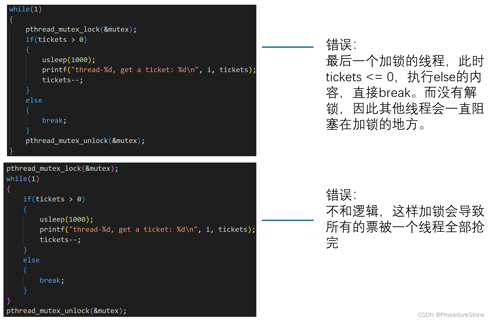

- **临界区的代码尽量要少 （锁的粒度应该尽可能小）**

加锁的本质是用时间换安全。
实际表现：线程串行的执行临界区的代码。
而线程串行执行实际上降低了效率，因此临界区的代码越少，越能减少效率的降低。

- **锁的分配要合理**

上面正确加锁的代码实际还有一些问题。我的运行结果发现：1000票，大部分票被线程2和线程3抢了，线程4仅抢了97张票。这表明了一点：不同线程对锁的竞争能力是不同，这可能导致大部分时间，锁都在某一个线程上，这将导致线程的**饥饿问题**。因此，我们要合理的安排锁的分配，而这涉及到**同步问题**。


#### 互斥锁的原理

锁可以保护临界区被线程互斥访问。但锁同时也是所有线程共享，属于共享资源，那锁自身的互斥问题呢？那必须将申请锁设计成**原子的**。（不会被任何调度机制打断的操作，该操作只有两态，要么完成，要么未完成）
首先我们要有一个共识：**一条汇编语句是原子的**。
但加锁的过程不可能仅仅只是一条汇编语句。那是如何实现加锁过程是原子的呢？

为了实现互斥锁操作,大多数体系结构都提供了swap或exchange指令,该指令的作用是把寄存器和内存单
元的数据相交换,由于只有一条指令,保证了原子性,即使是多处理器平台,访问内存的 总线周期也有先后,一
个处理器上的交换指令执行时另一个处理器的交换指令只能等待总线周期。 现在我们把lock和unlock的伪
代码改一下
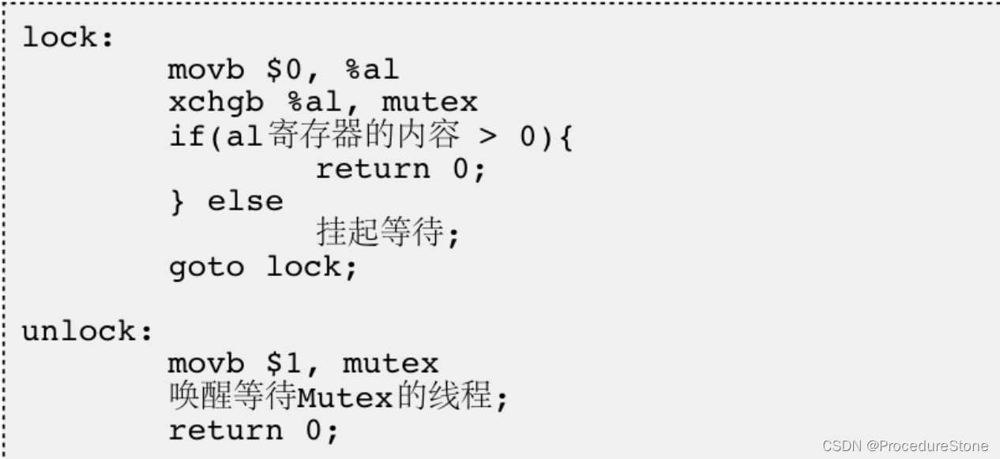
动态演示：

通过lock，可以实现一个时间段内只有一个线程持有锁（上图的锁用1表示）


## 线程同步

前文提到加锁需要**合理的分配锁**，而如何合理的分配锁，就要进行线程同步。

>同步：在保证数据安全的前提下，让线程能够按照某种特定的顺序访问临界资源，从而有效避免饥饿问题，叫做同步

先说一下，未同步的情况：
比如前文的申请锁的问题，每个新来的线程申请锁，不是排队竞争，而是一窝蜂的竞争。这就可能导致某个线程竞争能力很强，导致锁一直在它身上（比如它刚释放锁，又瞬间申请到锁）

如何解决呢？
解决方式有很多：条件变量，信号量……

### 条件变量

条件变量（Condition Variable）是一种线程同步机制，需要与互斥锁（Mutex）结合使用，用于在线程间传递某个条件的状态并实现线程的等待和唤醒。条件变量允许一个或多个线程在满足特定条件之前进入等待状态，并在条件被满足时被唤醒。
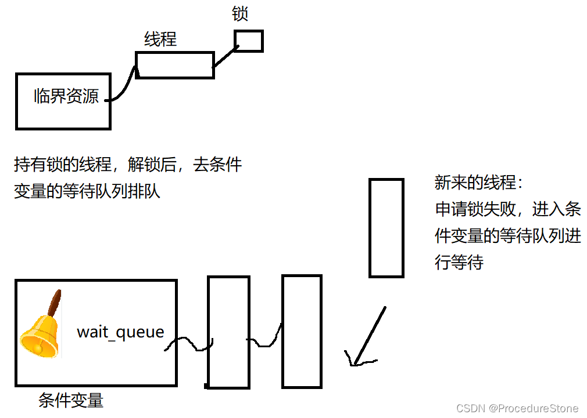

#### 条件变量的接口

和互斥锁的接口函数一样简单：

>初始化
>
>1. 静态：
>   `pthread_cond_t cond = PTHREAD_COND_INITIALIZER`
>   2.动态：
>   `int pthread_cond_init(pthread_cond_t *restrict cond,const pthread_condattr_t *restrict
>   attr);`
>   参数：
>   cond：要初始化的条件变量
>   attr：NULL

>销毁
>`int pthread_cond_destroy(pthread_cond_t *cond)`

>等待条件满足（休眠线程）
>`int pthread_cond_wait(pthread_cond_t *restrict cond,pthread_mutex_t *restrict mutex);`
>参数：
>cond：要在这个条件变量上等待
>mutex：互斥量，后面详细解释

>唤醒等待
>`int pthread_cond_broadcast(pthread_cond_t *cond);` 一次唤醒全部线程
>`int pthread_cond_signal(pthread_cond_t *cond); `一次唤醒一个线程


用例：

```cpp
#include <iostream>
#include <vector>
#include <pthread.h>
#include <unistd.h>
#include <stdint.h>

int cnt = 0;
pthread_mutex_t mutex = PTHREAD_MUTEX_INITIALIZER;
pthread_cond_t cond = PTHREAD_COND_INITIALIZER;

void* Count(void* args)
{
    pthread_detach(pthread_self());
    //pthread_detach -- 线程分离， pthread_self -- 获取线程tid
    uint64_t number = (uint64_t) args;
    while(1)
    {
        pthread_mutex_lock(&mutex);//细节
        pthread_cond_wait(&cond, &mutex);//细节
        std::cout << "thread-" << number << " , cnt: " << cnt++ << std::endl;
        pthread_mutex_unlock(&mutex);
    }
}
int main()
{
    for(int i = 0; i < 5; i++)
    {
        pthread_t tid;
        pthread_create(&tid, nullptr, Count, (void*)i);
    }
    sleep(3);
    while(1)
    {
        sleep(1);
        std::cout << "signal a thread" << std::endl;
        pthread_cond_signal(&cond);
    }
    return 0;
}
```

执行结果：很有序。没有出现一个线程连续持有锁。
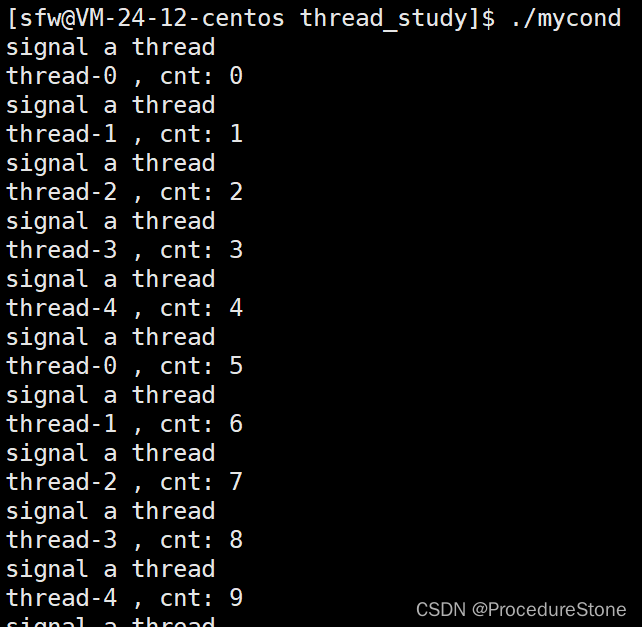

上面的代码看起来很简单，但有一个细节不能忽视：即加锁和等待条件变量二者的顺序。
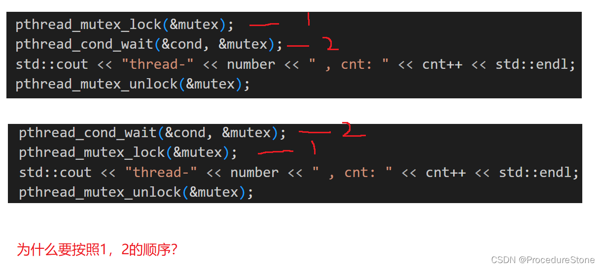
这里我们先谈谈为什么要让线程去休眠？一定是临界资源未就绪，如何知道临界资源未就绪，先要查看临界资源，查看临界资源的状态本身就是访问临界资源，访问临界资源必须要加锁。
因此顺序：**加锁 -- 查看临界资源的状态 -- 进行休眠**（pthread_cond_wait)
这就是为什么pthread_cond_wait需要在pthread_mutex_lock和pthread_mute_unlock之间的原因之一。

问题1：对于休眠线程有个疑惑，一个线程加锁后，才会考虑是否进行休眠，假如需要休眠，那不就导致这个线程是**带锁休眠**的吗？ 拿了锁却跑去睡觉，这能允许？当然不可以。
pthread_cond_wait函数其实除了休眠线程，还会**自动释放锁**。
过程如下：
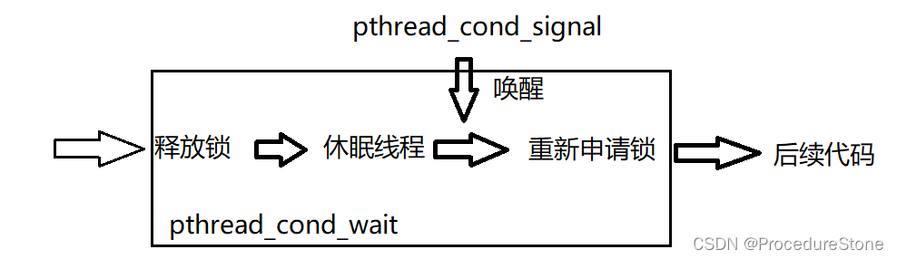


### POSIX信号量

POSIX信号量和SystemV信号量（进程间通信）作用相同，都是用于同步操作，达到无冲突的访问共享资源目的。 但POSIX可以用于线程间同步。

信号量是什么？信号量本质是个**计数器**。类似但是**绝不等于** `int cnt;`(这里的绝不等于体现在信号量的++和--是原子的，但整形变量的++和--不是原子的， 具体是如何实现的，不知道）

那这个计数器记忆什么数据呢？**临界资源的数量**
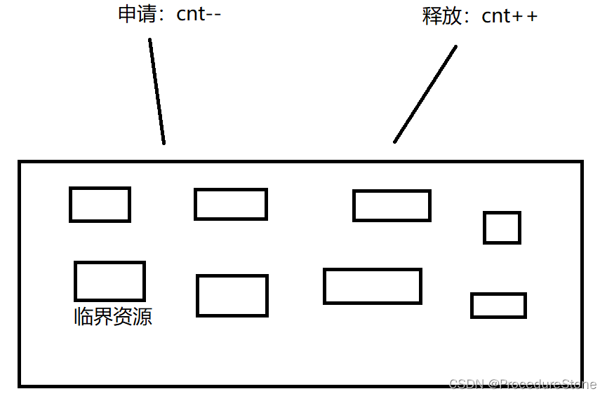
当申请时，信号量会预定临界资源给你。就像电影院买票，只要你买了票，不管你是否去看，电影院一定有你的位置。信号量同理，**只要你向信号量申请了临界资源，就一定有可以使用的临界资源**（不用担心临界资源是否就绪、是否存在等问题）

正是这一特性，我们使用信号量就不用像互斥锁一样，加了锁还要用条件变量。

信号量有2个操作P和V，P表示申请，V表示释放。

使用时的顺序：

```cpp
P(信号量)

使用临界资源

V(信号量）
```

#### POSIX信号量的接口

>初始化信号量
>#include <semaphore.h>
>int sem_init(sem_t *sem, int pshared, unsigned int value);
>参数：
>pshared:0表示线程间共享，非零表示进程间共享
>value：信号量初始值

>销毁信号量
>int sem_destroy(sem_t *sem);

>等待信号量
>功能：等待信号量，会将信号量的值减1
>int sem_wait(sem_t *sem); //P()

>发布信号量
>功能：发布信号量，表示资源使用完毕，可以归还资源了。将信号量值加1。
>int sem_post(sem_t *sem);//V()

用例：

```cpp
#include <iostream>
#include <queue>
#include <unistd.h>
#include <pthread.h>
#include <semaphore.h>
using namespace std;
#define CAPACITY 10 //总容量
queue<int> q;//临界资源
sem_t pushspace, popspace;
//pushspace : 剩余空间数目，初始为总容量
//popspace : 可pop空间的数目，初始为0
//改个名字
void P(sem_t& sem)
{
    sem_wait(&sem);
}
void V(sem_t& sem)
{
    sem_post(&sem);
}

void* push(void* args)
{
    pthread_detach(pthread_self());
    while(1)
    {
        P(pushspace);
        int data = rand()%100;
        cout << "push a data: " << data << endl;
        q.push(data);
        sleep(1);
        V(popspace);
    }
}
void* pop(void* args)
{
    pthread_detach(pthread_self());
    while(1)
    {
        P(popspace);
        cout << "pop a data: " << q.front() << endl;
        q.pop();
        sleep(2);
        V(pushspace);
    }
}

int main()
{
    srand(time(nullptr));
    sem_init(&pushspace, 0, CAPACITY);
    sem_init(&popspace, 0, 0);
    pthread_t tpush, tpop;
    pthread_create(&tpush, nullptr, push, nullptr);
    pthread_create(&tpop, nullptr, pop, nullptr);
    while(1)
    {
        sleep(1);
    }
    return 0;
}
```

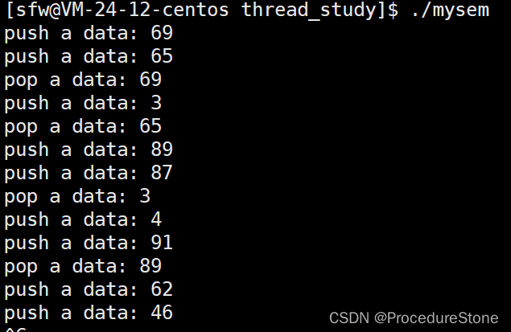
这个例子并不能体现信号量的优势，这里只是简单展示了信号量的使用。
信号量的一个经典的应用场景：**基于环形队列的生产者消费者模型**

## 线程安全

可重入VS线程安全

>线程安全：多个线程并发同一段代码时，不会出现不同的结果。常见对全局变量或者静态变量进行操作，并且没有锁保护的情况下，会出现该问题。

>重入：同一个函数被不同的执行流调用，当前一个流程还没有执行完，就有其他的执行流再次进入，我们称之为重入。一个函数在重入的情况下，运行结果不会出现任何不同或者任何问题，则该函数被称为可重入函数，否则，是不可重入函数。

常见的线程不安全的情况

- 不保护共享变量的函数
- 函数状态随着被调用，状态发生变化的函数
- 返回指向静态变量指针的函数
- 调用线程不安全函数的函数

常见的线程安全的情况

- 每个线程对全局变量或者静态变量只有读取的权限，而没有写入的权限，一般来说这些线程是安全的
- 类或者接口对于线程来说都是原子操作
- 多个线程之间的切换不会导致该接口的执行结果存在二义性

常见不可重入的情况

- 调用了malloc/free函数，因为malloc函数是用全局链表来管理堆的
- 调用了标准I/O库函数，标准I/O库的很多实现都以不可重入的方式使用全局数据结构
- 可重入函数体内使用了静态的数据结构

常见可重入的情况

- 不使用全局变量或静态变量
- 不使用用malloc或者new开辟出的空间
- 不调用不可重入函数
- 不返回静态或全局数据，所有数据都有函数的调用者提供
- 使用本地数据，或者通过制作全局数据的本地拷贝来保护全局数据

可重入与线程安全联系

- 函数是可重入的，那就是线程安全的
- 函数是不可重入的，那就不能由多个线程使用，有可能引发线程安全问题
- 如果一个函数中有全局变量，那么这个函数既不是线程安全也不是可重入的。

可重入与线程安全区别

- 可重入函数是线程安全函数的一种
- 线程安全不一定是可重入的，而可重入函数则一定是线程安全的。
- 如果将对临界资源的访问加上锁，则这个函数是线程安全的，但如果这个重入函数若锁还未释放则会产生死锁，因此是不可重入的。


###  锁的相关概念和常见的锁

死锁

>死锁是指在一组进程中的各个进程均占有不会释放的资源，但因互相申请被其他进程所站用不会释放的资源而处于的一种永久等待状态。

举个例子：小红、小明各持有5毛，一个棒棒糖需要1元。现在小红申请小明的5毛，以便筹齐1元购买棒棒糖，但小明也想买棒棒糖，也申请小红的5毛。现在，小红和小明都想要对方的5毛，又不肯放弃自己的5毛，那不就卡住了吗。死锁就类似于小红小明的情况。

死锁有四个**必要条件**

- 互斥条件：一个资源每次只能被一个执行流使用
- 请求与保持条件：一个执行流因请求资源而阻塞时，对已获得的资源保持不放
- 不剥夺条件:一个执行流已获得的资源，在末使用完之前，不能强行剥夺
- 循环等待条件:若干执行流之间形成一种头尾相接的循环等待资源的关系

只要是死锁，一定满足这4个条件。

那如何解决死锁？

- 破坏死锁的四个必要条件
- 加锁顺序一致
- 避免锁未释放的场景
- 资源一次性分配

避免死锁算法

- 死锁检测算法
- 银行家算法


悲观锁：在每次取数据时，总是担心数据会被其他线程修改，所以会在取数据前先加锁（读锁，写锁，行
锁等），当其他线程想要访问数据时，被阻塞挂起。
乐观锁：每次取数据时候，总是乐观的认为数据不会被其他线程修改，因此不上锁。但是在更新数据前，
会判断其他数据在更新前有没有对数据进行修改。主要采用两种方式：版本号机制和CAS操作。
CAS操作：当需要更新数据时，判断当前内存值和之前取得的值是否相等。如果相等则用新值更新。若不
等则失败，失败则重试，一般是一个自旋的过程，即不断重试。
自旋锁，公平锁，非公平锁？

### STL、智能指针与线程安全

>STL中的容器是否是线程安全的?
>不是.原因是, STL 的设计初衷是将性能挖掘到极致, 而一旦涉及到加锁保证线程安全, 会对性能造成巨大的影响.而且对于不同的容器, 加锁方式的不同, 性能可能也不同(例如hash表的锁表和锁桶).
>因此 STL 默认不是线程安全. 如果需要在多线程环境下使用, 往往需要调用者自行保证线程安全.

>智能指针是否是线程安全的?
>对于 unique_ptr, 由于只是在当前代码块范围内生效, 因此不涉及线程安全问题.
>对于 shared_ptr, 多个对象需要共用一个引用计数变量, 所以会存在线程安全问题. 但是标准库实现的时候考虑到了这个问题, 基于原子操作(CAS)的方式保证 shared_ptr 能够高效, 原子的操作引用计数

### 线程安全的单例模式

**概念**
设计模式是一种在软件设计中反复出现的通用解决方案，它是由经验丰富的软件开发人员总结出来的。设计模式提供了一种解决特定问题的方法，可以帮助开发人员更加高效、灵活地设计和实现软件系统。

设计模式的类型

- 创建型模式：用于处理对象的创建机制
- 结构型模式：用于处理类或对象的组合
- 行为型模式：用于处理对象之间的通信和职责分配。

**单例设计模式**是一种创建型模式，**它确保一个类只有一个实例**，并提供一个全局访问点来访问该实例。单例模式通常用于管理全局资源，例如日志系统、数据库连接池等。

单例模式的关键点是：

私有构造函数：单例类的构造函数必须是私有的，这样外部代码就无法直接实例化该类。
静态成员变量：单例类必须拥有一个静态成员变量来存储唯一实例。
静态方法：单例类通常提供一个静态方法来获取该唯一实例，这个方法会负责创建实例（如果实例不存在的话）并返回它。

单例模式的实现方式常见的有2种：

- **饿汉实现方式**：吃完饭, 立刻洗碗, 这种就是饿汉方式. 因为下一顿吃的时候可以立刻拿着碗就能吃饭.
- **懒汉实现方式**：吃完饭, 先把碗放下, 然后下一顿饭用到这个碗了再洗碗, 就是懒汉方式.懒汉方式最核心的思想是 "**延时加载**". 从而能够优化服务器的启动速度.


饿汉方式实现单例模式

```cpp
template <typename T>
class Singleton {
	static T data;
public:
	static T* GetInstance() 
	{
		return &data;
	}
};
```


只要通过 Singleton 这个包装类来使用 T 对象, 则一个进程中只有一个 T 对象的实例.

懒汉方式实现单例模式（线程不安全）

```cpp
template <typename T>
class Singleton {
	static T* inst;
public:
	static T* GetInstance() 
	{
		if (inst == NULL) 
		{
			inst = new T();
		}
		return inst;
	}
};
```

需要用时，再创建。

**那这与线程安全有什么关系呢？**

懒汉模式，第一次调用 GetInstance 的时候, 如果两个线程同时调用, 可能会创建出两份 T 对象的实例.但是后续再次调用, 就没有问题了.
懒汉方式实现单例模式(线程安全版本) -- 双重检查锁懒汉式

```cpp
template <typename T>
class Singleton {
	volatile static T* inst; // 需要设置 volatile 关键字, 否则可能被编译器优化.
	static std::mutex lock;
public:
	static T* GetInstance() {
	if (inst == NULL) 
	{ // 双重判定空指针, 降低锁冲突的概率, 提高性能.
		lock.lock(); // 使用互斥锁, 保证多线程情况下也只调用一次 new.
		if (inst == NULL) 
		{
			inst = new T();
		}
		lock.unlock();
	}
	return inst;
	}
};
```

注意事项:

1. 加锁解锁的位置
2. 双重 if 判定, 避免不必要的锁竞争
3. volatile关键字防止过度优化
