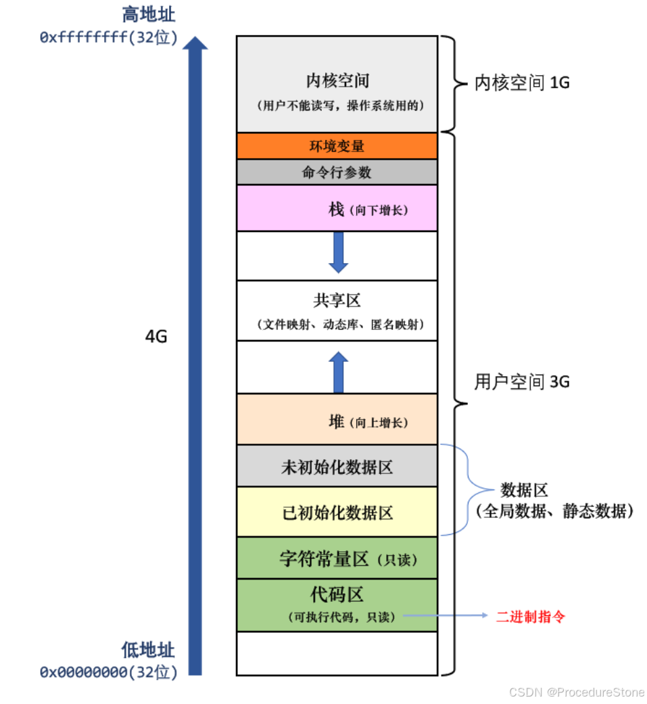

@[TOC](文章目录)

---

## 进程和PCB

什么是进程？
课本上的定义有很多，如：进程是程序的一次执行，是加载到内存的程序，是**系统进行资源分配和调度的一个独立单位**。

我们不必去纠结定义，只需知道2点：如何描述进程？如何管理进程？

描述=提取进程属性，管理=对进程的属性进行管理
由此首先要引出一个概念：进程的PCB

PCB(process control block) 是什么？一句话：**进程属性的集合**，是一个结构体。此时进程就被拆分为2个部分：属性和数据，如下图：


## linux与进程的相关命令

linux下的进程信息存储在`/proc`目录下

大多数的进程信息也可以通过ps和top等用户级工具来获取

### PS

>ps命令用于显示当前正在运行的进程信息
>`a`: 显示所有用户的进程。通常情况下，ps命令仅显示与当前终端关联的进程，但使用-a选项可以显示所有用户的进程。
>`j`: 使用BSD风格的输出格式。这种格式下，ps命令会以进程状态、作业控制信息等形式显示进程信息。
>`x`: 显示与终端无关的进程。通常情况下，ps命令仅显示与当前终端关联的进程，但使用-x选项可以显示与当前终端无关的进程。
>
>我们使用ps命令查看进程会发现有些进程的状态会带个+号，如R+
>这里的 **+表示该进程是在前台运行**
>
>
>如果在运行时加上`&`，可以让程序变为后台运行。此时如果想终止进程则需要`kill -9 PID`
>


>top命令用于动态显示系统中运行的进程的相关信息，包括进程的CPU利用率、内存利用率、进程ID等
>


## linux下的PCB 

在linux操作系统下的PCB：**task_struct（结构体）**


>task_struct的内容分类：
>
>1. **标识符**: 描述本进程的唯一标示符，用来区别其他进程。
>2. **状态**: 任务状态，退出代码，退出信号等。
>3. **优先级**: 相对于其他进程的优先级。
>4. 程序计数器: 程序中即将被执行的下一条指令的地址。
>5. 内存指针: 包括程序代码和进程相关数据的指针，还有和其他进程共享的内存块的指针
>6. 上下文数据: 进程执行时处理器的寄存器中的数据[休学例子，要加图CPU，寄存器]。
>7. I／O状态信息: 包括显示的I/O请求,分配给进程的I／O设备和被进程使用的文件列表。
>8. 记账信息: 可能包括处理器时间总和，使用的时钟数总和，时间限制，记账号等。
>9. ……


重点介绍 标识符，状态，优先级

### 进程标识符

进程标识符,即PID:描述本进程的唯一标示符，用来区别其他进程。

这里PPID -- parent PID， 即该进程的父进程的PID.

linux也提供了系统接口来获取进程的PID

返回值类型`pid_t`， 本质是整型


### 父子进程

前文在谈到进程的描述符时谈到了父进程和子进程，怎么进程还有父子关系？

**所谓父子进程，就是在一个进程的基础上创建出另一条完全独立的进程，这个就是子进程。**
问题来了：

1. 如何创建？
2. 子进程是在父进程的基础上，那么二者的PCB、代码和数据有什么不同？


#### fork

linux下有一个系统调用fork，它可以创建子进程。

```cpp
NAME
       fork - create a child process

SYNOPSIS
       #include <sys/types.h>
       #include <unistd.h>

       pid_t fork(void);
```

返回值：
失败了返回-1，并且没有子进程被创建，如果成功，父进程返回子进程的PID，子进程返回0

```cpp
#include <sys/type.h>
#include <unistd.h>

int main()
{
        pid_t id = fork();
        if(id == 0)
        {
                //子进程
        }
        else if(id > 0)
        {
                //父进程
        }
        else 
        {
                //创建进程失败
        }       

}
```

这里就有问题了：

问题1：为什么创建子进程？
让子进程去处理其他事

问题2：为什么fork后子进程返回0？父进程返回子进程的pid
由于父只有一个，而子进程可以有很多个，因此父进程返回子进程的pid，来标识你创建好的子进程pid是多少。子进程返回0，因为子进程只有一个父亲，不需要额外标识出来。

问题3：为什么一个变量（id）有2个值？
子进程在父进程的基础上创建，这意味着父子进程具有相同的代码和数据。
那么这里的”相同“指的是

1. 子进程复制一份父进程
2. 子进程和父进程共享一份
   
   实际情况是第2种：**父子进程共享代码和数据**
   那么父子进程岂不是使用同一个变量（id）？
   也不是，当子进程如果要更改数据时，会发生**写时拷贝，即更改的数据拷贝一份，未更改的数据父子共享**
   总结：**代码共享，数据写时拷贝**

注：为什么要写时拷贝? 为了节省资源

问题3：父子进程谁先运行？
由各自PCB的调度信息（时间片，优先级等）+调度算法自助决定

### 进程状态

**在操作系统理论中**，进程一般有3种基本状态：运行、就绪和阻塞。

但上面的只是操作系统理论，实际的操作系统下的进程状态更复杂。

以linux为例，解释一下：运行，阻塞，挂起

在计算机操作系统中，进程可能会由于各种原因而进入阻塞挂起状态，其中包括等待输入/输出（I/O）操作完成、等待系统资源分配、等待进程间通信等。

**在具体的Linux系统中**，进程状态有以下几种：


R即运行状态，S即阻塞状态，这都好理解，但有3个状态很奇怪：D、T、t、X、Z

>插一个小知识：我们使用ps命令查看进程会发现有些进程的状态会带个+号，如R+
>这里的 **+表示该进程是在前台运行**
>
>
>如果在运行时加上`&`，可以让程序变为后台运行。此时如果想终止进程则需要`kill -9 PID`
>

##### 磁盘睡眠 -- D

>进程的磁盘睡眠状态（Disk Sleep State）通常是指进程处于等待磁盘I/O操作完成的状态。这种状态通常出现在进程请求进行磁盘读取或写入操作时，但磁盘尚未完成相应的I/O操作，因此进程被阻塞，等待磁盘响应。在这种状态下，进程不会消耗CPU时间，而是被挂起，直到磁盘I/O操作完成。**是阻塞挂起状态的一种形式**

处于磁盘睡眠的进程，不响应操作系统的请求，直到进程完成它的I/O操作。

要想看到磁盘睡眠，需要进行高I/O操作，不容易演示。可以使用`dd`命令来进行，由于dd命令的操作非常强大，但同时也非常底层，因此在使用时需要特别小心，避免造成意外的数据损坏或丢失。

#### 暂停和跟踪暂停 -- T和t

Linux操作系统的有个信号`kill -19`， 可以使进程暂停。T状态即进程处于暂停状态。注意不要于S状态混淆，S状态一定是进程在等待某种资源，但T状态不一定在等待某种资源。
那T和t有什么区别呢？

Stopped（停止）状态：
进程处于停止状态通常是由于接收到了一个信号，例如SIGSTOP（Ctrl-Z产生的SIGTSTP信号）或者SIGTSTP（通常由shell的暂停命令引发）。这种状态下的进程被挂起，暂时停止执行，但可以通过发送SIGCONT信号来恢复执行。

Tracing Stop（跟踪停止）状态：
进程处于跟踪停止状态通常是由于调试器（如GDB）或者ptrace系统调用的作用。在这种状态下，进程被调试器所追踪，通常是因为调试器在进行单步执行、观察或者修改进程的内存等操作。这种状态下的进程暂时停止执行，直到调试器允许其继续执行。

一般认为T和t没什么区别。


#### 僵尸进程 -- Z

当一个进程（子进程）完成执行后，它的退出状态需要被父进程获取。如果父进程没有主动获取子进程的退出状态，那么子进程就会变成僵尸进程，相当于一个人处于生死之间。

下方代码实现：父进程一直运行，子进程执行3次后结束

结果如下：子进程的状态由S+ --> Z+， Z即处于僵尸状态

僵尸进程虽然不会直接对系统造成严重影响，但长时间存在的僵尸进程会对系统的正常运行产生一些间接的危害，包括：可能导致资源耗尽，影响进程管理，降低系统稳定性。因此需要父进程处理僵尸进程。
父进程通常需要调用类似于wait()或waitpid()的系统调用来等待子进程的退出，并获取其退出状态。

**当然如果父进程也结束，系统会自动把子进程释放。**


#### 孤儿进程

僵尸进程是子进程结束，但父进程未结束。如何父进程先结束，子进程后结束呢？那么子进程便会变为孤儿进程，并被**托孤**给1号进程，即操作系统。


### 进程优先级


PRI（Priority）：PRI 表示进程的静态优先级或调度优先级。俗点说就是程序被CPU执行的先后顺序，**此值越小,进程的优先级别越高。**
NI（Nice Value）：NI 表示进程的 Nice 值，是一个表示进程调度优先级的数值。它的作用是改变PRI的值。

通过PRI和NI可以调整进程的优先级，计算公式如下：

`PRI(new)=PRI(old)+nice` '

这样，当nice值为负值的时候，那么该程序将会优先级值将变小，即其优先级会变高，则其越快被执行所以，调整进程优先级，在Linux下，就是调整进程nice值

注意：nice 的范围在 【-20， 19】
PRI(old) 最小是80，如果原来的PRI < 80， 则会直接从80开始算：
因此：PRI 范围【60， 99】，但在计算新的PRI时，最小从80开始
举例：原来 ： PRI = 60 NI = 0;
		更改：令PRI = 100
		结果：PRI = 99 NI = 19

那如何更改nice值呢？

在Linux系统中，`nice`命令用于启动一个新的进程，并设置其优先级。而`renice`命令用于修改已经运行的进程的优先级。

 `nice`命令的使用：

```bash
nice [OPTION] [COMMAND [ARG]...]
```

`nice`命令通过改变进程的优先级来影响其调度。数值越大，优先级越低。默认情况下，优先级是0。

例如，运行一个命令并设置其优先级：

```bash
nice -n <优先级> <命令>
```

例如，将`ls`命令的优先级降低为10：

```bash
nice -n 10 ls
```

`renice`命令的使用：

```bash
renice [优先级] -p <进程ID> [<进程ID>...]
```

`renice`命令用于修改已经运行的进程的优先级。可以指定一个或多个进程ID来修改它们的优先级。

例如，将进程ID为1234的进程的优先级设置为10：

```bash
renice 10 -p 1234
```

如果你想要提高某个进程的优先级，你需要具有足够的权限。通常，只有超级用户（root）才能提高进程的优先级，而普通用户只能降低自己创建的进程的优先级。


## 进程地址空间

### 再谈fork

```cpp
#include <sys/types.h>
#include <unistd.h>
#include <iostream>
int g_val = 100;

int main()
{
	pid_t id = fork();
	if(id == 0)
	{
		g_val = 200;
		printf("子进程：g_val = %d, &g_val = %p\n", g_val, &g_val);
	}
	else if(id > 0)
	{
		printf("父进程：g_val = %d, &g_val = %p\n", g_val, &g_val);
	}
}

结果：
父进程：g_val = 100, &g_val = 0x55631bc26010
子进程：g_val = 200, &g_val = 0x55631bc26010
```

子进程更改数据后，会发生写时拷贝，因此子进程和父进程的g_val值不一样，符合预期，但是为什么发生了写时拷贝，父子进程的g_val地址还是相同？
显然这里的地址一定不是真实的地址。

要解释这个问题，要引入一个概念：进程地址空间

### 进程地址空间分布

c/c++常见的地址分布图，过去我们称它为程序地址分布，但实际它真正的名字是**进程地址空间**
**不同语言的进程地址空间大致相同**，下面以c++的地址分布图为例。



```cpp
#include <iostream>
using namespace std;
int g_A;
int g_B = 100;
int main()
{
        const char* a = "ab";
        static int s_A = 5;
        int A;
        int B;
        int C;
        int* m_A = new int;
        int* m_B = new int;
        int* m_C = new int;
        printf("字符常量：a : %p\n", a);
        cout << "静态变量：s_A : " << &s_A << endl;
        cout << "全局变量：未初始化g_A : " << &g_A << endl;
        cout << "全局变量：已初始化g_B : " << &g_B << endl;
        cout << "栈区：A : " << &A << endl;
        cout << "栈区：B : " << &B << endl;
        cout << "栈区：C : " << &C << endl;
        cout << "堆区：m_A : " << m_A << endl;
        cout << "堆区：m_B : " << m_B << endl;
        cout << "堆区：m_C : " << m_C << endl;
}

ubuntu g++:
字符常量：a : 0x5649d4534009
静态变量：s_A : 0x5649d4536014
全局变量：未初始化g_A : 0x5649d4536154 未初始化地址 > 已初始化地址 符合
全局变量：已初始化g_B : 0x5649d4536010
栈区：A : 0x7ffc892fb3cc 栈区的地址是增长的, 不符合
栈区：B : 0x7ffc892fb3d0
栈区：C : 0x7ffc892fb3d4
堆区：m_A : 0x5649d5eadeb0 堆区的地址是增长的，符合
堆区：m_B : 0x5649d5eaded0
堆区：m_C : 0x5649d5eadef0

windows vs2019
字符常量：a : 00639B30
静态变量：s_A : 0063C004
全局变量：未初始化g_A : 0063C3E0
全局变量：已初始化g_B : 0063C000
栈区：A : 004FFBA8
栈区：B : 004FFB9C
栈区：C : 004FFB90
堆区：m_A : 0069FD68
堆区：m_B : 0069FD98
堆区：m_C : 006A0118
```

怎么linux的栈区的地址是向上增长的呢？
[【问题】栈区地址分配之谜：为什么局部变量的地址会递增？-CSDN博客](https://blog.csdn.net/ProcedureStone/article/details/143377211?sharetype=blogdetail&sharerId=143377211&sharerefer=PC&sharesource=ProcedureStone&spm=1011.2480.3001.8118)


### 虚拟地址和页表

每一个进程，操作系统都会分配一个进程地址空间，对于32位机器，总地址大小位4GB。每个进程都分配4GB的内存，这可能吗？不可能。
因此进程地址空间里的地址是**虚拟地址**，通过**页表**与物理地址映射。

回到fork里的问题：为什么父子进程不同的值有着相同的地址？因为这里的地址是虚拟地址。
子进程只需更改子进程页表。


### mm_struct


---

## 进程控制


### 进程终止

当一个进程退出时，有以下3种场景：

1. 代码运行完毕，结果正确
2. 代码运行完毕，结果不正确
3. 代码异常终止

对于场景1，我们无需关心。
对于场景2，结果不正确，因此我们需要查明为什么不正确。通过什么来查明? **进程的退出码**。即main函数的返回值。
对于场景3，代码异常终止，此时还需要关心进程的退出码吗？不用。退出码是结果是否正确的标志。进程是否异常的标志是**信号**。比如ctrl + c 终止进程，就是向进程发送SIGINT信号


### 进程退出码

这里要介绍2个控制进程退出的函数

```cpp
_exit函数

#include <unistd.h>
void _exit(int status);

参数：status 定义了进程的终止状态，父进程通过wait来获取该值
说明：虽然status是int，但是仅有低8位可以被父进程所用。所以_exit(-1)时，在终端执行$?发现返回值
是255。


exit函数

#include <unistd.h>
void exit(int status);

exit最后也会调用exit, 但在调用exit之前，还做了其他工作：
1. 执行用户通过 atexit或on_exit定义的清理函数。
2. 关闭所有打开的流，所有的缓存数据均被写入
3. 调用_exit
```


**我们平时控制进程退出是使用return。执行return n等同于执行exit(n),因为调用main的运行时函数会将main的返return是一种更常见的退出进程方法。执行return n等同于执行exit(n),因为调用main的运行时函数会将main的返回值当做 exit的参数。回值当做 exit的参数**。


## 进程等待

前文介绍进程状态时，当一个进程（子进程）完成执行后，它的退出状态需要被父进程获取。如果父进程没有主动获取子进程的退出状态，那么子进程就会变成僵尸进程。**僵尸进程无法被信号 kill -9 杀死，如果放着不管，就会造成内存泄漏**。
哪如何解决呢？此时需要父进程通过进程等待的方式，回收子进程资源，获取子进程退出信息


### 进程等待的方法

```cpp
#include<sys/types.h>
#include<sys/wait.h>

pid_t wait(int*status);
返回值：
 成功返回被等待进程pid，失败返回-1。
参数：
 输出型参数，获取子进程退出状态,不关心则可以设置成为NULL


pid_ t waitpid(pid_t pid, int *status, int options);
返回值：
 当正常返回的时候waitpid返回收集到的子进程的进程ID；
 如果设置了选项WNOHANG,而调用中waitpid发现没有已退出的子进程可收集,则返回0；
 如果调用中出错,则返回-1,这时errno会被设置成相应的值以指示错误所在；
参数：
 pid：
 Pid=-1,等待任一个子进程。与wait等效。
 Pid>0.等待其进程ID与pid相等的子进程。
 status:
 WIFEXITED(status): 若为正常终止子进程返回的状态，则为真。（查看进程是否是正常退出）
 WEXITSTATUS(status): 若WIFEXITED非零，提取子进程退出码。（查看进程的退出码）
 options:
 WNOHANG: 若pid指定的子进程没有结束，则waitpid()函数返回0，不予以等待。若正常结束，则返回该子进
程的ID。
```

使用案例：
t1.cpp

```cpp
#include <unistd.h>
#include <sys/types.h>
#include <sys/wait.h>
#include <iostream>
using std::endl;
using std::cout;
int main()
{
	for(int i = 0; i < 5; i++)
	{
		pid_t id = fork();
		if(id == 0)
		{
			cout << "create a child process, pid = " << getpid() << endl;
			exit(i);
		}
	}
	sleep(3); //经过3秒后，wait子进程
	for(int i = 0; i < 5; i++)
	{
		int status;
		pid_t id = wait(&status);
		if(id > 0)
		{
			cout << "wait a process pid = " << id << " status = " << status << endl;
		}
	}
	return 0;
}

结果：
create a child process, pid = 230665
create a child process, pid = 230667
create a child process, pid = 230668
create a child process, pid = 230669
create a child process, pid = 230666
wait a process pid = 230665 status = 0
wait a process pid = 230666 status = 256
wait a process pid = 230667 status = 512
wait a process pid = 230668 status = 768
wait a process pid = 230669 status = 1024

```

使用`while :; do ps ajx | head -1 && ps ajx | grep t1; sleep 1; done`来监控 
发现5个僵尸进程，被wait回收了

```cpp
root@iZbp1inz4ol3gjahpjal9qZ:~# while :; do ps ajx | head -1 && ps ajx | grep t1; sleep 1; done
   PPID     PID    PGID     SID TTY        TPGID STAT   UID   TIME COMMAND
 229980  230652  230651  229980 pts/3     230651 S+       0   0:00 grep --color=auto t
   PPID     PID    PGID     SID TTY        TPGID STAT   UID   TIME COMMAND
 229980  230657  230656  229980 pts/3     230656 S+       0   0:00 grep --color=auto t
   PPID     PID    PGID     SID TTY        TPGID STAT   UID   TIME COMMAND
 229980  230662  230661  229980 pts/3     230661 S+       0   0:00 grep --color=auto t
   PPID     PID    PGID     SID TTY        TPGID STAT   UID   TIME COMMAND
 229863  230664  230664  229863 pts/2     230664 S+       0   0:00 ./t1
 230664  230665  230664  229863 pts/2     230664 Z+       0   0:00 [t1] <defunct>
 230664  230666  230664  229863 pts/2     230664 Z+       0   0:00 [t1] <defunct>
 230664  230667  230664  229863 pts/2     230664 Z+       0   0:00 [t1] <defunct>
 230664  230668  230664  229863 pts/2     230664 Z+       0   0:00 [t1] <defunct>
 230664  230669  230664  229863 pts/2     230664 Z+       0   0:00 [t1] <defunct>
 229980  230673  230672  229980 pts/3     230672 S+       0   0:00 grep --color=auto t
   PPID     PID    PGID     SID TTY        TPGID STAT   UID   TIME COMMAND
 229863  230664  230664  229863 pts/2     230664 S+       0   0:00 ./t1
 230664  230665  230664  229863 pts/2     230664 Z+       0   0:00 [t1] <defunct>
 230664  230666  230664  229863 pts/2     230664 Z+       0   0:00 [t1] <defunct>
 230664  230667  230664  229863 pts/2     230664 Z+       0   0:00 [t1] <defunct>
 230664  230668  230664  229863 pts/2     230664 Z+       0   0:00 [t1] <defunct>
 230664  230669  230664  229863 pts/2     230664 Z+       0   0:00 [t1] <defunct>
 229980  230678  230677  229980 pts/3     230677 S+       0   0:00 grep --color=auto t
   PPID     PID    PGID     SID TTY        TPGID STAT   UID   TIME COMMAND
 229863  230664  230664  229863 pts/2     230664 S+       0   0:00 ./t1
 230664  230665  230664  229863 pts/2     230664 Z+       0   0:00 [t1] <defunct>
 230664  230666  230664  229863 pts/2     230664 Z+       0   0:00 [t1] <defunct>
 230664  230667  230664  229863 pts/2     230664 Z+       0   0:00 [t1] <defunct>
 230664  230668  230664  229863 pts/2     230664 Z+       0   0:00 [t1] <defunct>
 230664  230669  230664  229863 pts/2     230664 Z+       0   0:00 [t1] <defunct>
 229980  230683  230682  229980 pts/3     230682 S+       0   0:00 grep --color=auto t
   PPID     PID    PGID     SID TTY        TPGID STAT   UID   TIME COMMAND
 229980  230688  230687  229980 pts/3     230687 S+       0   0:00 grep --color=auto t
   PPID     PID    PGID     SID TTY        TPGID STAT   UID   TIME COMMAND
 229980  230693  230692  229980 pts/3     230692 S+       0   0:00 grep --color=auto t

```

问题1：如何父进程运行到wait,但是子进程还未退出，此时wait是阻塞等待，还是直接返回？

wait函数是阻塞等待，waitpid取决于option参数。
option = 0则是阻塞等待，option =  WNOHANG则是非阻塞轮询

非阻塞轮询是什么意思？ 非阻塞轮询 = 非阻塞 + 循环
使用如下：

```cpp
	while(1)
	{
		pid_id = waitpid(pid, NULL, WNOHANG);
		if(id > 0)
		{
			//wait了一个子进程， 正常处理
		}
		else if(id < 0)
		{
			//出错
		}
		//等于0，则继续循环
	}
```

非阻塞轮询的意义就是可以利用等待时间做其他事。


### status

这里要重点介绍一下status
wait和waitpid，都有一个status参数，该参数是一个输出型参数，由操作系统填充。
如果传递NULL，表示不关心子进程的退出状态信息。
否则，操作系统会根据该参数，将子进程的退出信息反馈给父进程。
status不能简单的当作整形来看待，可以当作位图来看待，具体细节如下图（只研究status低16比特
位）：

```cpp
		int status;
		pid_t id = wait(&status);
```


前文进程终止中提到，正常退出看退出码，异常退出看信号。status作为子进程的退出信息，通过位图的方式将退出码和信号的信息存储在比特位中。

你可以通过status的值来分析它的退出信息，如果你嫌麻烦，可以使用2个宏

```cpp
 WIFEXITED(status): 若为正常终止子进程返回的状态，则为真。（查看进程是否是正常退出）
 WEXITSTATUS(status): 若WIFEXITED非零，提取子进程退出码。（查看进程的退出码）
```

## 进程替换

回忆fork创建子进程的目的是什么？
答：让子进程去做其他事。
这里的其他事一般有2种：

1. 执行不同的代码分支
2. 调用一种exec函数执行另外一个程序 （替换为另一个进程）

下面介绍进程替换的原理及方法	


### 进程替换原理

当进程调用一种exec函数时,该进程的用户空间代码和数据完全被新程序替换,从新程序的启动
例程开始执行。调用exec并不创建新进程,所以调用exec前后该进程的id并未改变。


### 进程替换方法	

进程替换方法有6个函数，统称为exec函数

```cpp
#include <unistd.h>`
int execl(const char *path, const char *arg, ...);
int execlp(const char *file, const char *arg, ...);
int execle(const char *path, const char *arg, ...,char *const envp[]);
int execv(const char *path, char *const argv[]);
int execvp(const char *file, char *const argv[]);
int execve(const char *path, char *const argv[], char *const envp[]);
```

函数解释：
这些函数如果调用成功则加载新的程序从启动代码开始执行,不再返回。
如果调用出错则返回-1
所以exec函数只有出错的返回值而没有成功的返回值。


命令理解：

- l(list) : 表示参数采用列表
- v(vector) : 参数用数组
- p(path) : 有p自动搜索环境变量PATH
- e(env) : 表示自己维护环境变量
  

函数关系：
事实上,只有execve是真正的系统调用,其它五个函数最终都调用 execve,所以execve在man手册 第2节,其它函数在man手册第3节。这些函数之间的关系如下图所示


---


# 进程间通信

>进程间通信（Inter-Process Communication，IPC）是指在操作系统中，不同的进程之间进行数据交换、信息传递和同步操作的机制。在多任务操作系统中，不同的进程可能同时运行，它们之间可能需要进行数据共享、协作完成某项任务等操作，这就需要进程间通信。
>进程间通信目的：
>
>1. 数据传输：一个进程需要将它的数据发送给另一个进程
>2. 资源共享：多个进程之间共享同样的资源。
>3. 通知事件：一个进程需要向另一个或一组进程发送消息，通知它（它们）发生了某种事件（如进程终止时要通知父进程）。
>4. 进程控制：有些进程希望完全控制另一个进程的执行（如Debug进程），此时控制进程希望能够拦截另一个进程的所有陷入和异常，并能够及时知道它的状态改变


如何理解进程间通信：**本质是让不同的进程看到同一份资源**。

1. 那如何让不同进程看到同一份资源呢？
2. 资源又是什么呢？

 怀着这2个问题，我们来看看进程通信模块：
 一般操作系统会有一个独立的通信模块，隶属于文件系统, 即IPC通信模块。
在linux内核刚被设计时，不支持通信，后来发现通信很重要，于是很多开发人员开始设计通信模块。当时的设计一个通信模块并不难，很多人提出了不同设计思路，谁也不服谁，为了统一，制定了标准。
最后落地了2套标准：system V && posix


进程间通信的分类：

>管道
>
>1. 匿名管道pipe
>2. 命名管道
>
>System V IPC
>
>1. System V 消息队列
>2. System V 共享内存
>   3 .System V 信号量
>
>POSIX IPC
>
>1. 消息队列
>2. 共享内存
>3. 信号量
>4. 互斥量
>5. 条件变量
>6. 读写锁


# 一、管道

管道是Unix中最古老的进程间通信的形式，所谓的“管道”，指的是从一个进程连接到另一个进程的一个**数据流**。

如何理解？
对于一个文件，我们普遍印象如下图，进程打开文件，通过写(读)操作，写入(读取）文件缓冲区，再由文件缓冲区刷新到磁盘里。

现在有一类文件，它抛弃了最后一步，即将缓冲区的内容刷新到磁盘上，所有操作仅在内存上完成。这一类文件即是**内存级文件**。
假如现在该进程创建了一个子进程，子进程会继承父进程的file_struct，故都指向了一个内存级文件，现在我们便实现了**让不同的进程看到同一份资源**。然后我们让父进程和子进程一个只读，一个只写，不就可以实现两者进行**单向通信**了吗？而**这种特殊的文件就是管道**。这也符合linux下一切皆文件的观点。

管道有两种，匿名管道和命名管道。
匿名管道应用于具有血缘关系的进程
命名管道应用于无血缘关系的进程

## 匿名管道

```cpp
#include <unistd.h>
功能:创建匿名管道
原型
int pipe(int pipefd[2]);
参数
pipefd：文件描述符数组,输出型参数，其中pipefd[0]存放读端的文件描述符, pipefd[1]存放读端的文件描述符
返回值:成功返回0，失败返回错误代码
```

管道通常是**单向通信**，主要是为了简化设计。如果要进行双向通信，那就创造两个管道。


```cpp
#include <unistd.h>
#include <cassert>

int main()
{
    //创建管道，让父进程写，子进程读
    int pipefd[2];
    int n = pipe(pipefd);
    assert(n != -1);
    pid_t id = fork();
    if(id == 0)
    {
        //子进程 -- 读取管道
        close(pipefd[1]);//关闭写端,留下读端
        
        //……子进程接受数据
 
        close(pipefd[0]);
        exit(0);
    }
    else if(id > 0)
    {
        //父进程 -- 写入管道
        close(pipefd[0]);//关闭读端，留下写端

        //……父进程写入数据 
        
        close(pipefd[1]);
    }
    return 0;
}
```

下面给一个完整的代码：

```cpp
#include <unistd.h>
#include <cassert>
#include <cstdlib>
#include <sys/types.h>
#include <sys/wait.h>
#include <iostream>
#include <string>

ssize_t SendMessage(int fd, std::string& message)
{
    return write(fd, (char*)message.c_str(), message.size());
}
ssize_t ReceiveMessage(int fd, std::string* message)
{
    char buf[1024];
    int n = read(fd, buf, sizeof buf);
    if(n == -1)
    {
        return n;
    }
    buf[n] = '\0';
    *message = buf;
    return n;
}
int main()
{
    //创建管道，让父进程写，子进程读
    int pipefd[2];
    int n = pipe(pipefd);
    assert(n != -1);
    pid_t id = fork();
    if(id == 0)
    {
        //子进程 -- 读取管道
        close(pipefd[1]);//关闭写端,留下读端

        //子进程接受数据
        ssize_t n = 0;
        do
        {
            std::string message;
            n = ReceiveMessage(pipefd[0], &message);
            std::cout << "child process receive: " << message << std::endl;         
        } while (n > 0);
        close(pipefd[0]);
        exit(0);
    }
    else if(id > 0)
    {
        //父进程 -- 写入管道
        close(pipefd[0]);//关闭读端，留下写端

        //父进程写入数据 
        while(1)
        {
            std::string message = "66666";
            std::cout << "father send message: " << message << std::endl; 
            n = SendMessage(pipefd[1], message);
            sleep(1);
        }
        close(pipefd[1]);
    }
    //进程等待
    int status;
    pid_t pid = waitpid(id, &status, 0);

    std::cout << "pid = " << pid << " return: " << ((status >> 8) & 0x7f);
    return 0;
}
```

## 管道特征

1. 管道是面向字节流
2. 管道生命周期随文件

管道的4种情况：

1. 读写端正常，管道如果为空，读写端阻塞
2. 读写端正常，写端一直写，读端不读，当管道满了，写端被阻塞
3. 读写端不正常，写端关闭，读端read会返回0，表明读到了文件结尾，不会阻塞
4. 读写端不正常，读端关闭，写端写入则操作系统会杀掉正在写入的进程，即发生信号SIGPIPE


## 命名管道

上面讲到的匿名管道应用于具有血缘关系的管道，如果我们要让俩个不相干的进程进行通信，就要使用命名管道。

linux下有个命令`mkfifo`，它的作用是创造一个文件类型为p的文件。使用时：`mkfifo filename` 如下图：


命名管道和匿名管道的性质一样，是一种特殊的文件形式，不存储数据，只传递数据。
因此它的文件大小一直显示为0。
使用如下：


linux也提供了mkfifo的系统接口，如下

```cpp
NAME
       mkfifo, mkfifoat - make a FIFO special file (a named pipe)

SYNOPSIS
       #include <sys/types.h>
       #include <sys/stat.h>

       int mkfifo(const char *pathname, mode_t mode);

参数：mode即文件权限

生成命名管道后，用文件的操作函数来操作


命名管道的打开规则
如果当前打开操作是为读而打开FIFO时
O_NONBLOCK disable：阻塞直到有相应进程为写而打开该FIFO
O_NONBLOCK enable：立刻返回成功
如果当前打开操作是为写而打开FIFO时
O_NONBLOCK disable：阻塞直到有相应进程为读而打开该FIFO
O_NONBLOCK enable：立刻返回失败，错误码为ENXIO

```


下面是一个简单演示：

common.hpp

```cpp
#include <iostream>
#include <cstring>
#include <cstdlib>
#include <cerrno>
#include <sys/types.h>
#include <sys/stat.h>
#include <fcntl.h>
#include <unistd.h>

#define FIFO_PATH "./myfifo"
#define MODE 0664

enum sfw
{
    FIFO_MKFIFO = 1,
    FIFO_OPEN,
    FIFO_READ,
    FIFO_UNLINK
};
```

client.cc

```cpp
#include "common.hpp"

using namespace std;

int main()
{
    int fd = open(FIFO_PATH, O_WRONLY);
    if(fd < 0)
    {
        perror("open");
        exit(FIFO_OPEN);
    }
    string line;
    while(1)
    {
        cout << "clien sent# ";
        getline(cin, line);
        write(fd, line.c_str(), line.size());

    }
    close(fd);
    return 0;
}
```

server.cc

```cpp
#include "common.hpp"

using namespace std;

int main()
{
//创建管道
    int n = mkfifo(FIFO_PATH, MODE);
    if(n == -1)
    {
        perror("mkfifo");
        exit(FIFO_MKFIFO);
    }
//打开管道
    int fd = open(FIFO_PATH, O_RDONLY);
    if(fd < 0)
    {
        perror("open");
        exit(FIFO_OPEN);
    }
    //
    while(1)
    {
        char buffer[1024] = {0};
        int x = read(fd, buffer, sizeof(buffer));
        if(x > 0)
        {
            buffer[x] = 0;
            cout << "clien say@ " << buffer << endl;
        }
        else if(x == 0)
        {
            cout << "client quit" << endl;
            break;
        }
        else 
        {
            perror("read");
            exit(FIFO_READ);
        }
    }
    close(fd);

    int x = unlink(FIFO_PATH);//删除管道
    if(x == -1)
    {
        perror("unlink");
        exit(FIFO_UNLINK);
    }
    cout << "server quit" << endl;
    return 0;
}
```


# 二、system V 共享内存

共享内存区是最快的IPC形式。一旦这样的内存映射到共享它的进程的地址空间，这些进程间数据传递不再涉及到内核，换句话说是进程不再通过执行进入内核的系统调用来传递彼此的数据


## 共享内存方法

我们想使用共享内存，首先要在物理内存上开一个空间，然后要将物理内存上的空间映射到不同的进程上，之后就可以使用了。

### 创建共享内存

```cpp
功能：用来创建共享内存
原型
 int shmget(key_t key, size_t size, int shmflg);
参数
 	key:这个共享内存段名字
 	size:共享内存大小
 	shmflg:由九个权限标志构成，它们的用法和创建文件时使用的mode模式标志是一样的
 	
 	IPC_CREAT：Create a new segment.  If this flag is not used, then shmget() will find the segment associated with key and check to see if the user has permission to access the segment.
 	IPC_EXCL：This flag is used with IPC_CREAT to ensure that this call creates the segment.  If the segment already exists, the call fails
返回值：成功返回一个非负整数，即该共享内存段的标识码；失败返回-1

```

理解：
key这个参数是什么东西？我们要想进程看到共享内存（记作A），首先要找到A。同一时间，物理内存里可能有很多共享内存，因此，查找的过程中，我们要还要区分A与其他共享内存。这一切都导致共享内存需要有一个唯一的标志，即参数key
那参数key传什么？我随便传个数字，可以吗？当然可以，但这有个问题：如果你传的数字和系统中某个共享内存的key冲突了，怎么办？显然自己手动设置key，不妥。系统为我们提供了一个生成key的函数

```cpp
NAME
       ftok - convert a pathname and a project identifier to a System V IPC key

SYNOPSIS
       #include <sys/types.h>
       #include <sys/ipc.h>

       key_t ftok(const char *pathname, int proj_id);
       
ftok根据路径名，提取文件信息，再根据这些文件信息及project ID合成key，
pathname和proj_id由用户自己约定
```

size，单位为字节，假如我们传入4097，那么共享内存的大小应该是4097，但实际上，共享内存大小是4096 * 2，但只允许你使用其中的4097。操作系统在分配共享内存大小时是以**4096的整数倍**分配。

shmflg， 这里的标志位最常用是什么组合：
创建共享内存：传 `IPC_CREAT | IPC_EXCL | 0666`
获取共享内存：传`IPC_CREAT`


使用:

```cpp
#include <sys/ipc.h>
#include <sys/shm.h>
#include <sys/types.h>

#include <iostream>

#define PATHNAME "./main"
#define PROJ_ID 0x8848
key_t CreateKey()
{
	key_t key = ftok(PATHNAME, PROJ_ID);
    if(key < 0)
    {
        std::cerr << "ftok fail" << std::endl;
        return -1;
    }
    return key;
}
int ComMem(key_t key, size_t size, int shmflg)
{
    int shmid = shmget(key, size, shmflg);
    if(shmid < 0)
    {
        std::cerr << "shmget fali" << std::endl;
        return -1;
    }
    return shmid;
}
int CreateComMem(key_t key, size_t size)
{
    return ComMem(key, size, IPC_CREAT | IPC_EXCL | 0666);
}
int GetComMem(key_t key, size_t size)
{
    return ComMem(key, size, IPC_CREAT);
}
```

### 映射到进程地址空间

```cpp
功能：将共享内存段连接到进程地址空间
原型
 void *shmat(int shmid, const void *shmaddr, int shmflg);
参数
 shmid: 共享内存标识
 shmaddr:指定连接的地址
 shmflg:它的两个可能取值是SHM_RND和SHM_RDONLY
返回值：成功返回一个指针，指向共享内存第一个节；失败返回-1

.

shmaddr为NULL，核心自动选择一个地址
shmaddr不为NULL且shmflg无SHM_RND标记，则以shmaddr为连接地址。
shmaddr不为NULL且shmflg设置了SHM_RND标记，则连接的地址会自动向下调整为SHMLBA的整数倍。公式：shmaddr - 
(shmaddr % SHMLBA)
shmflg=SHM_RDONLY，表示连接操作用来只读共享内存


功能：将共享内存段与当前进程脱离
原型
 int shmdt(const void *shmaddr);
参数
 shmaddr: 由shmat所返回的指针
返回值：成功返回0；失败返回-1
注意：将共享内存段与当前进程脱离不等于删除共享内存段
```

### 控制共享内存

```cpp
功能：用于控制共享内存
原型
 int shmctl(int shmid, int cmd, struct shmid_ds *buf);
参数
 shmid:由shmget返回的共享内存标识码
 cmd:将要采取的动作（有三个可取值）
 buf:指向一个保存着共享内存的模式状态和访问权限的数据结构
返回值：成功返回0；失败返回-1
```

```cpp
struct shmid_ds {
 struct ipc_perm shm_perm; /* operation perms */
 int shm_segsz; /* size of segment (bytes) */
 __kernel_time_t shm_atime; /* last attach time */
 __kernel_time_t shm_dtime; /* last detach time */
 __kernel_time_t shm_ctime; /* last change time */
 __kernel_ipc_pid_t shm_cpid; /* pid of creator */
 __kernel_ipc_pid_t shm_lpid; /* pid of last operator */
 unsigned short shm_nattch; /* no. of current attaches */
 unsigned short shm_unused; /* compatibility */
 void *shm_unused2; /* ditto - used by DIPC */
 void *shm_unused3; /* unused */
};
```

## 共享内存特征

理解：key VS shmid?

共享内存的生命周期随内核，用户不主动关闭，共享内存不释放, 直到内核重启

# 三、信号

>定义：在Linux中，信号是一种用于进程间通信的机制，用于通知进程发生了特定的事件。信号可以由操作系统、其他进程或进程自身发送，而接收信号的进程可以选择如何处理收到的信号。

linux下的信号有62个，通过`kill -l`可以查看所有信号

1-31为普通信号

>普通信号是传统的 Unix 信号，其范围通常为 1 到 31（包括0），使用整数值表示。
>当多个相同类型的普通信号被发送给进程时，只有一个实例会被记录，因此可能会丢失部分信号。
>普通信号是顺序交付的，即如果一个进程收到了多个相同类型的信号，它们将按照到达的顺序依次处理。

34-64为实时信号

>实时信号引入了对于更高精度的信号处理的支持，信号的编号通常大于 31，从 32 开始直到 SIGRTMAX。
>实时信号不会丢失，即使在相同类型的实时信号连续发送给进程时，每个信号都会被记录。
>实时信号可以按照任意顺序传递，并且不会排队等待处理，而是按照优先级立即被发送给接收者。
>时信号适用于需要及时响应外部事件，且对信号处理精度和可靠性有较高要求的场景。

```bash
1. SIGHUP（Hangup）：通常用于通知进程其终端已断开连接。
2. SIGINT（Interrupt）：通常由用户通过键盘输入Ctrl+C发送，用于请求中断进程。
3. SIGQUIT（Quit）：通常由用户通过键盘输入Ctrl+\发送，用于请求终止进程并生成核心转储文件。
4. SIGILL（Illegal instruction）：指示进程执行了非法指令。
5. SIGTRAP（Trace/Breakpoint trap）：用于调试，例如跟踪或设置断点。
6. SIGABRT（Abort）：由调用abort函数引发的信号，通常表示程序异常终止。
7. SIGBUS（Bus error）：表示尝试访问无效内存区域。
8. SIGFPE（Floating point exception）：表示浮点运算异常，如除以零或溢出。
9. SIGKILL（Kill）：用于立即终止进程，无法被阻塞或处理。
10. SIGUSR1（User-defined signal 1）：由用户定义，可用于进程间通信。
11. SIGSEGV（Segmentation fault）：表示进程试图访问未分配给其的内存。
12. SIGUSR2（User-defined signal 2）：由用户定义，可用于进程间通信。
13. SIGPIPE（Broken pipe）：当进程尝试向已关闭的管道写入数据时触发。
14. SIGALRM（Alarm clock）：用于定时器和闹钟功能。
15. SIGTERM（Termination）：用于请求进程正常终止。
16. SIGSTKFLT（Stack fault）：表示栈溢出或栈空间不足。
17. SIGCHLD（Child status changed）：子进程状态发生变化时发送给父进程。
18. SIGCONT（Continue）：请求继续之前暂停的进程。
19. SIGSTOP（Stop）：用于立即停止进程，但可以被恢复。
20. SIGTSTP（Terminal stop）：用户通过键盘输入Ctrl+Z发送，请求暂停进程。
21. SIGTTIN（Background read from tty）：后台进程尝试从控制终端读取数据。
22. SIGTTOU（Background write to tty）：后台进程尝试向控制终端写入数据。
23. SIGURG（Urgent condition on socket）：表示套接字上发生紧急情况。
24. SIGXCPU（CPU time limit exceeded）：进程已用尽CPU时间配额。
25. SIGXFSZ（File size limit exceeded）：进程尝试写入超出文件大小限制的数据。
26. SIGVTALRM（Virtual timer expired）：用于虚拟定时器。
27. SIGPROF（Profiling timer expired）：用于分析和性能监视。
28. SIGWINCH（Window size change）：当终端窗口大小改变时发送给前台进程。
29. SIGIO（I/O now possible）：指示异步I/O操作已完成。
30. SIGPWR（Power failure）：表示电源故障。
31. SIGSYS: 非法系统调用信号，通常表示进程尝试执行一个非法的系统调用。
```

为什么没有32，33？不知道。

本文不讨论实时信号。

对于一个信号，它要经过3个阶段

1. 信号的产生：信号由谁产生 ？如何产生？
2. 信号的保存：进程接受了信号，那信号是如何保存在进程里？
3. 信号的捕捉处理：进程如何理解信号的含义？如何处理信号？

学习信号，必须搞懂这3个阶段。


## 信号的产生

信号的产生有4种方式

### 通过终端按键产生信号

Linux输入`Ctrl  c`可以中断进程。本质上是OS把ctrl c解释为2号信号`SIGINT`，发送给**前台**进程。（后台进程接受不到）

除了`Ctrl c`之外，还有`Ctrl \（SIGQUIT） Ctrl z（SIGTSTP)`


### 调用系统函数向进程发信号

kill函数可以向指定进程发送信号。

kill命令就是用kill函数完成的。 

```bash
kill命令: kill -[signal] [pid]
kill函数：int n =  kill(pid, signal); 成功返回0， 失败返回-1
```

raise函数可以向当前进程发送信号


### 软件条件产生信号

SIGPIPE和SIGALRM是由软件条件产生的信号

SIGPIPE产生条件如下：

SIGALRM是alrm()函数产生的。


## 信号的保存

信号产生后，就要发给进程来处理。在处理之前，首先要保存。linux下，进程的信息是task_struct来进行管理的，在task_struct里控制信号的相关信息的成员通常包括以下几个：block, pending, handler


在解释这几个成员的含义之前，先要介绍几个概念：

1. 信号递达(Delivery)：**执行信号的处理动作**被称为信号递达
2. 信号未决(Pending)：信号从产生到递达之间的状态,称为信号未决。
3. 信号阻塞(block)：进程可以选择阻塞 (Block )某个信号。被阻塞的信号产生时将保持在未决状态,直到进程解除对此信号的阻塞,才执行递达的动作.
   注意,阻塞和忽略是不同的,只要信号被阻塞就不会递达,而忽略是在递达之后可选的一种处理动作。


block和pending是用来**表示信号的状态**的**位图**。我们一般叫阻塞表和未决表
什么意思？
在task_struct里，block和pending的定义如下：

```cpp
sigset_t blocked
sigset_t pending

sigset_t类型的定义如下：
typedef __sigset_t sigset_t;

# define _SIGSET_NWORDS	(1024 / (8 * sizeof (unsigned long int)))
typedef struct
  {
    unsigned long int __val[_SIGSET_NWORDS];
  } __sigset_t;
```

sigset_t是一个结构体，结构体成员是一个类型unsigned long int的数组。假设在32位机器，则数组的大小为4*32 = 128 字节。数组下标1-31对应1-31号信号，数组成员的值只有0和1。
在block中，0表示未被阻塞，1表示阻塞
在pending中，0表示未收到，1表示未决


首先介绍2类系统调用接口：
与block相关：


```cpp
NAME
       sigemptyset, sigfillset, sigaddset, sigdelset, sigismember - POSIX signal set operations

SYNOPSIS
       #include <signal.h>

       int sigemptyset(sigset_t *set);

       int sigfillset(sigset_t *set);

       int sigaddset(sigset_t *set, int signum);

       int sigdelset(sigset_t *set, int signum);

       int sigismember(const sigset_t *set, int signum);

sigaddset -- 将set里signum信号对应的元素设为1（阻塞）
```

```cpp
       #include <signal.h>

       /* Prototype for the glibc wrapper function */
       int sigprocmask(int how, const sigset_t *set, sigset_t *oldset);

sigprocmask -- 检查或者改变进程的block表（改变，即将block的内容先保存到oldset，再替换为set）。

```


>调用函数sigprocmask可以读取或更改进程的信号屏蔽字(阻塞信号集)。
>如果oset是非空指针,则读取进程的当前信号屏蔽字通过oset参数传出。如果set是非空指针,则 更改进程的信号屏蔽字,参数how指示如何更改。如果oset和set都是非空指针,则先将原来的信号 屏蔽字备份到oset里,然后根据set和how参数更改信号屏蔽字。假设当前的信号屏蔽字为mask,下表说明了how参数的可选值。
>
>这里的 信号屏蔽字 就是 block表， 只是换了一个说法。
>用例如下：

```cpp
 	sigset_t bset;
    sigemptyset(&bset);
    //bset: 0000 0000 0000 0000 0000 0000 0000 0000 
    sigaddset(&bset, 2); //阻塞2号信号，对应下标2的元素值变为1
    //bset: 0000 0000 0000 0000 0000 0000 0000 0100 

    sigset_t oldset;
    sigemptyset(&oldset);
    //oldset: 0000 0000 0000 0000 0000 0000 0000 0000 

    sigprocmask(SIG_SETMASK, &bset, &oldset);
    //原来进程里的block: 0000 0000 0000 0000 0000 0000 0000 0000
    //改变后的block: 0000 0000 0000 0000 0000 0000 0000 0100
```

与pending相关

sigpending -- 将系统里的pending表 赋给 set。
用例如下：

```cpp
void printpending(sigset_t& pending) //打印pending表
{
    for(int i = 31; i >= 1; i--)
    {
        if(sigismember(&pending, i))
        {
            cout << "1";
        }
        else 
        {
            cout << "0";
        }
    }
    cout << endl << endl;
}
int main()
{
	sigset_t pending;
	sigpending(&pending);
	printpending(pending);
}
```

---

了解完这2类系统调用接口后，下面我们来运行一段代码。
	
mysignal.cc

```cpp
#include <iostream>
#include <signal.h>
#include <unistd.h>
using namespace std;
void printpending(sigset_t& pending)
{
    for(int i = 31; i >= 1; i--)
    {
        if(sigismember(&pending, i))
        {
            cout << "1";
        }
        else 
        {
            cout << "0";
        }
    }
    cout << endl << endl;
}
int main()
{
    sigset_t bset;
    sigemptyset(&bset);
    //bset: 0000 0000 0000 0000 0000 0000 0000 0000 
    sigaddset(&bset, 2); //阻塞2号信号，对应下标2
    //bset: 0000 0000 0000 0000 0000 0000 0000 0100 

    sigset_t oldset;
    sigemptyset(&oldset);
    //oldset: 0000 0000 0000 0000 0000 0000 0000 0000 

    sigprocmask(SIG_SETMASK, &bset, &oldset);
    //原来进程里的block: 0000 0000 0000 0000 0000 0000 0000 0000
    //改变后的block: 0000 0000 0000 0000 0000 0000 0000 0100

    sigset_t pending;
    int cnt = 0;
    while(true)
    {
        int n = sigpending(&pending);
        if(n < 0) continue;
        printpending(pending);
        sleep(1);
        cnt++;
        if(cnt == 10)
        {
            cout << "unblock 2 signo" << endl;
            sigprocmask(SIG_SETMASK, &oldset, nullptr);
        }
    }
    return 0;
}
```


由此我们可以得出以下结论：

上面的代码其实还不能说明最后一步（执行信号2的对应操作，pending的下标2的元素值会变为0），学习了signal函数之后，便可以更直观看到现象。


block和pending已经实现了信号的保存， 还剩一个handler，他是做什么的呢？


handler是一个函数指针数组，函数指针的定义如下：

```cpp
typedef void (*__sighandler_t) (int);

//除此之外，还定义了3个宏
#define SIG_ERR	((__sighandler_t) -1)		/* Error return.  */
#define SIG_DFL	((__sighandler_t) 0)		/* Default action.  */
#define SIG_IGN	((__sighandler_t) 1)		/* Ignore signal.  */
```

总结一句话：handler是负责信号的处理的，默认情况下，handler数组存储的值是SIG_DFL。
这里可能有个疑问：比如2号信号在handler存储的是SIG_DFL, 8号信号在handler存的也是SIG_DFL。很明显，SIG_DFL和SIG_DFL是同一个地址，即0（0也不是一个合法的地址）. 那为什么2号信号和8号信号的处理的方式不同，比如2号信号是中断进程，8号信号是退出进程。

>SIG_DFL 只是一个宏，表示默认的信号处理行为，它的值是一个函数指针，指向预先定义的默认处理函数。这个宏的定义只是为了方便代码的书写，以及在代码中清晰地表示使用默认处理行为。如果某个信号对应handler是SIG_DFL, 操作系统会到内核里找到该信号的默认操作函数。


正是通过block，pending，handler, 进程才能执行不同信号对应的的处理方式。


​	

# 三、信号的捕捉处理

信号的捕捉是指进程通过设置信号处理函数来处理接收到的信号。当进程收到一个信号时，操作系统会中断当前的执行流程，将控制权转移到相应的信号处理函数。在信号处理函数中，进程可以执行**特定的操作**来处理该信号，比如清理资源、记录日志、进行错误处理等。完成信号处理后，进程可以继续执行原来的任务

那如何给某个信号设置特定的操作呢？可以通过signal函数来进行。

## signal函数

在Linux下，signal() 函数用于设置信号处理函数（Signal Handler），以便在接收到指定信号时执行特定的操作。它的原型如下：

当接受到`signum`后，执行`handler`函数。handler函数自定义，要求参数为int类型。
如下：

```cpp
#include <iostream>
#include <unistd.h>
#include <sys/types.h>
#include <signal.h>
using namespace std;
void handler(int signal)
{
    cout << "I receive SIGINT" << endl;
}
int main()
{
    signal(SIGINT, handler);
    //使用后，进程如果接受到SIGINT，便会执行handler函数，而不执行SIGINT默认的操作：中断进程
    //和srand()函数一样，使用1次，之后都有用
    while(1)
    {
        cout << "It is running, pid: "<< getpid() << endl;
        sleep(1);
    }
    return 0;
}
```


1-31 信号，9号和19号无法被signal更改操作的，因为它们是属于操作系统的强制行为。

## 信号捕捉的原理


这里有两个概念：用户态和内核态

>用户态（User Mode）：
>用户态是指程序在执行时所处的一种特权级别较低的状态，程序在此状态下只能访问受限的资源，不能直接访问底层硬件设备或执行特权指令。
>大多数应用程序在用户态下运行，例如普通的应用程序、库函数等。

>内核态（Kernel Mode）：
>内核态是操作系统的核心运行模式，拥有最高的特权级别，可以直接访问所有系统资源和硬件设备，执行特权指令以及控制硬件。在内核态下运行的代码拥有对系统资源和硬件的直接控制权，可以执行操作系统内核的所有功能和服务，如管理进程、内存管理、文件系统等。
>内核态通常由操作系统内核代码执行，例如处理中断、系统调用等

核心：在于能不能使用操作系统的代码和数据
