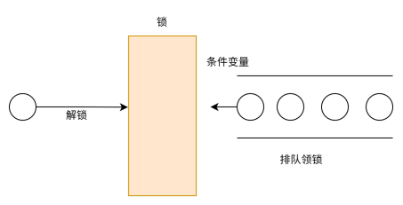

## 线程与TCB

>线程（Thread）是进程内的一个执行分支，线程的执行粒度，要比进程更细。

如何理解？


### linux下的线程与pthread库

**linux没有真正意义的线程**，这在很多教材都提过的观点。究其原因，就如上图所示，让n个PCB来管理一个进程地址空间不就有了线程了。区别windows系统专门设置了TCB结构体，linux选择用PCB来模拟TCB，因此linux可以说没有真正意义的线程，而是叫做**轻量级进程**。


你linux搞特殊是吧？我想使用线程，你告诉我说让我使用轻量级进程。这让用户满意吗？于是linux封装了一个库 **pthread**，让用户可以使用到**用户级线程**，并不能叫做**内核级线程**，因为在linux内核中只有轻量级进程。可以通过下图来理解：


注：

- 轻量级进程:用户级线程 = 1:1
- 用户使用到的TCB结构体并不在内核空间中。


上图中出现了2个名词：线程栈和线程局部存储

#### 线程栈

每一个线程都有自己的调用链，注定了每个线程都要有调用链对应的栈帧结构，用来存储线程函数中的局部变量、函数参数以及函数调用的返回地址等信息。这一点类似进程的main函数的函数栈帧。这里的线程栈由pthread来维护，有了线程栈，才能在内核里创建执行流，有了新的执行流，才是一个真正的线程。

> pthread是如何创建线程栈？
>
> inux下只有轻量级进程的概念，自然linux会提供轻量级进程的接口，pthread库正是对轻量级进程的接口进行了封装，才在用户层创建了线程的概念。
>
> linux下创建轻量级进程的系统接口是clone
>
> 

如何验证？

```cpp
#include <pthread.h>
#include <unistd.h>
#include <iostream>
#include <vector>
using namespace std;
int g_val = 0;
void *thread_routine(void* arg) {
    int* pi = (int*)arg;
    int i = *pi;
    int j = 0;
    while(j < 5) {
        cout << "thread-" << i << ", j=" << j << ", &j=" << &j << ", g_val=" << g_val << ", &g_val=" << &g_val << endl;
        sleep(2);
        j++, g_val++;
    }
    return NULL;
}
int main() {
    int i = 0;
    std:;vector<pthread_t> tids;
    while(i < 4) {
        pthread_t tid;
        pthread_create(&tid, nullptr, thread_routine, (void*)&i);
        sleep(1);
        tids.push_back(tid);
        i++;
    }
    for(int j = 0; j < 4; j++){
        pthread_join(tids[j], nullptr);
        sleep(1);
    }
    sleep(3);
    return 0;
}
```


不同的线程，都执行的同一个函数thread_routine，但函数内部的临时变量j，不是共享的，如果是共享的，那么不同的线程的j的地址应该一样。但结果表明，j的地址都不同。这也表明线程有自己独立的栈结构。

对于全局变量g_val，不同线程是共享的。


插入一个问题：线程栈由多大？

在linux系统中使用 `ulimit -a`可以查看

```
root@hcss-ecs-f8b5:/blog# ulimit -a
real-time non-blocking time  (microseconds, -R) unlimited
core file size              (blocks, -c) 0
data seg size               (kbytes, -d) unlimited
scheduling priority                 (-e) 0
file size                   (blocks, -f) unlimited
pending signals                     (-i) 6628
max locked memory           (kbytes, -l) 226728
max memory size             (kbytes, -m) unlimited
open files                          (-n) 65535
pipe size                (512 bytes, -p) 8
POSIX message queues         (bytes, -q) 819200
real-time priority                  (-r) 0
stack size                  (kbytes, -s) 8192
cpu time                   (seconds, -t) unlimited
max user processes                  (-u) 6628
virtual memory              (kbytes, -v) unlimited
file locks                          (-x) unlimited
```

stack size                  (kbytes, -s) 8192 约为8M


#### 线程的局部存储
如果我想线程拥有私有的全局变量呢？这就要使用线程的局部存储。
`int g_val = 0  改为 __thread in g_val = 0`
此时不同的线程的变量g_val，都是不同的

在变量前加上 `__thread`， 就可以将该变量改为局部存储。除了这个关键字之外，pthread库中也有一些函数可以实现局部存储。

__thread 是 GCC 中用于实现线程局部存储（Thread Local Storage，TLS）的关键字。它可以用来声明线程局部变量，这些变量对于每个线程是唯一的，不同线程之间的变量不会相互影响。**但是它只能声明内置类型，无法声明自定义类型。**
需要注意的是，__thread 关键字是 GCC 的扩展语法，虽然在大多数情况下可以正常工作，但并不是 C 标准的一部分，因此在一些不支持 GCC 扩展语法的编译器中可能无法使用。在 C11 标准中引入了 _Thread_local 关键字，用于实现线程局部存储，具有类似的功能，而且是标准化的语法。


## 线程的竞争与协作

进程地址空间存在的意义是什么？扩大地址空间，内存保护、进程隔离。这中间最重要一点的就是进程隔离，它可以放在数据被随意修改。现在多个线程共享一个进程地址空间，不可避免的就会出现数据竞争的问题。

看下面这段代码：4个线程同时访问全局变量tickets

```cpp
#include <pthread.h>
#include <unistd.h>
#include <iostream>
#include <vector>
using namespace std;

int tickets = 1000;

void *getTickets(void* arg) {
    int* pi = (int*)arg;
    int i = *pi;
    while(1) {
    //票大于0才抢
        if(tickets > 0) {
            usleep(1000);
            printf("thread-%d, get a ticket: %d\n", i, tickets);
            tickets--;
        }
        else {
            break;
        }
    }
    return nullptr;
}
int main() {
    int i = 0;
    std::vector<pthread_t> tids;
    while(i < 4) {
        pthread_t tid;
        pthread_create(&tid, nullptr, getTickets, (void*)&i);
        tids.push_back(tid);
        i++;
    }
    for(int j = 0; j < 4; j++) {
        pthread_join(tids[j], nullptr);
    }
    sleep(3);
    return 0;
}
```


按照抢票的逻辑，票>0才抢，<=0就退出，怎么会出现负数呢？一张票应该属于一个线程，怎么出现了相同数字？问题就出在多线程并发访问。


多线程执行操作共享变量会导致竞争状态，在执行过程中发生了上下文切换，得到了错误的结果。每次运行都可能得到不同的结果，存在不确定性，为了解决这类问题，我们需要引入同步和互斥

### 同步和互斥相关概念

首先了解以下几个概念

- **并发**：指的是多个事情，在同一时间段内同时发生了。

- **并行**：指的是多个事情，在同一时间点上同时发生了。只有在多CPU的情况中，才会出现

- **共享资源**：多个线程之间可以**并发**访问的资源。
- **临界资源**：多个线程**互斥**访问的共享资源。（共享资源 且 同一时间只能由一个线程访问 即为临界资源）
- **临界区**：每个线程内部，访问临界资源的代码，就叫做临界区
- **互斥**：任何时刻，互斥保证有且只有一个执行流进入临界区，访问临界资源，通常对临界资源起保护作用
- **同步**：就是并发进程/线程在一些关键点上可能需要互相等待与互通消息，这种相互制约的等待与互通信息称为进程/线程同步。
- **原子性**：不会被任何调度机制打断的操作，该操作只有两态，要么完成，要么未完成


了解完概念，下面的问题是如何实现线程的同步和互斥？


### 同步和互斥的实现

操作系统提供实现线程协作的措施和方法，主要的方法有两种：

- 锁
- POSIX信号量


#### 互斥锁和条件变量

一个线程进入临界区之前，需要**申请锁**，只有拿了锁，才能执行临界区的代码。锁只有一把，故当一个线程拿了锁后，其他线程在申请锁时就会被阻塞，只有当持有锁的线程执行完临界区代码、进行**解锁**后，其他线程才可以申请锁。此时便实现了多个线程互斥的访问共享资源。

> 锁有2中基本类型：互斥锁（互斥量）和自旋锁，下面以互斥锁为例。


单纯加锁已经解决了数据资源竞争问题，但是又引出了锁资源竞争的问题。不同线程对锁的竞争能力是不同，这可能导致大部分时间，锁都在某一个线程上，这将导致线程的**饥饿问题**


为此，我们需要引入一个同步机制，比如条件变量

> 条件变量（Condition Variable）是一种线程同步机制，需要与互斥锁（Mutex）结合使用，用于在线程间传递某个条件的状态并实现线程的等待和唤醒。条件变量允许一个或多个线程在满足特定条件之前进入等待状态，并在条件被满足时被唤醒。




##### 互斥锁和条件变量的使用（以下采用linux原生API)


##### 互斥锁的原理

锁可以保护临界区被线程互斥访问。但锁同时也是所有线程共享，属于共享资源，那锁自身的互斥问题呢？那必须将申请锁设计成**原子的**。（不会被任何调度机制打断的操作，该操作只有两态，要么完成，要么未完成）
首先我们要有一个共识：**一条汇编语句是原子的**。
但加锁的过程不可能仅仅只是一条汇编语句。那是如何实现加锁过程是原子的呢？

为了实现互斥锁操作,大多数体系结构都提供了swap或exchange指令,该指令的作用是把寄存器和内存单元的数据相交换,由于只有一条指令,保证了原子性,即使是多处理器平台,访问内存的 总线周期也有先后,一个处理器上的交换指令执行时另一个处理器的交换指令只能等待总线周期。


```
lock:
        movb $0, %al
        xchgb %al, mutex
        if(al寄存器的内容〉0) {
        	return 0;
        } else
	        挂起等待;
        goto lock;
unlock:
		movb $l,mutex
		唤醒等待Mutex的线程；
		return 0;
```


#### POSIX信号量

POSIX信号量和SystemV信号量（进程间通信）作用相同，都是用于同步操作，达到无冲突的访问共享资源目的。 但POSIX可以用于线程间同步。

信号量是什么？信号量本质是个**计数器**。类似但是**绝不等于** `int cnt;`(这里的绝不等于体现在信号量的++和--是原子的，但整形变量的++和--不是原子的）

那这个计数器记忆什么数据呢？**临界资源的数量**


当申请时，信号量会预定临界资源给你。就像电影院买票，只要你买了票，不管你是否去看，电影院一定有你的位置。信号量同理，**只要你向信号量申请了临界资源，就一定有可以使用的临界资源**（不用担心临界资源是否就绪、是否存在等问题）

正是这一特性，我们使用信号量就不用像互斥锁一样，加了锁还要用条件变量。

信号量有2个操作P和V，P表示申请，V表示释放。
使用时的顺序：

```
P(信号量)

使用临界资源

V(信号量）
```


## 经典同步问题


### 生产者消费者模型

生成者消费者模型是一种用于解决多线程或多进程间数据交换与同步的经典问题。
在该模型中，生产者负责生产数据并将其放入共享的缓冲区，而消费者则负责从缓冲区中获取数据并进行处理。这种模型通常用于解决生产者与消费者之间速度不匹配的情况，以及避免因为生产者和消费者之间的竞争条件而导致的数据丢失或不一致的问题。


> 这里共享资源准确说是临界资源

生产者消费者模型的组成：
- 3种关系：生产者和生产者，消费者和消费者，生产者和消费者
- 2种角色：生产者、消费者
- 1个场所：特定结构的内存空间

从记忆的角度，我们可以简记为“321”原则。


3种关系：

1. 生产者与生产者：当一个生产者进行生产时，其他生产者不能生产 -- **互斥**（避免争夺同一空间）
2. 消费者与消费者：当一个消费者进行消费时，其他消费者不能消费 -- **互斥** （避免争夺同一资源）
3. 消费者与生产者：当一个生产者进行生产时，消费者不能进行消费 -- **互斥**（原因：假如生产者正在生产，消费者这时要进行消费，刚好消费这个生产者生产的资源，哪你怎么知道生产者此时生产好了吗？消费者拿到完整的资源了吗？因此要互斥）。避免生产者向已满的缓冲区中放入数据，或消费者从空的缓冲区中获取数据的情况发生。-- **同步**


**这个模型的优势在哪？**
一般的结论：
- **解耦生产者和消费者**
- **支持并发**：由于生产者与消费者是两个独立的并发体，他们之间是用缓冲区作为桥梁连接，生产者只需要往缓冲区里丢数据，就可以继续生产下一个数据，而消费者只需要从缓冲区了拿数据即可，这样就不会因为彼此的处理速度而发生阻塞。
- **支持忙闲不均**：当数据制造快的时候，消费者来不及处理，未处理的数据可以暂时存在缓冲区中。 等生产者的制造速度慢下来，消费者再慢慢处理掉。这平衡了生产和消费速率

- **高效**


这里重点说说**高效**，生产者消费者模型高效在哪？注意：前面提到3种关系都包含**互斥**，互斥决定了在共享资源中是串行访问，串行访问一点也不高效。


这里高效体现在非临界区上：

- 对于生产者：我们仅仅提到了它生产数据，它能凭空产生吗？一定需要它去获取“原材料”。因此在**生产数据**前，还有**获取数据**。

- 对于消费者：前文我们指的消费，仅仅表示它把数据拿走了，但它拿走之后呢？一定要进行数据的加工和处理。因此在**消费数据**后，还有**数据的加工和处理**。


临界区的代码是串行的，谈不上高效，但是生产者和消费者的非临界区是可以**并发**访问。而**非临界区的并发访问**才是生产者消费者模型高效的部分。


#### 基于阻塞队列的生产消费模型

在多线程编程中阻塞队列(Blocking Queue)是一种常用于实现生产者和消费者模型的数据结构。其与普通的队列区别：当队列为空时，从队列获取元素的操作将会被阻塞，直到队列中被放入了元素；当队列满时，往队列里存放元素的操作也会被阻塞，直到有元素被从队列中取出(以上的操作都是基于不同的线程来说的，线程在对阻塞队列进程操作时会被阻塞)


```cpp
#pragma once
#include <iostream>
#include <queue>
#include <pthread.h>

template<class T>
class blockqueue
{
    static const int defaultnum = 10;
    // 加锁 - 等待 - 唤醒 - 解锁
public:
    blockqueue(int maxcap = defaultnum):maxcap_(maxcap)
    {
        pthread_mutex_init(&mutex_, nullptr);
        pthread_cond_init(&p_cond_, nullptr);
        pthread_cond_init(&c_cond_, nullptr);
    }
    ~blockqueue()
    {
        pthread_mutex_destroy(&mutex_);
        pthread_cond_destroy(&c_cond_);
        pthread_cond_destroy(&p_cond_);
    }
    T pop()
    {
        pthread_mutex_lock(&mutex_);
        while(q_.empty()) //为什么不用if来判断？
        {
            pthread_cond_wait(&c_cond_, &mutex_);
        }
        T out = q_.front();
        q_.pop();
        pthread_cond_signal(&p_cond_); // 消费后，唤醒生产者
        pthread_mutex_unlock(&mutex_);
        return out;
    }
    void push(const T& in)
    {
        pthread_mutex_lock(&mutex_);
        while(q_.size() == maxcap_)
        {
            pthread_cond_wait(&p_cond_, &mutex_);
        }
        q_.push(in);
        pthread_cond_signal(&c_cond_); // 生产后，唤醒消费者
        pthread_mutex_unlock(&mutex_);
    }
private:
    std::queue<T> q_;
    int maxcap_; 
    pthread_mutex_t mutex_;
    pthread_cond_t c_cond_;
    pthread_cond_t p_cond_;
};
```


细节：为什么在判断条件时，用while循环？


操作系统层面的条件变量（如 `pthread_cond_wait`）在实现上可能因某些原因（如信号中断或内核调度）导致线程被**意外唤醒**，即使没有其他线程显式调用 ` pthread_cond_signal`。即 **伪唤醒**

在上面代码就会导致一个问题，同时唤醒的生产者/消费者线程可能不止一个。


如下图：假设a是被正常唤醒，b，c是伪唤醒


使用while循环后，伪唤醒的b还会先判断以下` q_.size() == maxcap_`


## 锁 *


### 锁的种类

#### 互斥锁和自旋锁

**互斥锁和自旋锁是并发编程中最基础的两种锁**，其核心区别在于**等待锁时的行为**

- **互斥锁**：通过**休眠**让出CPU，减少资源占用，但引入上下文切换开销
- **自旋锁**：通过**忙等待**避免切换，适合短临界区，但可能浪费CPU周期


互斥锁加锁失败时，会从用户态陷入到内核态，让内核帮我们切换线程，虽然简化了使用锁的难
度，但是存在一定的性能开销成本。
那这个开销成本是什么呢？会有两次线程上下文切换的成本：
·当线程加锁失败时，内核会把线程的状态从「运行」状态设置为「睡眠」状态，然后把CPU切换给其
他线程运行；
·接着，当锁被释放时，之前「睡眠」状态的线程会变为「就绪」状态，然后内核会在合适的时间，把
CPU 切换给该线程运行。


#### 读写锁

读写锁由两把锁组成，读锁和写锁。它的应用场景：**能明确区分读操作和写操作，且读操作 多于 写操作**。


### 死锁 *

什么是死锁？比如当两个线程为了保护两个不同的共享资源而使用了两个互斥锁，那么这两个互斥锁应用不当的时候，可能会造成两个线程都在等待对方释放锁，在没有外力的作用下，这些线程会一直相互等待，就没办法继续运行，这种情况就是发生了死锁。


**死锁有四个必要条件**

- **互斥条件**：多个线程不能同时使用同一个资源。
- **请求与保持条件**：线程因请求资源而阻塞时，对已获得的资源保持不放
- **不剥夺条件**：线程已获得的资源，在末使用完之前，不能强行剥夺
- **循环等待条件**：多个线程之间形成一种头尾相接的循环等待资源的关系


如何破坏死锁？打破4个条件的其中一个就行，最常见的就是打破**循环等待条件**，核心就是理清**资源的获取和释放顺序**。


