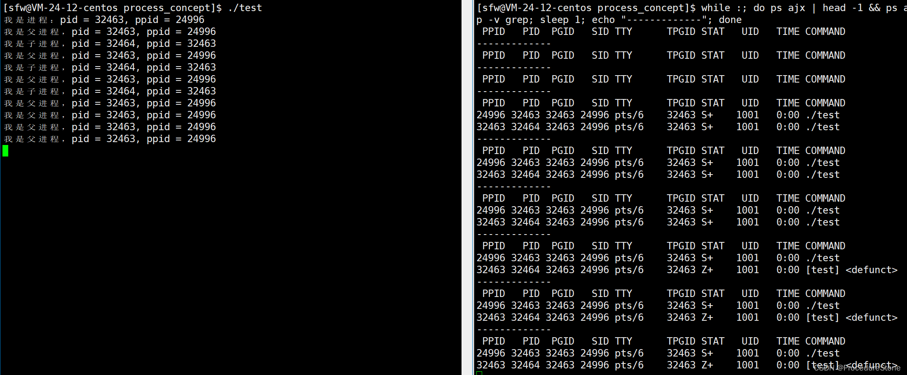
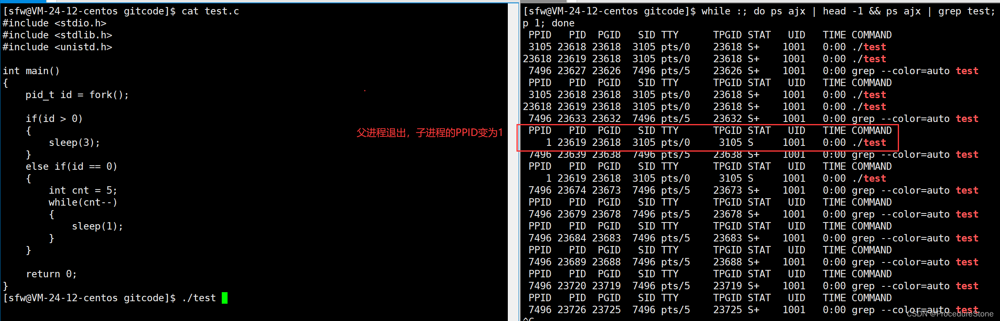
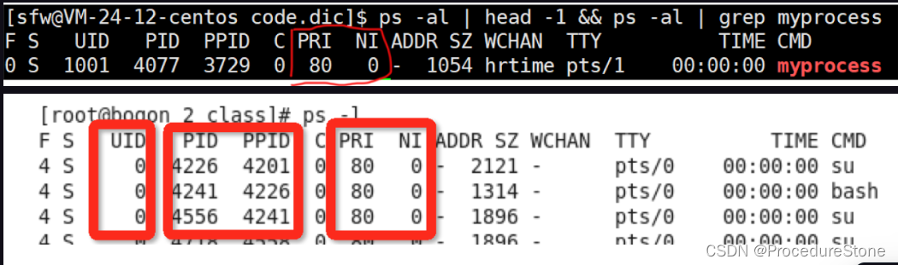
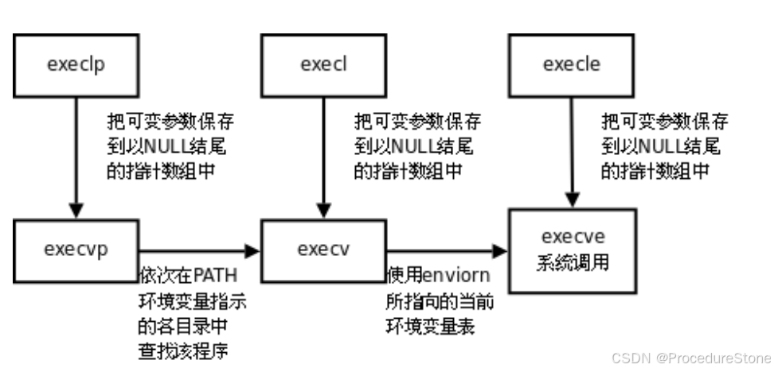

文章图片大部分使用draw.io绘制，一部分来源网上。
emoji [linux进程管理.drawio](linux进程管理.drawio)

## 进程和PCB

什么是进程？
课本上的定义有很多，如：进程是程序的一次执行，是加载到内存的程序，是**系统进行资源分配和调度的一个独立单位**。

我们不必去纠结定义，只需知道2点：如何描述进程？如何管理进程？

描述=提取进程属性，管理=对进程的属性进行管理
由此首先要引出一个概念：进程的PCB

PCB(process control block) 是什么？一句话：**进程属性的集合**，是一个结构体。此时进程就被拆分为2个部分：属性和数据，如下图：


linux下的进程信息存储在`/proc`目录下


### linux下的PCB 
在linux操作系统下的PCB：**task_struct（结构体）**


>task_struct的内容分类：
>1. **标识符**: 描述本进程的唯一标示符，用来区别其他进程。
>2. **状态**: 任务状态，退出代码，退出信号等。
>3. **优先级**: 相对于其他进程的优先级。
>4. 程序计数器: 程序中即将被执行的下一条指令的地址。
>5. 内存指针: 包括程序代码和进程相关数据的指针，还有和其他进程共享的内存块的指针
>6. 上下文数据: 进程执行时处理器的寄存器中的数据[休学例子，要加图CPU，寄存器]。
>7. I／O状态信息: 包括显示的I/O请求,分配给进程的I／O设备和被进程使用的文件列表。
>8. 记账信息: 可能包括处理器时间总和，使用的时钟数总和，时间限制，记账号等。
>9.  ……


### 进程状态

在操作系统学科中，描述了一**个进程活动期间至少具备3种状态**，即进程的三态模型。


但是这几种状态不够应对实际的情况。如果有大量处于阻塞状态的进程，将长时间占据物理内存空间，造成浪费。因此我们新增一种状态——**挂起状态**

> 挂起状态：进程没有占用物理内存空间的状态（关键词：物理内存）
>
> 理解：此时进程的数据会被移到磁盘空间中

其中挂起状态又分为2种：阻塞挂起和就绪挂起

- 阻塞挂起状态：进程在外存，等待事件
- 就绪挂起状态：进程在外存，事件就绪

因此现在有 运行、就绪、阻塞、阻塞挂起、就绪挂起共5种状态，如果再具体一点，还可以加入进程**创建状态**和进程**结束状态**，共7种。


在linux系统中，关于进程状态的定义如下，

```c
static const char * const task_state_array[] = {

	/* states in TASK_REPORT: */
	"R (running)",		/* 0x00 */
	"S (sleeping)",		/* 0x01 */
	"D (disk sleep)",	/* 0x02 */
	"T (stopped)",		/* 0x04 */
	"t (tracing stop)",	/* 0x08 */
	"X (dead)",		/* 0x10 */
	"Z (zombie)",		/* 0x20 */
	"P (parked)",		/* 0x40 */

	/* states beyond TASK_REPORT: */
	"I (idle)",		/* 0x80 */
};
```


#### 磁盘睡眠 -- D

D状态，磁盘睡眠，进程的磁盘睡眠状态（Disk Sleep State）通常是指进程处于等待磁盘I/O操作完成的状态。这种状态通常出现在进程请求进行磁盘读取或写入操作时，但磁盘尚未完成相应的I/O操作，因此进程被阻塞，等待磁盘响应。在这种状态下，进程不会消耗CPU时间，而是被挂起，直到磁盘I/O操作完成。

也就是挂起状态。

#### 暂停和跟踪暂停 -- T和t
Linux操作系统的有个信号`kill -19`， 可以使进程暂停。T状态即进程处于暂停状态。注意不要于S状态混淆，S状态一定是进程在等待某种资源，但T状态不一定在等待某种资源。

那T和t有什么区别呢？

- Stopped（停止）状态：
  进程处于停止状态通常是由于接收到了一个信号，例如SIGSTOP（Ctrl-Z产生的SIGTSTP信号）或者SIGTSTP（通常由shell的暂停命令引发）。这种状态下的进程被挂起，暂时停止执行，但可以通过发送SIGCONT信号来恢复执行。

- Tracing Stop（跟踪停止）状态：
  进程处于跟踪停止状态通常是由于调试器（如GDB）或者ptrace系统调用的作用。在这种状态下，进程被调试器所追踪，通常是因为调试器在进行单步执行、观察或者修改进程的内存等操作。这种状态下的进程暂时停止执行，直到调试器允许其继续执行。


#### 僵尸进程 -- Z
当一个进程（子进程）完成执行后，它的退出状态需要被父进程获取。如果父进程没有主动获取子进程的退出状态，那么子进程就会变成僵尸进程，相当于一个人处于生死之间。


##### 父子进程 *

这里提到了父子进程，那什么是父进程、子进程？如何创建子进程？


下方代码实现：父进程一直运行，子进程执行3次后结束

```c
#include <stdio.h>
#include <sys/types.h>
#include <unistd.h>
#include <stdlib.h>
int main() {
    printf("我是进程：pid = %d，ppid = %d\n"，getpid()，getppid());
    pid_t id = fork();
    if(id == 0) {
        int cnt = 3;
        while(cnt--) {
        	printf("我是子进程，pid =%d，ppid =%d\n"，getpid()，getppid());
        	sleep(1);   
        }
        exit(0);
    }
    else if(id > 0) {
		while(1) {
    		printf("我是父进程，pid = %d，ppid = %d\n"，getpid()，getppid());
    		sleep(1);
    	}
	}
    return 0;
}
```

结果如下：子进程的状态由S+ --> Z+， Z即处于僵尸状态



僵尸进程虽然不会直接对系统造成严重影响，但长时间存在的僵尸进程会对系统的正常运行产生一些间接的危害，包括：可能导致资源耗尽，影响进程管理，降低系统稳定性，因此需要父进程处理僵尸进程。
父进程通常需要调用类似于wait()或waitpid()的系统调用来等待子进程的退出，并获取其退出状态。

**当然如果父进程也结束，系统会自动把子进程释放。**


#### 孤儿进程
僵尸进程是子进程结束，但父进程未结束。如何父进程先结束，子进程后结束呢？那么子进程便会变为孤儿进程，并被**托孤**给1号进程，即操作系统。




### 进程优先级


PRI（Priority）：PRI 表示进程的静态优先级或调度优先级。俗点说就是程序被CPU执行的先后顺序，**此值越小,进程的优先级别越高。**
NI（Nice Value）：NI 表示进程的 Nice 值，是一个表示进程调度优先级的数值。它的作用是改变PRI的值。

通过PRI和NI可以调整进程的优先级，计算公式如下：

`PRI(new)=PRI(old)+nice` '

这样，当nice值为负值的时候，那么该程序将会优先级值将变小，即其优先级会变高，则其越快被执行所以，调整进程优先级，在Linux下，就是调整进程nice值

注意：nice 的范围在 【-20， 19】
PRI(old) 最小是80，如果原来的PRI < 80， 则会直接从80开始算：
因此：PRI 范围【60， 99】，但在计算新的PRI时，最小从80开始
举例：原来 ： PRI = 60 NI = 0;
		更改：令PRI = 100
		结果：PRI = 99 NI = 19

那如何更改nice值呢？

在Linux系统中，`nice`命令用于启动一个新的进程，并设置其优先级。而`renice`命令用于修改已经运行的进程的优先级。

 `nice`命令的使用：

```bash
nice [OPTION] [COMMAND [ARG]...]
```

`nice`命令通过改变进程的优先级来影响其调度。数值越大，优先级越低。默认情况下，优先级是0。

例如，运行一个命令并设置其优先级：

```bash
nice -n <优先级> <命令>
```

例如，将`ls`命令的优先级降低为10：

```bash
nice -n 10 ls
```

`renice`命令的使用：

```bash
renice [优先级] -p <进程ID> [<进程ID>...]
```

`renice`命令用于修改已经运行的进程的优先级。可以指定一个或多个进程ID来修改它们的优先级。

例如，将进程ID为1234的进程的优先级设置为10：

```bash
renice 10 -p 1234
```


## 进程地址空间

进程地址空间是操作系统为每个进程分配的**虚拟内存**区域，它让每个进程有独立的地址范围，隔离了物理内存，提高了安全性和管理效率。


### 进程地址空间分布

linux下进程地址空间如下：内核空间和用户空间按1 : 3

> Linux系统与Windows系统在进程地址空间设计上存在显著差异，而不同编程语言的进程地址空间本质上是统一的（受操作系统管理）
>
> **Windows**：默认采用 **2:2模式**（用户空间和内核空间各占2GB）但可通过设置 `Large-Address-Aware` 标志调整为 **3:1模式**
>
> 但是它们的用户空间都包含**代码段、数据段、堆、栈**等


验证一下：

```cpp
#include <iostream>
using namespace std;
int g_A;
int g_B = 100;
int main()
{
        const char* a = "ab";
        static int s_A = 5;
        int A;
        int B;
        int C;
        int* m_A = new int;
        int* m_B = new int;
        int* m_C = new int;
        printf("字符常量：a : %p\n", a);
        cout << "静态变量：s_A : " << &s_A << endl;
        cout << "全局变量：未初始化g_A : " << &g_A << endl;
        cout << "全局变量：已初始化g_B : " << &g_B << endl;
        cout << "栈区：A : " << &A << endl;
        cout << "栈区：B : " << &B << endl;
        cout << "栈区：C : " << &C << endl;
        cout << "堆区：m_A : " << m_A << endl;
        cout << "堆区：m_B : " << m_B << endl;
        cout << "堆区：m_C : " << m_C << endl;
}
```

结果如下：

```
ubuntu g++:
字符常量：a : 0x5649d4534009
静态变量：s_A : 0x5649d4536014
全局变量：未初始化g_A : 0x5649d4536154 未初始化地址 > 已初始化地址 符合
全局变量：已初始化g_B : 0x5649d4536010
栈区：A : 0x7ffc892fb3cc A到B栈区的地址是增长的, 不符合
栈区：B : 0x7ffc892fb3d0
栈区：C : 0x7ffc892fb3d4
堆区：m_A : 0x5649d5eadeb0 堆区的地址是增长的，符合
堆区：m_B : 0x5649d5eaded0
堆区：m_C : 0x5649d5eadef0
```

这里栈区的地址是增长的，不是应该是减少吗？我再测试一下windows下vs2019

```
windows vs2019
字符常量：a : 00639B30
静态变量：s_A : 0063C004
全局变量：未初始化g_A : 0063C3E0
全局变量：已初始化g_B : 0063C000
栈区：A : 004FFBA8	A到B栈区的地址是下降的, 符合
栈区：B : 004FFB9C
栈区：C : 004FFB90
堆区：m_A : 0069FD68 堆区的地址是增长的，符合
堆区：m_B : 0069FD98
堆区：m_C : 006A0118
```

这是什么情况？linux栈区是向高地址分配？windows的栈区是向低地址分配？这个问题我之前查阅的时候，得到答案是**局部变量按编译器自己方式进行分配**。

？？？

我对此很懵逼，后来我才理解。这里需要引入一个概念：**函数栈帧**

> 函数栈帧（stack frame）就是函数调用过程中在程序的调用栈（call stack）所开辟的空间，这些空间是用来存放：
>
> - 函数参数和函数返回值
> - 临时变量（包括函数的非静态的局部变量以及编译器自动生产的其他临时变量）
> - 保存上下文信息（包括在函数调用前后需要保持不变的寄存器）。


### 虚拟地址和页表

前面提到，进程地址空间是操作系统为每个进程分配的**虚拟内存**区域，这么说，在进程中使用的地址都是虚拟地址，如何证明？来看下面一段代码

```cpp
#include <sys/types.h>
#include <unistd.h>
#include <iostream>
int g_val = 100;

int main() {
	pid_t id = fork();
	if(id == 0) {
		g_val = 200;
		printf("子进程：g_val = %d, &g_val = %p\n", g_val, &g_val);
	}
	else if(id > 0) {
		printf("父进程：g_val = %d, &g_val = %p\n", g_val, &g_val);
	}
}

结果：
父进程：g_val = 100, &g_val = 0x55631bc26010
子进程：g_val = 200, &g_val = 0x55631bc26010
```

子进程更改数据后，会发生写时拷贝，因此子进程和父进程的g_val值不一样，符合预期，但是为什么发生了写时拷贝，父子进程的g_val地址还是相同？
**显然这里的地址一定不是真实的地址。**


那虚拟地址如何于物理地址联系呢？通过**页表**与物理地址映射。

回到fork里的问题：为什么父子进程不同的值有着相同的地址？因为这里的地址是虚拟地址。子进程只需更改子进程页表。


## 进程控制

前文提到linux下进程有7种状态，如果从进程控制的角度，我们关心

1. 进程如何创建
2. 进程运行结束，结果是否正确？
3. 进程异常，如何终止？


### 创建进程

系统创建进程的流程如下：

1. 申请一个空白的PCB，初始化PCB；
2. 为进程分配运行时所必需的资源；
3. 将PCB 插入到就绪队列，等待进程调度；

用户如何创建进程？

- 运行一个可执行程序
- fork创建子进程


### 进程等待

当一个进程（子进程）完成执行后，它的退出状态需要被父进程获取。如果父进程没有主动获取子进程的退出状态，那么子进程就会变成僵尸进程。**僵尸进程无法被信号 kill -9 杀死，如果放着不管，就会造成内存泄漏**。
如何解决呢？此时需要父进程通过进程等待的方式，回收子进程资源，获取子进程退出信息。

```cpp
#include<sys/types.h>
#include<sys/wait.h>

pid_t wait(int*status);
返回值：
 成功返回被等待进程pid，失败返回-1。
参数：
 输出型参数，获取子进程退出状态,不关心则可以设置成为NULL


pid_ t waitpid(pid_t pid, int *status, int options);
返回值：
 当正常返回的时候waitpid返回收集到的子进程的进程ID；
 如果设置了选项WNOHANG,而调用中waitpid发现没有已退出的子进程可收集,则返回0；
 如果调用中出错,则返回-1,这时errno会被设置成相应的值以指示错误所在；
参数：
 pid：
 Pid=-1,等待任一个子进程。与wait等效。
 Pid>0.等待其进程ID与pid相等的子进程。
 status:
 WIFEXITED(status): 若为正常终止子进程返回的状态，则为真。（查看进程是否是正常退出）
 WEXITSTATUS(status): 若WIFEXITED非零，提取子进程退出码。（查看进程的退出码）
 options:
 WNOHANG: 若pid指定的子进程没有结束，则waitpid()函数返回0，不予以等待。若正常结束，则返回该子进
程的ID。
```


使用案例：

```cpp
#include <unistd.h>
#include <sys/types.h>
#include <sys/wait.h>
#include <iostream>
using std::endl;
using std::cout;
int main()
{
	for(int i = 0; i < 5; i++)
	{
		pid_t id = fork();
		if(id == 0)
		{
			cout << "create a child process, pid = " << getpid() << endl;
			exit(i);
		}
	}
	sleep(3); //经过3秒后，wait子进程
	for(int i = 0; i < 5; i++)
	{
		int status;
		pid_t id = wait(&status);
		if(id > 0)
		{
			cout << "wait a process pid = " << id << " status = " << status << endl;
		}
	}
	return 0;
}

结果：
create a child process, pid = 230665
create a child process, pid = 230667
create a child process, pid = 230668
create a child process, pid = 230669
create a child process, pid = 230666
wait a process pid = 230665 status = 0
wait a process pid = 230666 status = 256
wait a process pid = 230667 status = 512
wait a process pid = 230668 status = 768
wait a process pid = 230669 status = 1024

```

使用`while :; do ps ajx | head -1 && ps ajx | grep t1; sleep 1; done`来监控 
发现5个僵尸进程，被wait回收了

```cpp
root@iZbp1inz4ol3gjahpjal9qZ:~# while :; do ps ajx | head -1 && ps ajx | grep t1; sleep 1; done
   PPID     PID    PGID     SID TTY        TPGID STAT   UID   TIME COMMAND
 229980  230652  230651  229980 pts/3     230651 S+       0   0:00 grep --color=auto t
   PPID     PID    PGID     SID TTY        TPGID STAT   UID   TIME COMMAND
 229980  230657  230656  229980 pts/3     230656 S+       0   0:00 grep --color=auto t
   PPID     PID    PGID     SID TTY        TPGID STAT   UID   TIME COMMAND
 229980  230662  230661  229980 pts/3     230661 S+       0   0:00 grep --color=auto t
   PPID     PID    PGID     SID TTY        TPGID STAT   UID   TIME COMMAND
 229863  230664  230664  229863 pts/2     230664 S+       0   0:00 ./t1
 230664  230665  230664  229863 pts/2     230664 Z+       0   0:00 [t1] <defunct>
 230664  230666  230664  229863 pts/2     230664 Z+       0   0:00 [t1] <defunct>
 230664  230667  230664  229863 pts/2     230664 Z+       0   0:00 [t1] <defunct>
 230664  230668  230664  229863 pts/2     230664 Z+       0   0:00 [t1] <defunct>
 230664  230669  230664  229863 pts/2     230664 Z+       0   0:00 [t1] <defunct>
 229980  230673  230672  229980 pts/3     230672 S+       0   0:00 grep --color=auto t
   PPID     PID    PGID     SID TTY        TPGID STAT   UID   TIME COMMAND
 229863  230664  230664  229863 pts/2     230664 S+       0   0:00 ./t1
 230664  230665  230664  229863 pts/2     230664 Z+       0   0:00 [t1] <defunct>
 230664  230666  230664  229863 pts/2     230664 Z+       0   0:00 [t1] <defunct>
 230664  230667  230664  229863 pts/2     230664 Z+       0   0:00 [t1] <defunct>
 230664  230668  230664  229863 pts/2     230664 Z+       0   0:00 [t1] <defunct>
 230664  230669  230664  229863 pts/2     230664 Z+       0   0:00 [t1] <defunct>
 229980  230678  230677  229980 pts/3     230677 S+       0   0:00 grep --color=auto t
   PPID     PID    PGID     SID TTY        TPGID STAT   UID   TIME COMMAND
 229863  230664  230664  229863 pts/2     230664 S+       0   0:00 ./t1
 230664  230665  230664  229863 pts/2     230664 Z+       0   0:00 [t1] <defunct>
 230664  230666  230664  229863 pts/2     230664 Z+       0   0:00 [t1] <defunct>
 230664  230667  230664  229863 pts/2     230664 Z+       0   0:00 [t1] <defunct>
 230664  230668  230664  229863 pts/2     230664 Z+       0   0:00 [t1] <defunct>
 230664  230669  230664  229863 pts/2     230664 Z+       0   0:00 [t1] <defunct>
 229980  230683  230682  229980 pts/3     230682 S+       0   0:00 grep --color=auto t
   PPID     PID    PGID     SID TTY        TPGID STAT   UID   TIME COMMAND
 229980  230688  230687  229980 pts/3     230687 S+       0   0:00 grep --color=auto t
   PPID     PID    PGID     SID TTY        TPGID STAT   UID   TIME COMMAND
 229980  230693  230692  229980 pts/3     230692 S+       0   0:00 grep --color=auto t

```


#### 进程退出信息

wait和waitpid，都有一个status参数，该参数是一个输出型参数，由操作系统填充。

- 如果传递NULL，表示不关心子进程的退出状态信息。
- 否则，操作系统会根据该参数，将子进程的退出信息反馈给父进程。

status不能简单的当作整形来看待，可以当作位图来看待，具体细节如下图（只研究status低16比特位）：

```cpp
int status;
pid_t id = wait(&status);
```


正常退出看退出码，异常退出看信号。status作为子进程的退出信息，通过位图的方式将退出码和信号的信息存储在比特位中。

你可以通过status的值来分析它的退出信息，如果你嫌麻烦，可以使用2个宏

```cpp
 WIFEXITED(status): 若为正常终止子进程返回的状态，则为真。（查看进程是否是正常退出）
 WEXITSTATUS(status): 若WIFEXITED非零，提取子进程退出码。（查看进程的退出码）
```


### 进程替换

当进程调用一种exec函数时,该进程的用户空间代码和数据完全被新程序替换,从新程序的启动进程程开始执行。调用exec并不创建新进程,所以调用exec前后该进程的id并未改变。


函数关系：
事实上,只有execve是真正的系统调用,其它五个函数最终都调用 execve,所以execve在man手册 第2节,其它函数在man手册第3节。这些函数之间的关系如下图所示

