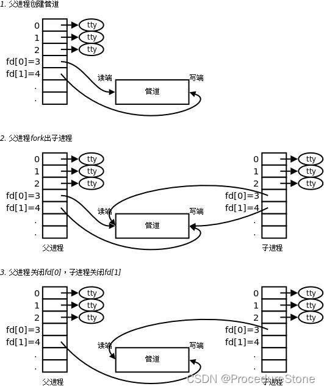
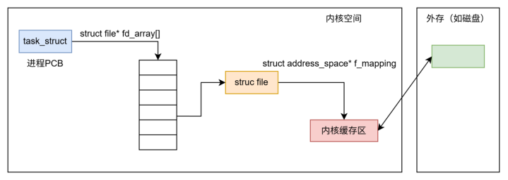
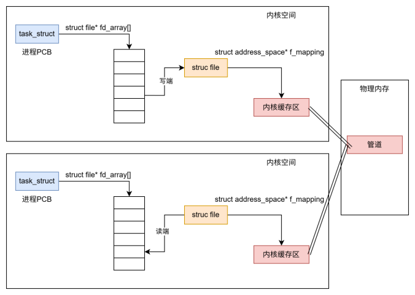
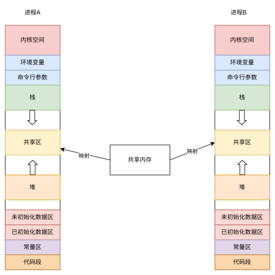

---
title: "Linux 进程间通信"
description: "从入门到精通的 Linux 进程间通信"
date: 2025-04-03
slug: "linux-process-communication"
categories:
    - linux
tags:
    - linux进程间通信
---


文章图片大部分使用draw.io绘制，一部分来源网上。
emoji [linux进程管理.drawio](../linux进程管理.drawio)


## 进程间通信

>进程间通信（Inter-Process Communication，IPC）是指在操作系统中，不同的进程之间进行数据交换、信息传递和同步操作的机制。在多任务操作系统中，不同的进程可能同时运行，它们之间可能需要进行数据共享、协作完成某项任务等操作，这就需要进程间通信。
>进程间通信目的：
>
>1. 数据传输：一个进程需要将它的数据发送给另一个进程
>2. 资源共享：多个进程之间共享同样的资源。
>3. 通知事件：一个进程需要向另一个或一组进程发送消息，通知它（它们）发生了某种事件（如进程终止时要通知父进程）。
>4. 进程控制：有些进程希望完全控制另一个进程的执行（如Debug进程），此时控制进程希望能够拦截另一个进程的所有陷入和异常，并能够及时知道它的状态改变


如何理解进程间通信：**本质是让不同的进程看到同一份资源**。

1. 那如何让不同进程看到同一份资源呢？
2. 资源又是什么呢？

 怀着这2个问题，我们来看看进程通信模块：
 一般操作系统会有一个独立的通信模块，隶属于文件系统, 即IPC通信模块。
在linux内核刚被设计时，不支持通信，后来发现通信很重要，于是很多开发人员开始设计通信模块。当时的设计一个通信模块并不难，很多人提出了不同设计思路，谁也不服谁，为了统一，制定了标准。
最后落地了2套标准：system V && posix


进程间通信的分类：

>管道
>
>1. 匿名管道pipe
>2. 命名管道
>
>System V IPC
>
>1. System V 消息队列
>2. System V 共享内存
> 3. 3 .System V 信号量
>
>POSIX IPC
>
>1. 消息队列
>2. 共享内存
>3. 信号量
>4. 互斥量
>5. 条件变量
>6. 读写锁


## 管道

在使用linux命令时，常常需要使用管道

```bash
ps aux | grep name
```

这里的`丨`竖线就是一个管道，它的功能是将前一个命令的输出，作为后一个命令的输入，采用FIFO（先进先出）的传输方式。

这种管道没有名字，称为**匿名管道**

有了匿名管道，那肯定还有**命名管道**。命名管道通过`mkfifo`来创建

```
mkfifo name
```


### 匿名管道

匿名管道是如何创建的呢？这涉及到一个系统调用：pipe

```c
#include <unistd.h>
功能:创建管道
原型
int pipe(int pipefd[2]);
参数
pipefd：文件描述符数组,输出型参数，其中pipefd[0]存放读端的文件描述符, pipefd[1]存放读端的文件描述符
返回值:成功返回0，失败返回错误代码
```

管道通常是**单向通信**，主要是为了简化设计。如果要进行双向通信，那就创造两个管道。




案例：

```cpp
#include <unistd.h>
#include <cassert>

int main()
{
    //创建管道，让父进程写，子进程读
    int pipefd[2];
    int n = pipe(pipefd);
    assert(n != -1);
    pid_t id = fork();
    if(id == 0)
    {
        //子进程 -- 读取管道
        close(pipefd[1]);//关闭写端,留下读端
        
        //……子进程接受数据
 
        close(pipefd[0]);
        exit(0);
    }
    else if(id > 0)
    {
        //父进程 -- 写入管道
        close(pipefd[0]);//关闭读端，留下写端

        //……父进程写入数据 
        
        close(pipefd[1]);
    }
    return 0;
}
```


### 命名管道


### 理解管道


linux下一切皆文件，管道能读能写，肯定是一种文件。一般情况下，进程管理文件如下图。



> 这里内核缓存区到外存，要通过页表，到物理内存，在通过DMA写入外存。

管道不同于上面的形式，**它是一种内存级别的文件，本质就是内核里面的一串缓存**。




## 共享内存

听名字就懂了，具体原理：拿出一块虚拟地址空间来，映射到相同的物理内存中。




## 套接字（socket）

