---
title: "Linux 进程"
description: "从入门到精通的 Linux 进程"
date: 2025-04-03
slug: "linux-process"
categories:
    - System
    - Linux
---


## 进程间通信

>进程间通信（Inter-Process Communication，IPC）是指在操作系统中，不同的进程之间进行数据交换、信息传递和同步操作的机制。在多任务操作系统中，不同的进程可能同时运行，它们之间可能需要进行数据共享、协作完成某项任务等操作，这就需要进程间通信。
>进程间通信目的：
>
>1. 数据传输：一个进程需要将它的数据发送给另一个进程
>2. 资源共享：多个进程之间共享同样的资源。
>3. 通知事件：一个进程需要向另一个或一组进程发送消息，通知它（它们）发生了某种事件（如进程终止时要通知父进程）。
>4. 进程控制：有些进程希望完全控制另一个进程的执行（如Debug进程），此时控制进程希望能够拦截另一个进程的所有陷入和异常，并能够及时知道它的状态改变


如何理解进程间通信：**本质是让不同的进程看到同一份资源**。

1. 那如何让不同进程看到同一份资源呢？
2. 资源又是什么呢？

 怀着这2个问题，我们来看看进程通信模块：
 一般操作系统会有一个独立的通信模块，隶属于文件系统, 即IPC通信模块。
在linux内核刚被设计时，不支持通信，后来发现通信很重要，于是很多开发人员开始设计通信模块。当时的设计一个通信模块并不难，很多人提出了不同设计思路，谁也不服谁，为了统一，制定了标准。
最后落地了2套标准：system V && posix


进程间通信的分类：

>管道
>
>1. 匿名管道pipe
>2. 命名管道
>
>System V IPC
>
>1. System V 消息队列
>2. System V 共享内存
>   3 .System V 信号量
>
>POSIX IPC
>
>1. 消息队列
>2. 共享内存
>3. 信号量
>4. 互斥量
>5. 条件变量
>6. 读写锁


## 一、管道

管道是Unix中最古老的进程间通信的形式，所谓的“管道”，指的是从一个进程连接到另一个进程的一个**数据流**。
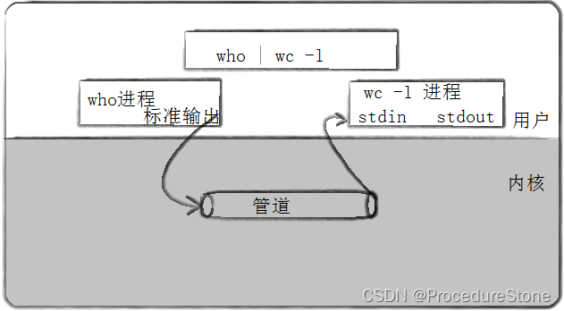
如何理解？
对于一个文件，我们普遍印象如下图，进程打开文件，通过写(读)操作，写入(读取）文件缓冲区，再由文件缓冲区刷新到磁盘里。
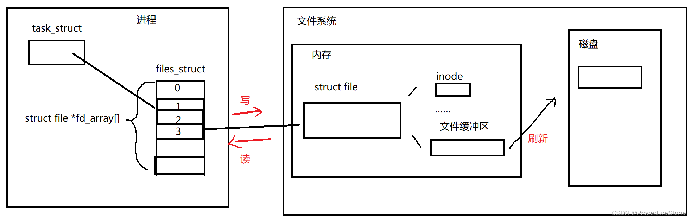
现在有一类文件，它抛弃了最后一步，即将缓冲区的内容刷新到磁盘上，所有操作仅在内存上完成。这一类文件即是**内存级文件**。
假如现在该进程创建了一个子进程，子进程会继承父进程的file_struct，故都指向了一个内存级文件，现在我们便实现了**让不同的进程看到同一份资源**。然后我们让父进程和子进程一个只读，一个只写，不就可以实现两者进行**单向通信**了吗？而**这种特殊的文件就是管道**。这也符合linux下一切皆文件的观点。
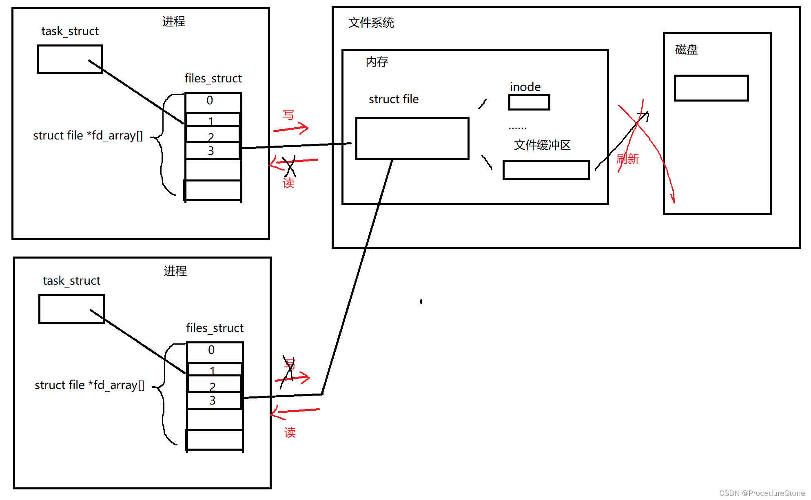
管道有两种，匿名管道和命名管道。
匿名管道应用于具有血缘关系的进程
命名管道应用于无血缘关系的进程

### 匿名管道

```cpp
#include <unistd.h>
功能:创建匿名管道
原型
int pipe(int pipefd[2]);
参数
pipefd：文件描述符数组,输出型参数，其中pipefd[0]存放读端的文件描述符, pipefd[1]存放读端的文件描述符
返回值:成功返回0，失败返回错误代码
```

管道通常是**单向通信**，主要是为了简化设计。如果要进行双向通信，那就创造两个管道。


```cpp
#include <unistd.h>
#include <cassert>

int main()
{
    //创建管道，让父进程写，子进程读
    int pipefd[2];
    int n = pipe(pipefd);
    assert(n != -1);
    pid_t id = fork();
    if(id == 0)
    {
        //子进程 -- 读取管道
        close(pipefd[1]);//关闭写端,留下读端
        
        //……子进程接受数据
 
        close(pipefd[0]);
        exit(0);
    }
    else if(id > 0)
    {
        //父进程 -- 写入管道
        close(pipefd[0]);//关闭读端，留下写端

        //……父进程写入数据 
        
        close(pipefd[1]);
    }
    return 0;
}
```

下面给一个完整的代码：

```cpp
#include <unistd.h>
#include <cassert>
#include <cstdlib>
#include <sys/types.h>
#include <sys/wait.h>
#include <iostream>
#include <string>

ssize_t SendMessage(int fd, std::string& message)
{
    return write(fd, (char*)message.c_str(), message.size());
}
ssize_t ReceiveMessage(int fd, std::string* message)
{
    char buf[1024];
    int n = read(fd, buf, sizeof buf);
    if(n == -1)
    {
        return n;
    }
    buf[n] = '\0';
    *message = buf;
    return n;
}
int main()
{
    //创建管道，让父进程写，子进程读
    int pipefd[2];
    int n = pipe(pipefd);
    assert(n != -1);
    pid_t id = fork();
    if(id == 0)
    {
        //子进程 -- 读取管道
        close(pipefd[1]);//关闭写端,留下读端

        //子进程接受数据
        ssize_t n = 0;
        do
        {
            std::string message;
            n = ReceiveMessage(pipefd[0], &message);
            std::cout << "child process receive: " << message << std::endl;         
        } while (n > 0);
        close(pipefd[0]);
        exit(0);
    }
    else if(id > 0)
    {
        //父进程 -- 写入管道
        close(pipefd[0]);//关闭读端，留下写端

        //父进程写入数据 
        while(1)
        {
            std::string message = "66666";
            std::cout << "father send message: " << message << std::endl; 
            n = SendMessage(pipefd[1], message);
            sleep(1);
        }
        close(pipefd[1]);
    }
    //进程等待
    int status;
    pid_t pid = waitpid(id, &status, 0);

    std::cout << "pid = " << pid << " return: " << ((status >> 8) & 0x7f);
    return 0;
}
```

### 管道特征

1. 管道是面向字节流
2. 管道生命周期随文件

管道的4种情况：

1. 读写端正常，管道如果为空，读写端阻塞
2. 读写端正常，写端一直写，读端不读，当管道满了，写端被阻塞
3. 读写端不正常，写端关闭，读端read会返回0，表明读到了文件结尾，不会阻塞
4. 读写端不正常，读端关闭，写端写入则操作系统会杀掉正在写入的进程，即发生信号SIGPIPE


### 命名管道

上面讲到的匿名管道应用于具有血缘关系的管道，如果我们要让俩个不相干的进程进行通信，就要使用命名管道。

linux下有个命令`mkfifo`，它的作用是创造一个文件类型为p的文件。使用时：`mkfifo filename` 如下图：

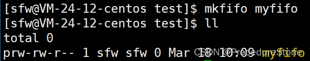
命名管道和匿名管道的性质一样，是一种特殊的文件形式，不存储数据，只传递数据。
因此它的文件大小一直显示为0。
使用如下：


linux也提供了mkfifo的系统接口，如下

```cpp
NAME
       mkfifo, mkfifoat - make a FIFO special file (a named pipe)

SYNOPSIS
       #include <sys/types.h>
       #include <sys/stat.h>

       int mkfifo(const char *pathname, mode_t mode);

参数：mode即文件权限

生成命名管道后，用文件的操作函数来操作


命名管道的打开规则
如果当前打开操作是为读而打开FIFO时
O_NONBLOCK disable：阻塞直到有相应进程为写而打开该FIFO
O_NONBLOCK enable：立刻返回成功
如果当前打开操作是为写而打开FIFO时
O_NONBLOCK disable：阻塞直到有相应进程为读而打开该FIFO
O_NONBLOCK enable：立刻返回失败，错误码为ENXIO

```


下面是一个简单演示：

common.hpp

```cpp
#include <iostream>
#include <cstring>
#include <cstdlib>
#include <cerrno>
#include <sys/types.h>
#include <sys/stat.h>
#include <fcntl.h>
#include <unistd.h>

#define FIFO_PATH "./myfifo"
#define MODE 0664

enum sfw
{
    FIFO_MKFIFO = 1,
    FIFO_OPEN,
    FIFO_READ,
    FIFO_UNLINK
};
```

client.cc

```cpp
#include "common.hpp"

using namespace std;

int main()
{
    int fd = open(FIFO_PATH, O_WRONLY);
    if(fd < 0)
    {
        perror("open");
        exit(FIFO_OPEN);
    }
    string line;
    while(1)
    {
        cout << "clien sent# ";
        getline(cin, line);
        write(fd, line.c_str(), line.size());

    }
    close(fd);
    return 0;
}
```

server.cc

```cpp
#include "common.hpp"

using namespace std;

int main()
{
//创建管道
    int n = mkfifo(FIFO_PATH, MODE);
    if(n == -1)
    {
        perror("mkfifo");
        exit(FIFO_MKFIFO);
    }
//打开管道
    int fd = open(FIFO_PATH, O_RDONLY);
    if(fd < 0)
    {
        perror("open");
        exit(FIFO_OPEN);
    }
    //
    while(1)
    {
        char buffer[1024] = {0};
        int x = read(fd, buffer, sizeof(buffer));
        if(x > 0)
        {
            buffer[x] = 0;
            cout << "clien say@ " << buffer << endl;
        }
        else if(x == 0)
        {
            cout << "client quit" << endl;
            break;
        }
        else 
        {
            perror("read");
            exit(FIFO_READ);
        }
    }
    close(fd);

    int x = unlink(FIFO_PATH);//删除管道
    if(x == -1)
    {
        perror("unlink");
        exit(FIFO_UNLINK);
    }
    cout << "server quit" << endl;
    return 0;
}
```


## 二、system V 共享内存

共享内存区是最快的IPC形式。一旦这样的内存映射到共享它的进程的地址空间，这些进程间数据传递不再涉及到内核，换句话说是进程不再通过执行进入内核的系统调用来传递彼此的数据
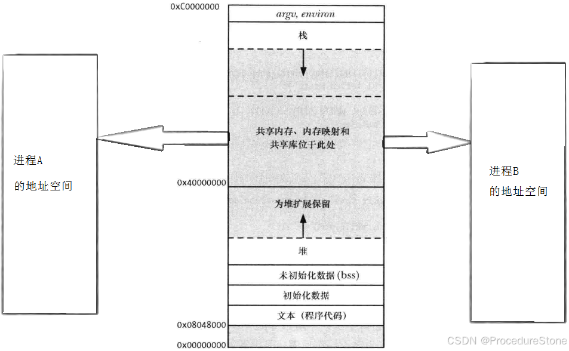

### 共享内存方法

我们想使用共享内存，首先要在物理内存上开一个空间，然后要将物理内存上的空间映射到不同的进程上，之后就可以使用了。

### 创建共享内存

```cpp
功能：用来创建共享内存
原型
 int shmget(key_t key, size_t size, int shmflg);
参数
 	key:这个共享内存段名字
 	size:共享内存大小
 	shmflg:由九个权限标志构成，它们的用法和创建文件时使用的mode模式标志是一样的
 	
 	IPC_CREAT：Create a new segment.  If this flag is not used, then shmget() will find the segment associated with key and check to see if the user has permission to access the segment.
 	IPC_EXCL：This flag is used with IPC_CREAT to ensure that this call creates the segment.  If the segment already exists, the call fails
返回值：成功返回一个非负整数，即该共享内存段的标识码；失败返回-1

```

理解：
key这个参数是什么东西？我们要想进程看到共享内存（记作A），首先要找到A。同一时间，物理内存里可能有很多共享内存，因此，查找的过程中，我们要还要区分A与其他共享内存。这一切都导致共享内存需要有一个唯一的标志，即参数key
那参数key传什么？我随便传个数字，可以吗？当然可以，但这有个问题：如果你传的数字和系统中某个共享内存的key冲突了，怎么办？显然自己手动设置key，不妥。系统为我们提供了一个生成key的函数

```cpp
NAME
       ftok - convert a pathname and a project identifier to a System V IPC key

SYNOPSIS
       #include <sys/types.h>
       #include <sys/ipc.h>

       key_t ftok(const char *pathname, int proj_id);
       
ftok根据路径名，提取文件信息，再根据这些文件信息及project ID合成key，
pathname和proj_id由用户自己约定
```

size，单位为字节，假如我们传入4097，那么共享内存的大小应该是4097，但实际上，共享内存大小是4096 * 2，但只允许你使用其中的4097。操作系统在分配共享内存大小时是以**4096的整数倍**分配。

shmflg， 这里的标志位最常用是什么组合：
创建共享内存：传 `IPC_CREAT | IPC_EXCL | 0666`
获取共享内存：传`IPC_CREAT`


使用:

```cpp
#include <sys/ipc.h>
#include <sys/shm.h>
#include <sys/types.h>

#include <iostream>

#define PATHNAME "./main"
#define PROJ_ID 0x8848
key_t CreateKey()
{
	key_t key = ftok(PATHNAME, PROJ_ID);
    if(key < 0)
    {
        std::cerr << "ftok fail" << std::endl;
        return -1;
    }
    return key;
}
int ComMem(key_t key, size_t size, int shmflg)
{
    int shmid = shmget(key, size, shmflg);
    if(shmid < 0)
    {
        std::cerr << "shmget fali" << std::endl;
        return -1;
    }
    return shmid;
}
int CreateComMem(key_t key, size_t size)
{
    return ComMem(key, size, IPC_CREAT | IPC_EXCL | 0666);
}
int GetComMem(key_t key, size_t size)
{
    return ComMem(key, size, IPC_CREAT);
}
```

### 映射到进程地址空间

```cpp
功能：将共享内存段连接到进程地址空间
原型
 void *shmat(int shmid, const void *shmaddr, int shmflg);
参数
 shmid: 共享内存标识
 shmaddr:指定连接的地址
 shmflg:它的两个可能取值是SHM_RND和SHM_RDONLY
返回值：成功返回一个指针，指向共享内存第一个节；失败返回-1

.

shmaddr为NULL，核心自动选择一个地址
shmaddr不为NULL且shmflg无SHM_RND标记，则以shmaddr为连接地址。
shmaddr不为NULL且shmflg设置了SHM_RND标记，则连接的地址会自动向下调整为SHMLBA的整数倍。公式：shmaddr - 
(shmaddr % SHMLBA)
shmflg=SHM_RDONLY，表示连接操作用来只读共享内存


功能：将共享内存段与当前进程脱离
原型
 int shmdt(const void *shmaddr);
参数
 shmaddr: 由shmat所返回的指针
返回值：成功返回0；失败返回-1
注意：将共享内存段与当前进程脱离不等于删除共享内存段
```

### 控制共享内存

```cpp
功能：用于控制共享内存
原型
 int shmctl(int shmid, int cmd, struct shmid_ds *buf);
参数
 shmid:由shmget返回的共享内存标识码
 cmd:将要采取的动作（有三个可取值）
 buf:指向一个保存着共享内存的模式状态和访问权限的数据结构
返回值：成功返回0；失败返回-1
```

```cpp
struct shmid_ds {
 struct ipc_perm shm_perm; /* operation perms */
 int shm_segsz; /* size of segment (bytes) */
 __kernel_time_t shm_atime; /* last attach time */
 __kernel_time_t shm_dtime; /* last detach time */
 __kernel_time_t shm_ctime; /* last change time */
 __kernel_ipc_pid_t shm_cpid; /* pid of creator */
 __kernel_ipc_pid_t shm_lpid; /* pid of last operator */
 unsigned short shm_nattch; /* no. of current attaches */
 unsigned short shm_unused; /* compatibility */
 void *shm_unused2; /* ditto - used by DIPC */
 void *shm_unused3; /* unused */
};
```

### 共享内存特征

理解：key VS shmid?

共享内存的生命周期随内核，用户不主动关闭，共享内存不释放, 直到内核重启

## 三、信号

>定义：在Linux中，信号是一种用于进程间通信的机制，用于通知进程发生了特定的事件。信号可以由操作系统、其他进程或进程自身发送，而接收信号的进程可以选择如何处理收到的信号。

linux下的信号有62个，通过`kill -l`可以查看所有信号
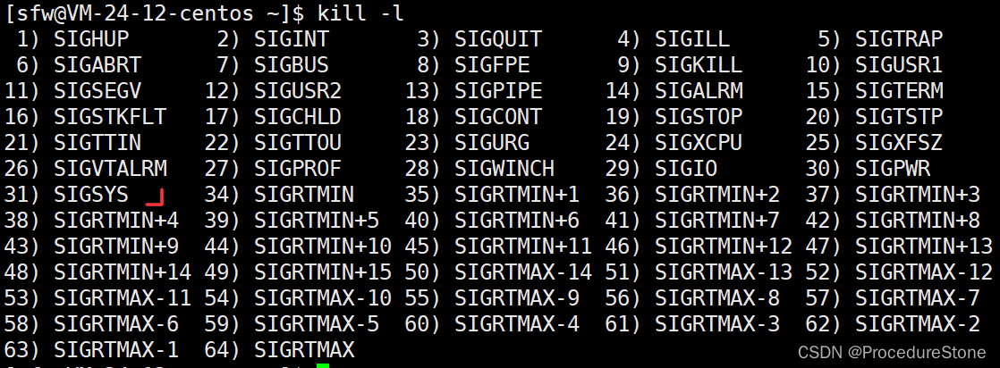
1-31为普通信号

>普通信号是传统的 Unix 信号，其范围通常为 1 到 31（包括0），使用整数值表示。
>当多个相同类型的普通信号被发送给进程时，只有一个实例会被记录，因此可能会丢失部分信号。
>普通信号是顺序交付的，即如果一个进程收到了多个相同类型的信号，它们将按照到达的顺序依次处理。

34-64为实时信号

>实时信号引入了对于更高精度的信号处理的支持，信号的编号通常大于 31，从 32 开始直到 SIGRTMAX。
>实时信号不会丢失，即使在相同类型的实时信号连续发送给进程时，每个信号都会被记录。
>实时信号可以按照任意顺序传递，并且不会排队等待处理，而是按照优先级立即被发送给接收者。
>时信号适用于需要及时响应外部事件，且对信号处理精度和可靠性有较高要求的场景。

```bash
1. SIGHUP（Hangup）：通常用于通知进程其终端已断开连接。
2. SIGINT（Interrupt）：通常由用户通过键盘输入Ctrl+C发送，用于请求中断进程。
3. SIGQUIT（Quit）：通常由用户通过键盘输入Ctrl+\发送，用于请求终止进程并生成核心转储文件。
4. SIGILL（Illegal instruction）：指示进程执行了非法指令。
5. SIGTRAP（Trace/Breakpoint trap）：用于调试，例如跟踪或设置断点。
6. SIGABRT（Abort）：由调用abort函数引发的信号，通常表示程序异常终止。
7. SIGBUS（Bus error）：表示尝试访问无效内存区域。
8. SIGFPE（Floating point exception）：表示浮点运算异常，如除以零或溢出。
9. SIGKILL（Kill）：用于立即终止进程，无法被阻塞或处理。
10. SIGUSR1（User-defined signal 1）：由用户定义，可用于进程间通信。
11. SIGSEGV（Segmentation fault）：表示进程试图访问未分配给其的内存。
12. SIGUSR2（User-defined signal 2）：由用户定义，可用于进程间通信。
13. SIGPIPE（Broken pipe）：当进程尝试向已关闭的管道写入数据时触发。
14. SIGALRM（Alarm clock）：用于定时器和闹钟功能。
15. SIGTERM（Termination）：用于请求进程正常终止。
16. SIGSTKFLT（Stack fault）：表示栈溢出或栈空间不足。
17. SIGCHLD（Child status changed）：子进程状态发生变化时发送给父进程。
18. SIGCONT（Continue）：请求继续之前暂停的进程。
19. SIGSTOP（Stop）：用于立即停止进程，但可以被恢复。
20. SIGTSTP（Terminal stop）：用户通过键盘输入Ctrl+Z发送，请求暂停进程。
21. SIGTTIN（Background read from tty）：后台进程尝试从控制终端读取数据。
22. SIGTTOU（Background write to tty）：后台进程尝试向控制终端写入数据。
23. SIGURG（Urgent condition on socket）：表示套接字上发生紧急情况。
24. SIGXCPU（CPU time limit exceeded）：进程已用尽CPU时间配额。
25. SIGXFSZ（File size limit exceeded）：进程尝试写入超出文件大小限制的数据。
26. SIGVTALRM（Virtual timer expired）：用于虚拟定时器。
27. SIGPROF（Profiling timer expired）：用于分析和性能监视。
28. SIGWINCH（Window size change）：当终端窗口大小改变时发送给前台进程。
29. SIGIO（I/O now possible）：指示异步I/O操作已完成。
30. SIGPWR（Power failure）：表示电源故障。
31. SIGSYS: 非法系统调用信号，通常表示进程尝试执行一个非法的系统调用。
```

为什么没有32，33？不知道。

本文不讨论实时信号。

对于一个信号，它要经过3个阶段

1. 信号的产生：信号由谁产生 ？如何产生？
2. 信号的保存：进程接受了信号，那信号是如何保存在进程里？
3. 信号的捕捉处理：进程如何理解信号的含义？如何处理信号？

学习信号，必须搞懂这3个阶段。


### 信号的产生

信号的产生有4种方式

#### 通过终端按键产生信号

Linux输入`Ctrl  c`可以中断进程。本质上是OS把ctrl c解释为2号信号`SIGINT`，发送给**前台**进程。（后台进程接受不到）
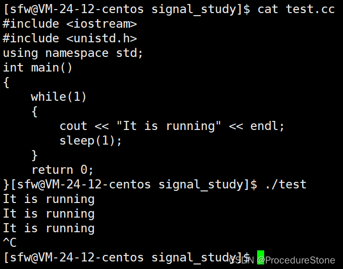
除了`Ctrl c`之外，还有`Ctrl \（SIGQUIT） Ctrl z（SIGTSTP)`


#### 调用系统函数向进程发信号

kill函数可以向指定进程发送信号。
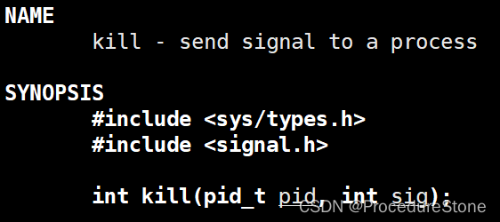
kill命令就是用kill函数完成的。 

```bash
kill命令: kill -[signal] [pid]
kill函数：int n =  kill(pid, signal); 成功返回0， 失败返回-1
```

raise函数可以向当前进程发送信号


#### 软件条件产生信号

SIGPIPE和SIGALRM是由软件条件产生的信号

SIGPIPE产生条件如下：
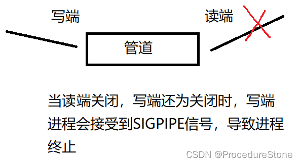
SIGALRM是alrm()函数产生的。


### 信号的保存

信号产生后，就要发给进程来处理。在处理之前，首先要保存。linux下，进程的信息是task_struct来进行管理的，在task_struct里控制信号的相关信息的成员通常包括以下几个：block, pending, handler

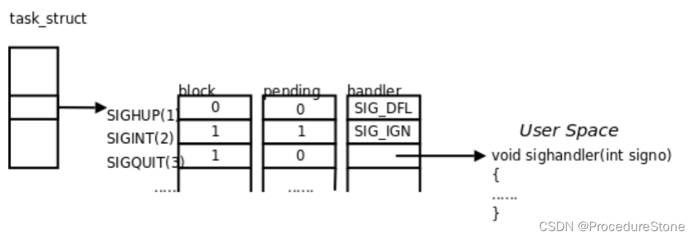
在解释这几个成员的含义之前，先要介绍几个概念：

1. 信号递达(Delivery)：**执行信号的处理动作**被称为信号递达
2. 信号未决(Pending)：信号从产生到递达之间的状态,称为信号未决。
3. 信号阻塞(block)：进程可以选择阻塞 (Block )某个信号。被阻塞的信号产生时将保持在未决状态,直到进程解除对此信号的阻塞,才执行递达的动作.
   注意,阻塞和忽略是不同的,只要信号被阻塞就不会递达,而忽略是在递达之后可选的一种处理动作。


block和pending是用来**表示信号的状态**的**位图**。我们一般叫阻塞表和未决表
什么意思？
在task_struct里，block和pending的定义如下：

```cpp
sigset_t blocked
sigset_t pending

sigset_t类型的定义如下：
typedef __sigset_t sigset_t;

# define _SIGSET_NWORDS	(1024 / (8 * sizeof (unsigned long int)))
typedef struct
  {
    unsigned long int __val[_SIGSET_NWORDS];
  } __sigset_t;
```

sigset_t是一个结构体，结构体成员是一个类型unsigned long int的数组。假设在32位机器，则数组的大小为4*32 = 128 字节。数组下标1-31对应1-31号信号，数组成员的值只有0和1。
在block中，0表示未被阻塞，1表示阻塞
在pending中，0表示未收到，1表示未决


首先介绍2类系统调用接口：
与block相关：


```cpp
NAME
       sigemptyset, sigfillset, sigaddset, sigdelset, sigismember - POSIX signal set operations

SYNOPSIS
       #include <signal.h>

       int sigemptyset(sigset_t *set);

       int sigfillset(sigset_t *set);

       int sigaddset(sigset_t *set, int signum);

       int sigdelset(sigset_t *set, int signum);

       int sigismember(const sigset_t *set, int signum);

sigaddset -- 将set里signum信号对应的元素设为1（阻塞）
```

```cpp
       #include <signal.h>

       /* Prototype for the glibc wrapper function */
       int sigprocmask(int how, const sigset_t *set, sigset_t *oldset);

sigprocmask -- 检查或者改变进程的block表（改变，即将block的内容先保存到oldset，再替换为set）。

```


>调用函数sigprocmask可以读取或更改进程的信号屏蔽字(阻塞信号集)。
>如果oset是非空指针,则读取进程的当前信号屏蔽字通过oset参数传出。如果set是非空指针,则 更改进程的信号屏蔽字,参数how指示如何更改。如果oset和set都是非空指针,则先将原来的信号 屏蔽字备份到oset里,然后根据set和how参数更改信号屏蔽字。假设当前的信号屏蔽字为mask,下表说明了how参数的可选值。
>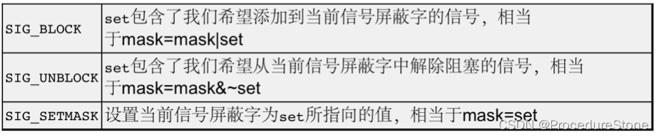
>这里的 信号屏蔽字 就是 block表， 只是换了一个说法。
>用例如下：

```cpp
 	sigset_t bset;
    sigemptyset(&bset);
    //bset: 0000 0000 0000 0000 0000 0000 0000 0000 
    sigaddset(&bset, 2); //阻塞2号信号，对应下标2的元素值变为1
    //bset: 0000 0000 0000 0000 0000 0000 0000 0100 

    sigset_t oldset;
    sigemptyset(&oldset);
    //oldset: 0000 0000 0000 0000 0000 0000 0000 0000 

    sigprocmask(SIG_SETMASK, &bset, &oldset);
    //原来进程里的block: 0000 0000 0000 0000 0000 0000 0000 0000
    //改变后的block: 0000 0000 0000 0000 0000 0000 0000 0100
```

与pending相关

sigpending -- 将系统里的pending表 赋给 set。
用例如下：

```cpp
void printpending(sigset_t& pending) //打印pending表
{
    for(int i = 31; i >= 1; i--)
    {
        if(sigismember(&pending, i))
        {
            cout << "1";
        }
        else 
        {
            cout << "0";
        }
    }
    cout << endl << endl;
}
int main()
{
	sigset_t pending;
	sigpending(&pending);
	printpending(pending);
}
```

---

了解完这2类系统调用接口后，下面我们来运行一段代码。
	
mysignal.cc

```cpp
#include <iostream>
#include <signal.h>
#include <unistd.h>
using namespace std;
void printpending(sigset_t& pending)
{
    for(int i = 31; i >= 1; i--)
    {
        if(sigismember(&pending, i))
        {
            cout << "1";
        }
        else 
        {
            cout << "0";
        }
    }
    cout << endl << endl;
}
int main()
{
    sigset_t bset;
    sigemptyset(&bset);
    //bset: 0000 0000 0000 0000 0000 0000 0000 0000 
    sigaddset(&bset, 2); //阻塞2号信号，对应下标2
    //bset: 0000 0000 0000 0000 0000 0000 0000 0100 

    sigset_t oldset;
    sigemptyset(&oldset);
    //oldset: 0000 0000 0000 0000 0000 0000 0000 0000 

    sigprocmask(SIG_SETMASK, &bset, &oldset);
    //原来进程里的block: 0000 0000 0000 0000 0000 0000 0000 0000
    //改变后的block: 0000 0000 0000 0000 0000 0000 0000 0100

    sigset_t pending;
    int cnt = 0;
    while(true)
    {
        int n = sigpending(&pending);
        if(n < 0) continue;
        printpending(pending);
        sleep(1);
        cnt++;
        if(cnt == 10)
        {
            cout << "unblock 2 signo" << endl;
            sigprocmask(SIG_SETMASK, &oldset, nullptr);
        }
    }
    return 0;
}
```


由此我们可以得出以下结论：

上面的代码其实还不能说明最后一步（执行信号2的对应操作，pending的下标2的元素值会变为0），学习了signal函数之后，便可以更直观看到现象。


block和pending已经实现了信号的保存， 还剩一个handler，他是做什么的呢？


handler是一个函数指针数组，函数指针的定义如下：

```cpp
typedef void (*__sighandler_t) (int);

//除此之外，还定义了3个宏
#define SIG_ERR	((__sighandler_t) -1)		/* Error return.  */
#define SIG_DFL	((__sighandler_t) 0)		/* Default action.  */
#define SIG_IGN	((__sighandler_t) 1)		/* Ignore signal.  */
```

总结一句话：handler是负责信号的处理的，默认情况下，handler数组存储的值是SIG_DFL。
这里可能有个疑问：比如2号信号在handler存储的是SIG_DFL, 8号信号在handler存的也是SIG_DFL。很明显，SIG_DFL和SIG_DFL是同一个地址，即0（0也不是一个合法的地址）. 那为什么2号信号和8号信号的处理的方式不同，比如2号信号是中断进程，8号信号是退出进程。

>SIG_DFL 只是一个宏，表示默认的信号处理行为，它的值是一个函数指针，指向预先定义的默认处理函数。这个宏的定义只是为了方便代码的书写，以及在代码中清晰地表示使用默认处理行为。如果某个信号对应handler是SIG_DFL, 操作系统会到内核里找到该信号的默认操作函数。


正是通过block，pending，handler, 进程才能执行不同信号对应的的处理方式。


​	

## 信号的捕捉处理

信号的捕捉是指进程通过设置信号处理函数来处理接收到的信号。当进程收到一个信号时，操作系统会中断当前的执行流程，将控制权转移到相应的信号处理函数。在信号处理函数中，进程可以执行**特定的操作**来处理该信号，比如清理资源、记录日志、进行错误处理等。完成信号处理后，进程可以继续执行原来的任务

那如何给某个信号设置特定的操作呢？可以通过signal函数来进行。

### signal函数

在Linux下，signal() 函数用于设置信号处理函数（Signal Handler），以便在接收到指定信号时执行特定的操作。它的原型如下：
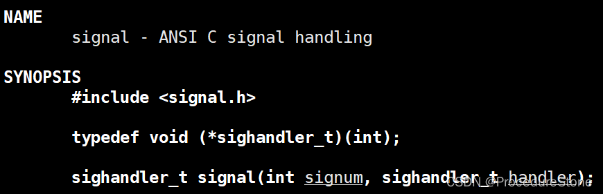
当接受到`signum`后，执行`handler`函数。handler函数自定义，要求参数为int类型。
如下：

```cpp
#include <iostream>
#include <unistd.h>
#include <sys/types.h>
#include <signal.h>
using namespace std;
void handler(int signal)
{
    cout << "I receive SIGINT" << endl;
}
int main()
{
    signal(SIGINT, handler);
    //使用后，进程如果接受到SIGINT，便会执行handler函数，而不执行SIGINT默认的操作：中断进程
    //和srand()函数一样，使用1次，之后都有用
    while(1)
    {
        cout << "It is running, pid: "<< getpid() << endl;
        sleep(1);
    }
    return 0;
}
```

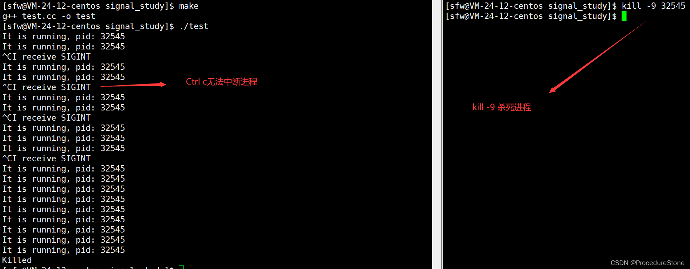

1-31 信号，9号和19号无法被signal更改操作的，因为它们是属于操作系统的强制行为。

### 信号捕捉的原理


这里有两个概念：用户态和内核态

>用户态（User Mode）：
>用户态是指程序在执行时所处的一种特权级别较低的状态，程序在此状态下只能访问受限的资源，不能直接访问底层硬件设备或执行特权指令。
>大多数应用程序在用户态下运行，例如普通的应用程序、库函数等。

>内核态（Kernel Mode）：
>内核态是操作系统的核心运行模式，拥有最高的特权级别，可以直接访问所有系统资源和硬件设备，执行特权指令以及控制硬件。在内核态下运行的代码拥有对系统资源和硬件的直接控制权，可以执行操作系统内核的所有功能和服务，如管理进程、内存管理、文件系统等。
>内核态通常由操作系统内核代码执行，例如处理中断、系统调用等

核心：在于能不能使用操作系统的代码和数据
